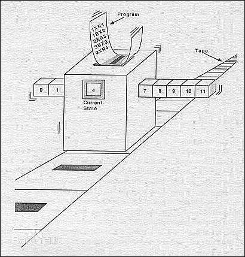

# 应用函数式编程

## 1.1 图灵机、冯.诺伊曼体系 与 命令式编程

现在大部分的程序员，接受的是“面向对象”的编程方法，基本的几板斧包括：继承、覆盖（重写）、设计模式等。缺乏对比，就很容易坐井观天，容易以为这种方式就是“唯一”的选择。

其实，从语言抽象的角度来看，从面向机器的汇编语言，到以Ｃ、Pascal为代表的结构化编程语言、再到C++、Java等OOP语言，他们的本质都是“图灵机”模型，程序 = 控制流 + 共享内存。



通过移动纸带依次执行下一行代码，代码可能是：
1. 从内存中读取某个数据
2. 进行某种计算（或逻辑比较）
3. 将计算结果写入到某个内存
4. 顺序执行下一条指令，或者跳转到某个指定的位置。

这个编程模型由于最为贴近目前的计算机体系架构（冯诺伊曼架构），因此是一种很自然的进化，具有最高的执行效率。但是，这种模型对”人类“并不是友好的：我们更喜欢一种顺序前进的思维模型：第一步，第二步，......直到完成任务。在这个过程中，如果不断的进行跳跃，兜转，最终就会形成一团乱麻，一座迷宫，让开发者无法理清思路。

1. 控制流程的复杂性，会让我们陷入到一个不断前进、后退的怪圈之中，很容易就会让我们迷失，忘记了过去，找不到未来。
2. 数据流程的复杂性。某一行代码，都需要读写某个内存数据，这些依赖的数据，其来龙去脉如何？目前的状态是否正确？与其他的数据是否一致？如果已经出现错误，或者不一致的情况，后续的处理就会蔓延这个错误，导致更大的错误产生。

控制流的复杂性和数据流的复杂性是相互纠缠的：
1. 复杂的控制流，会让数据流变得更复杂、更难以证明其正确性。某个数据的当前状态依赖于之前的执行流程，复杂的控制流，就意味着这个数据过去的读、写生命周期非常复杂。
2. 复杂的数据流，会反向作用于控制流，影响其程序流程。一个简单的例子是，某段代码本身逻辑没有问题，如果他的输入是一个错误的，或者自相矛盾的，则一定会产生错误的结果，甚至会让这个错误加以放大。

控制流，可以通过消除goto，从一团乱麻式的逻辑演进成为“结构化”的模式，主要的措施包括：
1. 引入“函数、过程”，提供一种基础化的子部件，通过过程调用的方式，支持高粒度的逻辑组合。在宏观层面消除 goto
2. 使用三种控制流程：
    1. 顺序代码块
    2. 分支代码块，也就是高级语言中的 if else, switch 等语法
    3. 循环代码块。也就是高级语言中的 for, while 等语法

结合上述元素，就可以完全编写出没有 goto 的代码来。其实，正如“结构化编程“的名称所示，我们并没有消除掉控制流的异常跳转，只是换了一种更加有序的模式，让代码块变得更为”结构“，接近人的思维习惯。结构化编程是对控制流程的一次抽象，把编程从无限自由的goto中，加以抽象，使用`子过程`、`顺序块`、`分支块`、`循环块`这几个基本的结构就可以实现同样的功能。

结构化编程诞生了新的高级语言，如 C、Pascal、Ada 等，随后，随着代码规模的飞速上升，`过程`的数量逐步成为一个巨大的数字，传统的代码组织模式一般按照“模块”的方式，将一组相关联的`过程`放到同一个模块中，例如：
1. 一个实现 Link List 数据结构的`module`
2. 一个实现 Quick Sort 排序算法的`module`
3. 一个实现某个 User Story 的`module`

随着`module`的进一步复杂化，我们引入了 `object oriented`, 以数据结构为中心，将 数据结构（`object`)和操作数据结构的过程（`method`) 组合到一起，形成了`class`，于是诞生了`面向对象编程`，除了 `object` 之外，我们还使用了 `package`(或者说 `namespace`)、`module` 等更高层次的组合，以提供更好的结构化组织能力。这类语言，包括 smalltalk、c++、Java、C#等。

上面的语言进化史，其实是一个对控制流程进行不断抽象，从而形成更贴近人的表达方式。但有一点不变的是，这个进化史有一个不变的“根隐喻”，即计算是一个图灵机模型，`程序 = 控制流 + 共享内存`，无论是汇编语言、结构化语言、面向对象语言，本质上都是一个图灵计算模型，这类的语言，我们也称之为“命令式语言”。

大家可以再翻翻《三体》，这本书其实也算是一本通俗的计算机入门书籍，第十八章《牛顿、冯.诺伊曼、秦始皇、三日连珠》中，为了解决三体的运转规律，准确预测出三体连珠的时间，牛顿发现了物理学三定律，解决了从上到天体运动、下到细胞分裂的一切规律，只是这里的计算量太过庞大，一大堆微积分方程需要求解。这个时候，冯.诺伊曼发明了计算模型，还只是理论，冯.诺伊曼并没有发明计算机，于是，他们找到了东方的君主：秦始皇，由秦始皇来负责制造这台复杂的计算机。冯调动了秦始皇的3000万士兵，把3000万士兵排兵布阵，并明确每一个士兵的职责，其实也是非常之简单：承担与门、或门、非门三者之一的职责，任何一名士兵只需要一小时的训练就可以掌握。最后，这台“秦1号” 计算机就构建成功（秦1号的CPU，由3000万的门电路组成，大约有1.2亿晶体管，其规模相当于 2005年Intel的第一代奔腾D双核处理器2.3亿晶体管 中的单核规模，其实是非常只领先的了）。这台计算机耗时16个月，完成了三体连珠的计算。当然，这个漂亮的案例中，如果再补充上图灵和Ada，我觉得会更完美一些，因为是图灵创造了计算模型，冯诺伊曼则根据这个计算模型设计了CPU和系统架构，而Ada，则是第一个程序员，由她设计出整个计算程序，命令着这台庞大的计算机，完成一个具体命题的计算。

> 在金字塔的中部，一排旗手用旗语发出指令，一时间，下面大地上三千万人构成的巨型主板仿佛液化了，充满了细密的粼粼波光，那是几千万面小旗在挥动。在靠近金字塔底部的显示阵列中，一条由无数面绿色大旗构成的进度条在延伸着，标示着自检的进度。十分钟后，进度条走到了头。
> “自检完成！引导程序运行！操作系统加载！！”
> 下面，贯穿人列计算机的系统总线上的轻骑兵快速运动起来，总线立刻变成了一条湍急的河流，这河流沿途又分成无数条细小的支流，渗入到各个模块阵列之中。很快，黑白旗的涟漪演化成汹涌的浪潮，激荡在整块主板上。中央的CPU区激荡最为剧烈，像一片燃烧的火药。突然，仿佛火药燃尽，CPU区的扰动渐渐平静下来，最后竟完全静止了；以它为圆心，这静止向各个方向飞快扩散开来，像快速封冻的海面，最后整块主板大部分静止了，其间只有一些零星的死循环在以不变的节奏没有生气地闪动着，显示阵列中出现了闪动的红色。

刘慈欣. 三体全集 

## 1.2 λ演算 与 函数式编程
花开两朵，各表一枝。除了图灵计算，还有一个计算模型，就是 λ计算。 λ演算是Alonzo Church在1930年建立的（其相比图灵机理论的创建时间早6年，Church也是Turing的老师）。λ 计算的核心非常简单：
```
E = x       -- 变量 x
    | λx.E -- 定义一个函数，接收变量x，返回值为 E
    | (E1 E2) -- 调用函数 E1(E2)
```

有论文证明：图灵演算 和 λ演算都是计算完备的语言，二者在功能上是等价的。Lisp 语言是最早的基于 λ演算 的高级语言。现在的各种编程语言中，都会引入 λ 这个概念，其源头都出自 λ 演算这一理论。

上述的核心模型是如此简单，但却是FP的核心原理，其作用犹如牛顿三定律之于经典物理，如五大公理之于欧几里得几何。或者可以理解为 FP 编程的CPU和汇编语言：所有的函数式代码，最终都可以表达为如上的三种基本元素。

# 2. 函数式编程的基本原则
 
## 2.1 无副作用纯函数
所谓纯函数，就是接收输入，计算并返回结果。除此之外，不产生其它效果。（通俗的说，除了返回结果，以及CPU发热之外，不要做其他的事情），包括：
1. 任何赋值操作，会改变现有内存状态（除非首次赋值，在函数式语言中，首次赋值被称为 变量绑定）
2. 更改全局变量。在Java中，这包括：static变量，对象的实例变量（包括修改参数对象中的字段）等。
3. 任何 IO 操作。包括键盘输入、屏幕输出、文件读写、记录日志、读写Socket等。
4. 任何数据库操作。当然，数据库操作也是IO。
5. 当然，也包括发送短信、发送邮件等等，这些也是通过 IO 来引起的。
    
除此之外，纯函数还具备“引用透明性”，即对相同的输入参数，总是应该返回相同的计算结果，因此，诸如 currentTimeMillis、UUID、random等，都不是“纯函数”。
    
放到实际业务之中，这个约束其实有些“苛刻”，我们很难做到。我们可以根据实际情况，酌情放松一下，例如：
1. 诸如“日志输出“这样的IO，可以视为“轻微无害的副作用”。
2. 在事务类服务处理中，读取数据库中的当前状态，可以视为“无害的IO操作"，或者当作类似于读取函数上下文中的全局变量操作。
    
感觉上，如果没有IO，没有数据库操作，那我们的代码还能干什么呢？创建订单的服务，本质上不就是需要生成一个新的订单吗？这个疑问，我们会在 `2.5 管理副作用` 中进行说明。

## 2.2 不可变数据
与命令式语言基于”共享内存“的模型不同，函数式编程中强调数据的不可变性：
1. 在函数中不要使用可变变量（variable）。用 Java 语言为例，所有的函数局部变量都应该使用 final 修饰，只能初始化赋值一次，不能进行二次赋值。（这里，沿用了 variable 这个名称，只是沿用而已，其含义完全不同）
2. 不要创建 mutable 的对象。所有的对象都应该是 immutable 的。一经实例化，其内部字段终生不变，直到对象销毁。用 Java 语言为例，所有的实例变量都应该使用 final 修饰，只能在构造方法中进行初始化。这样的类型，在Java中少之又少，我们所熟知的就是 String 类型。
3. 不要使用 mutable 的集合。所有的集合，都必须在实例化的时候，唯一确定其中的元素。一经创建，便不可增加、替换或删除元素。如果需要变更的话，只能基于现有的集合，创建一个新的副本。这一点在 Java 中比较尴尬，java.util.collection 中根本就没有这样的集合类型。

局部变量不可变，实例变量不可变（当然，静态变量也不可变）、集合不可变，这个也是颠覆Java程序员三观的约束，在此规则下，还能干什么呢？

## 2.3 使用表达式(expression)而非语句(statement)
`1 + 2 * 3` 是一个表达式，其反应了一个计算过程，并代表着一个最终的值。而 `if(flag) a = 1 else a = 0` 是一个语句，它没有返回值（虽然部分语言也可能给它赋予了一个返回值），而是执行了一次赋值操作，产生了副作用。

在 Java 中， if-else，for, while, switch, try-catch 都是 statement，因此，这一点我们只能将就。（Java14中 switch 将支持作为 expression 使用，但奇怪的是，其它操作还是不支持 expression，总是学一点不学完全）。我们可以使用 `?:` 三木运算符来替代 if-else，不过也有很多局限。这一点，我们就只能将就了。
 
而在 Kotlin，scala 等时髦的编程语言里，if-else, switch, try-catch, for 都可以作为 expression 来使用，如果你选择这样的语言，你就可以选择 expression，而避免使用 statement 了。

使用 statement，则不可避免的会用到赋值操作，这一类的副作用就没法避免的了。在这种场景下，我们可以约束：只容许对方法的局部变量进行赋值，而不要对对象字段（实例变量或静态变量）进行赋值。这相当于把 ”副作用“局限在方法内部。
 
而在Kotlin，Scala这类支持完整 expression 的语言中，我们可以指定严格的标准，杜绝赋值语言这一类副作用的出现。 

## 2.4 简单化流程
结构化编程，引入了 if-else, switch 等分支流程，for/while等循环流程，实际业务中，这类的流程还是会带来一定的复杂性，尤其是多层嵌套的情况下。正如 λ演算 的理论模型中，FP 只需要函数的调用，而无需分支和循环流程的。

这里的约定针对 kotlin, scala等支持 expression 的语言，对于 Java, 需要酌情参考：
1. 使用 if-else, for, switch 等expression, 而不是 statement。（思考题：if-else expression就不是分支了吗？）
2. 避免使用 continue, break 等破坏正常流程。
3. 避免使用 return ，正常的话，函数应该在最末一行产生返回值。
4. 避免 null 值。
    1. 如果某个变量的值可能为 null，则改变为 Option[T]，并使用 None 替代 null。
    2. 如果某个方法，可能会返回 null，调整为返回 Option[T]
    3. 如果某个字段的值可能会为 null，调整为 Option[T]
    4. 使用 filter, map 等操作处理 Option，可以避免 if/else 的使用。

也有的文章建议，避免使用 Exception，而使用 Try[T] 来替代，不过，我个人并不倾向于此，在我看来， Excpetion 本身也是一个 Monod，自然具有 Try[T] 的特性，而且可读性更高。

一个常见的挑战是，不使用可变变量，不使用循环，那么如何处理传统需要迭代的场景呢？在FP中，递归调用就是FP的循环解决方案，可以参考[从示例逐渐理解Scala尾递归](https://www.jianshu.com/p/e456c27a4366)一文。

## 2.5 简单数据流
应用函数式编程，带来的一个本质的改变就是：简单的数据流：请求参数留经一个函数，而产出一个新的数据，新的数据继续流动，经过新的计算过程，产生出新的数据，直到达成最终的结果。区别于命令式编程，这个流动总是产生新的数据，而不会修改任何已经存在的数据。

### 2.5.1 pipeline 
对 shell 用户来说，pipeline 是最为熟悉的，譬如如下的bash脚本，是统计nginx访问日志中访问量最大的前10名IP，及其访问次数。

```bash
cat access.log | gawk ‘{print $1}’ | sort | uniq -c | sort -rn | tail -10
```
可以这么来理解一个 pipeline：每个step相当于一个函数，接收上一个 step 的输出，处理完成后，形成新的计算结果，再输出到下一个 Step。Step之间收尾相连，数据依次从Step1、Step2、直到最后。这其实相当于一系列的函数组合调用。

### 2.5.2 单向无环数据流 DAG 
pipeline 是一种最简单、最清晰的数据流，没有分支，没有合并，但实际场景下，数据流向还是会更复杂一些。有如河流入海，有主干河道，也有众多分支的河道，最后主干、支流汇聚成江，东奔大海。

与命令式语言不通，FP下的数据流必须是单向无环路的，一个函数不能依赖这个函数执行之后产生的数据。这样的数据流，最终会形成一个 DAG。数据一旦形成回路，带来的复杂性，包括：难以理解，难以推理。

当然，会有一些其它的模式，让整个数据流变得更加简单一些，例如：
1. 层次化。 对复杂的数据流进行层次划分。
2. 模块化。将DAG的部分节点进行聚合，简化节点。

这个过程需要结合业务，形成经验。后续可以整理成为参考的“模式”。但总的而言，我们的目标是让 DAG 变得更加简单，更易于理解，更方便推理验证。

## 2.6 隔离副作用
纯函数只返回计算结果，但我们的最终目的都是要“改变世界”：或者更新银行账户的余额，或者发送一个电子邮件通知，或者在屏幕上显示一个报表，这些都是FP意义上的“effect”，在函数结束之后依然存在的影响。现实的程序最终依然会产生 effect，并且以产生最终的 、正确的 effect 为终极目标。

FP 的目的不是没有effect，不是消除effect，而是隔离effect，将程序中的逻辑计算和结果落地进行分离，让逻辑计算更为纯粹，带来更强的组合能力，更清晰的数据流，让逻辑可以自我证明。隔离之后的副作用操作，就是“解释”逻辑计算的结果，完成落地过程，因而更为内聚（而不是分散在处理的四处）、更为简单。

参考：[函数式计算中的副作用](https://zio.dev/docs/overview/overview_background)

### 2.6.1 计算-解释模型
计算-解释模型是最简单的副作用隔离，其基本逻辑如下：
```scala
def  service(request) 
    def logic(): ActionModel
        ...... // pure function code which return an ActionModel
    def interpret(actionModel)
        ...... // execute the actions such as insert an entity, send an email, etc.
    
    logic() -> interpret()    
```
考虑到 `logic()` 中依赖着对数据库等的一些依赖（存在着某种 Input 的操作），因此，也可以调整为 `准备-计算-解释模型`： 
```scala
def  service(request) 
    def fetch(): InitialModel
        ...... // read only operation, fetch required information into InitialModel
    def logic(): ActionModel
        ...... // pure function code which return an ActionModel
    def interpret(actionModel)
        ...... // execute the actions such as insert an entity, send an email, etc.
    
    fetch() -> logic() -> interpret()    
```
对事务类服务而言，查询类服务和大部分的单事务类服务，都可以简化为 `计算-解释模型`，这种抽象会带来如下的好处：
1. 将副作用提取、聚合到一个解释函数中，取代分散在业务逻辑的方式，服务的目的性非常明确，易于理解代码。
2. 隔离副作用后的业务逻辑，成为一个纯函数，可以更好的实现代码的复用，更便于进行单元测试。

在有的事务类处理中，会有锁定资源的需求，如扣减账户余额，此时，我们可以在 fetch 阶段，对需要锁定的资源施加锁定操作。这里，我们把“lock" 这样的操作，也视为一种“低危害副作用”，因为其本质上不修改数据，容易回退。

开发约定：
1. 区分计算与副作用，业务逻辑应该集中在`计算`之中，保持`解释`的简单性。
    1. 保持计算是纯函数的，具备引用透明性。
    2. 避免在解释中包括业务逻辑，只解释执行计算的结果，完成数据落地。如：
        - 避免在解释阶段依赖 `insert` 操作返回的自增 ID，替代方案是：通过全局的 id 服务获取id，在 insert 语句中显示赋值。
        - 避免在解释阶段依赖 `update` 语句是否会命中数据，替代方案是：在 fetch 阶段检查数据是否存在。
2. 命名约定
    1. 对有副作用的方法，使用 `doXXX` 命名。
    2. 混合方法（即串联起计算 和 解释的方法），应作为服务的最外层方法（复杂的方法，可以放宽到第二层的方法），混合方法使用 `@effect`进行标识。
    3. 在混合方法中，使用`DoEffects!`进行代码集中标识有副作用的代码块，示例如下：

      ```scala
          def service()
              calculation 1 //
              DoEffects! {   
                  ... ... // 在 DoEffects! 代码块中进行副作用处理，如发送邮件，修改数据库。
              }
              calculation 2 //
              DoEffects! { 
                  ... ... // 在 DoEffects! 代码块中进行副作用处理，如发送邮件，修改数据库。 
              }
      ```

### 2.6.2  多阶段递进模型

```scala
def service(request)

    // phase1
    phase1Fetch() -> phase1Logic() -> phase1Interpret()
   
    phase2Fetch() -> phase2Logic() -> phase2Interpret()  // based on phase1’s result
    
    phase3Fetch() -> phase3Logic() -> phase3Interpret()  // based on phase1 & phase2’s result

```

如果`阶段N`的处理需要依赖`阶段N-1`或者更早之前的副作用处理结果，那么，我们将无法完全的遵守`计算-解释`模型，那么，此时，我们可以遵守约定，让代码的可读性变得更强：
1. **将副作用处理集中到服务的顶层主流程代码中**。避免将副作用代码分散，尤其是下沉到很低层的业务代码之中，会让服务的主逻辑变得不明晰，增加复杂度。
2. **使用 doXXXX 或者 DOEffects! 约定**。让副作用代码阅读起来更为明显。
3. 由于执行副作用本身会带来更多的异常情况，因此，在主流程中集中处理异常，会让异常更为清晰。

在数据库事务类应用中，除非多阶段的处理需要在多个事务中完成（如因为领域隔离原因），否则我们应尽可能使用`计算-解释模型`，在计算阶段尽可能的确定逻辑，而不要过于依赖“副作用执行”时的结果。

### 2.6.3 TCC 模型
`计算-解释模型` 非常适合于单事务类的处理，但对于多事务，或者说分布式事务的场景时，会有些力不从心。譬如：
```scala
def service
    val resp_a = service_a(req_a)
    if(resp_a) {
        val resp_b = service(req_b)
    }
```
需要根据第一个事务处理的结果，来决定第二个事务的执行情况，在执行事务二之前，必须要先提交事务一的执行结果，即执行事务一的副作用。

使用 TCC 模型时：
1. `Try` 处理负责锁定服务所需的最少资源，这个操作存在副作用，但提供了一种可逆的方式。因而可视为*无害的副作用*
2. `Confirm` 由主流程裁决，在决定提交事务时，再依次调用多个子操作的 `confirm`， 这一步相当于*执行副作用*的操作。
3. `Cancel`由主流程裁决，在决定事务回滚时，再依次调用多个字操作的`cancel`，这一步相当于*执行回滚副作用*的操作。

通过TCC模型的使用，我们可以以一种接近于*隔离副作用*的效果的方式，来实现复杂场景下的逻辑隔离。

# 3. FP 无处不在
1. Linux Shell & FP

    正如上文中的 pipeline 示例， pipeline 构建了 Shell 的强大之处，也可以作为 FP 成功的一个典型案例：
    1. 每个Linux命令，都聚焦于解决单个问题。这相当于编写更具内聚的函数。
    2. Shell 使用简单的文本行 `Line` 作为标准的数据格式，作为管道交换的数据标准。这个简单的策略让所有的命令都可以串联起来，完成互操作。
      
    这也给我们很多良好的 FP 编程启示：
    3. 函数设计应遵守`Single Responsibility Principle`，内聚性越强的函数、功能越单一的函数，不仅实现成本更低，其可组合能力也更强。
    4. 基于标准化的数据结构。便于函数间的互相组合。如果在每次函数组合时，都需要进行数据的转换，这样代码的自由度就会大打折扣。
       
2. SQL & FP
    
    我们最为熟悉的SQL，其实也算是一种 FP 的思想，也被称之为 `Declarative Programming`（声明式编程），其实这也是 FP 的特征。如果说命令式语言关注于`how to do`，那么FP 则关注于 `what to do`，对比一下如下的代码：
    
    ```csharp
        int[] array = { 1, 5, 2, 10, 7 };
        var results = from x in array
            where x % 2 == 1  
            orderby x descending   
            select x * x;        
        foreach (var result in results)     {      
             Console.WriteLine(result);   
        } 
   ```
    上面的代码是支持 LINQ 语法的C#，在scala中，也可以使用如下的方式：
    ```scala
        val array = Array(1,5,2,10,7)
        val results = array.filter(_ % 2 == 1)
            .sortedBy ( 0 - _ )
            .map( x => x * x)
    ```
    如果使用 Java 来编写，会长什么样子呢？大家可以从这个案例来理解一下 FP 的 `声明式编程` 特点。声明式编程的一个最大的不同在于，他的每一行代码更聚焦于描述代码的目的（面向阅读者），而不是聚焦于”怎么做“？
    
3. CQRS & FP
    `Command Query Responsibility Segregation` 是一种面向领域复杂性的解决方案，通过区分 Command、Query，使用 Event Sourcing 来描述 Command 的结果，避免对数据进行 mutable 的操作。
    
    1. Event Sourcing 模式避免了对 Entity 的直接修改，而 Event 本身是 immutable 的，这与 FP 的数据不可变思想一致。
    2. Entity Snapshot = f ( events )。可以根据不同的需求、场景、视角，建立不同的 snapshot。这是一个 Pure 的操作。 

4. 大数据处理 & FP（Flink、Spark、Kafka Stream、Akka Stream）
    从 Map-Reduce 开启大数据处理时代开始，新的大数据处理框架，如 Spark、Flink 等都采用了 FP 的思想。与普通的 FP 不同，这类架构会在一个分布式的环境下，编排出一个分布式的 Data Flow Topology，并提供包括 back presure、checkpoint 等机制。但其核心思想，仍然是数据流图，这个和 FP 的思想是完全吻合的，因此，大部分的大数据处理框架提供的都是 FP 的API。

5. React & FP
    传统意义上，UI并不适合于FP，因为 UI 本质上就是一个高度 mutable 的场景，任何一个交互事件，如鼠标、键盘，或者时钟事件，都会导致 UI 元素的巨大变化。无论是一个 Widget Tree，还是一个 DOM Tree，这种变化总是无法避免的。而 FP 倾向于 immutable 的思维模型，因此，传统意义上，FP 并不适用于 UI 开发。
    
    不过，React 这个非常流行的框架，从WEB开发，延展到 React Native 进行APP的开发，短短的数年时间，已成为了最受欢迎的前端开发架构。很多最新的前端开发架构，例如 LitElement（a WebComponents library）、Flutter、微信小程序等，都采用了于 React 相似的方式：构建 VDOM，并通过 diff - patch 算法完成 DOM 的更新。
    
    引入 VDOM 后， VDOM. = f ( states )，这是一个纯粹的函数计算，是没有副作用，当任何状态变化后，我们只需要重新应用函数就可以得到最新的VDOM，而无需根据当前的状态，计算出界面所需要的变化（Δ、或者增量变化）。总是进行一次完整的 VDOM 计算，相比根据当前状态计算 Δ 要简单得多。当完成 VDOM 计算后，我们使用一个 diff 算法，完成 VDOM 与上一次的 VDOM 的差异。 即 patch = diff( VDOM1, VDOM2)，这也是一次纯粹的函数计算，然后，我们调用 `interpret` 函数，将这个 patch 应用到DOM上，完成DOM的更新过程。这个和我们上面介绍的 `计算-解释`模型是一致的。通过 VDOM 和 patch 算法，我们完成了计算与解释的隔离。
    
    React 的成功之处在于：通过`计算-解释`隔离，UI 的业务逻辑都可以采用 FP 的方式进行完成，这大大的简化了UI 的操作，减少了代码量。同时，由于采用 diff 算法，最后的DOM更新也可以做到*最优化*，从而也带来极大的性能提升。
    
6. 新的编程语言对FP的支持
    虽然C、Java语言在最近许多年中，一直是雄霸 Tiobe榜的前二选择，不过，越来越多的新晋语言，都普遍选择了支持 FP 的特性。
    随着越来越多的编程语言、编程框架对FP的支持，我们应该大胆的拥抱FP的编程思想，因为这也代表着未来的趋势。   

    
|    |  Java  |  Kotlin  |  Scala  | Swift | Rust |  Go   |  Dart| 
| --- | --- | --- | --- | --- | --- | --- | --- |
|  不可变变量  | N   |  Y  |  Y  | Y   |  Y  |  N  |  Y  |
|  不可变集合  |  N  |  Y  |  Y  |  Y  |  Y  |  N  |  Y  |
|  if-else 表达式  |  N  |  Y  |  Y  |  N  |  Y  |  N  |  Y  |
|  for 表达式  |  N  |  N  |  Y  |  N  | N   |  N  |  Y  |
|  switch 表达式  |  JDK14  | Y |  Y  |  N  | N|  N  | N   |
|  λ匿名函数  |  JDK8  |  Y  |  Y  |  Y  |  Y  | Y   |  Y  |
|  函数即值  | N   |  Y  |Y |  Y  |  Y  |  Y  |  Y  |
|  尾递归  | N   |  Y  |  Y  |  N  |  N  |  N  |  N  |
综上，比较好的体验FP的编程语言是 Kotlin、Scala。 

# 4. 应用实践
从目前国内的应用情况来看，FP 应该还是小众的选择，作者在一个函数式开发的群中，普遍接触到的都是一些“兴趣爱好者“，问及是否在实际项目中，是否有选择”函数式编程语言”，是否应用函数式编程？普遍的回答是“不”，大家对FP有较多的担忧、误解。

## 4.1 FP 很困难，如复杂类型体系、灵活的DSL语法、天书一般的framework源代码、以及晦涩的Monad？
相信很多FP的爱好者都是抱着这样的疑惑的：FP很困难，有很多的新概念，Monad、λ calculus、Categories，这似乎与学习量子力学的难度也差不多了。

的确，FP的发展史上，一直都有“数学家”的影子，从Categories理论、λ演算、LISP编程语言，都有非常深厚的数据理论基础，其背后有一套复杂的、深奥的理论。但实际上，大部分的商业应用中，并不会用到复杂的理论。正如母鸡会下蛋，但它不会知道下蛋背后的科学逻辑，我们也可以在不了解这些深奥数学的情况下，驾驭函数式编程。

FP可以很深奥，但一些基本的原则确实非常简单的，也足以处理绝大多数的应用问题。本文总结了几条FP的基本原则：
1. 编写无副作用的纯函数。
2. 编写“不变性“的代码，使用 immutable 变量和 immutable 对象、immutabe集合。
3. 使用 expression 而非 statement
4. 编写简单的处理流程。
5. 编写简单的数据流，采用 pipeline、DAG 的结构，划分层次、粒度。
6. 隔离副作用，采用 `计算-解释`、`多阶段副作用模型`、`TCC`等模式隔离副作用处理。

实际上，通过遵守上述的原则，我们不需要关心 Monad、更不需要学习 Categories Theory，就完全可以应对商业应用开发。使用 FP 并不并 OOP 更复杂，更烧脑，相反，通过应用上述的原则，我们可以开发出更为简洁、清晰、可读、无BUG的程序。

## 4.2 招不到熟悉FP的工程师。
的确如此，目前大部分工程师都是OO的信徒，基本上缺乏FP的认知和实践。不过，我们认为FP并不是什么“异类”的编程模式，通过强调上述的6条基本原则，绝大部分的工程师都可以在1-2周时间内，逐步完成转型，并在3-4周的实践窗口内，逐步的习惯新的编程模式，产出更为高效、高质量的代码。

我们推荐的学习路径是：
1. 初步了解函数式语言的一些基本语法、函数。(1-2天），在后续过程中，可以随时通过搜索、查手册、咨询身边的熟手，来应对函数式编程中的一些初级问题：例如，语法问题，常用函数问题。
2. 基于不变量编程，编写无副作用的纯函数。（1周），一般的，通过完成几个集合相关的练习题，开发者即可理解如何消除不变量。
3. 选择1-2个过往的代码片段，我们的原则上是选择尽可能复杂的业务场景，有时候可能是成百上千行的传统代码，尝试使用1周的时间进行重构实验，演练我们推荐的6个原则：在这个过程中，有一个熟练掌握这种方式的熟手，予以检查和指导，是非常有效的。（1周）。

一般的，经历2周的实践，一个熟练的Java程序员，完全可以成功转型，掌握新的FP编程思想和使用方法，并开始在工程中进行应用。当然，在这个过程中，配置一个掌握该方法的熟手，指导4-6个转型程序员，按需施以援手，阶段性进行代码的review，是非常有效的。


## 4.3 编程语言选择？是混合式编程？，还是强制性 FP？

1. 选择 Java 8？还是 Kotlin、Scala等编程语言？    
2. 是在项目中选择混合式编程，既采用传统命令式，使用变量、可变集合，也结合使用部分函数式的用法？

从我个人的经验来看，我会更倾向于一步到位，选择支持函数式能力较为彻底地语言，在 JVM 之上，我会推荐 Kotlin、Scala。虽然基于 Java8 的Stream API 和 λ，也可以编写 FP 风格的代码，但是，选择 Java8，主要存在的不足之处是：
1. 缺少一个 immutable collection API。
2. 缺少对 if-else, switch 表达式的支持。这使得 statement 的使用不可避免。
3. 不支持 tailrec，这使得 循环不可避免，也使得 statement的使用不可避免。

而选择 Kotlin、Scala 这样的语言，对 Java 程序员来说，其实并没有多大的门槛，一般的，经过2-4周的时间，Java程序员就可以基本上掌握 Scala 这样的语言，熟练的进行应用开发。而通过施加本文介绍的 6 个限制原则，杜绝副作用的滥用、拒绝数据可变性处理，可以带来显著的代码质量提升。相反，如果不能践行本文推荐的原则，则大部分情况下，程序员在不自觉的情况下，可能会退化为传统OOP的编程习惯，最终的效果会打上折扣。

## 4.4 FP 对程序员素养的帮助
对大部分的程序员来说，会更习惯 OOP 的方式，因为这种方式带给程序员的约束更小，编码会更为自由。但这样带来的问题是，缺乏对整个程序的整体思考，尤其是对数据流的整体思考，大部分的时间其实是通过“调试”来编写代码，可能1天编写的代码，调试要2-5倍的时间。这种写起来很爽，把困难留给调试的方式，很难说可以提高程序员的思维能力。

而 FP 不同，隔离副作用、编写无副作用的函数、使用单向无环路的数据流，都会迫使程序员在解决一个具体问题前，先理清思路，梳理数据流向，了解最终的副作用是什么？而这些搞清楚后，剩下的代码开发反而是一件相对简单的事情。采用 FP 方式，我们可以花更少的时间来调试代码，原因是：FP 简单的数据流、数据的不变性，让代码是高度自描述的，具有很强的可证明性。在我们的实践中，我们会推荐程序员挑战：一遍写正确代码，而不必通过 debug 来和错误捉谜藏。

## 4.5 FP 对项目质量的帮助 
通过践行本文推荐的6条基本原则，可以加大幅度的提升代码的质量：
1. 隔离副作用，会让代码的逻辑更为清晰。
2. 大部分代码是符合SRP、内聚、无副作用的函数，这些函数很容易阅读、单元测试。
3. 简单数据流让代码整体流程简单、清晰。评审代码时，可以按照顺序方式进行，而无需兜转。

虽然 FP 并不是解决所有问题的银弹，但是，采用了本文6原则的 FP 代码，却带来了更好的可读性、可验证性，在实际工程实践中，大幅度降低了代码评审的难度，确保评审者可以以较小的代价理解被评审的代码。从我们的实践经验来看，采用6大原则编写的代码，其较低的水位的代码，也超过了大部分“编写良好的”传统 OOP 代码。

作为一个补充，我们正在开发6原则的代码测评工具，对违反原则的代码，在代码提交阶段，即可利用工具进行扫描检查，防止违反原则的代码进入代码库，这个进一步简化代码的评审工作量，使得，我们可以更聚焦于代码逻辑本身，而非一些形式化的内容。