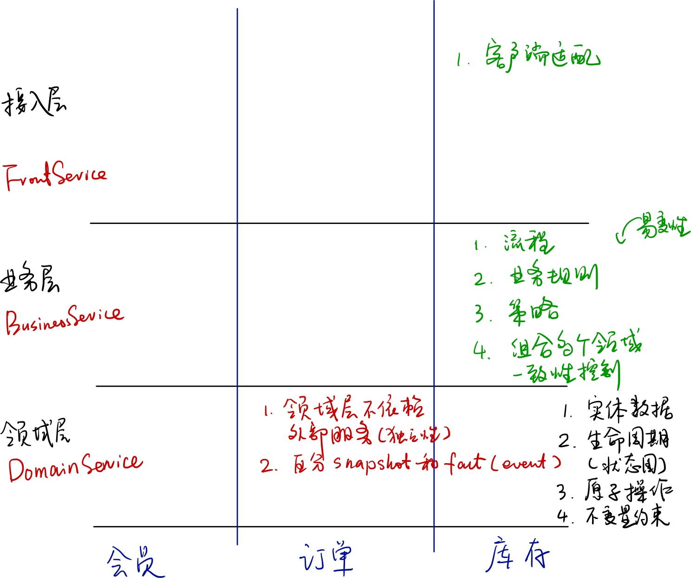

# 服务分层

按照业务领域对系统进行分解的方式是一种“水平”分解，譬如，划分为：商品、供应商、会员、订单、支付、库存、采购、促销、活动等，这样的水平拆分是否足够了呢？实际上，随着业务的不断精细化发展，单纯的水平拆分后，一个领域内的业务逻辑仍然会非常复杂，而且，随着业务的发展变化，这个领域的服务也会经常面临变更，整体结构难以维持稳定。

|  | DomainA | DomainB | DomainC |
| --- | --- | --- | --- |
| 接入层 | 面向渠道、主要是聚合类逻辑 |  |  |
| 业务逻辑层 | 适应公司运营模式、组织结构、营销活动策略，变化度较高。 |  |  |
| 领域层 | 面向行业，相对不变，可适应不同公司、不同业务模式 |  |  |

在水平拆分的基础上，我们可以进一步的进行层次拆分，层次拆分的依据包括：
1. 业务逻辑的稳定性。 将相对稳定（不变）的业务逻辑和容易变化的业务逻辑（主要是规则、策略、流程）进行拆分。
2. 

## 1 领域层（Domain Layer）
领域层的主要职责是：
1. 管理领域对象的核心数据、状态。（实体、关系、事件）
2. 严格定义的实体生命周期、状态图。
3. 定义实体的最小化原子操作。需要了解外层的各种业务操作逻辑，进行归纳、抽象，并进行合理的预期。
4. 不变量是领域对象的核心规则，任何原子方法都不能够打破这个规则。
5. 普适性。不局限于目前收集到的业务需求，跳出当前项目背景，要向同行业，向未来进行思考。业务模型要具有一定的普适性。

设计领域层服务时，要会做减法。如果某个约束、规则、策略具有易变性，或者有1-2个不同的替代方案，则应该从`领域层`剥离出去，上升到业务层中去。
- 约束  assertion 
- 规则  if then
- 策略. f(x)

2种部署模式：
1. 将 Domain Service 作为一个独立部署的 RPC 服务，其定义了单个事务边界。Business Service

### 1.1 原子操作
- 反应最为核心的实体生命周期中的原子性操作。
- 原子操作不适合于作为独立服务向外提供

### 1.2 聚合服务

### 1.3 依赖
1. 领域层服务要避免对外部领域的依赖，相反，如有依赖，在服务调用时注入。

## 2 业务层（Business Layer)
### 2.1 策略分离
### 2.2 业务流程（领域聚合） 
### 2.3 依赖

## 3 接入层（Front Layer)
### 3.1 会话适配