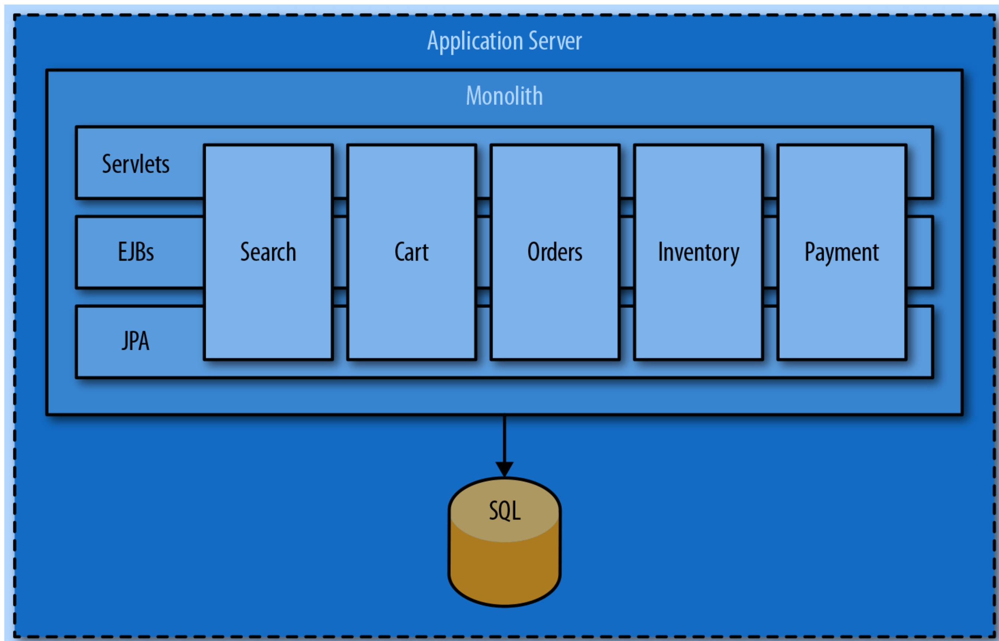

# 单体应用、SOA、ESB、MicroService、康威定律

# Client Server 模式
这种模式是上个世纪90年代，比较流行的一种模式。其软件主要包括如下两层：
1. Client
    Client 一般来说，就是采用Dephi、PowerBuilder等支持数据库操作、带有GUI功能的编程语言，编写的一个独立的程序，这个程序为最终用户提供各种功能，一般的，按照业务划分为多个菜单，进入到某个菜单后，打开相应的Form，与用户进行交互，然后，远程的操作数据库，进行数据读取、修改、删除等操作。
    所有的业务逻辑都在Client程序中。那个时代的企业软件，大部分都是采用这种模式进行开发的。
2. Server。
    一般的，Server特指数据库服务器，例如Oracle、MS SQL等，通过ODBC或者其他驱动程序，为Client所访问。
C/S模式在互联网普及之前，广为采用，绝大部分的POS、ERP等系统都是采用这种模式。随后，随着Internet的普及，而逐渐的消退。诸如Delphi、PowerBuilder等杀手级的IDE也逐步退出江湖。

# 单体应用 Monolith
早期的互联网应用，并没有很大的用户量、并发度的压力，一般采用所谓的单体模式，即将这个网站的功能包括一个部署单元中，部署在单台服务器上。例如 ASP、ASP.NET、JSP等。以Java为例，一个网站的全部内容都包括在一个war包中，部署在单个Tomcat容器内，对外提供服务。

1. User Interface。比如 Servlet、JSP、Struts MVC、Spring MVC等等。这里包括了用户界面和用户的交互逻辑。
2. Business Logic。一般的，所有的UI交互之下，都隐藏着业务逻辑，在单体应用中，一般会把Business Logic作为一个独立的层次，从MVC中独立出来，通过接口进行调用。
3. DAO。在 Business Logic下，一般会把数据的访问独立出来，作为一个独立的软件层次，并命令为 Data Access Object。这个尤其在ORM盛行的时代，得到了极大的重视。

     
单体模式，其实是一种很自然的开发模式，尤其适合与较小的业务团队、相对简单的业务场景。这种模式下，整个项目的代码可以在一个工程中完成，开发调试方便，部署也简单，实乃快速入门的最佳选择。实际上，很多的知名电商平台，最早也就10来号开发工程师，几个主要的网页和购物流程，就上线了，最早的模式很多都是单体模式的。

单体应用入门简单，但是随着业务的发展，就开始面临如下的挑战了：
1. 开发团队越来越大，单个工程的代码量越来越庞大，代码的合并冲突日益增加。
2. 在同一个部署单元中的多个功能模块冲突越来越大，一个小小的新的修改，都可能导致老的代码出现BUG，或者运行期的OOM等相互干扰。
3. 一次完整的编译、部署变得越来越慢。
4. 应用包越来越大，需要更多内存、启动越来越慢
5. 业务发展后，部分业务的请求流量显著增加，需要做集群化部署的需求越来越大。
6. 线上各个模块互相干扰，线上性能优化、问题定位非常复杂。

总之，单体应用适合与快速上手，但随着业务规模越来越复杂，无论从开发效率、线上运行效率、运维管理都会变得越来越复杂，并最终无法支撑业务的发展需要。

## 烟囱模式

## 基于数据总线的服务化

## 基于RPC模式的服务化

## 微服务？何谓微？

## 康威定律

