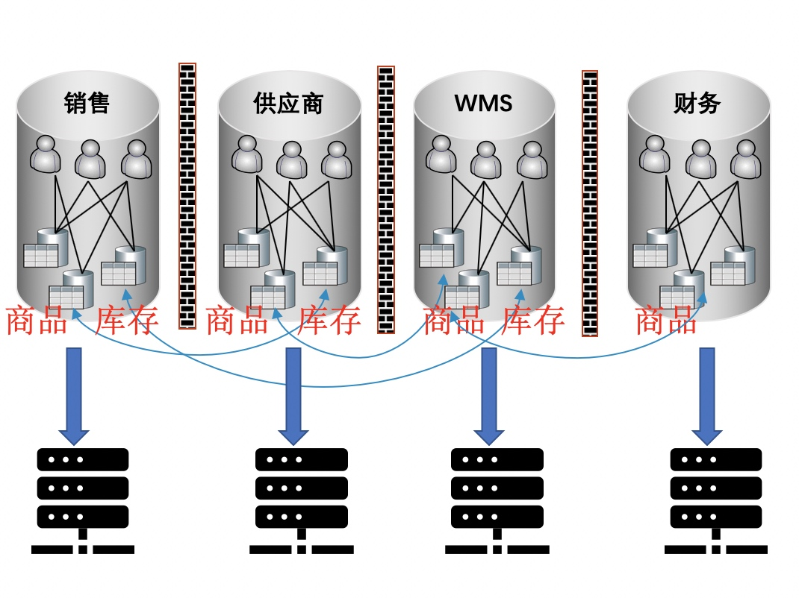
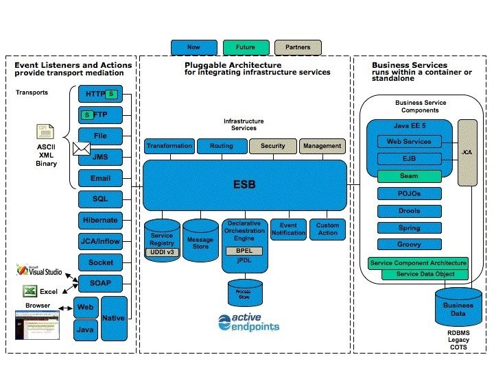

# 微服务演化史

本章内容属“史”，描述了从上个世纪90年代至今，一些主流的技术架构演化过程，肯定不能覆盖全部的技术架构，但也会有一定的代表度。
1. Client Server模式
2. 单体应用
3. 服务化之ESB
4. 服务化之烟囱模式
5. 服务化之微服务
6. 康威定律

## Client Server 模式
### 模式一：富客户端（Client） + 瘦存储端(Server)。
这种模式是上个世纪90年代，比较流行（先进、时髦）的一种模式。其软件主要包括如下两层：
1. Client
    Client 一般来说，就是采用Dephi、PowerBuilder等支持数据库操作、带有GUI功能的编程语言，编写的一个独立的程序，这个程序为最终用户提供各种功能，一般的，按照业务划分为多个菜单，进入到某个菜单后，打开相应的Form，与用户进行交互，然后，远程的操作数据库，进行数据读取、修改、删除等操作。
    所有的业务逻辑都在Client程序中。那个时代的企业软件，大部分都是采用这种模式进行开发的。
2. Server。
    一般的，Server特指数据库服务器，例如Oracle、MS SQL等，通过ODBC或者其他驱动程序，为Client所访问。

这种模式在上个世纪90年代，曾广为采用，绝大部分的POS、ERP、证券等系统都是采用这种模式。并诞生了诸如 Delphi、PowerBuilder等杀手级的IDE。
这种模式比较自然，但也存在问题：
1. 性能。由于Server其实就是一个数据库，每一次用户交互，都可能涉及到多次的数据查询、修改等操作，在当时网络速度还比较慢的情况下，交互的卡顿是常事。而且，后端数据库的性能也是很大的瓶颈。笔者知道2018年，还见到这样的零售系统，用户经常需要在按下一个查询键后，等待沙漏长达数分钟，才能收到查询数据的返回。
2. 代码的可维护性。一般来说，模式一里的Client，由于包括了界面展示、界面交互、数据校验、业务规则处理、数据查询与操作等全部的逻辑（而Server其实是一个几乎不包括任何逻辑的关系数据库），这个代码会变得臃肿、复杂、冗余，因此，难以维护、修改、变更。随着时间的演化，这个问题会越发艰巨，最终演化成不可维护、不可修改的代码。

### 模式二：富客户端（Client) + 服务端（存储过程 + 存储 Server） 
针对模式一存在性能问题、可维护性问题，一个超级优秀的方案出炉了：存储过程。主流的数据库都集成了存储过程的功能，现在，我们可以讲一些原本放在 Client 中的业务逻辑，转移到存储过程中。而在客户端，只需要一次过程调用即可。

这个方式是对模式一的自然过渡，开发上几乎不需要做多大的改动，但带来了很大的优点：
1. 减少了数据访问的round trip，大大的提升了性能。
2. 将业务逻辑从Client中分离出来，Client变得简单。
3. 修改业务逻辑，变得非常的简单。因为存储过程天然的 REPL 模式，远远优于各种传统的编程语言，需要 编码 - 编译 - 执行 的过程。有了存储过程，我们可以随时调出之前的代码、修改，然后保存后就可生效。

一切看来是如此美好。因此，模式二也曾经是非常之普遍。喜好这种模式的工程师，会讲绝大部份的业务逻辑都转移到存储过程中。因此，如果你看到一个3000-5000行长度的存储过程，以及一个数据库中成百上千的这类存储过程，你不用惊诧，

### 模式三：瘦客户端（Client） + 富服务端（Server) + DB Server。
笔者最早在银行业，就是采用这种模式：
1. Client 侧重于用户界面、用户交互等相关逻辑。当涉及到具体的数据访问、操作时，则通过网络（RPC模式、或报文模式）请求Server进行处理。
2. Server 响应Client的请求，完成复杂的业务逻辑（校验、业务规则、计算、策略、流程），并访问后端的数据存储。
3. DB Server 负责数据的存储，一般的，与Server在同一个局域网内。

我们最早也把这个模式称之为C/S模式，但发现他和模式一、模式二有很大的差别。

## 单体应用 Monolith
早期的互联网应用，并没有很大的用户量、并发度的压力，一般采用所谓的单体模式，即将这个网站的功能包括一个部署单元中，部署在单台服务器上。例如 ASP、ASP.NET、JSP等。以Java为例，一个网站的全部内容都包括在一个war包中，部署在单个Tomcat容器内，对外提供服务。

1. User Interface。比如 Servlet、JSP、Struts MVC、Spring MVC等等。这里包括了用户界面和用户的交互逻辑。
2. Business Logic。一般的，所有的UI交互之下，都隐藏着业务逻辑，在单体应用中，一般会把Business Logic作为一个独立的层次，从MVC中独立出来，通过接口进行调用。
3. DAO。在 Business Logic下，一般会把数据的访问独立出来，作为一个独立的软件层次，并命令为 Data Access Object。这个尤其在ORM盛行的时代，得到了极大的重视。

     
单体模式，其实是一种很自然的开发模式，尤其适合与较小的业务团队、相对简单的业务场景。这种模式下，整个项目的代码可以在一个工程中完成，开发调试方便，部署也简单，实乃快速入门的最佳选择。实际上，很多的知名电商平台，最早也就10来号开发工程师，几个主要的网页和购物流程，就上线了，最早的模式很多都是单体模式的。

单体应用入门简单，但是随着业务的发展，就开始面临如下的挑战了：
1. 开发团队越来越大，单个工程的代码量越来越庞大，代码的合并冲突日益增加。
2. 在同一个部署单元中的多个功能模块冲突越来越大，一个小小的新的修改，都可能导致老的代码出现BUG，或者运行期的OOM等相互干扰。
3. 一次完整的编译、部署变得越来越慢。
4. 应用包越来越大，需要更多内存、启动越来越慢
5. 业务发展后，部分业务的请求流量显著增加，需要做集群化部署的需求越来越大。
6. 线上各个模块互相干扰，线上性能优化、问题定位非常复杂。

总之，单体应用适合与快速上手，但随着业务规模越来越复杂，无论从开发效率、线上运行效率、运维管理都会变得越来越复杂，并最终无法支撑业务的发展需要。

## 服务化之烟囱模式
对单体应用进行拆分的一种常见模式就是：烟囱模式。也就是说，将一个大的系统拆解成为多个独立的子系统，每个独立的子系统都是一个一个的孤立的“烟囱”，彼此之间，并没有太多的关联。所谓的关联，一般是，通过定时的、批量的数据交换来完成。

烟囱化的原因是：多个系统，由于是不同的团队，在不同的时间点构建的，其业务关注点不一样，技术选型可能不一样，技术团队的风格也可能不一样，而且，历史上已经建立好的其它字系统，也已经是孤立的，没有提供良好的开发文档、开发接口，因此，新的子系统也会继承这个特色，从而多建一个新的“烟囱”。

烟囱模式的缺点是：
1. 在同一个大的公司（集团）内，不同的子系统总是有一些重复性的内容，这些就势必重复建设。冗余就会带来数据的不一致，从此就陷入到多口径的漩涡中。
2. 数据孤岛。一个子系统很难获得另外一个子系统的数据，更谈不大上实时的数据。
3. 系统之间的协作几乎为0，或者协作成本很高。很难想象，没有互动的系统，在价值上会打多大的折扣。
4. 很难孵化新业务。因为新业务缺少数据，或者说必须从零开始做一大堆重复性的基础建设。
5. 用户体验差。这个是不言而喻的，设想你需要在每个子系统中维护一套你的收货地址？

## 服务化之ESB模式
对单体应用进行拆分的一种模式，就是 Enterprise Service Bus(ESB)。ESB是通过消息队列这样的中间件，实现不同的Service之间的解耦。

下图是一张ESB的架构图：

 
 ESB 作为一个”Bus", 完成消息的输入、转化、输出的工作，包括：
 1. 协议的转换。如上图，从HTTP、FTP到JMS、SOAP、Socket 无所不包。
 2. 数据格式的转换。包括XML、JSON等。复杂的ESB还有自己的IDE定义数据的转换逻辑。
 3. 消息路由。消息可以通过配置复杂的路由规则，来完成对消费者的刷选和匹配能力。

 在ESB中，消息的生产者并不是直接把消息传递给“消费者”，而是通过ESB来进行，这样做的好处是：
 1. 更好的服务治理能力。比如对消息传递过程进行访问日志、权限检查、请求频次检查，这些可以在ESB上进行。
 2. 更灵活的服务路由能力。可以自由的解耦生产者、消费者，还可以按需装配新的“消息”传递过程，而无需修改生产者、消费者。
 
 ESB 存在的不足是：
 1. 消息的传递效率。相比RPC的直接消息传递，ESB的总线模式，在性能上多了一个环节，成本增加，时效性大为降低。这对效率敏感的互联网应用来说，是难以忍受的。
 2. ESB的性能瓶颈。当Bus上要承载每秒过百万、千万的消息量时，需要一个多复杂的Bus来支持呢？而互联网应用天然就对去中心化有亲切感，Bus这种“中心”模式，很难匹配高并发的互联网场景。
 
 这些优势，难道在RPC模式下，就不可获得吗？其实，不尽然，微服务模式就试图打破ESB的不足，但继承ESB的优势。

## 服务化之微服务模式

## 康威定律

