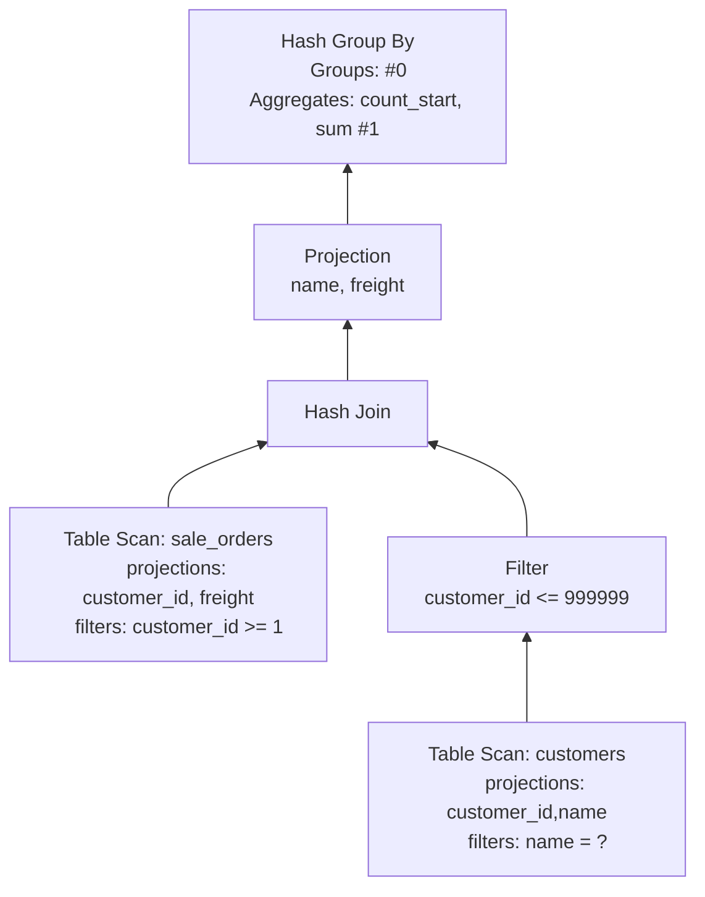
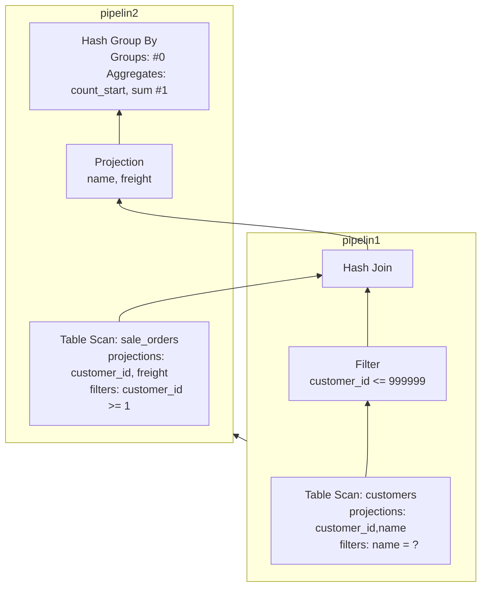

# 一个简单的关联、分组聚合查询的执行计划分析

## sql
```sql
select name, count(freight), sum(freight) 
from sale_orders so 
left join customers c on c.customer_id = so.customer_id 
where name = 'IB89Nf23kAom' 
group by name;
```

## Physical Plan



## Pipeline



1. 执行计划拆分为多个 pipeline, 每个 pipeline 是一个从 Source 到 Sink 的 Push 模型.
   - [ ] 如何根据物理执行计划生成 pipeline ?
2. 多个 pipeline 之间构成了一个依赖图，依赖的 pipeline 执行完毕后，被依赖的 pipeline 才能执行。
3. 每个 pipeline 会被拆分为多个 Task(分区并行)，每个 Task 相当于一个最小的调度单元。
   - 当 Pipeline 的所有 task 执行完毕，这个 pipeline 才执行完毕，可以执行被依赖的的 pipeline。
4. 在 Pipeline 中有3种角色：
   - Source: 管道的起点，从外部设备读取数据。（IO 阻塞式：这是否会降低系统的处理能力？）
     - GetData(): 读取数据
     
        Source 需要考虑并发，与单个任务相关的数据存储在 localState 中，与整个管道相关的数据存储在 globalState 中。
        - globalState 存储在 pipeline 中，同一个 pipeline 的所有 task 共享，设计到并发安全控制时，需要加锁
        - localState 存储在 PipelineExecutor 中。由 PipelineExecutor 负责创建和销毁。
        不同的 Source 节点有自己的 localState/globalState 定义。
     
     -[ ] 执行计划是如何处理分区的？
     
   - Operator: pure function
     - Execute(): 处理单个批次的输入数据，无需考虑并发安全。
     
   - Sink: 管道的终点，需要协调多个任务的结果，进行合并
     - Sink(): 处理单个批次的输入数据
     - Combine(): 单个 Task 的全部 Source 处理完毕，进行单个任务内的合并。（其他任务可能会 Sink/Combine）
     - Finalize(): 所有 Task 处理完毕，进行最终的合并。
     
     考虑到存在并发问题，需要区分 localState 和 globalState，不同的 Sink 节点有自己的 localState/globalState 定义。

# 主要算子的执行逻辑

## PhysicalTableScan (Source in pipeline1 & pipeline2)

1. [ ] 分区如何处理？ Source 侧如何处理并发？
2. 每次 Pipeline Execute最多 50 个 Chunk?
3. bind_data 指向 DataTable 
   - [ ] 为 TableScanBindData 增加 ToString 方法，方便调试
   - [ ] unordered_map 无法显示， 考虑为 ScanFilterInfo/TableScanState 添加 ToString 方法
4. 实际入口：TableScanFunc() 负责读取数据
   // 边界：TableFunction，可能要对比 from table 与 from csv_read 的执行流程的区别 

## PhysicalFilter (Operator in pipeline1)
1. filter 表达式的计算流程？（解释执行的成本如何？）
2. 这一块的代码是否会进行 SIMD 优化？

```

BinaryExecutor::SelectGenericLoop<…>(const int *, const int *, const SelectionVector *, 
    const SelectionVector *, const SelectionVector *, unsigned long long, ValidityMask &, 
    ValidityMask &, SelectionVector *, SelectionVector *) binary_executor.hpp:444
    --- 这个方法才是最终的向量执行代码，在前面有5-6层的解释和 dispatch 过程
BinaryExecutor::SelectGenericLoopSelSwitch<…>(const int *, const int *, const SelectionVector *, 
    const SelectionVector *, const SelectionVector *, unsigned long long, ValidityMask &, 
    ValidityMask &, SelectionVector *, SelectionVector *) binary_executor.hpp:459
BinaryExecutor::SelectGenericLoopSwitch<…>(const int *, const int *, const SelectionVector *, 
    const SelectionVector *, const SelectionVector *, unsigned long long, ValidityMask &, 
    ValidityMask &, SelectionVector *, SelectionVector *) binary_executor.hpp:475
BinaryExecutor::SelectGeneric<…>(Vector &, Vector &, const SelectionVector *, 
    unsigned long long, SelectionVector *, SelectionVector *) binary_executor.hpp:491
BinaryExecutor::Select<…>(Vector &, Vector &, const SelectionVector *, 
    unsigned long long, SelectionVector *, SelectionVector *) binary_executor.hpp:515
TemplatedSelectOperation<…>(Vector &, Vector &, optional_ptr<…>, unsigned long long, 
    optional_ptr<…>, optional_ptr<…>, optional_ptr<…>) execute_comparison.cpp:104
VectorOperations::LessThanEquals(Vector &, Vector &, optional_ptr<…>, unsigned long long, 
    optional_ptr<…>, optional_ptr<…>, optional_ptr<…>) execute_comparison.cpp:345
    
ExpressionExecutor::Select(const BoundComparisonExpression &, ExpressionState *, 
    const SelectionVector *, unsigned long long, SelectionVector *, 
    SelectionVector *) execute_comparison.cpp:369
ExpressionExecutor::Select(const Expression &, ExpressionState *, const SelectionVector *, 
    unsigned long long, SelectionVector *, SelectionVector *) expression_executor.cpp:236
ExpressionExecutor::SelectExpression(DataChunk &, SelectionVector &) expression_executor.cpp:90
PhysicalFilter::ExecuteInternal(ExecutionContext &, DataChunk &, DataChunk &, GlobalOperatorState &, OperatorState &) const physical_filter.cpp:45
......
```
当然，要对比一下在 release 模式下，是否会进行编译优化？从这个执行栈来看，这个解释过程还是很啰嗦的。如果进行更好的特化或者 TypedIR 的方式，相信在这一块的
执行效率会更高。

从代码执行流程来看，这个解释执行的过程似乎还是有些高，如果编译为更加特化（模版化）的版本，或者采用 TypedIR 的方式，应该会更高效一些。

customer_id <= 999999 的计算，是否可以特化为如下的 函数调用：
```cpp
void FilterOp::LE(Vector<i32> &src, Vector<i32> &dst, ductdb::Vector<bool> result) {
    todo!();
}
```
上述的方法甚至可以进一步的特化，例如针对 FlatVector / DictionaryVector / ConstantVector 等特定的 Vector 类型进行特化。这个也是 ClickHouse 的做法。

## PhysicalHashJoin (Sink in pipeline1)

## PhysicalHashJoin (operator in pipeline2)

## PhysicalProjection (Operator in pipeline2)

## PhysicalHashAggregate (Sink in pipeline2)


# Pipeline 调度
1. Pipeline Task 的创建
2. 主要数据结构
    - [ ] 画一个 class diagram, 理清楚这几个类的 CRC。
    - Event 这个类是干什么的？

    1. Executor: (共享粒度)
       - physical_plan
       - owned_plan
       - root_pipeline
       - pipelines
    2. Pipeline: 共享粒度，存储 global state，多线程访问需要考虑加锁
        - source operator
        - operators
        - sink operator
        - source_state: global state for Source
        - sink.sink_state: global state for Sink
       
    3. PipelineExecutor (线程粒度)
       - pipeline
       - thread_context
       - ExecutionContext
       - local_source_state
       - local_sink_state
    4. PipelineTask is a ExecutorTask(线程粒度) 在执行过程中有哪些是变化的？
       - ExecutorTask:
         - task ?
         - executor: Executor
         - event
         - thread_context
         - op ?
       - pipeline: Pipeline
       - pipeline_executor: PipelineExecutor (每个线程一个 PipelineExecutor 示例，存储 localState )
    5. ExecutionContext(client: ClientContext&, thread, pipeline)
