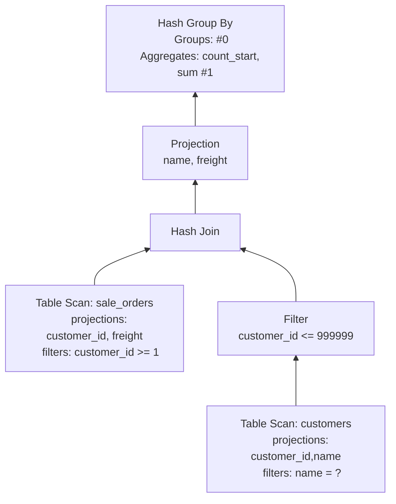
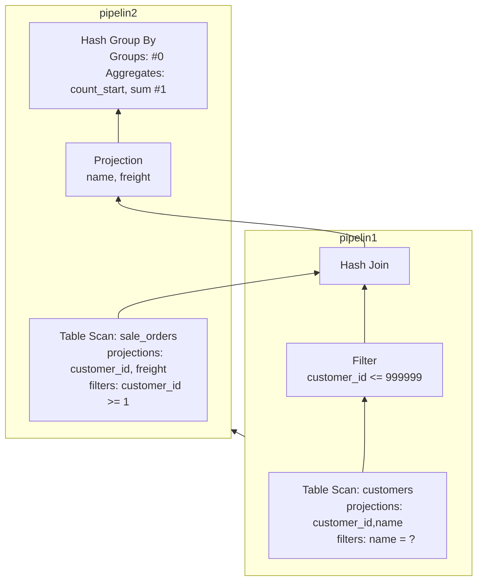

# 一个简单的关联、分组聚合查询的执行计划分析

## sql
```sql
select name, count(freight), sum(freight) 
from sale_orders so 
left join customers c on c.customer_id = so.customer_id 
where name = 'IB89Nf23kAom' 
group by name;
```

## Physical Plan



## Pipeline



1. 执行计划拆分为多个 pipeline, 每个 pipeline 是一个从 Source 到 Sink 的 Push 模型.
   - [ ] 如何根据物理执行计划生成 pipeline ?
2. 多个 pipeline 之间构成了一个依赖图，依赖的 pipeline 执行完毕后，被依赖的 pipeline 才能执行。
3. 每个 pipeline 会被拆分为多个 Task(分区并行)，每个 Task 相当于一个最小的调度单元。
   - 当 Pipeline 的所有 task 执行完毕，这个 pipeline 才执行完毕，可以执行被依赖的的 pipeline。
4. 在 Pipeline 中有3种角色：
   - Source: 管道的起点，从外部设备读取数据。（IO 阻塞式：这是否会降低系统的处理能力？）
     - GetData(): 读取数据
     
        Source 需要考虑并发，与单个任务相关的数据存储在 localState 中，与整个管道相关的数据存储在 globalState 中。
        - globalState 存储在 pipeline 中，同一个 pipeline 的所有 task 共享，设计到并发安全控制时，需要加锁
        - localState 存储在 PipelineExecutor 中。由 PipelineExecutor 负责创建和销毁。
        不同的 Source 节点有自己的 localState/globalState 定义。
     
     -[ ] 执行计划是如何处理分区的？
     
   - Operator: pure function
     - Execute(): 处理单个批次的输入数据，无需考虑并发安全。
     
   - Sink: 管道的终点，需要协调多个任务的结果，进行合并
     - Sink(): 处理单个批次的输入数据
     - Combine(): 单个 Task 的全部 Source 处理完毕，进行单个任务内的合并。（其他任务可能会 Sink/Combine）
     - Finalize(): 所有 Task 处理完毕，进行最终的合并。
     
     考虑到存在并发问题，需要区分 localState 和 globalState，不同的 Sink 节点有自己的 localState/globalState 定义。

# 主要算子的执行逻辑

## PhysicalTableScan (Source in pipeline1 & pipeline2)

1. [ ] 分区如何处理？ Source 侧如何处理并发？
2. 每次 Pipeline Execute最多 50 个 Chunk?
3. bind_data 指向 duckdb::DataTable 
   - [ ] 为 TableScanBindData 增加 ToString 方法，方便调试
   - [ ] unordered_map 无法显示， 考虑为 duckdb::ScanFilterInfo/TableScanState 添加 ToString 方法
4. 实际入口：duckdb::TableScanFunc() 负责读取数据
   // 边界：TableFunction，可能要对比 from table 与 from csv_read 的执行流程的区别 

## PhysicalFilter (Operator in pipeline1)

## PhysicalHashJoin (Sink in pipeline1)

## PhysicalHashJoin (operator in pipeline2)

## PhysicalProjection (Operator in pipeline2)

## PhysicalHashAggregate (Sink in pipeline2)


# Pipeline 调度
1. Pipeline Task 的创建
2. 
