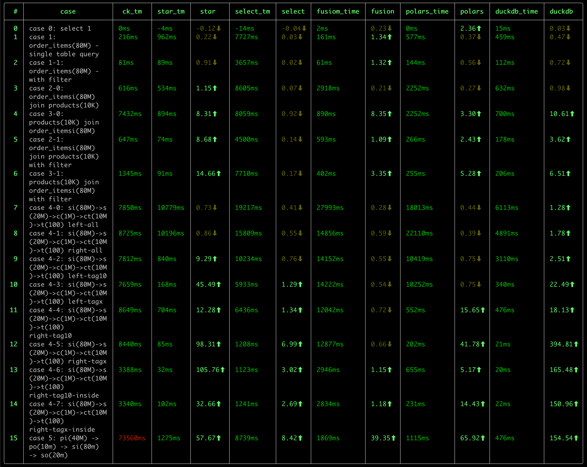

# 前言

[duckdb](duckdb.org) 是一款优秀的 OLAP 数据库，有如下的特点：
- 快速。 
  
  我之前进行了一次 OLAP 数据库的性能测试，对比了包括 ClickHouse, DuckDB, StarRocks, DorisDB, DataFusion， Pola.rs 在内的
  几款数据库， DuckDB 在好几项测试中，都处在领先位置。

  

- 轻量
  
  DuckDB 的二进制文件大小只有 40MB 左右，没有任何依赖。相比 clickhouse(~440M) 来说，小了一个数量级。
  
  而且，DuckDB 无需任何配置，即可使用，可处理 csv、parquet、json 等格式的文件数据，也可以使用 duckdb 自身的数据库格式，其使用
  风格非常类似于 sqlite, 是一个 serverless 风格的数据库，也非常适合于嵌入式应用。

  除了发布版本的的轻量之外，duckdb 的源代码量也很轻量，并且可以在各种平台中编译，源代码的结构较为清晰，适合于学习。

- SQL 支持能力强。

  作为一款轻量的数据库，我很惊讶于 duckdb 对 SQL 的支持程度：
  - 比如 [JOIN 支持]()，很多的数据库都不支持 Full Join，Semi Join, Anti Join
    等操作（虽然可以使用其他方式进行改写，但既不自然，也不便于性能优化）
  - [集合操作](https://duckdb.org/docs/sql/query_syntax/setops)：支持 Union, Union All, Intersect, Except 等操作。后两者很多数据库都不支持。
  - 窗口函数的支持力度。mysql 算是支持比较好的，但无法表示出“同期年累积值”（去年1月1日至1年前的今天）这样的窗口范围。ClickHouse 则对基于
    日期的窗口计算乏善可陈。在这方面, DuckDB 的支持力度是最好的。
  - [CTE 支持](https://duckdb.org/docs/sql/query_syntax/with)。 没有 CTE 的 SQL 语句，很多时候会变得难以阅读，难以维护。我们在处理类似于 PowerBI 的双向筛选时，生成了非常复杂的 SQL 语句，
    要理解这条 SQL 语句，有时1-2小时都讲不出清楚，但采用 CTE 后就变得简单、清晰很多。duckdb 良好的支持 CTE，并且有[针对 CTE 的优化](https://duckdb.org/2024/09/09/announcing-duckdb-110.html#automatic-cte-materialization)，
    这使得不仅 SQL 简单、易读，而且查询性能也更优秀。
  - 对 [list 数据类型](https://duckdb.org/docs/sql/data_types/list) 的支持，以及丰富的 [list 处理函数](https://duckdb.org/docs/sql/functions/list)。
    在我碰到的一个对 `count(distinct X)` 类型的度量进行小计、合计时，如果是传统的方式，势必针对每个聚合层次做一次重新计算，而采用 list 类型后，我们完全可以仅使用
    一次 SCAN 结合 窗口函数，完成这个需求，这对于大数据量下的查询来说，可以显著提升性能。
  
  上面仅列举了这段时间来我发现的一些能力，估计，随着对 duckdb 的深入研究，以及定制能力的挖掘，藏在 duckdb 内部还会有更多的宝藏会冒出来。
- 扩展能力。

  目前还只是简单的浏览了一下 [Extensions](https://duckdb.org/docs/sql/functions/list) 的文档，实验了一下 mysql 扩展提供的外部数据源
  连接能力，体会到 duckdb 强大的扩展能力。
  - 数据类型扩展，参考 [Inet Extension](https://duckdb.org/docs/extensions/inet)
  - 外部数据源扩展。参考 [MySQL Extension](https://duckdb.org/docs/extensions/mysql)，包括了函数、表函数、Pushdown 的扩展。
  - 自定义函数扩展。参考
    - scalar function
    - aggregate function
    - table function
    - window function
  
  当然，强大的扩展能力也是建立在良好的 模块化设计 的基础之上的。这也使得更有必要学习一下这款优秀的数据库的源代码了。

- 活跃的社区
  
  DuckDB 目前来看，在社区是棘手可热的：
  - 官网版本更新频繁。转正为 1.0.0 版本后，目前，每个月都有一个小版本的更新。
  - 文档较为完善。
  - Blog 更新较为频繁，介绍了很多新的优化、特性。
  - Youtube 上有很多的视频教程。
  - 国内也有很多的关注者，在知乎上有很多的文章介绍 duckdb 的使用和源代码分析的文章。
 
作为一名数据分析产品的开发者，我在了解 DuckDB 后，越发感觉到需要深入的学习 duckdb, 主要有以下的几个原因：
1. 引入 duckdb 作为公司核心产品的数据分析的引擎，简化产品产品架构、提升产品的能力，尤其是在性能方面的提升。

   目前，我们的产品有两个分析引擎：
   - SQL 分析引擎：将前端（仪表盘等可视化组件、AI）分析查询转换为 SQL 执行。目前这种方式对度量的复杂度有较大的局限，诸如时间的各种快速计算、
     表间计算 等难以有效支持。 (对源数据库的 SQL 方言适配工作量过于复杂。当产品要支持 40+ 各异的数据源时，SQL 方言几乎是一件不可能的任务。)
   - MDX 分析引擎。 MDX 分析引擎对复杂度量的表达能力支持，理论上是无上限的，但这种方式的计算模型偏重于 Top-Down 的递归函数计算，在数据的访问
     主要是 Pull 式的，在复杂的计算场景下，会面临性能问题。如果将 Top-Down + Pull 模型转换为 Bottom-Up + Push 模型，避免对数据源的重复 
     Scan 和 重复计算，是提升这类计算引擎的关键措施。
   
   对于 SQL 分析引擎，如何将一个复杂的 前端查询， 表示为 SQL 查询计划，在引入 duckdb 之前与 引入 duckdb 之后，在架构上会有很大的不同，甚至于
   有进一步的空间（即我们直接生成 物理执行计划，并在物理执行计划中添加与前端分析匹配的自定义算子的方式），这一块，目前还处在一个相对朦胧的阶段，
   有待内部进一步实验后，再进行分享。
   
   当然，无论是浅度的依赖，还是深度的依赖，都需要对 duckdb 的源代码有一个深入的了解，才能做到更多的驾驭能力，否则，很多东西是不敢想，不敢做，或者
   是遇到内部问题，难以跨越的。

2. 学习一款完整的 OLAP 分析引擎，了解更多的技术细节。

   SQL 执行自身是一个复杂的过程，从基础的火山模型，到向量版的火山模型、到 Pipeline 执行模型，从 Tree 解释执行到 JIT 编译执行，从传统的计算算子
   到 向量化的 算子，每一个领域都有很多的算法、优化技术。学习这些知识，是一个很有乐趣的过程。 或许，duckdb 并不是终点，而可能是一个新的起点。
   
后续，我会在这个系列中，记录我对 duckdb 的学习过程，包括：
- 数据结构
- 整体处理流程
- 特定的优化技术
- 对 OLAP.NEXT 技术的一些思考记录