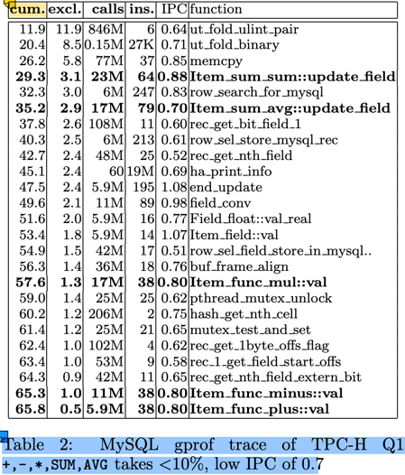

# Vector

向量化(Vectorization) 是 OLAP 的核心技术。在《MonetDB/X100: Hyper-Pipelining Query Execution》论文中，介绍了使用向量化技术带来的
性能提升，其主要原因是：
1. 传统的以 tuple-at-a-time 为单位的 Pull 模型，CPU 大部份消耗在 tuple 的运输(pull)上，实际的计算占比 < 10%（图中为8.8%）。参见下图：
   
2. 即使在这 8.8% 的计算中，其 IPC(Instructions Per Cycle) 也不高，只有 0.8。即平均每个时钟周期只执行了 0.8 条指令。而现在的服务器 CPU
   是多发射架构，intel skylake 每个时钟周期理论上可以执行4条指令。 这与 tuple-at-a-time 的计算模型有关。
3. 现代的 CPU 支持 SIMD 指令集，可以在一个时钟周期内执行多个相同操作的指令，这样可以提高计算效率。128/256/512 位的 SIMD 寄存器，可以在单条
   指令中操作 4/8/16 个 32-bit 的计算 或者 2/4/8 个 64-bit 的计算。
4. tuple-at-a-time 的计算模型，对 CPU 的缓存友好性不好。无论是 I-cache 还是 D-cache，这些都会影响 IPC 的提升。
   
使用向量化优化后，
1. 从 tuple-at-a-time 的 Pull 模型，改变为 morsel-at-a-time 的 Push 模型，每个 morsel 的大小可以很好的匹配 CPU 的缓存行大小。从而
   提升缓存的命中率。
2. morsel-at-a-time 的模式，大大的减少了处理循环，提高了有效运算的占比。
3. 结合 SIMD 指令，从原来的 0.8 的 IPC 显著提升到等效的 16-64， 计算处理也得以大幅度提升。

本文以 duckdb 的示例为例，介绍 Vector 的数据结构设计，常用的向量化操作，以及对这一块性能优化的一些思考。

## DuckDB Vector 数据结构

参考文档：[Vector官网介绍资料](https://duckdb.org/docs/internals/vector)。

```cpp
class Vector {
  VectorType vector_type;  // FLAT_VECTOR, FSST_VECTOR, CONSTANT_VECTOR, DICTIONARY_VECTOR, SEQUENCE_VECTOR
  LogicalType type;   // boolean, integer, date, varchar, etc.
  data_ptr_t data;    // uint8_t*, 指向数据的指钨
  ValidityMask validity;   // 标识某个元素是否是 null
  shared_ptr<VectorBuffer> buffer;   // data 的容器
  shared_ptr<VectorBuffer> auxliary; // 向量的动态数据部份的数据容器
}
```

以基础的 FlatVector(integer) 为例，其内存布局如下：
 ```
    vector_type: i8  -- FLAT_VECTOR
    type: [i8, 24]
        - id: i8  -- INTEGER
        - physical_type: i8
        _ type_info : nullptr  [i8,16]
    data: i32*  -- 指向 buffer.data 中区域
    validity: [i8, 32] 
        - validity_mask: u64*  -- bitmap，其 owner 由 validity_data 持有
        - validity_data: shared_ptr<ValidityBuffer>
        - target_count: u64 = 2048
    buffer: shared_ptr<VectorBuffer> -- owner data
            - buffer_type
            - aux_data: nullptr
            - data: nullptr -- 管理 vector.data 的所有权
    auxliary: nullptr       -- FlatVector(integer) 不需要额外的存储空间
```

- data: T_ITEM* 这里的 T_ITEM 是向量中元素的值类型，对 INTEGER 等定长类型，其值类型是 i32。
  - 对 VARCHAR，使用的是 string_t 结构，定义如下：
    ```cpp
    union {     // 16 bytes
        struct {  // length > 12 时存储前4个字符，后面的字符存储在 auxliary 中
            uint32_t length;
            char prefix[4];
            char *ptr;
        } pointer;
        struct { // length <= 12 时，直接存储在 inlined 中
            uint32_t length;
            char inlined[12];
        } inlined;
    } value;
    ```
    > 思考： 如果 string_t 调整为 24 或者 32 字节大小，则 INLINE 可以存储 12/20 字节，在进行字符串的比较时，是否会有更好的性能？
    
    对 VARCHAR 类型来说，string_t 是定长的，可以作为数组形式存储在 buffer 中（vector.data 是对 buffer 中的引用），而变长部份
    则存储在 auxliary 中。 这个存储设计非常类似于编程语言中的 stack 和 heap: stack 中存储定长部份，heap 中存储变长部份。
  - List 类型。DuckDB 支持 List ，不仅在 SQL 级别支持 list 数据类型及一系列的 list 操作函数，在引擎内部，也会依赖 List 类型来处理计算。
    ```cpp
    struct list_entry_t {  // list_entrt_t 是定长的，存储在 buffer 中
      idx_t offset;  // 指向在 auxliary 中的变长部份开始位置
      idx_t length;  // list 的长度
    };
    ```
     
    > 思考：这种设计就无法支持 list 的动态添加了。在将 list 作为聚合函数时，随着新的数据加入，list会不断的增长，这个就需要使用其他的数据结构来支持了。
    - [ ] 目前还没有看懂这一块的向量的构建过程。
- buffer: 
  数据的生命周期。

  > （我之前的C++经验还停留在 C++ 11之前的手动new/delete是经验，现在通过智能指针后，delete操作就基本上不需要了）这种模式是引用智能指针后 
   C++ 的常见的内存管理模式，rust 的内存管理思想与这个也是高度一致的。虽然 Rust 的设计是从 C++ 的最佳实践中衍生出来的，不过，不妨碍我用 Rust 来
   反向理解 C++。
  
  buffer 与 data 之间的关系满足：（在 Vector.Resize 方法中有这个假设：）
  ```cpp
  // data: unique_ptr<[T_ITEM]>; // T_ITEM 数组
  // data = buffer->data.get()   
  auto new_data = make_unsafe_uniq_array_uninitialized<data_t>(target_size); // new [T_ITEM; n]
  memcpy(new_data.get(), resize_info_entry.data, old_size); // 
  resize_info_entry.buffer->SetData(std::move(new_data));   // buffer->data = new_data
  resize_info_entry.vec.data = resize_info_entry.buffer->GetData();  // data = buffer->data.get()
  ```
  
  - [ ] TODO 似乎有一些子类型的 VectorBuffer 不满足这个契约，例如 DictionaryBuffer 通过 sel_vector 来访问 data， VectorChildBuffer 
    通过重载的 data: Vecotr 来管理数据。这些子类型似乎并不满足 Vector::Resize 中的这个契约。
  
- auxliary:
    