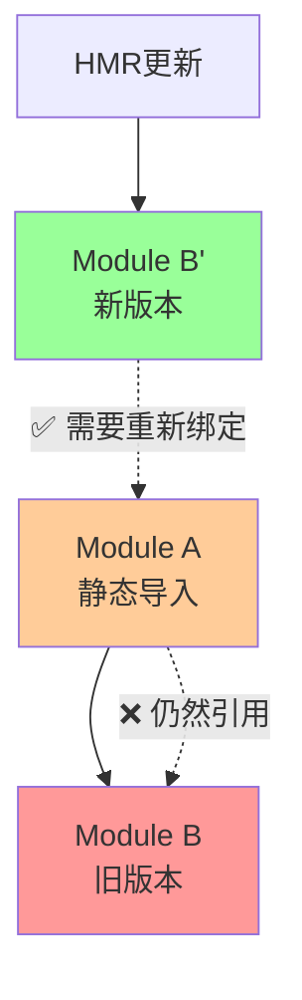

# 热模块重载 (Hot Module Reload)

热模块重载(HMR)是现代前端开发中的重要特性，允许在不刷新整个页面的情况下更新模块。它通过巧妙地绕过浏览器的模块缓存机制来实现实时开发体验。

## HMR基础概念

### 核心价值
HMR解决了传统开发中的几个关键痛点：

```javascript
// 传统开发流程的问题
// 1. 修改代码 → 2. 保存文件 → 3. 手动刷新浏览器 → 4. 重新填写表单/导航到测试页面
// 结果：开发效率低下，测试状态丢失

// HMR开发流程
// 1. 修改代码 → 2. 保存文件 → 3. 模块自动更新，状态保持
// 结果：即时反馈，开发体验显著提升
```

### 浏览器模块缓存机制

```javascript
// 浏览器模块缓存的工作原理
const moduleCache = new Map();

// 首次导入
import('./utils.js').then(module => {
    moduleCache.set('./utils.js', module); // 缓存模块
});

// 后续导入直接从缓存返回
import('./utils.js').then(module => {
    // 返回缓存的模块，即使文件已改变
});

// HMR的核心：绕过缓存
const versionedURL = `./utils.js?hmr_version=${Date.now()}`;
import(versionedURL).then(newModule => {
    // 强制获取新版本模块
});
```

## HMR的技术实现

### 版本化URL和WebSocket通信

```javascript
class HMRManager {
    constructor() {
        this.moduleVersions = new Map();
        this.moduleSubscribers = new Map();
        this.websocket = this.createWebSocket();
    }
    
    // 生成版本化的模块URL
    createVersionedURL(originalURL) {
        const version = this.moduleVersions.get(originalURL) || 0;
        const newVersion = version + 1;
        this.moduleVersions.set(originalURL, newVersion);
        
        // 添加版本参数绕过浏览器缓存
        const url = new URL(originalURL, window.location.origin);
        url.searchParams.set('hmr_version', newVersion.toString());
        url.searchParams.set('timestamp', Date.now().toString());
        
        return url.toString();
    }
    
    // 热重载指定模块
    async hotReload(modulePath) {
        console.log(`🔥 热重载模块: ${modulePath}`);
        
        try {
            const versionedURL = this.createVersionedURL(modulePath);
            const newModule = await import(versionedURL);
            
            // 通知所有订阅者
            const subscribers = this.moduleSubscribers.get(modulePath) || [];
            subscribers.forEach(callback => {
                try {
                    callback(newModule, modulePath);
                } catch (error) {
                    console.error(`HMR callback failed for ${modulePath}:`, error);
                }
            });
            
            return newModule;
        } catch (error) {
            console.error(`热重载失败 ${modulePath}:`, error);
            throw error;
        }
    }
    
    createWebSocket() {
        const ws = new WebSocket('ws://localhost:3000/hmr');
        
        ws.onmessage = (event) => {
            const message = JSON.parse(event.data);
            if (message.type === 'file-changed') {
                this.hotReload(message.path);
            }
        };
        
        ws.onopen = () => console.log('🔗 HMR WebSocket连接已建立');
        ws.onerror = (error) => console.error('❌ HMR WebSocket错误:', error);
        
        return ws;
    }
}
```

## Live Binding问题与Proxy解决方案

### Live Binding在HMR中的核心问题



```javascript
// 问题：静态导入的live binding在HMR中失效
import { calculateTotal, formatCurrency } from './utils.js';

class ProblematicShoppingCart {
    render() {
        // ❌ 这些函数引用在HMR后仍然指向旧版本！
        const total = calculateTotal(this.items);      // 旧版本
        const formattedTotal = formatCurrency(total);  // 旧版本
    }
}

// HMR更新后，即使utils.js文件内容改变了，
// calculateTotal和formatCurrency仍然是初始导入时的旧版本函数引用
```

### 基于Proxy的Live Binding解决方案

```javascript
// 核心：模块代理类
class ModuleProxy {
    constructor(modulePath) {
        this.modulePath = modulePath;
        this.currentModule = null;
        this.isLoading = false;
        this.loadInitialModule();
    }
    
    async loadInitialModule() {
        this.currentModule = await import(this.modulePath);
    }
    
    // 创建代理对象，动态转发到当前模块
    createProxy() {
        return new Proxy(this, {
            get(target, prop) {
                // 处理特殊属性
                if (prop === Symbol.toPrimitive || prop === 'valueOf' || prop === 'toString') {
                    return () => `[ModuleProxy: ${target.modulePath}]`;
                }
                
                if (target.currentModule && prop in target.currentModule) {
                    const value = target.currentModule[prop];
                    
                    // 如果是函数，绑定正确的this并保持上下文
                    if (typeof value === 'function') {
                        return function(...args) {
                            return value.apply(target.currentModule, args);
                        };
                    }
                    
                    // 返回其他类型的值（变量、对象等）
                    return value;
                }
                
                return undefined;
            },
            
            // 支持 'prop' in proxy 检查
            has(target, prop) {
                return target.currentModule && prop in target.currentModule;
            },
            
            // 支持 Object.keys(proxy) 等操作
            ownKeys(target) {
                return target.currentModule ? Object.keys(target.currentModule) : [];
            },
            
            getOwnPropertyDescriptor(target, prop) {
                if (target.currentModule && prop in target.currentModule) {
                    return Object.getOwnPropertyDescriptor(target.currentModule, prop);
                }
                return undefined;
            }
        });
    }
    
    // HMR更新时调用
    async updateModule() {
        if (this.isLoading) return;
        
        this.isLoading = true;
        try {
            const versionedURL = `${this.modulePath}?hmr_version=${Date.now()}`;
            const newModule = await import(versionedURL);
            
            // 保存旧模块用于对比
            const oldModule = this.currentModule;
            this.currentModule = newModule;
            
            console.log('✅ 模块代理已更新，live binding已恢复');
            
            // 可选：输出变更信息
            this.logChanges(oldModule, newModule);
            
        } catch (error) {
            console.error('❌ 模块代理更新失败:', error);
            throw error;
        } finally {
            this.isLoading = false;
        }
    }
    
    // 对比并输出模块变更
    logChanges(oldModule, newModule) {
        if (!oldModule) return;
        
        const oldKeys = Object.keys(oldModule);
        const newKeys = Object.keys(newModule);
        
        const added = newKeys.filter(key => !oldKeys.includes(key));
        const removed = oldKeys.filter(key => !newKeys.includes(key));
        const changed = oldKeys.filter(key => {
            return newKeys.includes(key) && oldModule[key] !== newModule[key];
        });
        
        if (added.length > 0) console.log('➕ 新增导出:', added);
        if (removed.length > 0) console.log('➖ 移除导出:', removed);
        if (changed.length > 0) console.log('🔄 变更导出:', changed);
    }
}
```

### 实际应用示例

```javascript
// Module B: utils.js (被依赖的模块)
export function calculateTotal(items) {
    return items.reduce((sum, item) => sum + item.price * item.quantity, 0);
}

export function formatCurrency(amount) {
    return new Intl.NumberFormat('zh-CN', {
        style: 'currency',
        currency: 'CNY'
    }).format(amount);
}

// HMR处理
if (import.meta.hot) {
    import.meta.hot.accept((newModule) => {
        console.log('🔄 utils.js 已更新');
    });
}
```

```javascript
// Module A: index.js - 使用Proxy方案
// 创建模块代理
const utilsProxy = new ModuleProxy('./utils.js');
const utils = utilsProxy.createProxy();

class SmartShoppingCart {
    constructor() {
        this.items = [
            { id: 1, name: '商品A', price: 100, quantity: 2 },
            { id: 2, name: '商品B', price: 50, quantity: 1 }
        ];
        this.render();
    }
    
    render() {
        // ✅ 通过代理访问，始终获取最新版本的函数
        const total = utils.calculateTotal(this.items);
        const formattedTotal = utils.formatCurrency(total);
        
        document.getElementById('cart').innerHTML = `
            <div>购物车总计: ${formattedTotal}</div>
            <div>商品数量: ${this.items.length}</div>
        `;
    }
}

// 全局实例管理
if (!window.__SMART_CART_INSTANCES__) {
    window.__SMART_CART_INSTANCES__ = [];
}

export function createShoppingCart() {
    const cart = new SmartShoppingCart();
    window.__SMART_CART_INSTANCES__.push(cart);
    return cart;
}

// HMR处理 - 使用Proxy方案
if (import.meta.hot) {
    import.meta.hot.accept(['./utils.js'], async () => {
        console.log('📦 utils.js 已更新，更新模块代理...');
        
        // 更新代理指向的模块
        await utilsProxy.updateModule();
        
        // 重新渲染所有实例，现在会使用新版本的函数
        window.__SMART_CART_INSTANCES__.forEach(cart => {
            cart.render();
        });
    });
}
```

### 增强版Proxy工厂

```javascript
// 高级模块代理工厂
class HMRModuleFactory {
    constructor() {
        this.proxies = new Map();
        this.hmrManager = new HMRManager();
    }
    
    // 创建或获取模块代理
    create(modulePath) {
        if (this.proxies.has(modulePath)) {
            return this.proxies.get(modulePath);
        }
        
        const moduleProxy = new ModuleProxy(modulePath);
        const proxy = moduleProxy.createProxy();
        
        // 注册HMR回调
        this.hmrManager.moduleSubscribers.set(modulePath, [
            async () => {
                await moduleProxy.updateModule();
                this.notifyUpdate(modulePath);
            }
        ]);
        
        this.proxies.set(modulePath, { proxy, moduleProxy });
        return proxy;
    }
    
    // 通知模块更新
    notifyUpdate(modulePath) {
        const event = new CustomEvent('hmr-module-updated', {
            detail: { modulePath, timestamp: Date.now() }
        });
        window.dispatchEvent(event);
    }
    
    // 获取所有代理的状态
    getProxyStatus() {
        const status = {};
        for (const [path, { moduleProxy }] of this.proxies) {
            status[path] = {
                isLoaded: !!moduleProxy.currentModule,
                isLoading: moduleProxy.isLoading,
                exports: moduleProxy.currentModule ? Object.keys(moduleProxy.currentModule) : []
            };
        }
        return status;
    }
}

// 全局工厂实例
const moduleFactory = new HMRModuleFactory();

// 便捷的模块导入函数
function hmrImport(modulePath) {
    return moduleFactory.create(modulePath);
}

// 使用示例
const utils = hmrImport('./utils.js');
const config = hmrImport('./config.js');
const helpers = hmrImport('./helpers.js');

// 监听模块更新事件
window.addEventListener('hmr-module-updated', (event) => {
    console.log(`📦 模块 ${event.detail.modulePath} 已通过HMR更新`);
});
```

## HMR的适用场景

### 技术性变更 (推荐使用HMR)

```javascript
// ✅ 性能优化 - API保持不变
// 优化前
export function calculateTotal(items) {
    let total = 0;
    for (let i = 0; i < items.length; i++) {
        total += items[i].price * items[i].quantity;
    }
    return total;
}

// 优化后 - 使用更高效的reduce
export function calculateTotal(items) {
    return items.reduce((sum, item) => sum + item.price * item.quantity, 0);
}
```

### 不适用的场景 (推荐完整刷新)

```javascript
// ❌ API签名变更
// 变更前
export function calculateTotal(items) {
    return items.reduce((sum, item) => sum + item.price, 0);
}

// 变更后 - 签名改变，返回值类型改变
export function calculateTotal(items, options = {}) {
    const { tax = 0, discount = 0 } = options;
    const subtotal = items.reduce((sum, item) => sum + item.price, 0);
    return {
        subtotal,
        tax: subtotal * tax,
        total: subtotal * (1 + tax - discount)
    };
}
```

### HMR决策管理器

// FIXME replace with markdown table
```javascript
class HMRDecisionManager {
    shouldUseHMR(changeType, moduleInfo) {
        const reasons = {
            // 技术性变更 - 适合HMR
            'performance_optimization': { useHMR: true, reason: '性能优化，API不变' },
            'bug_fix': { useHMR: true, reason: 'Bug修复，逻辑一致' },
            'code_refactoring': { useHMR: true, reason: '代码重构，接口稳定' },
            'style_update': { useHMR: true, reason: '样式更新，无副作用' },
            
            // 业务变更 - 需要完整刷新
            'api_signature_change': { useHMR: false, reason: 'API变更，避免类型错误' },
            'business_logic_change': { useHMR: false, reason: '业务逻辑变更，确保一致性' },
            'data_structure_change': { useHMR: false, reason: '数据结构变更，避免状态冲突' }
        };
        
        const decision = reasons[changeType] || { 
            useHMR: true, 
            reason: '默认尝试HMR，失败时降级' 
        };
        
        console.log(`📋 变更类型: ${changeType}`);
        console.log(`🎯 决策: ${decision.useHMR ? '使用HMR' : '完整刷新'}`);
        console.log(`💡 原因: ${decision.reason}`);
        
        return decision;
    }
}
```

## 总结

热模块重载通过以下核心机制工作：

1. **🔄 版本化URL**: 绕过浏览器模块缓存，确保获取最新模块
2. **📡 WebSocket通信**: 实时文件变更通知，保持客户端与服务器同步
3. **🎯 Proxy代理**: 解决ES模块live binding问题，确保引用始终指向最新版本
4. **💾 状态保持**: 维持应用运行时状态，避免开发时数据丢失

### 关键优势

- **⚡ 快速反馈**: 代码变更即时可见
- **🎯 精确更新**: 只更新修改的模块
- **💾 状态保持**: 保持应用状态不丢失
- **🔧 Live Binding**: 通过Proxy确保始终访问最新模块

### 使用建议

1. **Proxy方案**: 对于复杂应用，使用基于Proxy的模块代理解决live binding问题
2. **适用场景**: 优先用于技术性变更（性能优化、bug修复、代码重构）
3. **谨慎使用**: 避免在业务逻辑变更和API签名变化时使用HMR
4. **错误处理**: 实现完善的降级策略和错误恢复机制

HMR是现代前端开发不可或缺的工具，而基于Proxy的live binding解决方案使其在复杂应用中也能稳定可靠地工作。

---

**上一章**: ← [模块解析机制](./resolution.md)

**下一章**: [循环依赖处理](./circular-deps.md) →