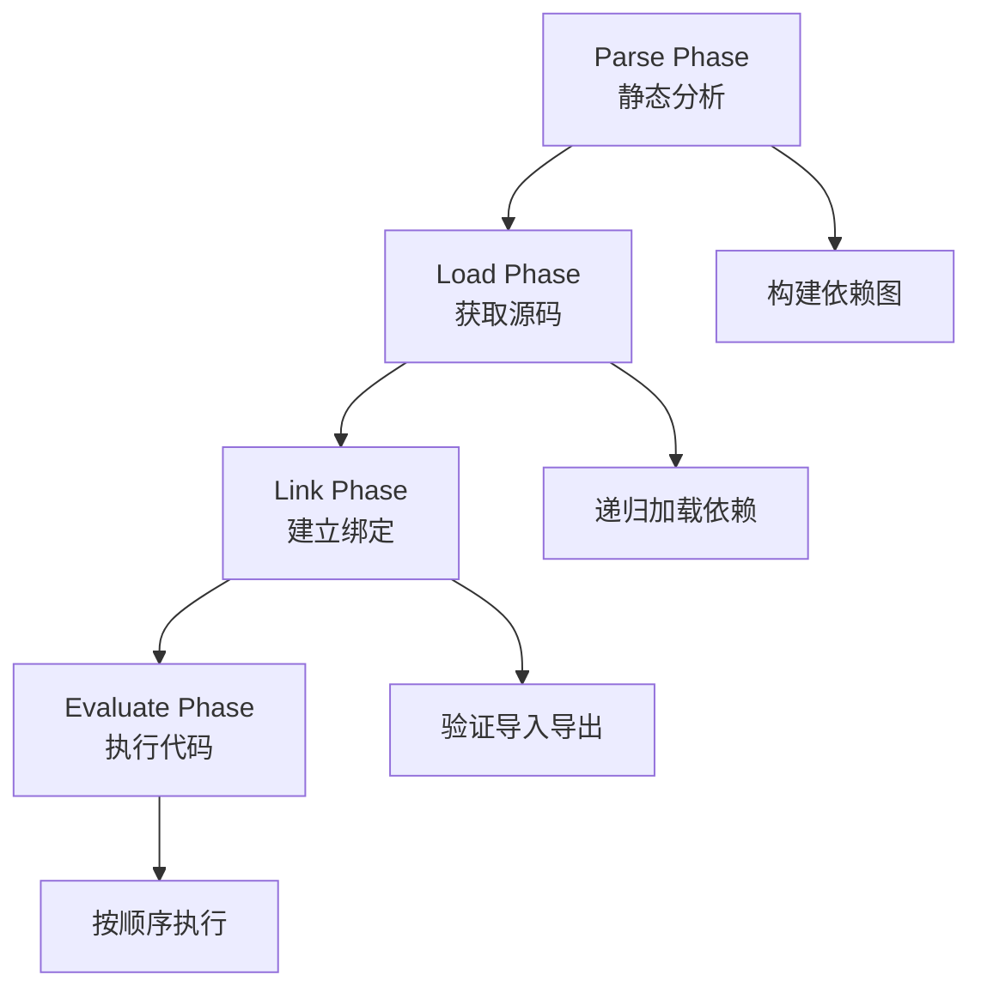

# 模块解析机制

模块解析（Module Resolution）是ES模块系统中的核心机制，决定了当你写下`import './module.js'`时，JavaScript引擎如何找到并加载正确的模块文件。本章将深入探讨各种解析规则、配置方式和最佳实践。

## ES模块执行的四个阶段

ES模块系统的执行过程严格按照以下四个阶段进行，这是ES模块规范的核心：

### 1. 解析阶段（Parse Phase）

**目标**: 静态分析模块代码，识别所有的导入和导出声明

```javascript
// 在这个阶段，引擎会分析：
import { utils, config } from './utils.js';     // ← 导入声明
import defaultExport from './helper.js';        // ← 默认导入
import * as api from './api.js';               // ← 命名空间导入

export const myVar = 'value';                  // ← 导出声明
export { helperFunc };                         // ← 重新导出
export default class MyClass {};               // ← 默认导出

// 在解析阶段，以下代码不会执行：
console.log('这行代码在解析阶段不会执行');
```

**关键特征**：
- 静态分析，不执行代码
- 构建模块依赖图
- 识别所有import/export声明
- 验证语法正确性

### 2. 加载阶段（Load Phase）

**目标**: 根据模块标识符获取所有依赖模块的源代码

```javascript
// 假设模块依赖关系：
// main.js → utils.js → config.js
// main.js → api.js → shared.js

// 加载阶段会递归获取所有模块的源码：
/*
加载顺序（深度优先）：
1. 开始加载 main.js
2. 发现依赖 utils.js，开始加载
3. 发现 utils.js 依赖 config.js，开始加载
4. config.js 无依赖，加载完成
5. 回到 utils.js，加载完成
6. 发现依赖 api.js，开始加载
7. 发现 api.js 依赖 shared.js，开始加载
8. shared.js 无依赖，加载完成
9. 回到 api.js，加载完成
10. 回到 main.js，加载完成
*/
```

**关键特征**：
- 递归加载所有依赖
- 网络请求或文件系统读取
- 深度优先遍历依赖图
- 处理循环依赖检测

### 3. 链接阶段（Link Phase）

**目标**: 创建模块记录，建立导入导出绑定，验证模块完整性

```javascript
// utils.js
export let count = 0;
export function increment() { count++; }

// main.js  
import { count, increment } from './utils.js';

// 在链接阶段：
// 1. 为每个模块创建模块记录（Module Record）
// 2. 验证 main.js 中的 { count, increment } 在 utils.js 中确实存在
// 3. 建立实时绑定（Live Binding）
// 4. 检查是否有未解析的导入
```

**链接过程详细步骤**：
```javascript
// 1. 创建模块环境记录
ModuleRecord {
  environment: ModuleEnvironmentRecord,
  namespace: ModuleNamespace,
  status: 'linking'
}

// 2. 验证导入导出匹配
main.js imports: ['count', 'increment']
utils.js exports: ['count', 'increment'] ✓

// 3. 建立绑定关系
main.count ──→ utils.count (live binding)
main.increment ──→ utils.increment (live binding)
```

**关键特征**：
- 创建模块环境记录
- 验证导入导出一致性
- 建立实时绑定关系
- 检测未解析的引用

### 4. 求值阶段（Evaluate Phase）

**目标**: 按拓扑顺序执行模块代码，初始化导出值

```javascript
// 执行顺序遵循依赖关系，无依赖的模块先执行

// config.js (无依赖，最先执行)
console.log('1. config.js 执行');
export const API_URL = 'https://api.example.com';

// utils.js (依赖 config.js)
import { API_URL } from './config.js';
console.log('2. utils.js 执行');
export const client = createClient(API_URL);

// main.js (依赖 utils.js)
import { client } from './utils.js';
console.log('3. main.js 执行');
client.connect();
```

**求值特征**：
```javascript
// 拓扑排序确定执行顺序
依赖图: main.js → utils.js → config.js
执行顺序: config.js → utils.js → main.js

// 循环依赖处理
// 如果 A ←→ B 循环依赖，按照遇到的顺序执行
// 未初始化的绑定在求值完成前可能是 undefined
```

**关键特征**：
- 按拓扑顺序执行代码
- 初始化导出值
- 处理循环依赖
- 建立实时绑定关系

## 阶段间的关系



## 实际示例演示

```javascript
// 创建测试文件来观察各个阶段
// main.js
console.log('=== main.js 开始执行 ===');
import { helper } from './helper.js';
console.log('helper imported:', helper);
export const mainValue = 'from-main';

// helper.js  
console.log('=== helper.js 开始执行 ===');
import { config } from './config.js';
console.log('config imported:', config);
export const helper = 'helper-value';

// config.js
console.log('=== config.js 开始执行 ===');
export const config = 'config-value';

// 执行结果将显示求值阶段的顺序：
// === config.js 开始执行 ===
// === helper.js 开始执行 ===  
// config imported: config-value
// === main.js 开始执行 ===
// helper imported: helper-value
```

这四个阶段的严格执行保证了ES模块的静态分析能力、依赖管理和循环依赖处理的可靠性。

## 与ECMAScript规范的对应关系

上述四阶段模型完全符合ECMAScript规范（ES2015+ 15.2.1节）中定义的模块处理流程：

### 规范中的核心操作

1. **ParseModule(sourceText)** ↔ **解析阶段**
   - 解析源码为抽象语法树
   - 提取导入导出声明
   - 创建模块记录（Source Text Module Record）

2. **HostResolveImportedModule()** ↔ **加载阶段**  
   - 解析模块标识符
   - 递归加载依赖模块
   - 实现定义的具体加载机制

3. **ModuleDeclarationInstantiation()** ↔ **链接阶段**
   - 创建模块环境记录
   - 建立导入导出绑定
   - 验证所有依赖的可解析性

4. **ModuleEvaluation()** ↔ **求值阶段**
   - 按依赖顺序递归求值
   - 执行模块代码
   - 初始化绑定值

### 规范保证的特性

```javascript
// ECMAScript规范确保的行为特征：

// 1. 幂等性 - 同一模块多次加载返回相同实例
const mod1 = await import('./module.js');
const mod2 = await import('./module.js');
console.log(mod1 === mod2); // true

// 2. 循环依赖检测 - ResolveExport算法防止无限递归
// 规范中的伪代码：
// If module and r.[[module]] are the same Module Record 
// and SameValue(exportName, r.[[exportName]]) is true, then
//   Assert: this is a circular import request.
//   Return null.

// 3. 静态结构 - 所有绑定在链接阶段确定
// 动态导入在运行时进行，但仍遵循四阶段流程
```

这种规范化的处理流程是ES模块相对于其他模块系统的核心优势。

## 三类模块标识符

### 1. 相对路径解析

```javascript
// 文件结构：
// src/
//   ├── components/
//   │   ├── Button.js
//   │   ├── Input.js
//   │   └── shared/
//   │       └── utils.js
//   ├── pages/
//   │   ├── Home.js
//   │   └── About.js
//   └── app.js

// 在 src/app.js 中
import { Button } from './components/Button.js';        // 相对路径：同级子目录
import { Home } from './pages/Home.js';               // 相对路径：同级子目录

// 在 src/components/Button.js 中
import { Input } from './Input.js';                   // 相对路径：同级文件
import { utils } from './shared/utils.js';           // 相对路径：子目录
import { config } from '../config.js';               // 相对路径：父目录

// 在 src/components/shared/utils.js 中
import { Button } from '../Button.js';               // 相对路径：父目录中的文件
import { Home } from '../../pages/Home.js';          // 相对路径：祖父目录
```

### 2. 绝对路径和包导入

```javascript
// 绝对路径（从项目根目录开始）
import { utils } from '/src/utils/helpers.js';

// Node.js 内置模块
import { readFile } from 'fs/promises';
import { join } from 'path';
import { EventEmitter } from 'events';

// npm 包导入
import React from 'react';                    // 包的主入口
import { useState } from 'react';             // 包的命名导出
import lodash from 'lodash';                  // 整个包
import { debounce } from 'lodash';            // 包的部分导入

// 作用域包（Scoped Packages）
import { parse } from '@babel/parser';
import { transform } from '@babel/core';
import { Button } from '@company/ui-components';

// 子路径导入
import { format } from 'date-fns/format';     // 包的子模块
import { isValid } from 'date-fns/isValid';
```

### 3. 裸模块标识符 (Bare Specifiers)

裸模块标识符是不以 `./`、`../` 或 `/` 开头的模块标识符，主要用于导入 npm 包或内置模块：

```javascript
// 内置模块
import { readFile } from 'fs/promises';
import { join } from 'path';
import { EventEmitter } from 'events';

// npm 包导入
import React from 'react';                    // 包的默认导出
import { useState, useEffect } from 'react';  // 包的命名导出
import lodash from 'lodash';                  // 整个包
import { debounce } from 'lodash/debounce';   // 包的子模块

// 作用域包 (Scoped Packages)
import { parse } from '@babel/parser';
import { transform } from '@babel/core';
import { Button } from '@company/ui-components';

// 子路径导入
import { format } from 'date-fns/format';     // 包的子模块
import { isValid } from 'date-fns/isValid';
import utils from 'my-package/utils';         // 自定义子路径
```

**裸模块标识符的解析特点**：

```javascript
// 1. 优先级顺序
// Node.js 环境中的解析顺序：
// 1) 核心模块（如 'fs', 'path', 'http'）
// 2) node_modules 中的包
// 3) 全局安装的包（较少使用）

// 2. 包入口解析
// 按以下顺序查找包的入口：
// - package.json 中的 "exports" 字段（现代方式）
// - package.json 中的 "module" 字段（ES模块入口）
// - package.json 中的 "main" 字段（传统入口）
// - index.js 文件（默认约定）

// 3. 子路径解析
import { helper } from 'my-package/utils';    // 解析为 node_modules/my-package/utils.js
import config from 'my-package/config.json';  // 解析为 node_modules/my-package/config.json

// 4. 作用域包解析
import { component } from '@company/ui';      // 解析为 node_modules/@company/ui/
```

**不同环境中的裸模块标识符**：

```javascript
// Node.js 环境
import fs from 'fs';                    // ✅ 内置模块
import express from 'express';          // ✅ npm包

// 浏览器环境（原生）
import fs from 'fs';                    // ❌ 浏览器不支持
import express from 'express';          // ❌ 需要Import Maps或构建工具

// 浏览器环境（使用Import Maps）
// <script type="importmap">
// {
//   "imports": {
//     "lodash": "https://cdn.skypack.dev/lodash",
//     "react": "https://esm.sh/react@18"
//   }
// }
// </script>
import lodash from 'lodash';            // ✅ 通过Import Maps解析
import React from 'react';             // ✅ 通过Import Maps解析

// 构建工具环境（Webpack/Vite等）
import lodash from 'lodash';            // ✅ 构建时解析
import utils from '@/utils';           // ✅ 通过别名配置
```

## Node.js 中的模块解析

### 1. 解析算法

Node.js 使用复杂的解析算法来查找模块：

```javascript
// Node.js 模块解析步骤示例
// 当导入 'my-package' 时

// 1. 检查内置模块
import { readFile } from 'fs/promises';  // fs 是内置模块，直接返回

// 2. 如果不是内置模块，查找 node_modules
// 按以下顺序查找：
// ./node_modules/my-package/
// ../node_modules/my-package/
// ../../node_modules/my-package/
// ... 一直到文件系统根目录

// 3. 在包目录中解析主入口
// 按优先级查找：
// - package.json 中的 "exports" 字段
// - package.json 中的 "main" 字段
// - index.js
// - index.json
// - index.node
```

### 2. package.json 的 exports 字段

```json
{
  "name": "my-library",
  "exports": {
    ".": {
      "import": "./dist/esm/index.js",
      "require": "./dist/cjs/index.js",
      "types": "./dist/types/index.d.ts"
    },
    "./utils": {
      "import": "./dist/esm/utils.js",
      "require": "./dist/cjs/utils.js"
    },
    "./components/*": {
      "import": "./dist/esm/components/*.js",
      "require": "./dist/cjs/components/*.js"
    },
    "./package.json": "./package.json"
  }
}
```

```javascript
// 使用上述配置的导入示例
import MyLibrary from 'my-library';           // 解析到 ./dist/esm/index.js
import { helper } from 'my-library/utils';    // 解析到 ./dist/esm/utils.js
import { Button } from 'my-library/components/Button';  // 解析到 ./dist/esm/components/Button.js
```

### 3. 条件导出

```json
{
  "exports": {
    ".": {
      "node": "./dist/node/index.js",
      "browser": "./dist/browser/index.js",
      "import": "./dist/esm/index.js",
      "require": "./dist/cjs/index.js",
      "development": "./src/index.js",
      "production": "./dist/prod/index.js",
      "default": "./dist/esm/index.js"
    }
  }
}
```

## 浏览器中的模块解析

### 1. 基本规则

```html
<!DOCTYPE html>
<html>
<head>
    <title>Browser Module Resolution</title>
</head>
<body>
    <script type="module">
        // 相对路径必须明确指定扩展名
        import { utils } from './utils.js';           // ✅ 正确
        // import { utils } from './utils';           // ❌ 在浏览器中会失败
        
        // 绝对路径
        import { config } from '/js/config.js';       // ✅ 从网站根目录
        
        // 完整URL
        import { library } from 'https://cdn.skypack.dev/lodash';  // ✅ CDN导入
    </script>
</body>
</html>
```

### 2. Import Maps

Import Maps 允许在浏览器中配置模块解析：

```html
<script type="importmap">
{
  "imports": {
    "react": "https://esm.sh/react@18",
    "react-dom": "https://esm.sh/react-dom@18",
    "lodash": "https://cdn.skypack.dev/lodash",
    "lodash/": "https://cdn.skypack.dev/lodash/",
    "@company/": "/js/packages/company/",
    "utils/": "/js/utils/"
  },
  "scopes": {
    "/js/legacy/": {
      "react": "https://esm.sh/react@17"
    }
  }
}
</script>

<script type="module">
    // 现在可以使用裸模块说明符
    import React from 'react';                    // 解析到 https://esm.sh/react@18
    import { debounce } from 'lodash';           // 解析到 https://cdn.skypack.dev/lodash
    import { merge } from 'lodash/merge';        // 解析到 https://cdn.skypack.dev/lodash/merge
    import { Button } from '@company/ui';        // 解析到 /js/packages/company/ui
    import { helper } from 'utils/helper.js';    // 解析到 /js/utils/helper.js
</script>
```

### 3. 动态 Import Maps

```javascript
// dynamic-import-maps.js

function createImportMap(dependencies) {
    const importMap = {
        imports: {}
    };
    
    Object.entries(dependencies).forEach(([name, url]) => {
        importMap.imports[name] = url;
    });
    
    const script = document.createElement('script');
    script.type = 'importmap';
    script.textContent = JSON.stringify(importMap);
    document.head.appendChild(script);
}

// 根据环境动态配置
const isDevelopment = location.hostname === 'localhost';
const dependencies = isDevelopment ? {
    'react': '/node_modules/react/index.js',
    'lodash': '/node_modules/lodash/lodash.js'
} : {
    'react': 'https://cdn.skypack.dev/react',
    'lodash': 'https://cdn.skypack.dev/lodash'
};

createImportMap(dependencies);
```

**动态 Import Maps 的重要限制**：

```javascript
// 关键原则：Import Maps 只影响未来的导入，不影响已加载的模块

// 1. 模块缓存机制
console.log('=== 演示模块缓存和 Import Maps 的交互 ===');

// 首先加载一个模块
import('https://cdn.skypack.dev/lodash').then(lodash1 => {
    console.log('第一次加载 lodash:', lodash1.default.VERSION);
    
    // 然后添加 Import Map（对已加载的模块无效）
    const importMap = {
        imports: {
            'lodash': 'https://esm.sh/lodash@4.17.20'  // 不同的URL
        }
    };
    
    const script = document.createElement('script');
    script.type = 'importmap';
    script.textContent = JSON.stringify(importMap);
    document.head.appendChild(script);
    
    // 再次使用相同URL导入 - 返回缓存的模块
    import('https://cdn.skypack.dev/lodash').then(lodash2 => {
        console.log('相同URL再次导入:', lodash2.default.VERSION);
        console.log('是同一个对象:', lodash1 === lodash2); // true
    });
    
    // 使用裸模块标识符导入 - 使用新的 Import Map
    import('lodash').then(lodash3 => {
        console.log('通过Import Map导入:', lodash3.default.VERSION);
        console.log('与第一次不同:', lodash1 !== lodash3); // 可能是true
    });
});

// 2. 安全的动态配置模式
class SafeImportMapManager {
    constructor() {
        this.loadedModules = new Set();
        this.importMapInstalled = false;
    }
    
    // 检查是否可以安全添加 Import Map
    canAddImportMap() {
        // Import Maps 必须在任何模块导入之前定义
        return !this.importMapInstalled && this.loadedModules.size === 0;
    }
    
    // 安全添加 Import Map
    addImportMap(dependencies) {
        if (!this.canAddImportMap()) {
            console.warn('Cannot add Import Map: modules already loaded or Import Map already exists');
            return false;
        }
        
        const importMap = { imports: dependencies };
        const script = document.createElement('script');
        script.type = 'importmap';
        script.textContent = JSON.stringify(importMap);
        document.head.appendChild(script);
        
        this.importMapInstalled = true;
        return true;
    }
    
    // 跟踪模块加载
    async importModule(specifier) {
        const module = await import(specifier);
        this.loadedModules.add(specifier);
        return module;
    }
}

// 使用示例
const importManager = new SafeImportMapManager();

// 在应用启动时配置
if (importManager.canAddImportMap()) {
    importManager.addImportMap({
        'react': 'https://esm.sh/react@18',
        'lodash': 'https://cdn.skypack.dev/lodash'
    });
}

// 3. 模块热更新的替代方案
class ModuleVersionManager {
    constructor() {
        this.moduleCache = new Map();
        this.versionCounter = 0;
    }
    
    // 通过版本化URL绕过模块缓存
    async loadFreshModule(baseUrl) {
        this.versionCounter++;
        const versionedUrl = `${baseUrl}?v=${this.versionCounter}&t=${Date.now()}`;
        
        try {
            const module = await import(versionedUrl);
            this.moduleCache.set(baseUrl, { module, url: versionedUrl, timestamp: Date.now() });
            return module;
        } catch (error) {
            console.error(`Failed to load fresh module from ${baseUrl}:`, error);
            throw error;
        }
    }
    
    // 获取缓存的模块信息
    getCachedModule(baseUrl) {
        return this.moduleCache.get(baseUrl);
    }
    
    // 清理过期缓存
    clearExpiredCache(maxAge = 300000) { // 5分钟
        const now = Date.now();
        for (const [url, info] of this.moduleCache.entries()) {
            if (now - info.timestamp > maxAge) {
                this.moduleCache.delete(url);
            }
        }
    }
}

// 4. 实际应用场景
// 场景1：开发环境 vs 生产环境
if (typeof window !== 'undefined') {
    const isDev = window.location.hostname === 'localhost';
    
    // 只在页面加载最开始配置Import Map
    if (!document.querySelector('script[type="importmap"]')) {
        const dependencies = isDev ? {
            'react': '/node_modules/react/index.js',
            'react-dom': '/node_modules/react-dom/index.js'
        } : {
            'react': 'https://esm.sh/react@18.2.0',
            'react-dom': 'https://esm.sh/react-dom@18.2.0'
        };
        
        const script = document.createElement('script');
        script.type = 'importmap';
        script.textContent = JSON.stringify({ imports: dependencies });
        document.head.appendChild(script);
    }
}
```

**核心要点**：

1. **模块缓存优先级最高**: 已经通过特定URL加载的模块会被永久缓存，Import Maps无法改变这些模块的解析结果

2. **Import Maps只影响新的解析**: 只有尚未解析过的模块标识符才会应用Import Maps规则

3. **时机关键**: Import Maps必须在任何使用相关模块标识符的import语句执行之前定义

4. **绕过缓存的方法**: 
   - 使用版本化URL (`module.js?v=1.0.1`)
   - 添加时间戳 (`module.js?t=${Date.now()}`)
   - 使用动态import的module reload技术

### 浏览器 Module Map API

**简短回答：浏览器目前没有提供直接访问 Module Map 的标准API。**

```javascript
// ❌ 不存在的API
// console.log(window.moduleMap);           // undefined
// console.log(document.moduleCache);       // undefined
// console.log(navigator.loadedModules);    // undefined

// ❌ 不存在的方法
// window.clearModuleCache();               // TypeError
// document.reloadModule('lodash');         // TypeError

// Module Map 是浏览器内部的实现细节，不暴露给开发者
```

**Module Map 的内部机制**：

```javascript
// 浏览器内部类似这样的结构（简化示例，实际更复杂）
/*
InternalModuleMap = {
  'https://cdn.skypack.dev/lodash': {
    status: 'evaluated',
    module: ModuleRecord { ... },
    namespace: { default: lodash, ... },
    timestamp: 1640995200000
  },
  'https://esm.sh/react@18': {
    status: 'evaluated', 
    module: ModuleRecord { ... },
    namespace: { default: React, ... },
    timestamp: 1640995201000
  }
}
*/

// 开发者无法直接访问这个内部结构
```

**间接观察 Module Map 的方法**：

```javascript
// 1. 通过性能和行为推断
class ModuleMapObserver {
    constructor() {
        this.loadTimes = new Map();
        this.loadedModules = new Set();
    }
    
    async observeModuleLoad(specifier) {
        const startTime = performance.now();
        
        try {
            const module = await import(specifier);
            const endTime = performance.now();
            const loadTime = endTime - startTime;
            
            // 第一次加载通常较慢（网络请求）
            // 后续加载很快（缓存命中）
            if (loadTime < 1) { // 小于1ms通常是缓存命中
                console.log(`📦 ${specifier} - 缓存命中 (${loadTime.toFixed(2)}ms)`);
                this.loadedModules.add(specifier);
            } else {
                console.log(`🌐 ${specifier} - 网络加载 (${loadTime.toFixed(2)}ms)`);
            }
            
            this.loadTimes.set(specifier, loadTime);
            return module;
        } catch (error) {
            console.error(`❌ ${specifier} - 加载失败:`, error);
            throw error;
        }
    }
    
    // 检查模块是否可能已缓存
    isProbablyCached(specifier) {
        const loadTime = this.loadTimes.get(specifier);
        return loadTime !== undefined && loadTime < 1;
    }
    
    // 获取加载统计
    getLoadStats() {
        const cached = Array.from(this.loadTimes.entries())
            .filter(([_, time]) => time < 1).length;
        const total = this.loadTimes.size;
        
        return {
            total,
            cached,
            networkLoaded: total - cached,
            cacheHitRate: total > 0 ? (cached / total * 100).toFixed(2) + '%' : '0%'
        };
    }
}

// 使用示例
const observer = new ModuleMapObserver();

// 第一次加载
await observer.observeModuleLoad('https://cdn.skypack.dev/lodash');
// 输出: 🌐 https://cdn.skypack.dev/lodash - 网络加载 (245.67ms)

// 第二次加载
await observer.observeModuleLoad('https://cdn.skypack.dev/lodash'); 
// 输出: 📦 https://cdn.skypack.dev/lodash - 缓存命中 (0.23ms)

console.log(observer.getLoadStats());
// 输出: { total: 2, cached: 1, networkLoaded: 1, cacheHitRate: '50.00%' }
```

**Module Map 调试技巧**：

```javascript
// 2. Chrome DevTools 中的模块调试
// 在 Chrome DevTools 中可以通过以下方式观察模块:

// Sources → Page → (no domain) → 查看已加载的模块
// Network → 过滤 "JS" 查看模块网络请求
// Application → Frames → 查看模块依赖图

// 3. 自定义模块加载跟踪
class ModuleLoadTracker {
    constructor() {
        this.modules = new Map();
        this.originalImport = window.eval('import'); // 保存原始import
        this.setupInterception();
    }
    
    setupInterception() {
        // 注意：这种方法在实际中不可行，因为import是语法关键字
        // 这里只是演示概念
        
        // 实际中可以通过重写动态import
        const originalDynamicImport = window.__dynamicImportHandler__;
        if (originalDynamicImport) {
            window.__dynamicImportHandler__ = async (specifier) => {
                console.log(`🔍 尝试导入: ${specifier}`);
                const result = await originalDynamicImport(specifier);
                this.modules.set(specifier, {
                    timestamp: Date.now(),
                    exports: Object.keys(result)
                });
                return result;
            };
        }
    }
    
    getLoadedModules() {
        return Array.from(this.modules.keys());
    }
    
    getModuleInfo(specifier) {
        return this.modules.get(specifier);
    }
}

// 4. 使用 Performance Observer 监控模块加载
if ('PerformanceObserver' in window) {
    const moduleObserver = new PerformanceObserver((list) => {
        for (const entry of list.getEntries()) {
            if (entry.entryType === 'navigation' || entry.entryType === 'resource') {
                if (entry.name.includes('.js') || entry.name.includes('.mjs')) {
                    console.log(`📊 模块资源: ${entry.name}`);
                    console.log(`   - 开始时间: ${entry.startTime}ms`);
                    console.log(`   - 持续时间: ${entry.duration}ms`);
                    console.log(`   - 传输大小: ${entry.transferSize} bytes`);
                }
            }
        }
    });
    
    moduleObserver.observe({ 
        entryTypes: ['navigation', 'resource'] 
    });
}
```

**为什么浏览器不暴露 Module Map API？**

```javascript
// 1. 安全考虑
// 暴露Module Map可能导致安全问题：
// - 恶意脚本可能清除关键模块
// - 可能绕过同源策略检查
// - 敏感信息泄露

// 2. 性能考虑  
// - Module Map操作可能很昂贵
// - 暴露内部结构可能影响引擎优化
// - 避免开发者意外破坏模块系统

// 3. 标准化复杂性
// - 不同浏览器实现差异
// - API设计的复杂性
// - 向后兼容性问题

// 4. 替代方案存在
// 开发者可以通过其他方式实现类似功能：
class UserLandModuleRegistry {
    constructor() {
        this.registry = new Map();
        this.importWrapper = this.createImportWrapper();
    }
    
    createImportWrapper() {
        return async (specifier) => {
            if (this.registry.has(specifier)) {
                console.log(`📦 从用户注册表获取: ${specifier}`);
                return this.registry.get(specifier);
            }
            
            console.log(`🌐 动态导入: ${specifier}`);
            const module = await import(specifier);
            this.registry.set(specifier, module);
            return module;
        };
    }
    
    // 用户可控的模块管理
    register(specifier, module) {
        this.registry.set(specifier, module);
    }
    
    unregister(specifier) {
        return this.registry.delete(specifier);
    }
    
    has(specifier) {
        return this.registry.has(specifier);
    }
    
    clear() {
        this.registry.clear();
    }
    
    list() {
        return Array.from(this.registry.keys());
    }
}

// 使用用户层模块注册表
const moduleRegistry = new UserLandModuleRegistry();
const dynamicImport = moduleRegistry.importWrapper;

// 这样可以实现类似Module Map的功能
await dynamicImport('https://cdn.skypack.dev/lodash');
console.log('已注册模块:', moduleRegistry.list());
```

**未来可能的发展**：

```javascript
// 虽然目前没有标准API，但可能的未来方向：

// 1. Module Reflection API (提案阶段)
// if ('moduleReflection' in window) {
//     const loadedModules = window.moduleReflection.getLoadedModules();
//     const moduleInfo = window.moduleReflection.getModuleInfo(specifier);
//     const canClear = window.moduleReflection.canClearModule(specifier);
// }

// 2. Performance API 扩展
// if ('getEntriesByType' in performance) {
//     const moduleEntries = performance.getEntriesByType('module');
//     // 获取模块性能指标
// }

// 3. 开发者工具集成
// 更好的DevTools集成，提供模块依赖可视化
```

**总结**：

- ❌ **没有直接API**: 浏览器不提供访问Module Map的标准API
- 🔍 **间接观察**: 可通过性能监控、加载时间等方式推断
- 🛠️ **替代方案**: 开发者可以构建用户层的模块管理系统
- 🔒 **安全设计**: 这是有意的设计选择，出于安全和性能考虑
- 🚀 **未来发展**: 可能会有专门的Module Reflection API

## 构建工具中的模块解析

### 1. Webpack 解析配置

```javascript
// webpack.config.js
module.exports = {
    resolve: {
        // 模块查找目录
        modules: ['node_modules', 'src'],
        
        // 文件扩展名
        extensions: ['.js', '.jsx', '.ts', '.tsx', '.json'],
        
        // 别名配置
        alias: {
            '@': path.resolve(__dirname, 'src'),
            '@components': path.resolve(__dirname, 'src/components'),
            '@utils': path.resolve(__dirname, 'src/utils'),
            '@assets': path.resolve(__dirname, 'src/assets')
        },
        
        // 主字段
        mainFields: ['browser', 'module', 'main'],
        
        // 主文件名
        mainFiles: ['index', 'main'],
        
        // 条件导出
        conditionNames: ['import', 'module', 'browser', 'default']
    }
};

// 使用别名的导入示例
// 代替: import { Button } from '../../../components/Button.js'
import { Button } from '@components/Button.js';

// 代替: import { helper } from '../../../utils/helper.js'
import { helper } from '@utils/helper.js';
```

### 2. Vite 解析配置

```javascript
// vite.config.js
import { defineConfig } from 'vite';
import path from 'path';

export default defineConfig({
    resolve: {
        alias: {
            '@': path.resolve(__dirname, 'src'),
            '@components': path.resolve(__dirname, 'src/components'),
            '@utils': path.resolve(__dirname, 'src/utils')
        },
        extensions: ['.js', '.ts', '.jsx', '.tsx', '.json'],
        conditions: ['import', 'module', 'browser', 'default'],
        mainFields: ['module', 'jsnext:main', 'jsnext']
    }
});
```

### 3. TypeScript 解析配置

```json
// tsconfig.json
{
  "compilerOptions": {
    "baseUrl": ".",
    "paths": {
      "@/*": ["src/*"],
      "@components/*": ["src/components/*"],
      "@utils/*": ["src/utils/*"],
      "@types/*": ["src/types/*"]
    },
    "moduleResolution": "node",
    "allowSyntheticDefaultImports": true,
    "esModuleInterop": true,
    "resolveJsonModule": true
  }
}
```

## 模块解析的高级用法

### 1. 条件解析

```javascript
// platform-specific.js

// 根据平台加载不同的实现
const platform = process.platform;

let fileSystem;
switch (platform) {
    case 'win32':
        fileSystem = await import('./fs/windows.js');
        break;
    case 'darwin':
        fileSystem = await import('./fs/macos.js');
        break;
    case 'linux':
        fileSystem = await import('./fs/linux.js');
        break;
    default:
        fileSystem = await import('./fs/generic.js');
}

export default fileSystem.default;
```

### 2. 版本化模块

```javascript
// versioned-modules.js

class ModuleVersionManager {
    constructor() {
        this.versions = new Map();
    }
    
    async loadVersion(moduleName, version) {
        const versionKey = `${moduleName}@${version}`;
        
        if (this.versions.has(versionKey)) {
            return this.versions.get(versionKey);
        }
        
        try {
            // 尝试加载指定版本
            const module = await import(`./modules/${moduleName}/v${version}/index.js`);
            this.versions.set(versionKey, module);
            return module;
        } catch (error) {
            console.warn(`Failed to load ${versionKey}, trying latest`);
            return this.loadLatest(moduleName);
        }
    }
    
    async loadLatest(moduleName) {
        const latestKey = `${moduleName}@latest`;
        
        if (this.versions.has(latestKey)) {
            return this.versions.get(latestKey);
        }
        
        const module = await import(`./modules/${moduleName}/latest/index.js`);
        this.versions.set(latestKey, module);
        return module;
    }
    
    async loadCompatible(moduleName, semverRange) {
        // 简化的语义版本兼容性检查
        const availableVersions = await this.getAvailableVersions(moduleName);
        const compatibleVersion = this.findCompatibleVersion(availableVersions, semverRange);
        
        if (compatibleVersion) {
            return this.loadVersion(moduleName, compatibleVersion);
        }
        
        throw new Error(`No compatible version found for ${moduleName}@${semverRange}`);
    }
    
    async getAvailableVersions(moduleName) {
        // 实际实现中可能需要查询API或文件系统
        return ['1.0.0', '1.1.0', '1.2.0', '2.0.0'];
    }
    
    findCompatibleVersion(versions, range) {
        // 简化的语义版本匹配逻辑
        return versions.find(version => this.satisfies(version, range));
    }
    
    satisfies(version, range) {
        // 实际实现中应使用专业的semver库
        return version.startsWith(range.replace('^', '').split('.')[0]);
    }
}

// 使用示例
const versionManager = new ModuleVersionManager();

// 加载特定版本
const moduleV1 = await versionManager.loadVersion('my-library', '1.0.0');

// 加载兼容版本
const moduleCompat = await versionManager.loadCompatible('my-library', '^1.0.0');
```

### 3. 模块解析中间件

```javascript
// resolution-middleware.js

class ModuleResolutionMiddleware {
    constructor() {
        this.middlewares = [];
    }
    
    use(middleware) {
        this.middlewares.push(middleware);
    }
    
    async resolve(specifier, context = {}) {
        let result = { specifier, context };
        
        for (const middleware of this.middlewares) {
            result = await middleware(result.specifier, result.context) || result;
        }
        
        return result.specifier;
    }
}

// 中间件示例
const aliasMiddleware = (aliases) => (specifier, context) => {
    for (const [alias, target] of Object.entries(aliases)) {
        if (specifier.startsWith(alias)) {
            return {
                specifier: specifier.replace(alias, target),
                context
            };
        }
    }
};

const environmentMiddleware = (specifier, context) => {
    if (specifier.includes('{{env}}')) {
        return {
            specifier: specifier.replace('{{env}}', process.env.NODE_ENV || 'development'),
            context
        };
    }
};

const loggingMiddleware = (specifier, context) => {
    console.log(`Resolving: ${specifier}`);
    // 不修改specifier，只是记录日志
};

// 使用中间件
const resolver = new ModuleResolutionMiddleware();

resolver.use(aliasMiddleware({
    '@/': './src/',
    '@components/': './src/components/',
    '@utils/': './src/utils/'
}));

resolver.use(environmentMiddleware);
resolver.use(loggingMiddleware);

// 解析模块
const resolvedPath = await resolver.resolve('@components/Button');
// 输出: Resolving: ./src/components/Button
```

## 解析性能优化

### 1. 缓存机制

```javascript
// resolution-cache.js

class ResolutionCache {
    constructor(options = {}) {
        this.cache = new Map();
        this.maxSize = options.maxSize || 1000;
        this.ttl = options.ttl || 300000; // 5分钟
    }
    
    get(specifier) {
        const entry = this.cache.get(specifier);
        
        if (!entry) {
            return null;
        }
        
        if (Date.now() - entry.timestamp > this.ttl) {
            this.cache.delete(specifier);
            return null;
        }
        
        return entry.resolved;
    }
    
    set(specifier, resolved) {
        if (this.cache.size >= this.maxSize) {
            // 删除最旧的条目
            const oldestKey = this.cache.keys().next().value;
            this.cache.delete(oldestKey);
        }
        
        this.cache.set(specifier, {
            resolved,
            timestamp: Date.now()
        });
    }
    
    clear() {
        this.cache.clear();
    }
    
    size() {
        return this.cache.size;
    }
}

const resolutionCache = new ResolutionCache({ maxSize: 500, ttl: 600000 });

async function resolveWithCache(specifier) {
    // 检查缓存
    const cached = resolutionCache.get(specifier);
    if (cached) {
        return cached;
    }
    
    // 执行实际解析
    const resolved = await actualResolve(specifier);
    
    // 缓存结果
    resolutionCache.set(specifier, resolved);
    
    return resolved;
}
```

### 2. 预解析

```javascript
// pre-resolution.js

class ModulePreResolver {
    constructor() {
        this.preresolved = new Map();
    }
    
    // 预解析常用模块
    async preresolveCommonModules(modules) {
        const promises = modules.map(async (specifier) => {
            try {
                const resolved = await this.resolve(specifier);
                this.preresolved.set(specifier, resolved);
            } catch (error) {
                console.warn(`Failed to preresolve ${specifier}:`, error);
            }
        });
        
        await Promise.all(promises);
    }
    
    async resolve(specifier) {
        // 检查预解析结果
        if (this.preresolved.has(specifier)) {
            return this.preresolved.get(specifier);
        }
        
        // 执行实际解析
        return this.actualResolve(specifier);
    }
    
    async actualResolve(specifier) {
        // 实际的解析逻辑
        return new Promise((resolve) => {
            setTimeout(() => resolve(`resolved:${specifier}`), 10);
        });
    }
}

// 在应用启动时预解析常用模块
const preresolver = new ModulePreResolver();

await preresolver.preresolveCommonModules([
    'react',
    'lodash',
    '@company/ui-components',
    './utils/helpers.js'
]);
```

## 常见问题和解决方案

### 1. 路径解析问题

```javascript
// 问题：深层嵌套的相对路径
// ❌ 难以维护
import { utils } from '../../../utils/helpers.js';
import { Button } from '../../../../components/Button.js';

// 解决方案1：使用绝对路径（如果工具支持）
import { utils } from '/src/utils/helpers.js';
import { Button } from '/src/components/Button.js';

// 解决方案2：使用路径别名
import { utils } from '@utils/helpers.js';
import { Button } from '@components/Button.js';

// 解决方案3：创建桶文件
// src/index.js
export * from './utils/helpers.js';
export * from './components/Button.js';

// 在其他文件中
import { utils, Button } from '@/index.js';
```

### 2. 循环依赖解析

```javascript
// 检测循环依赖的工具
class CircularDependencyDetector {
    constructor() {
        this.visiting = new Set();
        this.visited = new Set();
        this.dependencies = new Map();
    }
    
    addDependency(from, to) {
        if (!this.dependencies.has(from)) {
            this.dependencies.set(from, new Set());
        }
        this.dependencies.get(from).add(to);
    }
    
    detectCycles() {
        const cycles = [];
        
        for (const module of this.dependencies.keys()) {
            if (!this.visited.has(module)) {
                const cycle = this.dfs(module, []);
                if (cycle) {
                    cycles.push(cycle);
                }
            }
        }
        
        return cycles;
    }
    
    dfs(module, path) {
        if (this.visiting.has(module)) {
            // 找到循环
            const cycleStart = path.indexOf(module);
            return path.slice(cycleStart).concat(module);
        }
        
        if (this.visited.has(module)) {
            return null;
        }
        
        this.visiting.add(module);
        path.push(module);
        
        const deps = this.dependencies.get(module) || new Set();
        for (const dep of deps) {
            const cycle = this.dfs(dep, [...path]);
            if (cycle) {
                return cycle;
            }
        }
        
        this.visiting.delete(module);
        this.visited.add(module);
        
        return null;
    }
}

// 使用示例
const detector = new CircularDependencyDetector();
detector.addDependency('A', 'B');
detector.addDependency('B', 'C');
detector.addDependency('C', 'A'); // 循环依赖

const cycles = detector.detectCycles();
console.log('Detected cycles:', cycles); // [['A', 'B', 'C', 'A']]
```

## 总结

模块解析机制是ES模块系统的重要组成部分，理解其工作原理有助于：

- ✅ **正确组织项目结构**: 合理的路径设计和别名配置
- ✅ **优化构建配置**: 配置适当的解析规则提升构建性能
- ✅ **调试导入问题**: 快速定位和解决模块找不到的问题
- ✅ **设计可重用模块**: 创建易于导入和使用的模块接口
- ✅ **性能优化**: 通过缓存和预解析提升解析性能

掌握模块解析机制，能够帮助你构建更加健壮和高效的模块化应用。

---

**下一章**: [热模块重载](./hot-module-reload.md) →