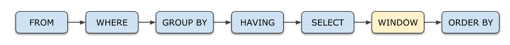
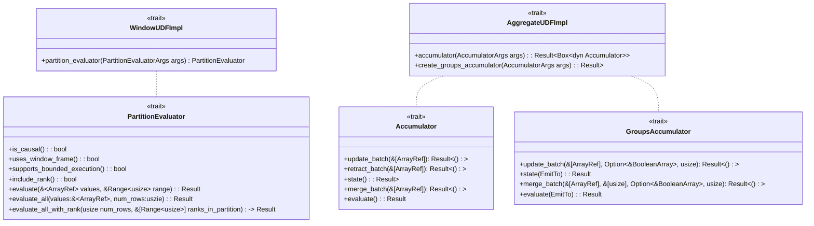
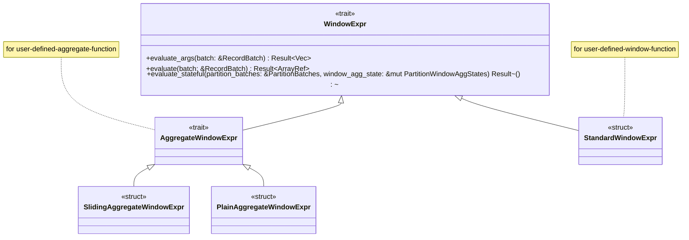
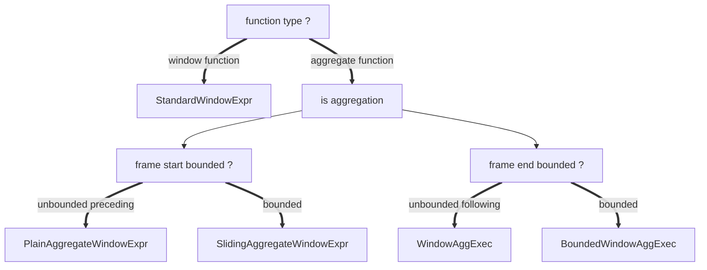

# datafusion 窗口函数执行分析

## API: 使用窗口函数
窗口函数是针对数据分析的一个 SQL 查询扩展，其执行顺序如下图中，


一般的，窗口函数的语法如下：

来源：https://duckdb.org/docs/stable/sql/functions/window_functions

datafusion 提供了对窗口函数的支持，不过，目前的版本支持程度仍然不如 duckdb，我目前发现的问题是： frame 中目前仅支持 literal expr, 
这限制了基于当前行的 dynamic range 的支持能力，例如，典型的 上年同期年累 这样的计算。

在 duckdb 中，可以表示为 
  ```sql
  SUM( SUM(amount) ) over (order by order_date 
    range between to_days( order_date - (date_trunc('year', order_date'year') - interval 1 year)) preceding 
    and interval 1 year preceding )
  ```
本文分析的目的之一就是对 datafusion 的窗口函数执行机制进行研究，并评估为其添加上这类能力的可行性。

## SPI：创建自定义的窗口函数

datafusion 中支持4种 自定义函数：
- udf: scalar 函数
- udtf: 表函数，如 csv_read 之类的函数
- udwf: User Define Window Function：以 partition 为单位的窗口函数

  主要针对非聚合类的窗口函数，参见：
  1. [simple udwf](https://github.com/apache/datafusion/blob/main/datafusion-examples/examples/simple_udwf.rs)
  2. [advanced udwf](https://github.com/apache/datafusion/blob/main/datafusion-examples/examples/advanced_udwf.rs)
   
   see: datafusion/physical-expr/src/window/standard.rs StandardWindowExpr::evaluate(按照这个源代码整理，与代码注释对应不上)

  | [`uses_window_frame`] | [`supports_bounded_execution`] | [`include_rank`] | function_to_implement      | functions                   |
  |-----------------------|--------------------------------|------------------|----------------------------|-----------------------------|
  | true                  | *                              | *                | [`evaluate`]               | nth                         |
  | false (default)       | *                              | true             | [`evaluate_all_with_rank`] | rank, dense_rank, cume_dist |
  | false                 | *                              | false (default)  | [`evaluate_all`]           |                             |

  - use_window_frame = false: 表示该函数使用 frame 部分，在单个 partition 粒度上执行
    - nth use_window_frame = true 
    - others: false
  - supports_bounded_execution:
    - lead
    - lag
    - row_number
    - nth,
    - rank
    - dense_rank
  - include_rank
    - cume_dist
    - rank
    
- udaf: User Define Aggregate Function
  针对形如 SUM, COUNT 之类的函数，自定义函数参考：[advanced udaf](https://github.com/apache/datafusion/blob/main/datafusion-examples/examples/advanced_udaf.rs)
  核心接口是 Accumulator, GroupsAccumulator







## 算子: WindowAggExec 分析

## 算子： BoundedWindowAggExec

# 窗口函数执行堆栈

BoundedWindowAggStream as futures_core::stream::Stream::poll_next 
  BoundedWindowAggStream::poll_next_inner 
    BoundedWindowAggStream::compute_aggregates
      <SlidingAggregateWindowExpr as WindowExpr>::evaluate_stateful 
        AggregateWindowExpr::aggregate_evaluate_stateful 
          AggregateWindowExpr::get_result_column 
            <SlidingAggregateWindowExpr as AggregateWindowExpr>::get_aggregate_result_inside_range 
              <SlidingSumAccumulator<T> as Accumulator>::update_batch

WindowExpr  AggregateWindowExpr
   StandardWindowExpr
   SlidingAggregateWindowExpr
   PlainAggregateWindowExpr


```rust
struct WindowState { -- 每个分区维护一个 WindowState
    state:  WindowAggState,
    window_fn:  WindowFn
}

struct WindowAggState {
    window_frame_range: Range<usize>,
    window_frame_ctx: Option<WindowFrameContext>
    
    last_calculated_index: usize,
    offset_pruned_rows: usize,
    out_col: ArrayRef,
    n_row_result_missing: usize,
    is_end: bool,
}

partitionBatcheS:           IndexMap<PartitionKey,  PartitionBatchState>
partitionWindowAggStates:   IndexMap<PartitionKey, WindowState>
```