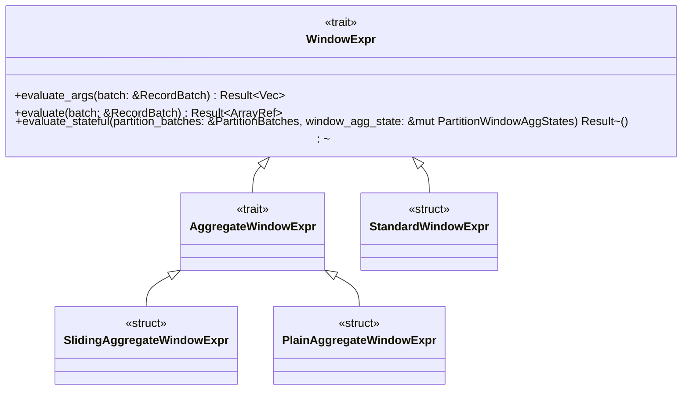

# 窗口函数

1. AggregateUDF: 从多行聚集一个结果
   - [simple udaf](https://github.com/apache/datafusion/blob/main/datafusion-examples/examples/simple_udaf.rs)
   - [advanced udaf](https://github.com/apache/datafusion/blob/main/datafusion-examples/examples/advanced_udaf.rs)
   
   ```rust
   trait AggrgateUDF {
     fn accumulator(&self, acc_args: AccumulatorArgs) -> Result<Box<dyn Accumulator>>    ;
     fn create_groups_accumulator(&self, acc_args: AccumulatorArgs)  -> Result<Box<dyn GroupsAccumulator>> ;
   }
   
   trait Accumulator {
      fn update_batch(&mut self, values: &[ArrayRef]) -> Resutl<()>;
      fn merge_batch(&mut self, states: &[ArrayRef]) -> Result<()>;
      fn retract_batch(&mut self, values: &[ArrayRef]) -> Result<()>;
      fn support_retract_batch(&self) -> bool;
      fn state(&mut self) -> Result<Vec<ScalarValue>>;
      fn evaluate(&mut self) -> Resutl<ScalarValue>;
   }
   
   // 1. acc.update_batch -> acc.evaluate
   // 2. acc1.update_batch, acc2.update_batch, acc3.update_batch
   //    acc1.merge_batch( acc2.state, acc3.state )
   //    acc1.evaluate()
   
   trait GroupsAccumulator {
     fn update_batch(&mut self, values: &[ArrayRef], group_indices: &[usize], opt_filter: Option<&BooleanArray>, total_num_groups: usize) -> Result<()>;
     fn evaluate(&mut self, emit_to: EmitTo) -> Result<ArrayRef>;
     fn state(&mut self, emit_to: EmitTo) -> Result<Vec<ArrayRef>>;
     fn merge_batch(&mut self, values: &[ArrayRef], group_indices: &[usize], opt_filter, total_num_groups);
   }
   
   ```
2. WindowUDF


# 窗口函数执行堆栈

BoundedWindowAggStream as futures_core::stream::Stream::poll_next 
  BoundedWindowAggStream::poll_next_inner 
    BoundedWindowAggStream::compute_aggregates
      <SlidingAggregateWindowExpr as WindowExpr>::evaluate_stateful 
        AggregateWindowExpr::aggregate_evaluate_stateful 
          AggregateWindowExpr::get_result_column 
            <SlidingAggregateWindowExpr as AggregateWindowExpr>::get_aggregate_result_inside_range 
              <SlidingSumAccumulator<T> as Accumulator>::update_batch

WindowExpr  AggregateWindowExpr
   StandardWindowExpr
   SlidingAggregateWindowExpr
   PlainAggregateWindowExpr



```rust
struct WindowState { -- 每个分区维护一个 WindowState
    state:  WindowAggState,
    window_fn:  WindowFn
}

struct WindowAggState {
    window_frame_range: Range<usize>,
    window_frame_ctx: Option<WindowFrameContext>
    
    last_calculated_index: usize,
    offset_pruned_rows: usize,
    out_col: ArrayRef,
    n_row_result_missing: usize,
    is_end: bool,
}

partitionBatcheS:           IndexMap<PartitionKey,  PartitionBatchState>
partitionWindowAggStates:   IndexMap<PartitionKey, WindowState>
```