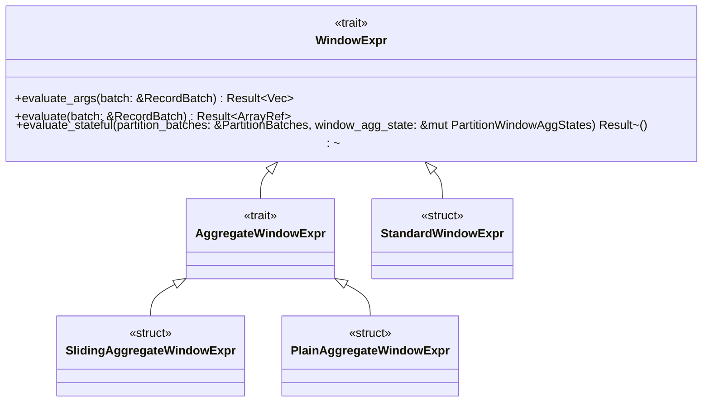

# 窗口函数

1. AggregateUDF: 从多行聚集一个结果
   - [simple udaf](https://github.com/apache/datafusion/blob/main/datafusion-examples/examples/simple_udaf.rs)
   - [advanced udaf](https://github.com/apache/datafusion/blob/main/datafusion-examples/examples/advanced_udaf.rs)
   
   ```rust
   trait AggrgateUDF {
     fn accumulator(&self, acc_args: AccumulatorArgs) -> Result<Box<dyn Accumulator>>    ;
     fn create_groups_accumulator(&self, acc_args: AccumulatorArgs)  -> Result<Box<dyn GroupsAccumulator>> ;
   }
   
   trait Accumulator {
      fn update_batch(&mut self, values: &[ArrayRef]) -> Resutl<()>;
      fn merge_batch(&mut self, states: &[ArrayRef]) -> Result<()>;
      fn retract_batch(&mut self, values: &[ArrayRef]) -> Result<()>;
      fn support_retract_batch(&self) -> bool;
      fn state(&mut self) -> Result<Vec<ScalarValue>>;
      fn evaluate(&mut self) -> Resutl<ScalarValue>;
   }
   
   // 1. acc.update_batch -> acc.evaluate
   // 2. acc1.update_batch, acc2.update_batch, acc3.update_batch
   //    acc1.merge_batch( acc2.state, acc3.state )
   //    acc1.evaluate()
   
   trait GroupsAccumulator {
     fn update_batch(&mut self, values: &[ArrayRef], group_indices: &[usize], opt_filter: Option<&BooleanArray>, total_num_groups: usize) -> Result<()>;
     fn evaluate(&mut self, emit_to: EmitTo) -> Result<ArrayRef>;
     fn state(&mut self, emit_to: EmitTo) -> Result<Vec<ArrayRef>>;
     fn merge_batch(&mut self, values: &[ArrayRef], group_indices: &[usize], opt_filter, total_num_groups);
   }
   
   ```
2. WindowUDF


# 窗口函数执行堆栈

BoundedWindowAggStream as futures_core::stream::Stream::poll_next 
  BoundedWindowAggStream::poll_next_inner 
    BoundedWindowAggStream::compute_aggregates
      <SlidingAggregateWindowExpr as WindowExpr>::evaluate_stateful 
        AggregateWindowExpr::aggregate_evaluate_stateful 
          AggregateWindowExpr::get_result_column 
            <SlidingAggregateWindowExpr as AggregateWindowExpr>::get_aggregate_result_inside_range 
              <SlidingSumAccumulator<T> as Accumulator>::update_batch

WindowExpr  AggregateWindowExpr
   StandardWindowExpr
   SlidingAggregateWindowExpr
   PlainAggregateWindowExpr



```rust
struct WindowState { -- 每个分区维护一个 WindowState
    state:  WindowAggState,
    window_fn:  WindowFn
}

struct WindowAggState {
    window_frame_range: Range<usize>,
    window_frame_ctx: Option<WindowFrameContext>
    
    last_calculated_index: usize,
    offset_pruned_rows: usize,
    out_col: ArrayRef,
    n_row_result_missing: usize,
    is_end: bool,
}

partitionBatcheS:           IndexMap<PartitionKey,  PartitionBatchState>
partitionWindowAggStates:   IndexMap<PartitionKey, WindowState>
```

1. WindowAggExec
   - 需要保持窗口中的所有历史行，以进行计算。
   - 成本高
2. BoundedWindowAggExec
   - 适合于窗口边界在查询时即可确定的场景
   - 仅保留一个有限的历史数据，支持流式计算


rows
    each row:
        update frame: moves forward only
            1. rows   from..end
            2. range  from..end
            3. groups

1. (rows, current_row)
2. current_frame

- on first row, initialize current_row, current_frame
- on new row:
  - if new row out of current_frame:
    - update current row's result to aggregator's result
    - current_row++, calculate new frame
    - evict old rows, update frame's result
    - if new row still out of current_frame, repeat.
  - if new row inside current_frame, continue


1. StandardWindowExpr: 只与分区有关，不是用 frame?
   ```text
   BoundedWindowAggStream.pill_next_inner -> 
   BoundedWindowAggStream.compute_aggregates -> 
   StandardWindowExpr.evaluate_stateful ->
   RankEvaluator.evaluate
   ```

2. SlidingAggrgateWindowExpr: over( rows between N preceding and ... )
```text
BoundedWindowAggStream as futures_core::stream::Stream::poll_next 
  BoundedWindowAggStream::poll_next_inner 
    BoundedWindowAggStream::compute_aggregates
      <SlidingAggregateWindowExpr as WindowExpr>::evaluate_stateful 
        AggregateWindowExpr::aggregate_evaluate_stateful 
          AggregateWindowExpr::get_result_column 
            <SlidingAggregateWindowExpr as AggregateWindowExpr>::get_aggregate_result_inside_range 
              <SlidingSumAccumulator<T> as Accumulator>::update_batch    
```

3. PlainAggregateWindowExpr: over( rows between unbounded preceding and ...)

```sql
select *, 
    sum(amount) over (partition by product_id) as "product_amounts", -- WindowAggExec + PlainAggregateWindowExpr
    sum(amount) over (partition by product_id order by order_date rows 1 preceding) as "amounts1", -- BoundedWindowAggExec + SlidingAggrgateWindowExpr
    rank() over (partition by product_id order by order_date) as rank1, -- BoundedWindowAggExec + StandardWindowExpr
    rank() over (partition by product_id order by order_date desc) as rank2 -- BoundedWindowAggExec + StandardWindowExpr
from t1
```


算子选择：
1. 如果计算需要基于 partition 的全量数据进行，使用 window_agg_exec 算子
    - 输入数据已经按照 partion by 和 order by 进行排序
    - 将输入数据，按 partition 分割为 RecordBatch
        - 对每个窗口表达式调用 window_expr.evaluate(batch)，返回 求值后的向量 （按分区全量求值）
2. 否则，意味着算子基于一个受限的窗口数据进行计算，使用 bounded_window_agg_exec 算子
    - 输入数据已经按照 partition by 和 order by 进行排序
    - 将输入的 batch 添加到 input_buffer: RecordBatch 和  partition_buffers: IndexedMap< PartitionKey, PartionBatchState> 中 // TODO
    - 调用 boundedWindowAggStream::compute_aggregates 进行增量求值
        - 对 每一个 window_expr 调用 evaluate_stateful 进行增量求值，其求值结果同步在 IndexedMap< PartitionKey, WindowState> 中
          三元组：(window_expr, partition_key, WindowState) // TODO 合适初始化
            - Windowexpr::evalute_statful( partition_batches, partition_states ) 对多个 partition 进行增量求值，并不直接返回结果，而是更新 states
        - calculate_out_columns 计算当前是否有完成的计算行，有的话，修改 partition_buffers 并返回（会作为算子的输出行）

重点是这个状态是如何维护的：

struct WindowAggState {			// 窗口的状态在这里维护
window_frame_range: Range<usize>,
window_frame_ctx:  Option<WindowFrameContext>,

    last_calculated_index: usize,
    offset_pruned_rows: usize,

    out_col:  ArrayRef,
    n_row_result_missing: usize,
    is_end: bool
}

pub enum WindowFn {
Builtin(Box<dyn PartitionEvaluator>),	//
Aggregate(Box<dyn Accumulator>),		// 累加器的状态在这里维护
}

1. get_result_column 中更新 state.window_frame_range, 并返回 ArrayRef
   -> get_aggregate_result_inside_range 计算出一个值

2. 根据返回结果，再 state.update 其余字段

   accumulator.update_batch  新增数据
   accumulator.retract_batch 删除数据

