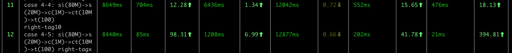
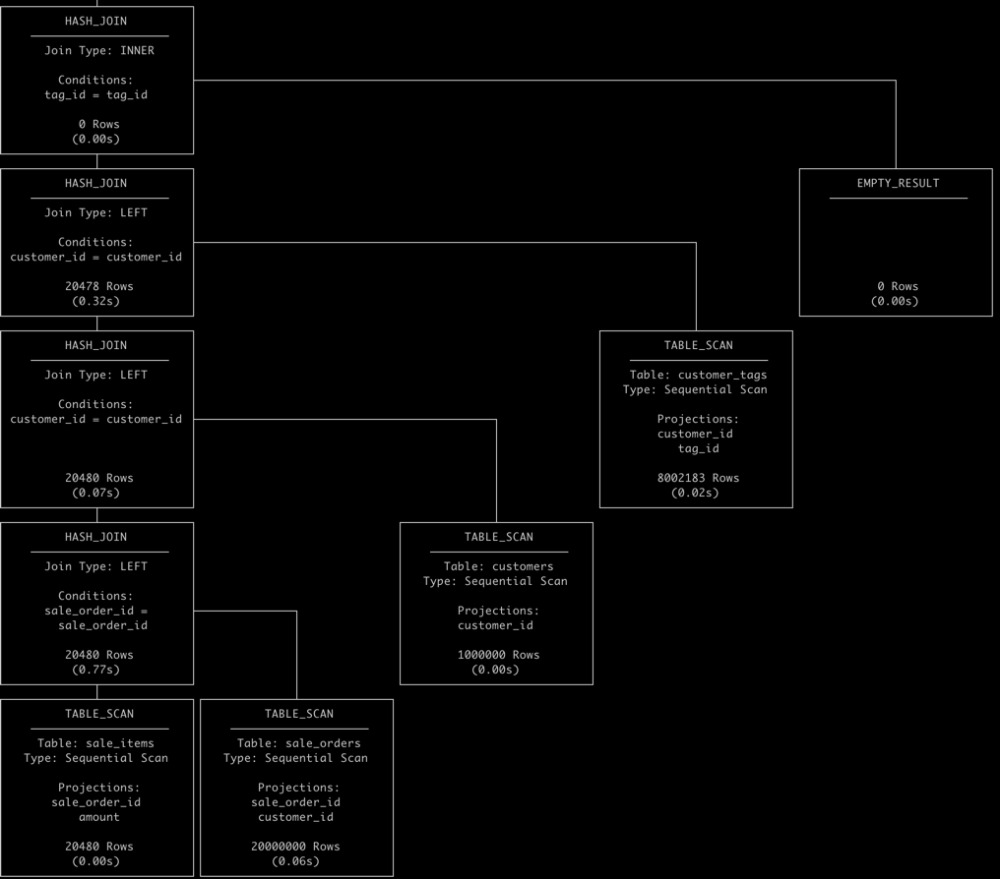

# 一个 datafusion 执行慢的case 分析

## Overview
- dataset: 这个 dataset 的生成文档稍后补充。

## SQL

```sql
select wt.tag_name, sum(wt.amount) from (
	select si.sale_item_id as sale_item_id, 
		si.sale_order_id as sale_order_id,
		si.product_id as product_id,
		si.quantity as quantity,
		si.price as price, 
		si.amount as amount,
		s.order_date as order_date,
		s.shop_id as shop_id,
		s.freight as freight,
		c.customer_id as customer_id,
		c.name as customer_name,
		t.tag_name as tag_name
	from sale_items si
	 left join sale_orders s on si.sale_order_id = s.sale_order_id
	 left join customers c on s.customer_id = c.customer_id
	 left join customer_tags ct on ct.customer_id = c.customer_id
     left join tags t on t.tag_id = ct.tag_id
) as wt where wt.tag_name = 'tagx' group by wt.tag_name;
```

- 数据规模：
  - sale_items: 80M
  - sale_orders: 20M
  - customers: 1M
  - customer_tags: 8M
  - tags: 100
- sql case4-4 where tag_name = 'tag0', 约命中 
- sql case4-5 where tag_name = 'tagx' 不存在的tag

耗时对比：

- case 4-4: datafusion 的耗时 12.042s vs (polars:552ms) vs (duckdb: 476ms)
- case 4-5: (datafusion: 12.877s) vs (polars: 202ms) vs (duckdb: 2ms)

1. duckdb 查询计划
   
   - duckdb 的 pipeline 依赖执行顺序，build table pipeline 先执行，然后 lookup pipeline 再执行，在 多表 join 时
   有 right-assoc 的特性。
   - duckdb 具有连接字段筛选左移的逻辑，因此：
     - tags 过滤后，没有匹配任何行 tag_id = null （恒为 false）
     - table scan: customer_tags 使用 tag_id = null 过滤后，结果集为 empty。 耗时 20ms ()
     - table scan: customers 使用 customer_id = null 过滤后，结果集为 empty。 耗时 0ms ()
     - table scan: sale_orders 使用 customer_id = null 过滤后，结果集为 empty。 耗时 60ms ()
     - table scan: sale_items 使用 sale_order_id = null 过滤后，结果集为 empty。 耗时 0ms ()
     - 在这个过程中，基本上不需要 scan-table 的开销，和 build hash table 的开销，这也使得查询可以在 476ms 内完成。
2. datafusion 查询计划
```text
AggregateExec: mode=FinalPartitioned, gby=[tag_name@0 as tag_name], aggr=[SUM(wt.amount)], metrics=[output_rows=0, elapsed_compute=198.668µs]
  CoalesceBatchesExec: target_batch_size=8192, metrics=[output_rows=0, elapsed_compute=3.621µs]
    RepartitionExec: partitioning=Hash([tag_name@0], 10), input_partitions=10, metrics=[send_time=10ns, fetch_time=102.663346124s, repart_time=103.708µs]
      AggregateExec: mode=Partial, gby=[tag_name@1 as tag_name], aggr=[SUM(wt.amount)], metrics=[output_rows=0, elapsed_compute=6.758498ms]
        ProjectionExec: expr=[amount@0 as amount, tag_name@1 as tag_name], metrics=[output_rows=0, elapsed_compute=10ns]
          CoalesceBatchesExec: target_batch_size=8192, metrics=[output_rows=0, elapsed_compute=76.937µs]
            FilterExec: tag_name@1 = tagx, metrics=[output_rows=0, elapsed_compute=1.225804042s]
              ProjectionExec: expr=[amount@0 as amount, tag_name@3 as tag_name], metrics=[output_rows=640183854, elapsed_compute=120.415µs]
                CoalesceBatchesExec: target_batch_size=8192, metrics=[output_rows=640183854, elapsed_compute=100.156µs]
                  HashJoinExec: mode=Partitioned, join_type=Left, on=[(tag_id@1, tag_id@0)], metrics=[output_rows=19706, input_rows=19706, build_input_rows=640183854, output_batches=20, input_batches=20, build_input_batches=9351, build_mem_used=27158522336, join_time=49.222731379s, build_time=6.953609223s]
                    CoalesceBatchesExec: target_batch_size=8192, metrics=[output_rows=640183854, elapsed_compute=3.363182ms]
                      RepartitionExec: partitioning=Hash([tag_id@1], 10), input_partitions=10, metrics=[send_time=39.684042ms, fetch_time=35.729534992s, repart_time=7.162502463s]
                        ProjectionExec: expr=[amount@0 as amount, tag_id@3 as tag_id], metrics=[output_rows=640183854, elapsed_compute=841.639µs]
                          CoalesceBatchesExec: target_batch_size=8192, metrics=[output_rows=640183854, elapsed_compute=350.374µs]
                            HashJoinExec: mode=Partitioned, join_type=Left, on=[(customer_id@1, customer_id@0)], metrics=[output_rows=8021789, input_rows=8021789, build_input_rows=80002715, output_batches=946, input_batches=946, build_input_batches=121, build_mem_used=3822266169, join_time=9.038244053s, build_time=1.313059137s]
                              CoalesceBatchesExec: target_batch_size=8192, metrics=[output_rows=80002715, elapsed_compute=2.014118ms]
                                RepartitionExec: partitioning=Hash([customer_id@1], 10), input_partitions=10, metrics=[send_time=476.707µs, fetch_time=23.950913595s, repart_time=660.80167ms]
                                  ProjectionExec: expr=[amount@0 as amount, customer_id@2 as customer_id], metrics=[output_rows=80002715, elapsed_compute=186.586µs]
                                    CoalesceBatchesExec: target_batch_size=8192, metrics=[output_rows=80002715, elapsed_compute=289.68µs]
                                      HashJoinExec: mode=Partitioned, join_type=Left, on=[(customer_id@1, customer_id@0)], metrics=[output_rows=1000091, input_rows=1000091, build_input_rows=80002715, output_batches=131, input_batches=131, build_input_batches=7754, build_mem_used=3824093984, join_time=5.604351534s, build_time=3.333118481s]
                                        CoalesceBatchesExec: target_batch_size=8192, metrics=[output_rows=80002715, elapsed_compute=248.375811ms]
                                          RepartitionExec: partitioning=Hash([customer_id@1], 10), input_partitions=10, metrics=[send_time=258.43695ms, fetch_time=12.061572791s, repart_time=942.708092ms]
                                            ProjectionExec: expr=[amount@1 as amount, customer_id@3 as customer_id], metrics=[output_rows=80002715, elapsed_compute=1.224148ms]
                                              CoalesceBatchesExec: target_batch_size=8192, metrics=[output_rows=80002715, elapsed_compute=1.155271ms]
                                                HashJoinExec: mode=Partitioned, join_type=Left, on=[(sale_order_id@0, sale_order_id@0)], metrics=[output_rows=20000000, input_rows=20000000, build_input_rows=80002715, output_batches=2337, input_batches=2337, build_input_batches=9301, build_mem_used=3824486470, join_time=5.167676047s, build_time=4.466842704s]
                                                  CoalesceBatchesExec: target_batch_size=8192, metrics=[output_rows=80002715, elapsed_compute=335.290923ms]
                                                    RepartitionExec: partitioning=Hash([sale_order_id@0], 10), input_partitions=10, metrics=[send_time=496.763073ms, fetch_time=1.051912996s, repart_time=1.215274122s]
                                                      ParquetExec: file_groups={10 groups: [[Users/wangzaixiang/workspaces/wangzaixiang/mpp_test/datafusion/sale_items.parquet:0..288039863], [Users/wangzaixiang/workspaces/wangzaixiang/mpp_test/datafusion/sale_items.parquet:288039863..576079726], [Users/wangzaixiang/workspaces/wangzaixiang/mpp_test/datafusion/sale_items.parquet:576079726..864119589], [Users/wangzaixiang/workspaces/wangzaixiang/mpp_test/datafusion/sale_items.parquet:864119589..1152159452], [Users/wangzaixiang/workspaces/wangzaixiang/mpp_test/datafusion/sale_items.parquet:1152159452..1440199315], ...]}, projection=[sale_order_id, amount], 
                                                      -- metrics=[output_rows=80002715, elapsed_compute=10ns, page_index_rows_filtered=0, row_groups_pruned=0, pushdown_rows_filtered=0, predicate_evaluation_errors=0, num_predicate_creation_errors=0, bytes_scanned=960073227, file_open_errors=0, file_scan_errors=0, time_elapsed_opening=13.361125ms, pushdown_eval_time=20ns, time_elapsed_scanning_total=2.456770263s, time_elapsed_processing=306.505182ms, page_index_eval_time=20ns, time_elapsed_scanning_until_data=286.343959ms]
                                                  CoalesceBatchesExec: target_batch_size=8192, metrics=[output_rows=20000000, elapsed_compute=50.236463ms]
                                                    RepartitionExec: partitioning=Hash([sale_order_id@0], 10), input_partitions=10, metrics=[send_time=10.460815301s, fetch_time=402.799868ms, repart_time=10.643552746s]
                                                      ParquetExec: file_groups={10 groups: [[Users/wangzaixiang/workspaces/wangzaixiang/mpp_test/datafusion/sale_orders.parquet:0..48005167], [Users/wangzaixiang/workspaces/wangzaixiang/mpp_test/datafusion/sale_orders.parquet:48005167..96010334], [Users/wangzaixiang/workspaces/wangzaixiang/mpp_test/datafusion/sale_orders.parquet:96010334..144015501], [Users/wangzaixiang/workspaces/wangzaixiang/mpp_test/datafusion/sale_orders.parquet:144015501..192020668], [Users/wangzaixiang/workspaces/wangzaixiang/mpp_test/datafusion/sale_orders.parquet:192020668..240025835], ...]}, projection=[sale_order_id, customer_id], 
                                                      -- metrics=[output_rows=20000000, elapsed_compute=10ns, page_index_rows_filtered=0, row_groups_pruned=0, pushdown_rows_filtered=0, predicate_evaluation_errors=0, num_predicate_creation_errors=0, bytes_scanned=160006002, file_open_errors=0, file_scan_errors=0, time_elapsed_opening=58.245374ms, pushdown_eval_time=20ns, time_elapsed_scanning_total=12.439534825s, time_elapsed_processing=49.275148ms, page_index_eval_time=20ns, time_elapsed_scanning_until_data=274.586248ms]
                                        CoalesceBatchesExec: target_batch_size=8192, metrics=[output_rows=1000000, elapsed_compute=19.863092ms]
                                          RepartitionExec: partitioning=Hash([customer_id@0], 10), input_partitions=10, metrics=[send_time=2.203171325s, fetch_time=15.952289ms, repart_time=2.218283889s]
                                            ParquetExec: file_groups={10 groups: [[Users/wangzaixiang/workspaces/wangzaixiang/mpp_test/datafusion/customers.parquet:0..2605385], [Users/wangzaixiang/workspaces/wangzaixiang/mpp_test/datafusion/customers.parquet:2605385..5210770], [Users/wangzaixiang/workspaces/wangzaixiang/mpp_test/datafusion/customers.parquet:5210770..7816155], [Users/wangzaixiang/workspaces/wangzaixiang/mpp_test/datafusion/customers.parquet:7816155..10421540], [Users/wangzaixiang/workspaces/wangzaixiang/mpp_test/datafusion/customers.parquet:10421540..13026925], ...]}, projection=[customer_id], 
                                            -- metrics=[output_rows=1000000, elapsed_compute=10ns, page_index_rows_filtered=0, row_groups_pruned=0, pushdown_rows_filtered=0, predicate_evaluation_errors=0, num_predicate_creation_errors=0, bytes_scanned=4000154, file_open_errors=0, file_scan_errors=0, time_elapsed_opening=12.374708ms, pushdown_eval_time=20ns, time_elapsed_scanning_total=2.376960623s, time_elapsed_processing=6.096536ms, page_index_eval_time=20ns, time_elapsed_scanning_until_data=2.349624ms]
                              CoalesceBatchesExec: target_batch_size=8192, metrics=[output_rows=8002183, elapsed_compute=24.855317ms]
                                RepartitionExec: partitioning=Hash([customer_id@0], 10), input_partitions=10, metrics=[send_time=28.433823687s, fetch_time=205.519351ms, repart_time=28.547010334s]
                                  ParquetExec: file_groups={10 groups: [[Users/wangzaixiang/workspaces/wangzaixiang/mpp_test/datafusion/customer_tags.parquet:0..6402463], [Users/wangzaixiang/workspaces/wangzaixiang/mpp_test/datafusion/customer_tags.parquet:6402463..12804926], [Users/wangzaixiang/workspaces/wangzaixiang/mpp_test/datafusion/customer_tags.parquet:12804926..19207389], [Users/wangzaixiang/workspaces/wangzaixiang/mpp_test/datafusion/customer_tags.parquet:19207389..25609852], [Users/wangzaixiang/workspaces/wangzaixiang/mpp_test/datafusion/customer_tags.parquet:25609852..32012315], ...]}, projection=[customer_id, tag_id], 
                                  -- metrics=[output_rows=8002183, elapsed_compute=10ns, page_index_rows_filtered=0, row_groups_pruned=0, pushdown_rows_filtered=0, predicate_evaluation_errors=0, num_predicate_creation_errors=0, bytes_scanned=64019878, file_open_errors=0, file_scan_errors=0, time_elapsed_opening=10.220292ms, pushdown_eval_time=20ns, time_elapsed_scanning_total=32.500549547s, time_elapsed_processing=29.125525ms, page_index_eval_time=20ns, time_elapsed_scanning_until_data=174.252708ms]
                    CoalesceBatchesExec: target_batch_size=8192, metrics=[output_rows=100, elapsed_compute=74.628µs]
                      RepartitionExec: partitioning=Hash([tag_id@0], 10), input_partitions=1, metrics=[send_time=1.749µs, fetch_time=1.141582ms, repart_time=51.583µs]
                        ParquetExec: file_groups={1 group: [[Users/wangzaixiang/workspaces/wangzaixiang/mpp_test/datafusion/tags.parquet]]}, projection=[tag_id, tag_name], 
                        -- metrics=[output_rows=100, elapsed_compute=1ns, page_index_rows_filtered=0, row_groups_pruned=0, pushdown_rows_filtered=0, predicate_evaluation_errors=0, num_predicate_creation_errors=0, bytes_scanned=1359, file_open_errors=0, file_scan_errors=0, time_elapsed_opening=365.667µs, pushdown_eval_time=2ns, time_elapsed_scanning_total=815.125µs, time_elapsed_processing=603.584µs, page_index_eval_time=2ns, time_elapsed_scanning_until_data=759.209µs]
    
```
   
   - tag_name = `tagx` 这个条件没有下压到 tags 的 table scan 中，导致 tags 表的 scan 仍然会读取所有的行。
   - join 顺序不佳。这个案例中，由于最右表上有不能为null的限定，实际上是 inner join 逻辑，且最有的筛选器可以一直影响左边表的数据范围。
   - build table 构建好后，其筛选字段的的取值范围可以用于筛选左表的数据范围(scan filter)，进一步提高查询速度。