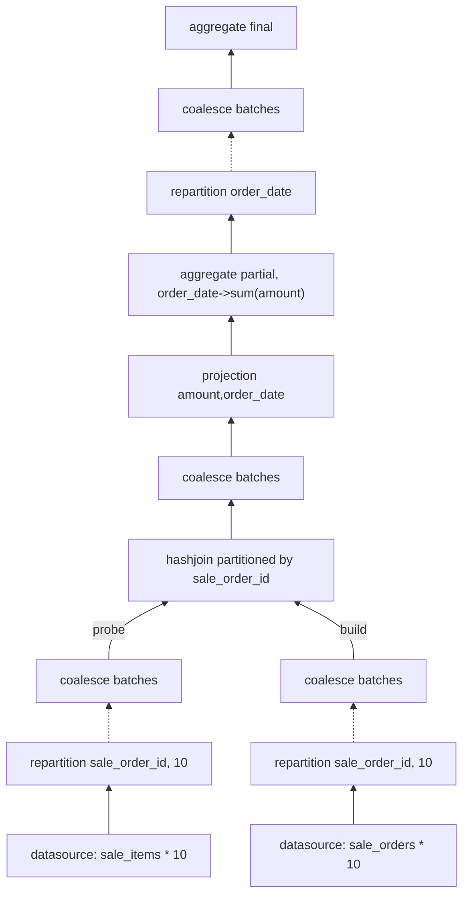

# Performance Compare: DataFusion vs DuckDB, Case 1

# Background
```sql
CREATE TABLE customer_tags(customer_id INTEGER, tag_id INTEGER);    -- 8M, average 1 customer 8 tags
CREATE TABLE customers(customer_id INTEGER, "name" VARCHAR, gender VARCHAR); -- 1M
CREATE TABLE purchase_items(purchase_item_id BIGINT, 
                            purchase_order_id INTEGER, 
                            product_id INTEGER, 
                            quantity INTEGER, 
                            price DOUBLE, 
                            amount DOUBLE);  -- 40M
CREATE TABLE purchase_orders(purchase_order_id INTEGER, 
                             order_date DATE, 
                             supplier_id INTEGER, 
                             shop_id INTEGER, 
                             freight DOUBLE);  -- 1M
CREATE TABLE sale_items(sale_item_id BIGINT, 
                        sale_order_id INTEGER, 
                        product_id INTEGER, 
                        quantity INTEGER, 
                        price DOUBLE, 
                        amount DOUBLE);     -- 80M
CREATE TABLE sale_orders(sale_order_id INTEGER, 
                         order_date DATE, 
                         customer_id INTEGER, 
                         shop_id INTEGER, 
                         freight DOUBLE);   -- 20M
CREATE TABLE suppliers(supplier_id INTEGER, "name" VARCHAR); -- 1000
CREATE TABLE tags(tag_id INTEGER, tag_name VARCHAR); -- 100

```

# Query Case 1
```sql
select s.order_date, sum(si.amount) 
from sale_items si left join sale_orders s on si.sale_order_id = s.sale_order_id  -- 80M * 20M
group by s.order_date;
```

# Result
1. DuckDB v1.2.2: 336ms(user: 2.667s, sys: 54ms) -- duckdb timer on 
   [samply profile](https://share.firefox.dev/3RLAzCv) 看sleep 1秒后后面的部分就是执行 SQL 的 profile.
   DuckDB 的火焰图构成相对较为简单(下述数据来源于 explain analyze，与flame graph 有点对不上)：
   - build pipeline: 10ms
   - proble pipeline
     -  scan: 40ms
     -  probe: 2.26s
     -  projection: 10ms
     -  hash group by: 470ms
2. DataFusion v46.0.1 810ms(user: 5.47s, sys: 0.99s) -- timer command
   [samply profile](https://share.firefox.dev/4iit5lv)
   

接近1倍的性能差距。
1. 从火焰图结构来看，duckdb 的方式更为简洁（栈调用深度很浅），datafusion 由于采用了大量的异步，导致火焰图也变得复杂。
2. dataframe 的执行计划更为复杂，引入了 Repartition, CoalesceBatches 等算子，有较多的跨线程操作，这些理论上可能导致
   性能下降。

工具化对比：
1. duckdb 的 explain analyze 具有较好的可读性，且耗时信息也较为简单。
2. datafusion 的 explain analyze 缺乏可读性，且耗时信息要复杂得多。
3. cli 工具，duckdb 的 cli 工具更为完善，支持命令更多，且 tab complete 做的很好。datafusion 在这方面几乎没有支持。

# 理解 datafusion 中的算子



需要理解 datafusion 中的 repartition 算子 和 coalesce batches 算子
1. Repartition 算子在多线程间的数据交换
2. CoalesceBatches 算子对数据的合并
3. 这两个算子的 data copy 开销以及缓存效率。
4. 执行栈的分析
5. hashjoin 算子的性能评估。
6. 是否可以手动编写一个 physical plan 来替代 datafusion 的执行计划?