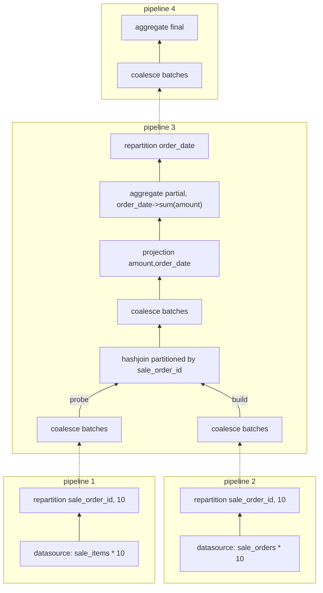

# Performance Compare: DataFusion vs DuckDB, Case 1

# Background
```sql
CREATE TABLE customer_tags(customer_id INTEGER, tag_id INTEGER);    -- 8M, average 1 customer 8 tags
CREATE TABLE customers(customer_id INTEGER, "name" VARCHAR, gender VARCHAR); -- 1M
CREATE TABLE purchase_items(purchase_item_id BIGINT, 
                            purchase_order_id INTEGER, 
                            product_id INTEGER, 
                            quantity INTEGER, 
                            price DOUBLE, 
                            amount DOUBLE);  -- 40M
CREATE TABLE purchase_orders(purchase_order_id INTEGER, 
                             order_date DATE, 
                             supplier_id INTEGER, 
                             shop_id INTEGER, 
                             freight DOUBLE);  -- 1M
CREATE TABLE sale_items(sale_item_id BIGINT, 
                        sale_order_id INTEGER, 
                        product_id INTEGER, 
                        quantity INTEGER, 
                        price DOUBLE, 
                        amount DOUBLE);     -- 80M
CREATE TABLE sale_orders(sale_order_id INTEGER, 
                         order_date DATE, 
                         customer_id INTEGER, 
                         shop_id INTEGER, 
                         freight DOUBLE);   -- 20M
CREATE TABLE suppliers(supplier_id INTEGER, "name" VARCHAR); -- 1000
CREATE TABLE tags(tag_id INTEGER, tag_name VARCHAR); -- 100

```

# Query Case 1
```sql
select s.order_date, sum(si.amount) 
from sale_items si left join sale_orders s on si.sale_order_id = s.sale_order_id  -- 80M * 20M
group by s.order_date;
```

# Result
1. DuckDB v1.2.2: 336ms(user: 2.667s, sys: 54ms) -- duckdb timer on 
   [samply profile](https://share.firefox.dev/3RLAzCv) 看sleep 1秒后后面的部分就是执行 SQL 的 profile.
   DuckDB 的火焰图构成相对较为简单(下述数据来源于 explain analyze，与flame graph 有点对不上)：
   - build pipeline: 10ms
   - proble pipeline
     -  scan: 40ms
     -  probe: 2.26s
     -  projection: 10ms
     -  hash group by: 470ms
2. DataFusion v46.0.1 810ms(user: 5.47s, sys: 0.99s) -- timer command
   [samply profile](https://share.firefox.dev/4iit5lv)
   - HashJoin 算子的效率不够高。 其中 lookup 的开销占比 67%
   

接近1倍的性能差距。
1. 从火焰图结构来看，duckdb 的方式更为简洁（栈调用深度很浅），datafusion 由于采用了大量的异步，导致火焰图也变得复杂。
2. dataframe 的执行计划更为复杂，引入了 Repartition, CoalesceBatches 等算子，有较多的跨线程操作，这些理论上可能导致
   性能下降。

# 理解 datafusion 中的算子



1. pipeline 1,2: 调用栈
    ```text
    <datafusion_datasource::file_stream::FileStream as futures_core::stream::Stream>::poll_next -- DataSourceExec
    ...
    datafusion_physical_plan::repartition::RepartitionExec::pull_from_input::{{closure}} -- RepartitionExec
    ...
    tokio::runtime::task::harness::poll_future [tokio-1.44.2/src/runtime/task/harness.rs]
    ...
    _pthread_start [libsystem_pthread.dylib]
    ```
2. pipeline 3 - collect build side
    ```text
    <datafusion_physical_plan::coalesce_batches::CoalesceBatchesStream as futures_core::stream::Stream>::poll_next 
    ...
    datafusion_physical_plan::joins::hash_join::HashJoinStream::collect_build_side 
    datafusion_physical_plan::joins::hash_join::HashJoinStream::poll_next_impl 
    <datafusion_physical_plan::joins::hash_join::HashJoinStream as futures_core::stream::Stream>::poll_next 
    ...
    <datafusion_physical_plan::coalesce_batches::CoalesceBatchesStream as futures_core::stream::Stream>::poll_next 
    ...
    <datafusion_physical_plan::projection::ProjectionStream as futures_core::stream::Stream>::poll_next 
    ...
    <datafusion_physical_plan::aggregates::row_hash::GroupedHashAggregateStream as futures_core::stream::Stream>::poll_next 
    ...
    datafusion_physical_plan::repartition::RepartitionExec::pull_from_input::{{closure}} 
    tokio::runtime::task::core::Core<T,S>::poll::{{closure}} 
    ...
    _pthread_start [libsystem_pthread.dylib]   
    ```
3. pipeline 3: fetch probe batch
   ```text
    <datafusion_physical_plan::coalesce_batches::CoalesceBatchesStream as futures_core::stream::Stream>::poll_next 
    ...
    datafusion_physical_plan::joins::hash_join::HashJoinStream::fetch_probe_batch 
    datafusion_physical_plan::joins::hash_join::HashJoinStream::poll_next_impl 
    <datafusion_physical_plan::joins::hash_join::HashJoinStream as futures_core::stream::Stream>::poll_next 
    ...
    <datafusion_physical_plan::coalesce_batches::CoalesceBatchesStream as futures_core::stream::Stream>::poll_next 
    ...
    <datafusion_physical_plan::projection::ProjectionStream as futures_core::stream::Stream>::poll_next 
    ...
    <datafusion_physical_plan::aggregates::row_hash::GroupedHashAggregateStream as futures_core::stream::Stream>::poll_next 
    ...
    datafusion_physical_plan::repartition::RepartitionExec::pull_from_input::{{closure}} 
    tokio::runtime::task::core::Core<T,S>::poll::{{closure}} [tokio-1.44.2/src/runtime/task/core.rs]
    ...
    _pthread_start [libsystem_pthread.dylib]
   ```
4. pipeline 4: 由于 pipeline 4 的耗时很少，在火焰图上抓不到，理论上可以通过调试的方式获得 stack trace.
   ```text
    <datafusion_physical_plan::coalesce_batches::CoalesceBatchesStream as futures_core::stream::Stream>::poll_next
    ...
    <datafusion_physical_plan::aggregates::row_hash::GroupedHashAggregateStream as futures_core::stream::Stream>::poll_next
    ...
    datafusion_physical_plan::stream::RecordBatchReceiverStreamBuilder::run_input::{{closure}}
    ...
    tokio::runtime::task::harness::Harness<T,S>::poll
    _pthread_start 0x0000000188c902e4
    ```
   
这 4 个 stacktrace 与途中的查询计划可以很好的匹配上：
1. datafusion 通过 async call chain 的方式实现了自上而下的 pull 式的执行计划。但仍然有隐含的 pipeline 概念。
   
   以图中的 pipeline 1 为例：这里有2个算子：repartition <- datasource：
   - 上层算子（这里是 hashjoin pipeline 的 probe 侧 CoalesceBatches 算子）调用 RepartitionExec 的 poll_next 方法
   - RepartitionExec 的 poll_next 方法会调用 datasource 的 poll_next 方法，这里总是以同步的方式调用。
   - datasource 的 poll_next 会异步读取数据，这里是一个异步源点，如果数据未就绪，则返回 Poll::Pending，并向上返回，直到把当前线程归还给线程池。
   - 当操作系统异步读取数据就绪时，会唤醒之前的 Future 链，重新恢复执行。

   以图中的 pipeline 3 为例，这个future chain 就更深了，从最底层的异步点 CoalesceBatch 到 顶层的 Repartition 共有 6 层，这会产生一定的开销，
   当然，由于 datafusion 采用了 batch 的方式来处理数据，减少了调度的次数，从而减低了future 链式调用的开销。

   采用 pull 模式时，当一个算子有多个输入时，存在轮询的需求，这一块的处理也需要特殊优化，否则可能会消耗不必要的CPU。
2. duckdb 则通过 push 模式实现算子间的数据流动，从火焰图的角度来看，push 模式的调用栈更浅，更清晰。
   duckdb 目前似乎没有采用 coalesce batches 的方式，而是 morsel 的自然流动，这样做可能会导致下游算子的数据批量减少，从而降低 SIMD 的效率，
   优点是避免不必要的临时数据存储

需要理解 datafusion 中的 repartition 算子 和 coalesce batches 算子
1. Repartition 算子在多线程间的数据交换
2. CoalesceBatches 算子对数据的合并
3. 这两个算子的 data copy 开销以及缓存效率。
4. 执行栈的分析
5. hashjoin 算子的性能评估。
6. 是否可以手动编写一个 physical plan 来替代 datafusion 的执行计划?

# 评估
1. push vs pull? 两者逻辑上是等效的，之前有看到某些文章说：batch 处理不适合与 pull，这种说法是不准确的。datafusion 就采用了 pull 的方式
   来处理处理，更贴近火山模型。
2. 虽然逻辑上是等效的，但我个人更倾向于 push 模型，主要是 async 的调用链看起来没有那么爽？这个是不是我的错觉？
3. datafusion 在这个 case 上的性能要比 duckdb 慢上不少，目前来看，主要的原因是：
   - hash join 算子的实现效率
   - duckdb 对 hash join 有更好的查询计划优化，尤其是 [Dynamic Filter Pushdown from Joins](https://duckdb.org/2024/09/09/announcing-duckdb-110.html#dynamic-filter-pushdown-from-joins)
   - 需要进一步评估 datafusion 算子的 copy 开销？这一块，在火焰图上还是比较明显的，duckdb 就少了很多。
4. datafusion 在命令行的友好程度上相比 duckdb 要差很多，体现在：
   - duckdb 支持更多的选项，例如 .timer 可以查看执行耗时，.rows/.columns 格式，.mode 设置多种 output 格式
   - duckdb 的 explain analyze 结果更为简洁，可读性强
   - duckdb 的 cli 对 SQL 的格式化、多行 SQL 输入、以及输入时的 tab complete 支持很好，datafusion 几乎没有支持。
5. datafusion 对窗口函数的支持不完善，range spec 不支持 expr.
6. 虽然 datafusion 的性能相比 duckdb 要差，但代码的结构要简单很多。当然，也可能是 rust 代码更易于阅读一些的缘故？所以，如果是选择 data frame 进行优化，我更倾向于
   base on datafusion。

总体来说，作为一个SQL计算的基础库而言，datafusion 目前的成熟度还较低，使用起来估计会有更多的坑。