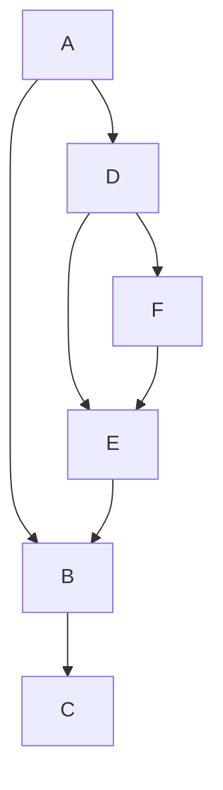
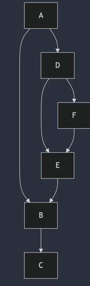

# QBE 源代码阅读 2: fillrpo

阅读 QBE 源代码较为困难的地方是，源代码中有一些 abbr 词汇，并没有详细的注释，要从源代码反向理解概念就比较费劲了。相反，如果理解了概念本身，
则源代码的阅读就先对容易很多。

RPO: reverse post order

Reverse Post Order (RPO) is a way of ordering the nodes (blocks) in a control flow graph (CFG) such that each node
appears before any of its successors. This ordering is particularly useful in compiler optimizations and analyses for several reasons:

1. Data Flow Analysis: Many data flow analyses, such as liveness analysis, constant propagation, and reaching definitions,
   benefit from RPO because it ensures that when processing a node, all its predecessors have already been processed.
   This makes the propagation of data flow information more efficient and straightforward.

2. Dominance Calculation: RPO is used in the calculation of dominator trees. A node A dominates a node B if every path
   from the entry node to B must go through A. Processing nodes in RPO ensures that when a node is processed,
   all its dominators have already been processed.

3. Loop Detection and Optimization: RPO helps in identifying natural loops in the CFG. By processing nodes in RPO,
   loops can be detected and optimized more effectively, as the back edges (which indicate loops) are easier to identify.

4. Code Generation: During code generation, RPO can be used to ensure that instructions are generated in an order that
   respects the dependencies between basic blocks, leading to more efficient code.

然后，我在 《深入理解 LLVM 代码生成》第3.4 节中找到了 RPO 的概念定义：
- Depth First Search (DFS) 生成的节点序列称为 DFS order
  - Pre Order 
  - Post Order
  - Reverse Post Order (RPO)
- Breadth First Search (BFS) 生成的节点序列称为 BFS order

对于如下的 DAG:

则：
- DFS pre-order: A B C D E F
- DFS post-order: C B E F D A
- DFS reverse post-order: A D F E B C

这个概念就很好理解了，实际上，在我们的一个应用场景中（仪表盘上的组件依赖关系），我们就已经应用了这个遍历算法，只是没有给它起一个名字。

在 QBE 中，pass fillrpo 并不修改 IR, 而是将 RPO 相关的内部字段计算出来:
- Fn.rpo: Blk ** rpo; // reverse post order
- 为每个 Blk 分配一个 id, 这个 id 就是 RPO 的序号。