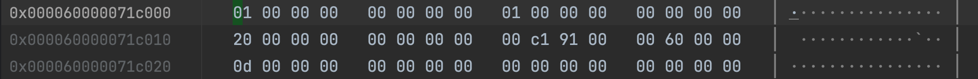

# Rc Layout

```rust

    let mut string = String::with_capacity(32); // sizeof::<String> = 24
    string.push_str("Hello World! ");

    let str1 = Rc::new(string); // sizeof::<RcInner<String>> = 40
    // memory: strong: 1, weak: 1
    assert_eq!(Rc::strong_count(&str1), 1);
    assert_eq!(Rc::weak_count(&str1), 0);

    let p1 = *(unsafe { &*(&str1 as *const Rc<_> as *const *const ()) }); // for debug the memory
    println!("str1 = {:p}", p1);

    let str2 = Rc::clone(&str1);
    // memory: strong:2 weak: 1
    assert_eq!(Rc::strong_count(&str2), 2);
    assert_eq!(Rc::weak_count(&str2), 0);

    let str3 = Rc::downgrade(&str2);
    // memory: strong:2 weak: 2
    assert_eq!(Rc::strong_count(&str1), 2);
    assert_eq!(Rc::weak_count(&str1), 1);
    
    drop(str1);
    // memory: strong = 1, weak = 2
    drop(str2);
    // memory: strong = 0, weak = 1, the value is dropped in place
    drop(str3);
    // memory: strong = 0, weak = 0, the RcInner is dropped
    
    println!("completed");
```

查看 p1 指向的内存：

```rust
struct Rc<T> {
    ptr:  NonNull<RcInner<T>>
}
struct RcInner {
    strong: usize,
    weak: usize,
    value: T;   // Here value: String
}

struct String {
    vec: Vec<u8>
}

struct Vec<u8> {
    buf: RawVec<u8>,
    len: usize
}

struct RawVec<u8> {
    inner: RawVecInner<u8>
}

struct RawVecInner {
    ptr: Unique<u8>,
    cap: usize
}

---
struct RcInner<String> { -- total: 40 bytes
    strong: usize,  // init:1, Rc +1, 
    weak: usize,    // init:1  Weak +1
    value: struct { -- total 24 bytes
        buf: {
            ptr: Unique<u8>
            cap: usize,
        }
        len: usize
    }
}
 
```



```rust
struct RcInner<String> {
    strong: usize,  // 1
    weak:   usize,  // 1
    value.buf.ptr: 0x60000091c100,
    value.buf.cap: 0x20,
    value.len:  0x0d
}
```

增加一个 Rc.clone()


增加一个 Weak 引用：


结论：
1. 当 strong_count 为 0 时， RcInner.value 可以被 drop_in_place，即释放掉 String.ptr 所在
   的内存。在这个例子中，释放掉 32个字节的内存（String.cap）,但 RcInner 自身占用的 40 字节不被释放
2. 当 weak_count 也为 0 时，RcInner 的内存也得以释放。
3. Rc::new 时 strong = 1, weak = 1( Rc::weak_count() == weak - 1)
4. Rc::clone 时 strong += 1, Rc::drop 时 strong -= 1
5. 新建一个 Weak 时 weak += 1, Weak::drop 时 weak - = 1
