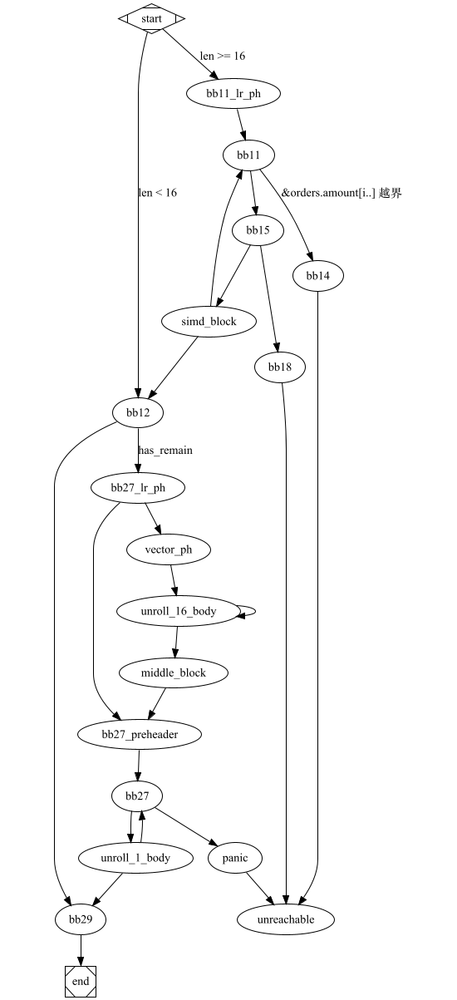

# simd-1

这个例子摘自实验项目
```rust
#[inline(never)]
fn aggregate_data(orders: &Orders) -> (f64, u32) {
    let mut total_amount = 0.0;
    let mut count = 0;
    for i in 0..orders.order_id.len() {
        total_amount += orders.amount[i];
        count += 1;
    }
    (total_amount, count)
}


// 1G 数据，耗时 260ms
#[inline(never)]
fn aggregate_data_simd(orders: &Orders) -> (f64, u32) {
    let mut total_amount = 0.0;
    let mut count = 0;

    let length = orders.order_id.len() & (!0x0F); // 16 is better than 32, same as 8
    for i in (0..length).step_by(16) {
        let amount= f64x16::from_slice(&orders.amount[i..]);
        let zero = f64x16::splat(0.0);
        total_amount += amount.reduce_sum();        // x86 上 reduce_sum 不支持向量化，还是多次累加
        count += amount.simd_ne(zero).to_bitmask().count_ones(); // x86 有 popcnt 指令
    }

    for i in length..orders.order_id.len() {
        total_amount += orders.amount[i];
        count += 1;
    }
    (total_amount, count)
}

#[inline(never)]
fn aggregate_data_simd2(orders: &Orders) -> (f64, u32) {
    let mut total_amount = 0.0;
    let mut count = 0;

    let length = orders.order_id.len() & (!0x0F); // 16 is better than 32, same as 8

    let mut aggr1 = f64x16::splat(0.0);
    // let mut aggr2 = f64x16::splat(0.0);
    let zero = f64x16::splat(0.0);

    for i in (0..length).step_by(16) {
        let amount1= f64x16::from_slice(&orders.amount[i..]);
        // let amount2= f64x16::from_slice(&orders.amount[i+16 ..]);
        aggr1 = aggr1 + amount1;
        // aggr2 = aggr2 + amount2;
        count += amount1.simd_ne(zero).to_bitmask().count_ones(); // x86 有 popcnt 指令
        // count += amount2.simd_ne(zero).to_bitmask().count_ones(); // x86 有 popcnt 指令
    }

    total_amount = aggr1.reduce_sum() ;
    for i in length..orders.order_id.len() {
        total_amount += orders.amount[i];
        count += 1;
    }
    (total_amount, count)
}
```

分别运行 1B(10亿) 的数据，耗时如下：
1. aggregate_data  947ms （0.9ns/iter)
2. aggregate_data_simd 260ms
3. aggregate_data_simd2 160ms

## x86_64 查看生成的汇编代码：
1. aggregate_data 进行了循环展开，一次循环处理了 4个 f64 数据，但没有使用 SIMD 指令。
   ```asm
    LBB24_10:
        vmovsd	xmm2, qword ptr [rdx + 8*rsi]
        vmovsd	xmm3, qword ptr [rdx + 8*rsi + 8]
        vaddsd	xmm0, xmm0, xmm2    // xmm0 += amount[i]
        vcmpneqsd	k0, xmm1, xmm2  
        kmovw	edi, k0
        add	edi, eax                // edi = count + (amount[i] != 0)
        vaddsd	xmm0, xmm0, xmm3    // xmm0 += amount[i+1]
        vcmpneqsd	k0, xmm1, xmm3
        kmovw	eax, k0
        vmovsd	xmm2, qword ptr [rdx + 8*rsi + 16]
        vaddsd	xmm0, xmm0, xmm2    // xmm0 += amount[i+2]
        vcmpneqsd	k0, xmm1, xmm2
        kmovw	r9d, k0         // 
        add	r9d, eax            // r9d = (amount[i+1] != 0) + (amount[i+2] != 0)
        add	r9d, edi            // r9d = count + (amount[i] != 0) + (amount[i+1] != 0) + (amount[i+2] != 0)
        vmovsd	xmm2, qword ptr [rdx + 8*rsi + 24]
        add	rsi, 4
        vaddsd	xmm0, xmm0, xmm2 // xmm0 += amount[i+3]
        vcmpneqsd	k0, xmm1, xmm2
        kmovw	eax, k0
        add	eax, r9d          // count += (amount[i+3] != 0)
        cmp	r8, rsi
        jne	LBB24_10
   ```
   - 进行了循环展开，一次循环处理了 4个 f64 数据
   - 没有使用 SIMD 指令
   - 上述指令具有一定的并行性。IPC > 1
2. aggregate_data_simd 显示在一次循环中处理 16个 f64 数据
   开启 avx512f 指令集，以及 popcnt 特性，生成的代码如下：
   ```asm
   LBB25_8:
      cmp	rcx, rsi
      ja	LBB25_12
      cmp	r10, 15
      jbe	LBB25_13
      dec	r8
      vaddsd	xmm3, xmm1, qword ptr [r9 + 8*rcx]
      vaddsd	xmm3, xmm3, qword ptr [r9 + 8*rcx + 8]
      vaddsd	xmm3, xmm3, qword ptr [r9 + 8*rcx + 16]
      vaddsd	xmm3, xmm3, qword ptr [r9 + 8*rcx + 24]
      vaddsd	xmm3, xmm3, qword ptr [r9 + 8*rcx + 32]
      vaddsd	xmm3, xmm3, qword ptr [r9 + 8*rcx + 40]
      vaddsd	xmm3, xmm3, qword ptr [r9 + 8*rcx + 48]
      vaddsd	xmm3, xmm3, qword ptr [r9 + 8*rcx + 56]
      vaddsd	xmm3, xmm3, qword ptr [r9 + 8*rcx + 64]
      vaddsd	xmm3, xmm3, qword ptr [r9 + 8*rcx + 72]
      vaddsd	xmm3, xmm3, qword ptr [r9 + 8*rcx + 80]
      vaddsd	xmm3, xmm3, qword ptr [r9 + 8*rcx + 88]
      vaddsd	xmm3, xmm3, qword ptr [r9 + 8*rcx + 96]
      vaddsd	xmm3, xmm3, qword ptr [r9 + 8*rcx + 104]
      vaddsd	xmm3, xmm3, qword ptr [r9 + 8*rcx + 112]
      vaddsd	xmm3, xmm3, qword ptr [r9 + 8*rcx + 120]  ; xmm3 = amount[i] + amount[i+1] + ... + amount[i+15]
      vcmpneqpd	k0, zmm2, zmmword ptr [r9 + 8*rcx]
      vcmpneqpd	k1, zmm2, zmmword ptr [r9 + 8*rcx + 64]
      vaddsd	xmm0, xmm0, xmm3
      kunpckbw	k0, k1, k0
      kmovw	r11d, k0
      popcnt	r11d, r11d                               ; r11d = popcnt(k0)
      add	eax, r11d
      add	r10, -16
      add	rcx, 16
      test	r8, r8
      jne	LBB25_8
   ```
   - f64 加法没有利用到 SIMD 指令
   - count 计算使用到 zmm 寄存器进行 SIMD 比较。
   - 使用了 popcnt 指令来计算 count
3. aggregate_data_simd2
   ```asm 
   LBB26_8:
      cmp	rcx, rsi
      ja	LBB26_12
      cmp	r10, 15
      jbe	LBB26_13
      dec	r8
      vmovupd	zmm3, zmmword ptr [r9 + 8*rcx]
      vmovupd	zmm4, zmmword ptr [r9 + 8*rcx + 64]
      vaddpd	zmm0, zmm0, zmm4
      vaddpd	zmm1, zmm1, zmm3
      vcmpneqpd	k0, zmm3, zmm2
      vcmpneqpd	k1, zmm4, zmm2
      kunpckbw	k0, k1, k0
      kmovw	r11d, k0
      popcnt	r11d, r11d
      add	eax, r11d
      add	r10, -16
      add	rcx, 16
      test	r8, r8
      jne	LBB26_8   
   ```
   - 加法充分使用到 SIMD 指令
   - count 充分利用 popcnt 指令

## ARM64 查看生成的汇编代码：
1. aggregate_data
2. aggregate_data_simd
3. aggregate_data_simd2
   ```asm
   ; x11: &orders.amount[i..]
   ; x8: i
   ; x12: orders.order_id.len() - i
   ; x9: 循环次数
   ; aggr1: f64x16 = v18, v23, v22, v20, v21, v19, v17, v0
   ; count_aggr: i64x16 = v3, v4, v2, v1, v6, v5, v16, v7
   LBB26_3:
       cmp	x8, x1
       b.hi	LBB26_14
       cmp	x12, #15
       b.ls	LBB26_15
       ldp	q25, q24, [x11, #64]       ; q24, q25, q26, q27, q28, q29, q30, q31: amount1: f64x16
       ldp	q27, q26, [x11, #32]
       ldp	q28, q29, [x11]
       fadd.2d	v23, v23, v29          ; v23, v18, v22, v20, v21, v19, v17, v0  aggr1: f64x16
       fadd.2d	v18, v18, v28
       fadd.2d	v22, v22, v27
       fadd.2d	v20, v20, v26
       fadd.2d	v21, v21, v25
       fadd.2d	v19, v19, v24
       ldp	q31, q30, [x11, #96]      ; 这条指令是否可以提前，以便更好的利用流水线？
       fadd.2d	v17, v17, v31
       fadd.2d	v0, v0, v30
       fcmeq.2d	v30, v30, #0.0
       mvn.16b	v30, v30。            ； v30, v31, v24, v25, v28, v29, v27, v26: amount1.simd_ne(zero)
       fcmeq.2d	v31, v31, #0.0
       mvn.16b	v31, v31
       fcmeq.2d	v24, v24, #0.0
       mvn.16b	v24, v24
       fcmeq.2d	v25, v25, #0.0
       mvn.16b	v25, v25
       fcmeq.2d	v28, v28, #0.0
       mvn.16b	v28, v28
       fcmeq.2d	v29, v29, #0.0
       mvn.16b	v29, v29
       fcmeq.2d	v27, v27, #0.0
       mvn.16b	v27, v27
       fcmeq.2d	v26, v26, #0.0
       mvn.16b	v26, v26
       sub.2d	v3, v3, v26        ; v3, v4, v2, v1, v6, v5, v16, v7: count_aggr += amount1.simd_ne(zero)
       sub.2d	v4, v4, v27
       sub.2d	v2, v2, v29
       sub.2d	v1, v1, v28
       sub.2d	v6, v6, v25
       sub.2d	v5, v5, v24
       add	x11, x11, #128        ; x11: &orders.amount, x12
       sub	x12, x12, #16
       sub.2d	v16, v16, v31
       add	x8, x8, #16           ; x8, x9
       sub.2d	v7, v7, v30
       sub	x9, x9, #1
       cbnz	x9, LBB26_3
   ```

   对应的 LLVM-IR 代码如下：
   ```llvm-ir
   ; vector_example1::aggregate_data_simd2
   ; Function Attrs: noinline uwtable
   define internal fastcc { double, i32 } @_ZN15vector_example120aggregate_data_simd217hf7a44556b264af6cE(ptr noalias nocapture noundef readonly align 8 dereferenceable(72) %orders) unnamed_addr #2 personality ptr @rust_eh_personality {
   start:
     %_73 = alloca [48 x i8], align 8
     %0 = getelementptr inbounds i8, ptr %orders, i64 16             ; &orders.order_id.len
     %order_id_len = load i64, ptr %0, align 8, !noundef !3          ; orders.order_id.len
     %length16 = and i64 %order_id_len, -16                          ; %length16 = orders.order_id.len & !0x0F
     %_57.not34 = icmp ult i64 %order_id_len, 16                     ; orders.order_id.len < 16
     br i1 %_57.not34, label %bb12, label %bb11.lr.ph

   bb11.lr.ph:                                       ; preds = %start
     %d.i.i23 = lshr i64 %order_id_len, 4
     %1 = getelementptr inbounds i8, ptr %orders, i64 64       ; &orders.total_amount.len
     %total_amount_len = load i64, ptr %1, align 8, !noundef !3
     %2 = getelementptr inbounds i8, ptr %orders, i64 56       ; &order.total_amount.ptr
     %total_amount_ptr = load ptr, ptr %2, align 8, !nonnull !3
     br label %bb11

   bb12:                                             ; preds = %simd_block, %start   ; orders.order_id.len < 16
     %count_aggr.sroa.0.0.lcssa = phi <16 x i64> [ zeroinitializer, %start ], [ %50, %simd_block ]
     %aggr1.sroa.0.0.lcssa = phi <16 x double> [ zeroinitializer, %start ], [ %47, %simd_block ]
     %3 = tail call double @llvm.vector.reduce.fadd.v16f64(double 0.000000e+00, <16 x double> %aggr1.sroa.0.0.lcssa)   ; total_amount
     %4 = tail call i64 @llvm.vector.reduce.add.v16i64(<16 x i64> %count_aggr.sroa.0.0.lcssa)
     %5 = trunc i64 %4 to i32                        ; count
     %_9640.not = icmp eq i64 %length16, %order_id_len
     br i1 %_9640.not, label %bb29, label %bb27.lr.ph

   bb27.lr.ph:                                       ; preds = %bb12   ; remaining > 0
     %6 = getelementptr inbounds i8, ptr %orders, i64 64
     %_100 = load i64, ptr %6, align 8, !noundef !3
     %7 = getelementptr inbounds i8, ptr %orders, i64 56
     %_102 = load ptr, ptr %7, align 8, !nonnull !3
     %8 = or disjoint i64 %length16, 1
     %umax = tail call i64 @llvm.umax.i64(i64 %order_id_len, i64 %8)
     %9 = xor i64 %length16, -1
     %10 = add i64 %umax, %9
     %11 = tail call i64 @llvm.usub.sat.i64(i64 %_100, i64 %length16)
     %umin = tail call i64 @llvm.umin.i64(i64 %10, i64 %11)
     %12 = add i64 %umin, 1
     %min.iters.check = icmp ult i64 %12, 17
     br i1 %min.iters.check, label %bb27.preheader, label %vector.ph

   bb27.preheader:                                   ; preds = %middle.block, %bb27.lr.ph
     %total_amount.sroa.0.043.ph = phi double [ %3, %bb27.lr.ph ], [ %35, %middle.block ]
     %count.sroa.0.042.ph = phi i32 [ %5, %bb27.lr.ph ], [ %37, %middle.block ]
     %iter.sroa.0.041.ph = phi i64 [ %length16, %bb27.lr.ph ], [ %ind.end, %middle.block ]
     br label %bb27

   vector.ph:                                        ; preds = %bb27.lr.ph
     %n.mod.vf = and i64 %12, 15
     %13 = icmp eq i64 %n.mod.vf, 0
     %14 = select i1 %13, i64 16, i64 %n.mod.vf
     %n.vec = sub i64 %12, %14
     %ind.end = add i64 %length16, %n.vec
     %15 = insertelement <4 x i32> <i32 poison, i32 0, i32 0, i32 0>, i32 %5, i64 0
     br label %unroll_16_body

   unroll_16_body:                                      ; preds = %unroll_16_body, %vector.ph
     %index = phi i64 [ 0, %vector.ph ], [ %index.next, %unroll_16_body ]
     %vec.phi = phi double [ %3, %vector.ph ], [ %35, %unroll_16_body ]
     %vec.phi62 = phi <4 x i32> [ %15, %vector.ph ], [ %28, %unroll_16_body ]
     %vec.phi63 = phi <4 x i32> [ zeroinitializer, %vector.ph ], [ %29, %unroll_16_body ]
     %vec.phi64 = phi <4 x i32> [ zeroinitializer, %vector.ph ], [ %30, %unroll_16_body ]
     %vec.phi65 = phi <4 x i32> [ zeroinitializer, %vector.ph ], [ %31, %unroll_16_body ]
     %offset.idx = add i64 %length16, %index
     %16 = getelementptr inbounds [0 x double], ptr %_102, i64 0, i64 %offset.idx
     %17 = getelementptr inbounds i8, ptr %16, i64 32
     %18 = getelementptr inbounds i8, ptr %16, i64 64
     %19 = getelementptr inbounds i8, ptr %16, i64 96
     %wide.load = load <4 x double>, ptr %16, align 8
     %wide.load66 = load <4 x double>, ptr %17, align 8
     %wide.load67 = load <4 x double>, ptr %18, align 8
     %wide.load68 = load <4 x double>, ptr %19, align 8
     %20 = fcmp une <4 x double> %wide.load, zeroinitializer
     %21 = fcmp une <4 x double> %wide.load66, zeroinitializer
     %22 = fcmp une <4 x double> %wide.load67, zeroinitializer
     %23 = fcmp une <4 x double> %wide.load68, zeroinitializer
     %24 = zext <4 x i1> %20 to <4 x i32>
     %25 = zext <4 x i1> %21 to <4 x i32>
     %26 = zext <4 x i1> %22 to <4 x i32>
     %27 = zext <4 x i1> %23 to <4 x i32>
     %28 = add <4 x i32> %vec.phi62, %24
     %29 = add <4 x i32> %vec.phi63, %25
     %30 = add <4 x i32> %vec.phi64, %26
     %31 = add <4 x i32> %vec.phi65, %27
     %32 = tail call double @llvm.vector.reduce.fadd.v4f64(double %vec.phi, <4 x double> %wide.load)
     %33 = tail call double @llvm.vector.reduce.fadd.v4f64(double %32, <4 x double> %wide.load66)
     %34 = tail call double @llvm.vector.reduce.fadd.v4f64(double %33, <4 x double> %wide.load67)
     %35 = tail call double @llvm.vector.reduce.fadd.v4f64(double %34, <4 x double> %wide.load68)
     %index.next = add nuw i64 %index, 16
     %36 = icmp eq i64 %index.next, %n.vec
     br i1 %36, label %middle.block, label %unroll_16_body, !llvm.loop !824

   middle.block:                                     ; preds = %unroll_16_body
     %bin.rdx = add <4 x i32> %29, %28
     %bin.rdx69 = add <4 x i32> %30, %bin.rdx
     %bin.rdx70 = add <4 x i32> %31, %bin.rdx69
     %37 = tail call i32 @llvm.vector.reduce.add.v4i32(<4 x i32> %bin.rdx70)
     br label %bb27.preheader

   bb11:                                             ; preds = %bb11.lr.ph, %simd_block
     %aggr1.sroa.0.038 = phi <16 x double> [ zeroinitializer, %bb11.lr.ph ], [ %47, %simd_block ]
     %count_aggr.sroa.0.037 = phi <16 x i64> [ zeroinitializer, %bb11.lr.ph ], [ %50, %simd_block ]
     %iter2.sroa.0.036 = phi i64 [ %d.i.i23, %bb11.lr.ph ], [ %38, %simd_block ]
     %iter1.sroa.0.035 = phi i64 [ 0, %bb11.lr.ph ], [ %_59, %simd_block ]
     %_59 = add nuw i64 %iter1.sroa.0.035, 16
     %38 = add nsw i64 %iter2.sroa.0.036, -1
     %_66 = icmp ugt i64 %iter1.sroa.0.035, %total_amount_len
     br i1 %_66, label %bb14, label %bb15, !prof !45

   bb29:                                             ; preds = %unroll_1_body, %bb12
     %count.sroa.0.0.lcssa = phi i32 [ %5, %bb12 ], [ %count.sroa.0.1, %unroll_1_body ]
     %total_amount.sroa.0.0.lcssa = phi double [ %3, %bb12 ], [ %41, %unroll_1_body ]
     %39 = insertvalue { double, i32 } poison, double %total_amount.sroa.0.0.lcssa, 0
     %40 = insertvalue { double, i32 } %39, i32 %count.sroa.0.0.lcssa, 1
     ret { double, i32 } %40

   bb27:                                             ; preds = %bb27.preheader, %unroll_1_body
     %total_amount.sroa.0.043 = phi double [ %41, %unroll_1_body ], [ %total_amount.sroa.0.043.ph, %bb27.preheader ]
     %count.sroa.0.042 = phi i32 [ %count.sroa.0.1, %unroll_1_body ], [ %count.sroa.0.042.ph, %bb27.preheader ]
     %iter.sroa.0.041 = phi i64 [ %_0.i, %unroll_1_body ], [ %iter.sroa.0.041.ph, %bb27.preheader ]
     %_105 = icmp ult i64 %iter.sroa.0.041, %_100
     br i1 %_105, label %unroll_1_body, label %panic

   unroll_1_body:                                             ; preds = %bb27
     %_0.i = add nuw i64 %iter.sroa.0.041, 1
     %_28 = getelementptr inbounds [0 x double], ptr %_102, i64 0, i64 %iter.sroa.0.041
     %_27 = load double, ptr %_28, align 8, !noundef !3
     %41 = fadd double %total_amount.sroa.0.043, %_27
     %_29 = fcmp une double %_27, 0.000000e+00
     %42 = zext i1 %_29 to i32
     %count.sroa.0.1 = add i32 %count.sroa.0.042, %42
     %_96 = icmp ult i64 %_0.i, %order_id_len
     br i1 %_96, label %bb27, label %bb29, !llvm.loop !825

   panic:                                            ; preds = %bb27
   ; call core::panicking::panic_bounds_check
     tail call void @_ZN4core9panicking18panic_bounds_check17h4e300ecacdcb485dE(i64 noundef %iter.sroa.0.041, i64 noundef %_100, ptr noalias noundef nonnull readonly align 8 dereferenceable(24) @alloc_1d64afd2f4d6487c2fc52f49f157fb70) #25
     unreachable

   bb15:                                             ; preds = %bb11
     %_68 = sub nuw i64 %total_amount_len, %iter1.sroa.0.035
     %_71 = icmp ugt i64 %_68, 15
     br i1 %_71, label %simd_block, label %bb18, !prof !162

   bb14:                                             ; preds = %bb11
   ; call core::slice::index::slice_start_index_len_fail
     tail call void @_ZN4core5slice5index26slice_start_index_len_fail17hc58130d6bde59316E(i64 noundef %iter1.sroa.0.035, i64 noundef %total_amount_len, ptr noalias noundef nonnull readonly align 8 dereferenceable(24) @alloc_a51f3018634c16dde71b5ca2d7634a49) #25
     unreachable

   bb18:                                             ; preds = %bb15
     call void @llvm.lifetime.start.p0(i64 48, ptr nonnull %_73)
     store ptr @alloc_9050ad19dc66bd48e533c9ef9ae2a705, ptr %_73, align 8
     %43 = getelementptr inbounds i8, ptr %_73, i64 8
     store i64 1, ptr %43, align 8
     %44 = getelementptr inbounds i8, ptr %_73, i64 32
     store ptr null, ptr %44, align 8
     %45 = getelementptr inbounds i8, ptr %_73, i64 16
     store ptr inttoptr (i64 8 to ptr), ptr %45, align 8
     %46 = getelementptr inbounds i8, ptr %_73, i64 24
     store i64 0, ptr %46, align 8
   ; call core::panicking::panic_fmt
     call void @_ZN4core9panicking9panic_fmt17hf449f69c28a45a63E(ptr noalias nocapture noundef nonnull readonly align 8 dereferenceable(48) %_73, ptr noalias noundef nonnull readonly align 8 dereferenceable(24) @alloc_aff0730a47fd28b03378033af17e580b) #25
     unreachable

   simd_block:                                             ; preds = %bb15
     %_69 = getelementptr inbounds double, ptr %total_amount_ptr, i64 %iter1.sroa.0.035
     %_77.sroa.0.0.copyload = load <16 x double>, ptr %_69, align 8
     %47 = fadd <16 x double> %aggr1.sroa.0.038, %_77.sroa.0.0.copyload
     %48 = fcmp une <16 x double> %_77.sroa.0.0.copyload, zeroinitializer
     %49 = zext <16 x i1> %48 to <16 x i64>
     %50 = add <16 x i64> %count_aggr.sroa.0.037, %49
     %_57.not = icmp eq i64 %38, 0
     br i1 %_57.not, label %bb12, label %bb11
   }

   ```
   
   对应的 CFG 如下：
   
