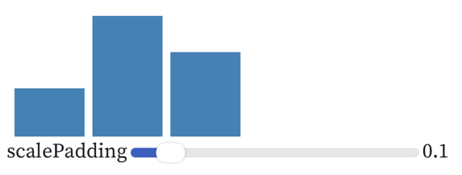

# How Vega Works

原始连接：https://observablehq.com/@vega/how-vega-works#inputSpec

1. Vega 使用 JSON 描述，有对用 JSON-Schema 规范。
2. Vega 不仅仅适用于静态的可视化，其具有交互能力和渲染动态数据的能力

示例：
```json
{
	"width": 200,
	"height": 100,
	"data": [{
		"name": "table",
		"values": [{
			"key": "A",
			"value": 4
		}, {
			"key": "B",
			"value": 10
		}, {
			"key": "C",
			"value": 7
		}]
	}],
	"scales": [{
		"name": "xscale",
		"type": "band",
		"domain": {
			"data": "table",
			"field": "key"
		},
		"padding": {
			"signal": "scalePadding"
		},
		"range": "width"
	}, {
		"name": "yscale",
		"type": "linear",
		"domain": {
			"data": "table",
			"field": "value"
		},
		"range": "height"
	}],
	"marks": [{
		"type": "rect",
		"from": {
			"data": "table"
		},
		"encode": {
			"update": {
				"x": {
					"scale": "xscale",
					"field": "key"
				},
				"y": {
					"scale": "yscale",
					"field": "value"
				},
				"y2": {
					"scale": "yscale",
					"value": 0
				},
				"width": {
					"scale": "xscale",
					"band": 1
				},
				"fill": {
					"value": "steelblue"
				}
			}
		}
	}],
	"signals": [{
		"name": "scalePadding",
		"value": 0.1,
		"bind": {
			"input": "range",
			"min": 0,
			"max": 0.99,
			"step": 0.01
		}
	}]
}
```



# Visualization as Reaction Dataflows
对一个源文件，Vega 会生成数据流图 dataflow graph，来处理从数据到可视化元素、坐标轴、图例的映射，以及响应交互式事件。

dataflow graph 包括：
- nodes(operators)：处理数据计算（源数据、派生的数据、可视化图元数据，signal） 
- edges: 数据流向
  - parameter edges
  - pulse edges

1. 灰色节点：signals
2. 红色节点：datasources
3. blue 节点：可视化marks
4. 白色节点：内部的operators
5. 黑色边： 数据流依赖
6. 灰色边：parameter 依赖
node 颜色：与目前产品中的不一致了。
- datajoin: map input data objects to scenegraph mark items
- collect: 收集 datajoin 的输出
- mark：bind mark to the scenegraph
- encode: 编码每个 mark 的属性
- bound： 计算每个 mark 的边界，用于布局，和处理点击事件
- render: 提交 scenegraph 修改到渲染队列中
- sieve: 传播 mark 的修改

# Parse a Vega Spec
```javascript
parsedSpec = vega.parse(inputSpec)
```
1. 解析 JSON，生成 dataflow graph, 这个 graph 目前并不是一个 JSON
2. encode.update 编译为 JavaScript 代码
   ```javascript
   o.x = _["%xscale"](datum["key"]);
   o.y = _["%yscale"](datum["value"]);
   o.y2 = _["%yscale"](0);
   o.width = this.__bandwidth(_["%xscale"]);
   o.fill = "steelblue";
   ```
   节省后续的解释时间

# View & Dataflow Runtime

# Scenegraph & Rendering
Vega Dataflow 计算并维护一个 scenegraph，这是一棵可视化元素的树，可以通过 SVG 或 Canvas 进行渲染。
在图元中， mark 是一组 item（每个item 对应单次 encode ），这个与我之前理解的概念不同。
对 scenegraph 进行更新后，也可以进行高效的更新，而非重新渲染整个图。
使用 Canvas 时，如何进行增量式的渲染，应该还是很有技术挑战的。

# 坐标轴、图例的处理
Vega 对 Axies 会生成 axis-grid, axis-tick, axis-label, axis-domain 等图元。
对图例也是如此，其实还是相当于一个 Dataflow 的语法糖