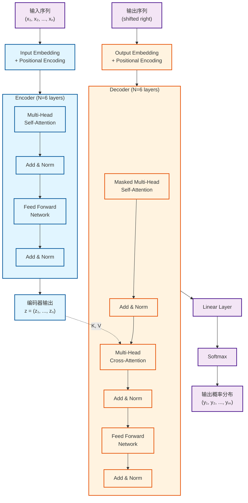

# Q2: 请介绍 Transformer 的整体架构

## 问题
请介绍 Transformer 的整体架构。

## 回答

Transformer 采用经典的 **Encoder-Decoder** 架构，但与传统的 RNN/LSTM 模型不同，它完全基于注意力机制构建。让我从整体到局部详细介绍这个架构。

### 一、整体架构图



### 二、核心组件详解


#### 1. **输入/输出嵌入层**

**Input/Output Embedding**：
- 将 token 转换为 $d_{model}=512$ 维向量
- 编码器和解码器共享相同的嵌入矩阵（权重绑定）
- 嵌入层权重乘以 $\sqrt{d_{model}}$ 进行缩放

**Positional Encoding（位置编码）**：
- Transformer 没有循环结构，需要显式注入位置信息
- 使用固定的正弦/余弦函数：
  $$PE_{(pos, 2i)} = \sin\left(\frac{pos}{10000^{2i/d_{model}}}\right)$$
  $$PE_{(pos, 2i+1)} = \cos\left(\frac{pos}{10000^{2i/d_{model}}}\right)$$
  - $pos$：位置索引
  - $i$：维度索引
  - 波长形成从 $2\pi$ 到 $10000 \cdot 2\pi$ 的几何级数

**为什么使用正弦函数？**
- 对于任何固定偏移 $k$，$PE_{pos+k}$ 可以表示为 $PE_{pos}$ 的线性函数
- 允许模型轻松学习相对位置关系
- 可以外推到训练时未见过的序列长度


#### 2. **Encoder（编码器）**

**结构**：由 $N=6$ 个完全相同的层堆叠而成。

每一层包含两个子层：

**子层 1：Multi-Head Self-Attention（多头自注意力）**
- 输入序列的每个位置都可以关注到序列中的所有位置
- 数学表示：对于输入 $X \in \mathbb{R}^{n \times d_{model}}$
  $$\text{SelfAttn}(X) = \text{MultiHead}(X, X, X)$$

**子层 2：Position-wise Feed-Forward Network（位置前馈网络）**
- 对每个位置独立应用相同的全连接网络
- 数学表示：
  $$\text{FFN}(x) = \max(0, xW_1 + b_1)W_2 + b_2$$
  其中 $W_1 \in \mathbb{R}^{d_{model} \times d_{ff}}$，$W_2 \in \mathbb{R}^{d_{ff} \times d_{model}}$
  - 论文中：$d_{model} = 512$，$d_{ff} = 2048$

**重要机制**：
- **残差连接（Residual Connection）**：$\text{output} = \text{LayerNorm}(x + \text{Sublayer}(x))$
- **层归一化（Layer Normalization）**：稳定训练过程

#### 3. **Decoder（解码器）**

**结构**：同样由 $N=6$ 个相同的层堆叠而成。

每一层包含三个子层：

**子层 1：Masked Multi-Head Self-Attention（带掩码的多头自注意力）**
- 确保位置 $i$ 的预测只能依赖于位置 $< i$ 的已知输出
- 通过将未来位置的注意力权重设为 $-\infty$（softmax 后变为 0）实现
- **自回归特性**：生成时逐个 token 预测

**子层 2：Multi-Head Cross-Attention（编码器-解码器注意力）**
- Query 来自解码器的前一层
- Key 和 Value 来自编码器的输出
- 数学表示：
  $$\text{CrossAttn}(Q_{dec}, K_{enc}, V_{enc}) = \text{MultiHead}(Q_{dec}, K_{enc}, V_{enc})$$
- **作用**：让解码器关注输入序列的相关部分

**子层 3：Position-wise Feed-Forward Network**
- 与编码器中的 FFN 结构相同

**重要特性**：
- 同样使用残差连接和层归一化
- 输出位置偏移（Output Embedding shifted right）：训练时将目标序列右移一位作为输入

#### 4. **输出层**

**Linear + Softmax**：
- 线性变换：将解码器输出映射到词汇表大小 $|V|$
- Softmax：转换为概率分布
  $$P(y_i) = \text{softmax}(\text{Linear}(\text{decoder\_output}_i))$$

### 三、关键设计特点

#### 1. **模型维度统一**
- 所有子层输出维度统一为 $d_{model} = 512$
- 便于残差连接的实现
- 简化了模型设计

#### 2. **堆叠深度**
- 编码器和解码器各 6 层（$N=6$）
- 大模型版本（big）使用相同层数，但增加维度

#### 3. **并行计算能力**
- 编码器可以并行处理整个输入序列
- 解码器在训练时也可以并行（使用掩码）
- 推理时解码器必须自回归生成

#### 4. **参数量**
- 基础模型（base）：约 65M 参数
- 大模型（big）：约 213M 参数
  - $d_{model} = 1024$
  - $d_{ff} = 4096$
  - $h = 16$ 个注意力头

### 四、信息流动路径

#### **训练阶段**：
```
输入序列 → Embedding + PE → Encoder (6层) → 编码表示 z
                                              ↓
目标序列 → Embedding + PE → Decoder (6层) ← 交叉注意力
                              ↓
                         Linear + Softmax
                              ↓
                          预测概率
```

#### **推理阶段**：
```
输入序列 → Encoder → 编码表示 z
                        ↓
<start> → Decoder → 预测 y₁
<start> y₁ → Decoder → 预测 y₂
<start> y₁ y₂ → Decoder → 预测 y₃
...（自回归生成）
```

### 五、架构优势总结

| 特性 | 传统 RNN/LSTM | Transformer |
|------|---------------|-------------|
| **并行化** | 序列计算，无法并行 | 完全并行（训练时） |
| **长距离依赖** | $O(n)$ 路径长度 | $O(1)$ 路径长度 |
| **计算复杂度** | $O(n \cdot d^2)$ | $O(n^2 \cdot d)$ |
| **梯度传播** | 梯度消失/爆炸问题 | 残差连接，梯度稳定 |
| **可解释性** | 黑盒 | 注意力权重可视化 |

### 六、数学维度总结

以 base 模型为例，数据在各层的维度变化：

1. **输入**：batch_size × seq_len × vocab_size（one-hot 或 token ids）
2. **Embedding**：batch_size × seq_len × 512
3. **Encoder 输出**：batch_size × seq_len × 512
4. **Decoder 输出**：batch_size × target_len × 512
5. **最终输出**：batch_size × target_len × vocab_size

---

**总结**：Transformer 的架构设计巧妙地平衡了表达能力、计算效率和可扩展性。其完全基于注意力机制的设计，摒弃了循环结构，使得模型可以高效并行训练，同时通过多层堆叠和残差连接实现了强大的表示学习能力。

## 相关主题
- 注意力机制详解（Self-Attention vs Cross-Attention）
- 位置编码的数学原理
- 残差连接和层归一化的作用
- Masked Attention 的实现细节
- Multi-Head Attention 的并行计算
