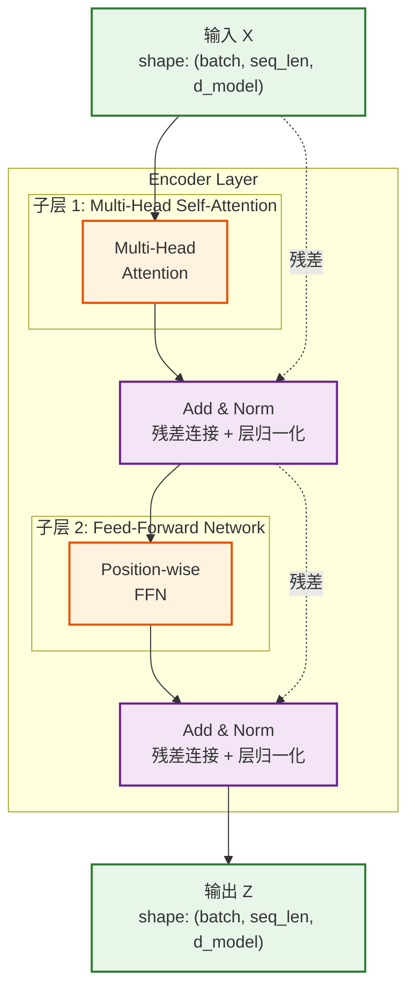

# Q3: 详细介绍 Encoder 层的各个子层

## 问题
请详细介绍 Encoder 层的各个子层，需要说明各个子层的输入格式、输出格式和数学公式。

## 回答

Encoder 由 $N=6$ 个完全相同的层堆叠而成。每个 Encoder 层包含两个主要子层，以及残差连接和层归一化机制。让我从数学角度详细拆解每个子层。

### 一、Encoder 单层结构



### 二、输入嵌入与位置编码（Encoder 的初始输入）

#### **输入格式**
- **原始输入**：token 序列 $(x_1, x_2, ..., x_n)$
  - $x_i \in \mathbb{V}$（词汇表）
  - $n$：序列长度

#### **Token Embedding**
将离散 token 映射到连续向量空间：

$$E \in \mathbb{R}^{|V| \times d_{model}}$$

其中 $|V|$ 是词汇表大小，$d_{model} = 512$（base 模型）

对于输入序列，得到嵌入矩阵：
$$X_{embed} = \text{Embedding}(x_1, ..., x_n) \in \mathbb{R}^{n \times d_{model}}$$

**缩放**：嵌入向量乘以 $\sqrt{d_{model}}$
$$X_{embed} = X_{embed} \times \sqrt{d_{model}}$$

#### **Positional Encoding**
由于 Transformer 没有循环结构，需要注入位置信息：

$$PE_{(pos, 2i)} = \sin\left(\frac{pos}{10000^{2i/d_{model}}}\right)$$
$$PE_{(pos, 2i+1)} = \cos\left(\frac{pos}{10000^{2i/d_{model}}}\right)$$

其中：
- $pos \in [0, n-1]$：序列中的位置
- $i \in [0, d_{model}/2-1]$：维度索引

位置编码矩阵：
$$PE \in \mathbb{R}^{n \times d_{model}}$$

#### **最终输入**
$$X^{(0)} = X_{embed} + PE \in \mathbb{R}^{n \times d_{model}}$$

这是第一个 Encoder 层的输入。

---

### 三、子层 1：Multi-Head Self-Attention

#### **输入格式**
- **输入**：$X^{(l)} \in \mathbb{R}^{n \times d_{model}}$（第 $l$ 层的输入）
  - $n$：序列长度
  - $d_{model} = 512$

#### **计算步骤**

##### **步骤 1：生成 Q, K, V**
通过三个独立的线性变换生成 Query, Key, Value：

$$Q = X^{(l)} W^Q, \quad W^Q \in \mathbb{R}^{d_{model} \times d_{model}}$$
$$K = X^{(l)} W^K, \quad W^K \in \mathbb{R}^{d_{model} \times d_{model}}$$
$$V = X^{(l)} W^V, \quad W^V \in \mathbb{R}^{d_{model} \times d_{model}}$$

输出形状：
- $Q \in \mathbb{R}^{n \times d_{model}}$
- $K \in \mathbb{R}^{n \times d_{model}}$
- $V \in \mathbb{R}^{n \times d_{model}}$

##### **步骤 2：多头分割**
将 $Q, K, V$ 分割成 $h=8$ 个头：

$$Q = [Q_1, Q_2, ..., Q_h], \quad Q_i \in \mathbb{R}^{n \times d_k}$$
$$K = [K_1, K_2, ..., K_h], \quad K_i \in \mathbb{R}^{n \times d_k}$$
$$V = [V_1, V_2, ..., V_h], \quad V_i \in \mathbb{R}^{n \times d_v}$$

其中：
- $d_k = d_v = d_{model} / h = 512 / 8 = 64$

> **关键概念说明**：
> - **$d_k$**（Key/Query 维度）：用于计算注意力分数的向量维度
> - **$d_v$**（Value 维度）：输出向量的维度
> - **$h$**（头数）：并行注意力头的数量 = 8
> - 在 Transformer 中，$d_k = d_v = 64$，但理论上它们可以不同
> - 设计原则：$h \times d_v = d_{model}$，保证拼接后维度为 512

实际实现中，通过投影矩阵实现：
$$Q_i = X^{(l)} W^Q_i, \quad W^Q_i \in \mathbb{R}^{d_{model} \times d_k}$$
$$K_i = X^{(l)} W^K_i, \quad W^K_i \in \mathbb{R}^{d_{model} \times d_k}$$
$$V_i = X^{(l)} W^V_i, \quad W^V_i \in \mathbb{R}^{d_{model} \times d_v}$$

##### **步骤 3：Scaled Dot-Product Attention（对每个头）**
对每个注意力头 $i$ 计算：

$$\text{head}_i = \text{Attention}(Q_i, K_i, V_i) = \text{softmax}\left(\frac{Q_i K_i^T}{\sqrt{d_k}}\right) V_i$$

详细展开：

1. **计算注意力分数**：
   $$S_i = \frac{Q_i K_i^T}{\sqrt{d_k}} \in \mathbb{R}^{n \times n}$$
   - $Q_i K_i^T$：点积相似度矩阵
   - $\sqrt{d_k} = \sqrt{64} = 8$：缩放因子

2. **Softmax 归一化**（对每一行）：
   $$A_i = \text{softmax}(S_i) \in \mathbb{R}^{n \times n}$$
   $$A_i[j, k] = \frac{\exp(S_i[j,k])}{\sum_{k'=1}^{n} \exp(S_i[j,k'])}$$
   - $A_i[j, k]$：位置 $j$ 对位置 $k$ 的注意力权重
   - 每行和为 1

3. **加权求和**：
   $$\text{head}_i = A_i V_i \in \mathbb{R}^{n \times d_v}$$

   **维度推导**：
   - $A_i \in \mathbb{R}^{n \times n}$：注意力权重矩阵
   - $V_i \in \mathbb{R}^{n \times d_v}$：Value 矩阵
   - 矩阵乘法：$(n \times n) \times (n \times d_v) = (n \times d_v)$
   - 因为 $d_v = 64$，所以 $\text{head}_i \in \mathbb{R}^{n \times 64}$

##### **步骤 4：多头拼接**
将所有头的输出拼接：

$$\text{MultiHead}(Q, K, V) = \text{Concat}(\text{head}_1, ..., \text{head}_h) W^O$$

其中：
- $\text{Concat}(\text{head}_1, ..., \text{head}_h) \in \mathbb{R}^{n \times (h \cdot d_v)} = \mathbb{R}^{n \times 512}$
- $W^O \in \mathbb{R}^{(h \cdot d_v) \times d_{model}} = \mathbb{R}^{512 \times 512}$：输出投影矩阵

#### **输出格式**
$$\text{Attn_Output} = \text{MultiHead}(X^{(l)}, X^{(l)}, X^{(l)}) \in \mathbb{R}^{n \times d_{model}}$$

#### **参数量统计**
每个 Encoder 层的 Multi-Head Attention 参数：
- $W^Q_i, W^K_i, W^V_i$：$h \times (d_{model} \times d_k \times 3) = 8 \times (512 \times 64 \times 3)$
- $W^O$：$512 \times 512$
- **总计**：$\approx 1,048,576$ 参数（约 1M）

---

### 四、Add & Norm 1（残差连接 + 层归一化）

#### **输入格式**
- **原始输入**：$X^{(l)} \in \mathbb{R}^{n \times d_{model}}$
- **子层输出**：$\text{Attn_Output} \in \mathbb{R}^{n \times d_{model}}$

#### **计算步骤**

##### **步骤 1：残差连接（Residual Connection）**
$$X_{res1} = X^{(l)} + \text{Attn_Output} \in \mathbb{R}^{n \times d_{model}}$$

**作用**：
- 缓解梯度消失问题
- 允许信息直接流过网络
- 使深层网络训练更稳定

##### **步骤 2：层归一化（Layer Normalization）**
对每个样本的每个位置，跨特征维度归一化：

$$\text{LN}(X_{res1}[i]) = \gamma \odot \frac{X_{res1}[i] - \mu_i}{\sigma_i + \epsilon} + \beta$$

其中：
- $X_{res1}[i] \in \mathbb{R}^{d_{model}}$：第 $i$ 个位置的向量
- $\mu_i = \frac{1}{d_{model}} \sum_{j=1}^{d_{model}} X_{res1}[i, j]$：均值（标量）
- $\sigma_i^2 = \frac{1}{d_{model}} \sum_{j=1}^{d_{model}} (X_{res1}[i, j] - \mu_i)^2$：方差（标量）
- $\gamma, \beta \in \mathbb{R}^{d_{model}}$：可学习的缩放和偏移参数
- $\epsilon = 10^{-6}$：数值稳定性常数
- $\odot$：逐元素乘法

#### **输出格式**
$$X_{norm1} = \text{LayerNorm}(X^{(l)} + \text{Attn_Output}) \in \mathbb{R}^{n \times d_{model}}$$

---

### 五、子层 2：Position-wise Feed-Forward Network

#### **输入格式**
$$X_{norm1} \in \mathbb{R}^{n \times d_{model}}$$

#### **计算步骤**

FFN 对序列的每个位置独立应用相同的全连接网络：

$$\text{FFN}(x) = \max(0, x W_1 + b_1) W_2 + b_2$$

展开为两层：

##### **第一层：线性变换 + ReLU 激活**
$$H = \text{ReLU}(X_{norm1} W_1 + b_1)$$

其中：
- $W_1 \in \mathbb{R}^{d_{model} \times d_{ff}}$，$b_1 \in \mathbb{R}^{d_{ff}}$
- $d_{ff} = 2048$（中间层维度）
- $H \in \mathbb{R}^{n \times d_{ff}} = \mathbb{R}^{n \times 2048}$

**ReLU 激活函数**：
$$\text{ReLU}(x) = \max(0, x)$$

##### **第二层：线性变换**
$$\text{FFN_Output} = H W_2 + b_2$$

其中：
- $W_2 \in \mathbb{R}^{d_{ff} \times d_{model}}$，$b_2 \in \mathbb{R}^{d_{model}}$
- $\text{FFN_Output} \in \mathbb{R}^{n \times d_{model}}$

#### **输出格式**
$$\text{FFN_Output} \in \mathbb{R}^{n \times d_{model}}$$

#### **参数量统计**
- $W_1$：$512 \times 2048$
- $b_1$：$2048$
- $W_2$：$2048 \times 512$
- $b_2$：$512$
- **总计**：$\approx 2,101,248$ 参数（约 2M）

#### **为什么是 "Position-wise"？**
- 相同的 $W_1, W_2, b_1, b_2$ 应用于序列的所有位置
- 每个位置的计算是独立的（没有跨位置的信息交互）
- 等价于两个 kernel size = 1 的 1D 卷积

---

### 六、Add & Norm 2（残差连接 + 层归一化）

#### **输入格式**
- **前一子层输出**：$X_{norm1} \in \mathbb{R}^{n \times d_{model}}$
- **FFN 输出**：$\text{FFN_Output} \in \mathbb{R}^{n \times d_{model}}$

#### **计算步骤**

##### **残差连接**
$$X_{res2} = X_{norm1} + \text{FFN_Output}$$

##### **层归一化**
$$X^{(l+1)} = \text{LayerNorm}(X_{res2})$$

#### **输出格式**
$$X^{(l+1)} \in \mathbb{R}^{n \times d_{model}}$$

这是第 $l$ 层 Encoder 的最终输出，也是第 $l+1$ 层 Encoder 的输入。

---

### 七、完整的数学流程（单个 Encoder 层）

给定输入 $X^{(l)} \in \mathbb{R}^{n \times d_{model}}$：

```
1. Multi-Head Self-Attention:
   Z₁ = MultiHeadAttention(X^(l), X^(l), X^(l))

2. Add & Norm 1:
   X₁ = LayerNorm(X^(l) + Z₁)

3. Feed-Forward Network:
   Z₂ = FFN(X₁)

4. Add & Norm 2:
   X^(l+1) = LayerNorm(X₁ + Z₂)
```

完整公式：
$$X^{(l+1)} = \text{LayerNorm}\left(\text{LayerNorm}\left(X^{(l)} + \text{MultiHead}(X^{(l)}, X^{(l)}, X^{(l)})\right) + \text{FFN}(\cdot)\right)$$

---

### 八、多层堆叠（N=6 层）

$$X^{(0)} = X_{embed} + PE$$
$$X^{(1)} = \text{EncoderLayer}(X^{(0)})$$
$$X^{(2)} = \text{EncoderLayer}(X^{(1)})$$
$$\vdots$$
$$X^{(6)} = \text{EncoderLayer}(X^{(5)})$$

最终 Encoder 输出：
$$Z = X^{(6)} \in \mathbb{R}^{n \times d_{model}}$$

这个 $Z$ 将传递给 Decoder 的 Cross-Attention 层。

---

### 九、维度变化总结表

| 步骤  | 操作                    | 输入维度        | 输出维度        | 参数量                |
|-----|-----------------------|-------------|-------------|--------------------|
| 输入  | Token Embedding       | $(n,)$      | $(n, 512)$  | $\|V\| \times 512$ |
|     | + Positional Encoding | $(n, 512)$  | $(n, 512)$  | 0（固定）              |
| 子层1 | Multi-Head Attention  | $(n, 512)$  | $(n, 512)$  | ~1M                |
|     | Add & Norm            | $(n, 512)$  | $(n, 512)$  | $2 \times 512$     |
| 子层2 | FFN (第一层)             | $(n, 512)$  | $(n, 2048)$ | $512 \times 2048$  |
|     | FFN (第二层)             | $(n, 2048)$ | $(n, 512)$  | $2048 \times 512$  |
|     | Add & Norm            | $(n, 512)$  | $(n, 512)$  | $2 \times 512$     |
| 输出  | Encoder Layer 输出      | $(n, 512)$  | $(n, 512)$  | ~3M/层              |

---

### 十、关键数学特性

#### **1. 维度保持不变**
每个子层的输入输出维度都是 $d_{model} = 512$，便于：
- 残差连接的实现
- 层的堆叠

#### **2. 序列长度保持不变**
- 自注意力不改变序列长度：$(n, d) \to (n, d)$
- FFN 对每个位置独立处理，序列长度不变

#### **3. 注意力矩阵的含义**
注意力矩阵 $A \in \mathbb{R}^{n \times n}$：
- $A[i, j]$：位置 $i$ 对位置 $j$ 的关注程度
- 每行和为 1（概率分布）
- 对称性不保证（$A[i,j] \neq A[j,i]$）

#### **4. 计算复杂度**
- **Self-Attention**：$O(n^2 \cdot d_{model})$
  - $Q K^T$：$O(n^2 \cdot d_k)$
  - Softmax：$O(n^2)$
  - $A V$：$O(n^2 \cdot d_v)$
- **FFN**：$O(n \cdot d_{model} \cdot d_{ff}) = O(n \cdot 512 \cdot 2048)$

当 $n < d_{model}$ 时，Self-Attention 更高效。

---

## 总结

Encoder 层通过两个核心子层实现：
1. **Multi-Head Self-Attention**：捕捉序列内部的依赖关系
2. **Feed-Forward Network**：对每个位置进行非线性变换

配合残差连接和层归一化，使得深层网络训练稳定，并能有效传播梯度。6 层堆叠的 Encoder 能够学习到丰富的层次化表示。

## 相关主题
- Multi-Head Attention 的数学推导
- 为什么需要缩放因子 $1/\sqrt{d_k}$
- Layer Normalization vs Batch Normalization
- Position-wise FFN 与标准 MLP 的区别
- 残差连接的梯度流动分析
