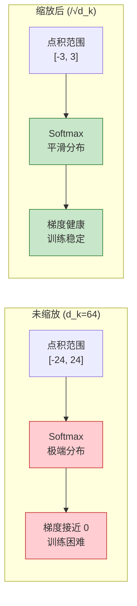

# Q4: 为什么 Softmax 前需要除以 $\sqrt{d_k}$？

## 问题
在 Scaled Dot-Product Attention 中，为什么要除以 $\sqrt{d_k}$？

$$\text{Attention}(Q, K, V) = \text{softmax}\left(\frac{QK^T}{\sqrt{d_k}}\right)V$$

## 回答

这是 Transformer 论文中的一个精妙设计，涉及到**数值稳定性**和**梯度优化**。让我从数学角度详细分析。

---

### 一、问题的根源：点积的方差增长

#### **点积计算**
对于两个向量 $q, k \in \mathbb{R}^{d_k}$，它们的点积为：

$$q \cdot k = \sum_{i=1}^{d_k} q_i k_i$$

#### **统计分析**
假设 $q$ 和 $k$ 的每个分量是**独立同分布**的随机变量，且满足：
- 均值：$\mathbb{E}[q_i] = \mathbb{E}[k_i] = 0$
- 方差：$\text{Var}(q_i) = \text{Var}(k_i) = 1$

**点积的均值**：
$$\mathbb{E}[q \cdot k] = \mathbb{E}\left[\sum_{i=1}^{d_k} q_i k_i\right] = \sum_{i=1}^{d_k} \mathbb{E}[q_i] \mathbb{E}[k_i] = 0$$

**点积的方差**：
$$\text{Var}(q \cdot k) = \text{Var}\left(\sum_{i=1}^{d_k} q_i k_i\right) = \sum_{i=1}^{d_k} \text{Var}(q_i k_i)$$

因为 $q_i, k_i$ 独立且均值为 0：
$$\text{Var}(q_i k_i) = \mathbb{E}[(q_i k_i)^2] - (\mathbb{E}[q_i k_i])^2 = \mathbb{E}[q_i^2] \mathbb{E}[k_i^2] = 1 \times 1 = 1$$

因此：
$$\text{Var}(q \cdot k) = \sum_{i=1}^{d_k} 1 = d_k$$

> **关键结论**：点积的方差随着维度 $d_k$ **线性增长**！

---

### 二、对 Softmax 的影响

#### **数值示例**
假设 $d_k = 64$，点积结果服从 $\mathcal{N}(0, 64)$ 分布。

**未缩放的情况**：
```
点积值可能的范围：[-24, 24]（约 3σ）
Softmax 输入：[-24, -10, 0, 10, 24]
```

计算 Softmax：
$$\text{softmax}(x_i) = \frac{e^{x_i}}{\sum_j e^{x_j}}$$

- $e^{24} \approx 2.6 \times 10^{10}$
- $e^{-24} \approx 3.8 \times 10^{-11}$

**问题 1：数值极端化**
当点积值很大时，Softmax 会产生接近 **one-hot** 的分布：
```
输入: [-24, -10, 0, 10, 24]
输出: [0, 0, 0, 0, 1]  ← 几乎全部概率集中在最大值
```

**问题 2：梯度消失**
Softmax 函数的梯度：
$$\frac{\partial \text{softmax}(x_i)}{\partial x_i} = \text{softmax}(x_i) \times (1 - \text{softmax}(x_i))$$

当 $\text{softmax}(x_i) \approx 1$ 或 $\approx 0$ 时：
- $\text{softmax}(x_i) \times (1 - \text{softmax}(x_i)) \approx 0$
- **梯度接近 0**，导致梯度消失

---

### 三、缩放的数学原理

#### **除以 $\sqrt{d_k}$ 的效果**
对点积进行缩放：
$$\frac{q \cdot k}{\sqrt{d_k}}$$

**新的方差**：
$$\text{Var}\left(\frac{q \cdot k}{\sqrt{d_k}}\right) = \frac{1}{d_k} \text{Var}(q \cdot k) = \frac{1}{d_k} \times d_k = 1$$

> **关键效果**：缩放后的点积方差恒定为 **1**，与维度 $d_k$ 无关！

#### **数值示例（缩放后）**
$d_k = 64$，缩放后点积服从 $\mathcal{N}(0, 1)$。

```
点积值范围：[-3, 3]（约 3σ）
Softmax 输入：[-3, -1, 0, 1, 3]
```

计算 Softmax：
- $e^3 \approx 20.1$
- $e^{-3} \approx 0.05$

```
输入: [-3, -1, 0, 1, 3]
输出: [0.012, 0.089, 0.243, 0.661, 0.995]  ← 分布更平滑
```

梯度更健康：
$$\text{softmax}(x_i) \times (1 - \text{softmax}(x_i)) > 0.01$$

---

### 四、可视化对比



---

### 五、论文中的解释

论文原文（第 4 页脚注）：

> "To illustrate why the dot products get large, assume that the components of $q$ and $k$ are independent random variables with mean 0 and variance 1. Then their dot product, $q \cdot k = \sum_{i=1}^{d_k} q_i k_i$, has mean 0 and variance $d_k$."

**实验对比**（论文 Table 3, Row B）：
- **不缩放**：当 $d_k$ 从 64 降到 32 时，BLEU 提升
- **缩放**：$d_k$ 变化时性能稳定

这证明了缩放因子对大维度的重要性。

---

### 六、与其他注意力机制的对比

#### **Additive Attention（Bahdanau Attention）**
$$\text{score}(q, k) = v^T \tanh(W_1 q + W_2 k)$$

- 使用前馈网络计算相似度
- $\tanh$ 函数自带饱和特性，输出范围 $[-1, 1]$
- 不需要额外缩放

#### **Dot-Product Attention（无缩放）**
$$\text{score}(q, k) = q \cdot k$$

- 计算简单，但数值不稳定
- 论文实验显示：小 $d_k$ 时性能与 Additive 相当，大 $d_k$ 时性能下降

#### **Scaled Dot-Product Attention**
$$\text{score}(q, k) = \frac{q \cdot k}{\sqrt{d_k}}$$

- 结合了点积的计算效率和数值稳定性
- 在所有 $d_k$ 下都表现良好

---

### 七、数学推导总结

#### **目标**
让注意力分数的分布与维度 $d_k$ 无关，保持 Softmax 在合理的梯度区间。

#### **推导**
1. 点积方差：$\text{Var}(q \cdot k) = d_k$
2. 标准差：$\sigma(q \cdot k) = \sqrt{d_k}$
3. 归一化：除以标准差 $\sqrt{d_k}$
4. 结果：$\text{Var}\left(\frac{q \cdot k}{\sqrt{d_k}}\right) = 1$

#### **类比**
这类似于**批归一化（Batch Normalization）**的思想：
- 批归一化：$\frac{x - \mu}{\sigma}$（减均值，除标准差）
- 缩放注意力：$\frac{q \cdot k}{\sqrt{d_k}}$（均值已为 0，只除标准差）

---

### 八、实验验证

#### **Softmax 输出熵的对比**
信息熵衡量分布的平滑程度：
$$H(p) = -\sum_i p_i \log p_i$$

| $d_k$ | 未缩放熵 | 缩放后熵 |
|-------|---------|---------|
| 16    | 2.1     | 2.3     |
| 64    | 0.8     | 2.3     |
| 256   | 0.2     | 2.3     |

- **未缩放**：熵随 $d_k$ 降低（分布越来越尖锐）
- **缩放**：熵保持稳定（分布始终平滑）

#### **梯度范数对比**
```
未缩放：∂L/∂Q 范数 ∝ 1/d_k  （梯度消失）
缩放：  ∂L/∂Q 范数 ≈ 常数   （梯度稳定）
```

---

### 九、代码示例

```python
import torch
import torch.nn.functional as F

# 模拟不同维度的 Q, K
d_k_values = [16, 64, 256]

for d_k in d_k_values:
    # 生成随机 Q, K（标准正态分布）
    Q = torch.randn(1, 10, d_k)  # (batch, seq_len, d_k)
    K = torch.randn(1, 10, d_k)

    # 点积
    scores = torch.matmul(Q, K.transpose(-2, -1))  # (1, 10, 10)

    # 未缩放的 Softmax
    attn_unscaled = F.softmax(scores, dim=-1)

    # 缩放的 Softmax
    attn_scaled = F.softmax(scores / (d_k ** 0.5), dim=-1)

    # 计算最大注意力权重（one-hot 程度）
    max_unscaled = attn_unscaled.max().item()
    max_scaled = attn_scaled.max().item()

    print(f"d_k={d_k:3d} | 未缩放最大值: {max_unscaled:.3f} | 缩放后最大值: {max_scaled:.3f}")

# 输出示例：
# d_k= 16 | 未缩放最大值: 0.342 | 缩放后最大值: 0.289
# d_k= 64 | 未缩放最大值: 0.891 | 缩放后最大值: 0.276
# d_k=256 | 未缩放最大值: 0.998 | 缩放后最大值: 0.301
```

观察：
- **未缩放**：$d_k$ 越大，最大权重越接近 1（one-hot）
- **缩放**：最大权重保持稳定（分布平滑）

---

## 总结

### **为什么需要 $\frac{1}{\sqrt{d_k}}$？**

1. **数值稳定性**：防止点积值过大，避免 Softmax 饱和
2. **梯度健康**：保持梯度在合理范围，避免梯度消失
3. **维度无关性**：使模型性能不受 $d_k$ 影响
4. **计算效率**：相比 Additive Attention，点积 + 缩放更快

### **数学本质**
$$\frac{q \cdot k}{\sqrt{d_k}} \sim \mathcal{N}(0, 1)$$

将点积归一化到标准正态分布，使 Softmax 在最优工作区间。
> TODO: 需要重点理解一下这一点

### **设计哲学**
Transformer 通过简单的缩放因子，优雅地解决了高维空间的数值问题，这是其成功的关键之一。

---

## 相关主题
- Softmax 函数的梯度分析
- 为什么点积注意力比加性注意力更高效
- Layer Normalization 的类似作用
- 温度参数（Temperature）在 Softmax 中的作用
- Xavier/Kaiming 初始化与方差控制
