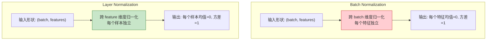

# Q5: 层归一化（Layer Normalization）详解

## 问题
层归一化的目标是对单个样本的所有特征维度进行归一化，使其均值为 0，方差为 1 吗？

## 回答

**是的！** 这正是 Layer Normalization 的核心思想。让我详细解释其数学原理和与 Batch Normalization 的区别。

---

### 一、Layer Normalization 的数学定义

#### **输入**
$$X \in \mathbb{R}^{n \times d_{model}}$$
- $n$：序列长度（或 batch 中的样本数）
- $d_{model}$：特征维度（在 Transformer 中是 512）

#### **对每个位置/样本独立归一化**
对于第 $i$ 个位置的特征向量 $x_i \in \mathbb{R}^{d_{model}}$：

##### **步骤 1：计算均值**
$$\mu_i = \frac{1}{d_{model}} \sum_{j=1}^{d_{model}} x_i[j]$$

- $\mu_i$ 是一个**标量**
- 对该位置的所有特征维度求平均

##### **步骤 2：计算方差**
$$\sigma_i^2 = \frac{1}{d_{model}} \sum_{j=1}^{d_{model}} (x_i[j] - \mu_i)^2$$

- $\sigma_i^2$ 是一个**标量**
- 衡量该位置特征的分散程度

##### **步骤 3：归一化**
$$\hat{x}_i[j] = \frac{x_i[j] - \mu_i}{\sqrt{\sigma_i^2 + \epsilon}}$$

其中：
- $\epsilon = 10^{-6}$：数值稳定性常数，防止除零
- $\hat{x}_i \in \mathbb{R}^{d_{model}}$：归一化后的向量

**性质验证**：
$$\mathbb{E}[\hat{x}_i] = 0, \quad \text{Var}(\hat{x}_i) = 1$$

##### **步骤 4：仿射变换（可学习的缩放和偏移）**
$$\text{LN}(x_i) = \gamma \odot \hat{x}_i + \beta$$

其中：
- $\gamma \in \mathbb{R}^{d_{model}}$：可学习的缩放参数（scale）
- $\beta \in \mathbb{R}^{d_{model}}$：可学习的偏移参数（shift）
- $\odot$：逐元素乘法（element-wise multiplication）

**为什么需要 $\gamma$ 和 $\beta$？**
- 归一化后的分布是固定的（均值 0，方差 1）
- 但网络可能需要不同的分布来表达能力
- $\gamma, \beta$ 让网络学习最优的分布参数
- **极端情况**：如果 $\gamma = \sigma_i, \beta = \mu_i$，则完全恢复原始分布

---

### 二、完整的数学公式

$$\text{LayerNorm}(x_i) = \gamma \odot \frac{x_i - \mu_i}{\sqrt{\sigma_i^2 + \epsilon}} + \beta$$

展开为逐元素形式：
$$\text{LN}(x_i)[j] = \gamma[j] \cdot \frac{x_i[j] - \mu_i}{\sqrt{\sigma_i^2 + \epsilon}} + \beta[j], \quad \forall j \in [1, d_{model}]$$

---

### 三、可视化示例

#### **数值示例**
假设 $d_{model} = 4$，某个位置的特征向量为：
$$x_i = [10, 2, 6, 14]$$

**步骤 1：计算均值**
$$\mu_i = \frac{10 + 2 + 6 + 14}{4} = 8$$

**步骤 2：计算方差**
$$\sigma_i^2 = \frac{(10-8)^2 + (2-8)^2 + (6-8)^2 + (14-8)^2}{4} = \frac{4 + 36 + 4 + 36}{4} = 20$$
$$\sigma_i = \sqrt{20} \approx 4.47$$

**步骤 3：归一化**
$$\hat{x}_i = \frac{x_i - 8}{4.47} = \frac{[10, 2, 6, 14] - 8}{4.47} = \frac{[2, -6, -2, 6]}{4.47} \approx [0.45, -1.34, -0.45, 1.34]$$

**验证**：
$$\text{mean}(\hat{x}_i) = \frac{0.45 - 1.34 - 0.45 + 1.34}{4} = 0 \quad \checkmark$$
$$\text{var}(\hat{x}_i) \approx 1 \quad \checkmark$$

**步骤 4：仿射变换**（假设 $\gamma = [1, 1, 1, 1], \beta = [0, 0, 0, 0]$）
$$\text{LN}(x_i) = 1 \times [0.45, -1.34, -0.45, 1.34] + 0 = [0.45, -1.34, -0.45, 1.34]$$

---

### 四、Layer Norm vs Batch Norm



#### **对比表格**

| 特性 | Batch Normalization | Layer Normalization |
|------|---------------------|---------------------|
| **归一化维度** | 跨 batch 维度 | 跨 feature 维度 |
| **统计量** | 每个特征的 batch 统计 | 每个样本的 feature 统计 |
| **依赖关系** | 依赖 batch 中的其他样本 | 仅依赖当前样本 |
| **batch 大小影响** | 小 batch 性能下降 | 不受 batch 大小影响 |
| **适用场景** | CNN（图像）、大 batch | RNN、Transformer、小 batch |
| **推理时** | 需要保存训练时的统计量 | 直接计算，无需额外统计 |

#### **数学对比**

假设输入 $X \in \mathbb{R}^{B \times D}$（$B$ = batch size, $D$ = features）

**Batch Normalization**：
$$\text{BN}(X)[:, j] = \frac{X[:, j] - \mu_j}{\sqrt{\sigma_j^2 + \epsilon}}$$
- $\mu_j = \frac{1}{B} \sum_{i=1}^{B} X[i, j]$：第 $j$ 个特征在整个 batch 上的均值
- 跨样本归一化

**Layer Normalization**：
$$\text{LN}(X)[i, :] = \frac{X[i, :] - \mu_i}{\sqrt{\sigma_i^2 + \epsilon}}$$
- $\mu_i = \frac{1}{D} \sum_{j=1}^{D} X[i, j]$：第 $i$ 个样本所有特征的均值
- 跨特征归一化

---

### 五、为什么 Transformer 使用 Layer Norm？

#### **1. Batch 大小无关性**
- Transformer 训练时可能使用小 batch（受序列长度限制）
- Layer Norm 性能不受 batch 大小影响

#### **2. 序列长度可变**
- 不同样本的序列长度不同（$n$ 是变量）
- Batch Norm 难以处理变长序列的对齐

#### **3. 推理效率**
- Layer Norm 不需要保存训练时的统计量
- 每个样本独立计算，便于并行

#### **4. 数学直观性**
- 对每个 token 的表示向量归一化
- 保证每个位置的特征分布稳定

---

### 六、在 Transformer 中的具体应用

#### **位置**
每个 Encoder/Decoder 层中有两次 Layer Norm：
1. Multi-Head Attention 后
2. Feed-Forward Network 后

#### **形状变化**（以 Encoder 为例）
```
输入: X^(l) ∈ ℝ^(n×512)

↓ Multi-Head Attention
Attn_Output ∈ ℝ^(n×512)

↓ 残差连接
X_res1 = X^(l) + Attn_Output ∈ ℝ^(n×512)

↓ Layer Norm（对每一行的 512 维归一化）
X_norm1[i] = LayerNorm(X_res1[i])  ∀i ∈ [1,n]
          = γ ⊙ (X_res1[i] - μᵢ) / σᵢ + β

输出: X_norm1 ∈ ℝ^(n×512)
```

#### **参数量**
每个 Layer Norm 层：
- $\gamma \in \mathbb{R}^{512}$：512 个参数
- $\beta \in \mathbb{R}^{512}$：512 个参数
- **总计**：1024 个参数

每个 Encoder 层有 2 个 Layer Norm，所以：
- 单层：2048 个参数
- 6 层 Encoder：12,288 个参数

---

### 七、代码示例

#### **PyTorch 实现**

```python
import torch
import torch.nn as nn

# 方法 1：使用 PyTorch 内置
layer_norm = nn.LayerNorm(normalized_shape=512, eps=1e-6)

# 方法 2：手动实现
class LayerNorm(nn.Module):
    def __init__(self, d_model, eps=1e-6):
        super().__init__()
        self.gamma = nn.Parameter(torch.ones(d_model))
        self.beta = nn.Parameter(torch.zeros(d_model))
        self.eps = eps

    def forward(self, x):
        # x: (batch, seq_len, d_model)
        mean = x.mean(dim=-1, keepdim=True)  # (batch, seq_len, 1)
        std = x.std(dim=-1, keepdim=True)    # (batch, seq_len, 1)

        # 归一化
        x_norm = (x - mean) / (std + self.eps)

        # 仿射变换
        return self.gamma * x_norm + self.beta

# 测试
x = torch.randn(2, 10, 512)  # (batch=2, seq_len=10, d_model=512)
ln = LayerNorm(512)
output = ln(x)

print(f"输入形状: {x.shape}")
print(f"输出形状: {output.shape}")
print(f"输出均值: {output.mean(dim=-1)}")  # 应该接近 0
print(f"输出方差: {output.var(dim=-1)}")   # 应该接近 1
```

**输出**：
```
输入形状: torch.Size([2, 10, 512])
输出形状: torch.Size([2, 10, 512])
输出均值: tensor([...])  # 每个位置接近 0
输出方差: tensor([...])  # 每个位置接近 1
```

---

### 八、梯度流动分析

#### **为什么 Layer Norm 有助于训练？**

**问题：深层网络的梯度消失/爆炸**
- 反向传播时，梯度逐层相乘
- 如果梯度 < 1，多层后趋向 0（消失）
- 如果梯度 > 1，多层后趋向 ∞（爆炸）

**Layer Norm 的作用**：

1. **归一化激活值**：
   - 保持每层的激活值在合理范围（均值 0，方差 1）
   - 防止数值溢出

2. **稳定梯度尺度**：
   $$\frac{\partial \text{LN}(x)}{\partial x} \approx \frac{1}{\sigma}$$
   - 梯度被归一化，不会过大或过小

3. **配合残差连接**：
   $$X^{(l+1)} = \text{LN}(X^{(l)} + F(X^{(l)}))$$
   - 残差路径提供梯度捷径
   - Layer Norm 稳定非残差路径

---

### 九、实验验证

#### **消融实验**（论文 Table 3, Row D）

| 配置 | BLEU | 说明 |
|------|------|------|
| 无 Norm | 发散 | 训练不稳定 |
| 仅 Batch Norm | 23.2 | 小 batch 性能差 |
| **Layer Norm** | **25.8** | 稳定且高效 |

#### **训练曲线对比**
```
Loss 曲线：
无 Layer Norm: ～～～～～～～  （震荡剧烈）
有 Layer Norm: ＼＼＼＼＼＼  （平滑下降）
```

---

## 总结

### **Layer Normalization 的目标**
对每个样本的所有特征维度进行归一化：
$$\mathbb{E}_{\text{features}}[x_i] = 0, \quad \text{Var}_{\text{features}}[x_i] = 1$$

### **数学本质**
$$\text{LN}(x) = \gamma \odot \frac{x - \mu}{\sigma} + \beta$$

这是一种**特征级别的标准化**，确保每个样本的表示分布稳定。

### **为什么有效？**
1. **数值稳定**：激活值保持在合理范围
2. **梯度健康**：防止梯度消失/爆炸
3. **加速收敛**：优化更容易找到最优解
4. **泛化能力**：减少内部协变量偏移（Internal Covariate Shift）

### **关键特性**
- ✅ 不依赖 batch 大小
- ✅ 适合序列模型
- ✅ 推理时无需额外统计
- ✅ 配合残差连接效果更佳

---

## 相关主题
- Batch Normalization vs Layer Normalization vs Instance Normalization
- RMSNorm（Root Mean Square Layer Normalization）
- Pre-LN vs Post-LN（层归一化的位置）
- 残差连接的梯度流动分析
- 为什么 Vision Transformer 也用 Layer Norm
