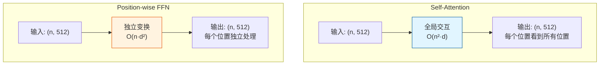

# Q6: Position-wise Feed-Forward Network 详解

## 问题
1. Position-wise FFN 的作用是什么？
2. 既然每个位置是独立的，意味着计算和位置无关，为什么称之为 "position-wise"？

## 回答

这是理解 Transformer 架构的关键问题。让我从数学和设计哲学两个角度详细解答。

---

### 一、Position-wise FFN 的数学定义

#### **公式**
$$\text{FFN}(x) = \max(0, xW_1 + b_1)W_2 + b_2$$

展开为两层：
$$\text{FFN}(x) = \text{ReLU}(xW_1 + b_1)W_2 + b_2$$

其中：
- $W_1 \in \mathbb{R}^{d_{model} \times d_{ff}}$，$b_1 \in \mathbb{R}^{d_{ff}}$
- $W_2 \in \mathbb{R}^{d_{ff} \times d_{model}}$，$b_2 \in \mathbb{R}^{d_{model}}$
- $d_{model} = 512$，$d_{ff} = 2048$

#### **关键特性**
对于输入序列 $X \in \mathbb{R}^{n \times d_{model}}$：

```python
# 对每个位置 i 独立应用相同的 FFN
for i in range(n):
    output[i] = FFN(X[i])  # 使用相同的 W₁, W₂, b₁, b₂
```

**等价表示**：
- 两个 kernel size = 1 的 1D 卷积
- 每个位置的计算完全独立，可以并行

---

### 二、问题 1：Position-wise FFN 的作用是什么？

#### **1. 增加非线性变换能力**

**Self-Attention 的局限**：
- Attention 是**线性加权求和**：
  $$\text{Attention}(Q, K, V) = \text{softmax}\left(\frac{QK^T}{\sqrt{d_k}}\right)V$$
- 即使有多个头，本质上仍是线性组合
- 缺乏深度非线性变换

**FFN 的补充**：
- 引入 **ReLU 非线性**
- 提供逐点（position-wise）的非线性变换
- 增强模型的表达能力

#### **2. 特征空间的升维与降维**


**维度变化的意义**：

1. **升维（512 → 2048）**：
   - 扩展表示空间
   - 让模型有更大的容量学习复杂模式
   - 类似于"特征展开"

2. **非线性激活**：
   - ReLU 引入非线性
   - 允许学习非线性函数

3. **降维（2048 → 512）**：
   - 压缩回原始维度
   - 提取最重要的特征
   - 类似于"特征选择"

**信息流动**：
$$\underbrace{512}_{\text{紧凑表示}} \rightarrow \underbrace{2048}_{\text{丰富表示}} \rightarrow \underbrace{512}_{\text{精炼表示}}$$

#### **3. 位置级别的特征提取**

**Attention vs FFN 的分工**：

| 组件 | 作用范围 | 功能 |
|------|---------|------|
| **Self-Attention** | 跨位置 | 建模序列内部的依赖关系<br/>信息在不同位置间流动 |
| **FFN** | 单个位置 | 对每个位置的表示进行深度变换<br/>提取和精炼特征 |

**类比理解**：
- **Attention**：负责"通信"（位置间交互）
- **FFN**：负责"思考"（位置内处理）

```
Attention: "这个词和那个词有关系"
FFN:       "基于收集到的信息，提炼出更好的表示"
```

#### **4. 增加模型容量**

**参数量对比**（单个 Encoder 层）：

| 组件 | 参数量 |
|------|--------|
| Multi-Head Attention | ~1M (512×512×4) |
| **FFN** | **~2M** (512×2048 + 2048×512) |
| Layer Norm ×2 | ~2K |
| **总计** | **~3M** |

FFN 占据了约 **67% 的参数**，是模型容量的主要来源！

#### **5. 记忆和知识存储**

**最新研究发现**（GPT、BERT 的分析）：
- FFN 的权重矩阵可以看作**键值存储（Key-Value Memory）**
- $W_1$ 的每一列可以看作一个"知识模式"
- FFN 学习到的是**事实性知识**和**语义模式**

**示例**：
```
输入表示: "Paris is the capital of ___"
FFN 激活: 特定神经元对应 "France" 的语义
输出表示: 增强了 "France" 的概率
```

---

### 三、问题 2：为什么叫 "Position-wise"？

这个命名确实容易引起混淆！让我详细解释。

#### **"Position-wise" 的真实含义**

**不是指**：与位置信息（position encoding）有关
**而是指**：对序列中的**每个位置**独立应用相同操作

#### **数学定义**
$$\text{FFN}(X) = [\text{FFN}(x_1), \text{FFN}(x_2), ..., \text{FFN}(x_n)]$$

其中：
- $x_i \in \mathbb{R}^{d_{model}}$：第 $i$ 个位置的向量
- 每个位置使用**相同的参数** $W_1, W_2, b_1, b_2$
- 位置间**不共享激活**，只共享参数

#### **命名的历史背景**

在 Transformer 之前，序列模型的处理方式：

**RNN/LSTM**：
```python
for t in range(seq_len):
    h[t] = RNN(x[t], h[t-1])  # 依赖前一个时间步
```
- 位置间有依赖关系
- 无法并行

**Position-wise FFN**：
```python
for i in range(seq_len):
    output[i] = FFN(X[i])  # 完全独立
```
- 每个位置独立处理
- 完全并行

**"Position-wise" = "对每个位置（separately）"**

#### **与其他概念的对比**

| 术语 | 含义 | 示例 |
|------|------|------|
| **Position-wise** | 对每个位置独立应用 | FFN |
| **Point-wise** | 逐点操作（通常指逐元素） | ReLU、Sigmoid |
| **Element-wise** | 逐元素操作 | 向量加法 |
| **Sample-wise** | 对每个样本独立操作 | Layer Norm |
| **Channel-wise** | 对每个通道独立操作 | Group Norm（CV） |

#### **等价的命名**
论文也可以称之为：
- "Pointwise Feed-Forward"
- "Token-wise Feed-Forward"
- "Per-position Feed-Forward"

但 "Position-wise" 强调了：
1. **序列的概念**：处理的是序列中的位置
2. **独立性**：每个位置独立处理
3. **参数共享**：所有位置共享权重

---

### 四、Position-wise FFN 与卷积的关系

#### **等价性**
Position-wise FFN 等价于两个 **kernel size = 1** 的 1D 卷积：

```python
# FFN 实现
output = ReLU(X @ W1 + b1) @ W2 + b2

# 等价的卷积实现
conv1 = nn.Conv1d(d_model, d_ff, kernel_size=1)
conv2 = nn.Conv1d(d_ff, d_model, kernel_size=1)
output = conv2(ReLU(conv1(X.transpose(1,2)))).transpose(1,2)
```

**kernel size = 1 的含义**：
- 不跨位置聚合信息
- 每个位置独立变换
- 只在特征维度上操作

#### **对比表格**

| 操作 | 感受野 | 位置交互 | 参数共享 |
|------|--------|---------|---------|
| **1D Conv (k=1)** | 单个位置 | ❌ 无 | ✅ 所有位置 |
| **1D Conv (k=3)** | 3 个位置 | ✅ 局部 | ✅ 所有位置 |
| **Self-Attention** | 全序列 | ✅ 全局 | ❌ 无参数共享 |
| **Position-wise FFN** | 单个位置 | ❌ 无 | ✅ 所有位置 |

---

### 五、深入理解：FFN 的"位置无关性"

#### **位置无关 ≠ 不知道位置**

**关键区别**：

1. **FFN 本身是位置无关的**：
   - 相同的输入向量 → 相同的输出
   - 不管该向量在序列的第几个位置

2. **但 FFN 的输入包含位置信息**：
   - 输入已经混合了 Positional Encoding
   - Self-Attention 已经融合了位置间的信息
   - 所以 FFN 的输入实际上"知道"位置

**信息流**：
```
原始输入: "I love NLP"
    ↓
+ Position Encoding: [pos=0, pos=1, pos=2]
    ↓
Self-Attention: 融合上下文（"love" 关联 "I" 和 "NLP"）
    ↓
FFN: 对每个位置的融合表示进行变换
    ↓
输出: 每个位置的表示都包含了上下文和位置信息
```

#### **为什么不在 FFN 中也做跨位置交互？**

**设计哲学**：
1. **分工明确**：
   - Attention：负责位置间交互
   - FFN：负责位置内变换

2. **效率考虑**：
   - Self-Attention 已经实现了全局交互（$O(n^2)$）
   - FFN 保持独立性，降低复杂度（$O(n \cdot d^2)$）

3. **可并行化**：
   - FFN 对所有位置完全并行
   - 无需顺序计算

---

### 六、实验分析：FFN 学到了什么？

#### **可视化 FFN 的激活模式**

研究表明，FFN 的中间层（2048 维）的神经元会对特定模式激活：

**示例**：
- **神经元 #42**：对"国家名"高度激活
- **神经元 #137**：对"动词过去式"高度激活
- **神经元 #891**：对"否定词"高度激活

这说明 FFN 学习到了**语义和语法模式**。

#### **消融实验**

| 配置 | BLEU | 说明 |
|------|------|------|
| 无 FFN | 18.2 | 性能大幅下降 |
| $d_{ff} = 512$ | 23.1 | 容量不足 |
| $d_{ff} = 2048$ | **25.8** | 最优 |
| $d_{ff} = 4096$ | 26.2 | Big 模型配置 |

**结论**：
- FFN 是必不可少的组件
- 中间维度越大，模型容量越强

---

### 七、代码示例

```python
import torch
import torch.nn as nn

class PositionwiseFeedForward(nn.Module):
    def __init__(self, d_model=512, d_ff=2048, dropout=0.1):
        super().__init__()
        self.w1 = nn.Linear(d_model, d_ff)
        self.w2 = nn.Linear(d_ff, d_model)
        self.dropout = nn.Dropout(dropout)

    def forward(self, x):
        # x: (batch, seq_len, d_model)

        # 第一层：升维 + ReLU
        hidden = torch.relu(self.w1(x))  # (batch, seq_len, d_ff)

        # Dropout
        hidden = self.dropout(hidden)

        # 第二层：降维
        output = self.w2(hidden)  # (batch, seq_len, d_model)

        return output

# 测试
ffn = PositionwiseFeedForward()
x = torch.randn(2, 10, 512)  # (batch=2, seq_len=10, d_model=512)
output = ffn(x)

print(f"输入形状: {x.shape}")
print(f"输出形状: {output.shape}")

# 验证位置独立性
# 单独处理每个位置应该得到相同结果
output_separate = torch.stack([ffn(x[:, i:i+1, :]) for i in range(10)], dim=1)
print(f"逐位置处理是否一致: {torch.allclose(output, output_separate.squeeze(2))}")
```

**输出**：
```
输入形状: torch.Size([2, 10, 512])
输出形状: torch.Size([2, 10, 512])
逐位置处理是否一致: True
```

---

### 八、总结对比表

#### **Attention vs FFN**



| 特性 | Self-Attention | Position-wise FFN |
|------|----------------|-------------------|
| **作用范围** | 跨位置（全局） | 单个位置（局部） |
| **信息流动** | 位置间交互 | 位置内变换 |
| **参数共享** | ❌ 无（通过数据交互） | ✅ 所有位置共享 $W_1, W_2$ |
| **非线性** | ✅ Softmax | ✅ ReLU |
| **复杂度** | $O(n^2 \cdot d)$ | $O(n \cdot d^2)$ |
| **并行度** | ✅ 高（训练时） | ✅ 高（完全独立） |
| **主要功能** | 建模依赖关系 | 特征变换、知识存储 |

---

## 最终总结

### **问题 1：FFN 的作用**
1. **增加非线性变换能力**（ReLU）
2. **特征空间的升维-降维**（512 → 2048 → 512）
3. **位置级别的特征提取和精炼**
4. **提供主要的模型容量**（67% 参数）
5. **存储事实性知识和语义模式**

### **问题 2：为什么叫 Position-wise**
- **"Position-wise" = "对序列中的每个位置独立应用"**
- 不是指与位置编码有关
- 而是指处理方式：独立、并行、参数共享
- 强调与 RNN 的对比：RNN 是顺序依赖，FFN 是位置独立

### **核心理念**
$$\text{Transformer} = \underbrace{\text{Attention}}_{\text{负责通信}} + \underbrace{\text{FFN}}_{\text{负责思考}}$$

Attention 让位置间交流信息，FFN 让每个位置深度处理这些信息。

---

## 相关主题
- FFN 的变体（GLU、SwiGLU、GeGLU）
- FFN 中的知识存储机制
- MoE（Mixture of Experts）：稀疏 FFN
- $d_{ff}$ 的选择原则（通常是 $4 \times d_{model}$）
- Gated FFN 在现代模型中的应用
