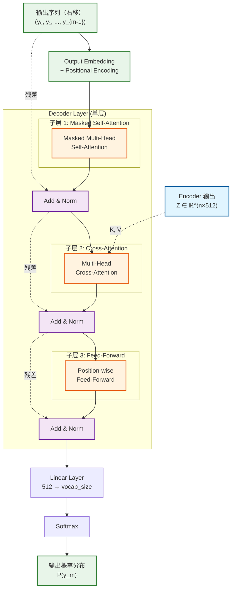
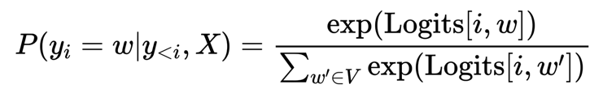

# Q7: Decoder 层详解

## 问题
请详细介绍 Decoder 层的结构、各个子层的输入输出格式和数学公式。

## 回答

Decoder 是 Transformer 的生成部分，负责根据 Encoder 的输出和已生成的内容，自回归地生成目标序列。它比 Encoder 多了一个关键组件：**Masked Self-Attention** 和 **Cross-Attention**。

---

### 一、Decoder 整体结构



#### **关键特点**
- **6 层堆叠**（$N=6$），与 Encoder 相同
- **每层 3 个子层**（比 Encoder 多 1 个）
- **自回归生成**：当前位置只能看到之前的位置
- **双输入源**：自身的历史输出 + Encoder 的编码表示

---

### 二、输入准备：Output Embedding + Positional Encoding

#### **训练时的输入**
目标序列 $(y_1, y_2, ..., y_m)$，需要**右移（shifted right）**：

$$\text{Decoder 输入} = (y_0, y_1, ..., y_{m-1})$$

其中 $y_0$ 是特殊的开始标记 `<START>` 或 `<BOS>`。

**示例**：
```
目标序列:    I  love  NLP  <EOS>
Decoder 输入: <START>  I  love  NLP
Decoder 输出: I  love  NLP  <EOS>
```

#### **Embedding 和 Positional Encoding**
与 Encoder 完全相同的处理：

$$Y^{(0)} = \text{Embedding}(y_0, ..., y_{m-1}) \times \sqrt{d_{model}} + PE$$

其中：
- $Y^{(0)} \in \mathbb{R}^{m \times d_{model}}$
- $m$：目标序列长度
- 使用与 Encoder **共享的 Embedding 矩阵**（权重绑定）

---

### 三、子层 1：Masked Multi-Head Self-Attention

#### **目的**
确保位置 $i$ 的预测**只能依赖于位置 $< i$ 的信息**，防止"看到未来"。

#### **输入格式**
$$Y^{(l)} \in \mathbb{R}^{m \times d_{model}}$$

#### **计算步骤**

##### **步骤 1：生成 Q, K, V**
与 Encoder 的 Self-Attention 相同：

$$Q = Y^{(l)} W^Q \in \mathbb{R}^{m \times d_{model}}$$
$$K = Y^{(l)} W^K \in \mathbb{R}^{m \times d_{model}}$$
$$V = Y^{(l)} W^V \in \mathbb{R}^{m \times d_{model}}$$

##### **步骤 2：计算注意力分数**
$$S = \frac{QK^T}{\sqrt{d_k}} \in \mathbb{R}^{m \times m}$$

##### **步骤 3：应用掩码（关键！）**
创建一个**下三角掩码矩阵**：

$$\text{Mask} = \begin{bmatrix}
0 & -\infty & -\infty & -\infty \\
0 & 0 & -\infty & -\infty \\
0 & 0 & 0 & -\infty \\
0 & 0 & 0 & 0
\end{bmatrix} \in \mathbb{R}^{m \times m}$$

或用布尔形式表示：
$$\text{Mask}[i, j] = \begin{cases}
0 & \text{if } j \leq i \\
-\infty & \text{if } j > i
\end{cases}$$

**应用掩码**：
$$S_{\text{masked}} = S + \text{Mask}$$

**效果**：
- 当 $j > i$ 时，$S[i,j] + (-\infty) = -\infty$
- Softmax 后：$e^{-\infty} = 0$
- 位置 $i$ 对未来位置 $j$ 的注意力权重为 **0**

**数值示例**（$m=4$）：
```
原始分数矩阵 S:
[[2.1, 3.5, 1.8, 2.9],
 [1.2, 4.3, 2.1, 3.7],
 [0.8, 1.5, 3.2, 2.4],
 [2.3, 1.9, 2.7, 4.1]]

加掩码后 S_masked:
[[2.1,  -∞,  -∞,  -∞],
 [1.2, 4.3,  -∞,  -∞],
 [0.8, 1.5, 3.2,  -∞],
 [2.3, 1.9, 2.7, 4.1]]
```

##### **步骤 4：Softmax 归一化**
$$A = \text{softmax}(S_{\text{masked}}) \in \mathbb{R}^{m \times m}$$

对每一行：
$$A[i, j] = \begin{cases}
\frac{\exp(S[i,j])}{\sum_{k=1}^{i} \exp(S[i,k])} & \text{if } j \leq i \\
0 & \text{if } j > i
\end{cases}$$

**示例**（Softmax 后）：
```
注意力矩阵 A:
[[1.0,  0,    0,    0  ],    ← 第 1 个位置只能看自己
 [0.2, 0.8,  0,    0  ],    ← 第 2 个位置看前 2 个
 [0.1, 0.3, 0.6,  0  ],    ← 第 3 个位置看前 3 个
 [0.15,0.25,0.3, 0.3]]    ← 第 4 个位置看全部 4 个
```

**关键观察**：
- 上三角全为 0（未来信息被屏蔽）
- 每行和为 1（概率分布）
- 下三角保留了对过去的注意力

##### **步骤 5：加权求和**
$$\text{MaskedAttn\_Output} = AV \in \mathbb{R}^{m \times d_{model}}$$

#### **输出格式**
$$\text{MaskedAttn\_Output} \in \mathbb{R}^{m \times d_{model}}$$

#### **为什么需要 Masking？**

**训练时**：
- 我们一次性输入整个目标序列：`<START> I love NLP`
- 但要模拟**自回归生成**的过程
- 预测 `love` 时不能看到 `NLP`
- Masking 确保这一约束

**推理时**：
- 实际上是逐个生成，天然满足约束
- 但为了与训练一致，仍使用 Masking

---

### 四、Add & Norm 1

#### **计算**
$$Y_1 = \text{LayerNorm}(Y^{(l)} + \text{MaskedAttn\_Output})$$

#### **输出格式**
$$Y_1 \in \mathbb{R}^{m \times d_{model}}$$

---

### 五、子层 2：Multi-Head Cross-Attention（编码器-解码器注意力）

这是 Decoder 的**核心创新**，连接 Encoder 和 Decoder。

#### **输入格式**
- **来自 Decoder**：$Y_1 \in \mathbb{R}^{m \times d_{model}}$（上一子层的输出）
- **来自 Encoder**：$Z \in \mathbb{R}^{n \times d_{model}}$（Encoder 的最终输出）

#### **计算步骤**

##### **步骤 1：生成 Q, K, V**

**关键区别**：
- **Query (Q)**：来自 **Decoder** 的当前表示
- **Key (K)** 和 **Value (V)**：来自 **Encoder** 的输出

$$Q = Y_1 W^Q \in \mathbb{R}^{m \times d_{model}}$$
$$K = Z W^K \in \mathbb{R}^{n \times d_{model}}$$
$$V = Z W^V \in \mathbb{R}^{n \times d_{model}}$$

**维度注意**：
- $Q$ 的长度是 $m$（目标序列长度）
- $K, V$ 的长度是 $n$（源序列长度）
- $m \neq n$ 是允许的！

##### **步骤 2：计算注意力分数**
$$S = \frac{QK^T}{\sqrt{d_k}} \in \mathbb{R}^{m \times n}$$

**维度推导**：
- $Q \in \mathbb{R}^{m \times d_k}$
- $K^T \in \mathbb{R}^{d_k \times n}$
- $QK^T \in \mathbb{R}^{m \times n}$

##### **步骤 3：Softmax 归一化（无掩码）**
$$A = \text{softmax}(S) \in \mathbb{R}^{m \times n}$$

**重要**：这里**不需要 Masking**！
- Decoder 的每个位置可以看到 Encoder 的**所有位置**
- 因为 Encoder 的输出是固定的，没有"未来"的概念

**注意力矩阵的含义**：
- $A[i, j]$：Decoder 的第 $i$ 个位置对 Encoder 的第 $j$ 个位置的关注度
- 每行和为 1

##### **步骤 4：加权求和**
$$\text{CrossAttn\_Output} = AV \in \mathbb{R}^{m \times d_v}$$

**维度推导**：
- $A \in \mathbb{R}^{m \times n}$
- $V \in \mathbb{R}^{n \times d_v}$
- $AV \in \mathbb{R}^{m \times d_v}$

#### **输出格式**
$$\text{CrossAttn\_Output} \in \mathbb{R}^{m \times d_{model}}$$

#### **Cross-Attention 的作用**

**语义理解**：
```
源句子（Encoder）: "I love natural language processing"
目标句子（Decoder）: "我 爱 自然 语言 处理"

当生成"自然"时：
- Query: "自然"的当前表示
- Key/Value: ["I", "love", "natural", "language", "processing"]
- Attention: "自然" 应该高度关注 "natural"
```

**注意力矩阵示例**（机器翻译）：
```
       I    love  natural  language  processing
我    0.8   0.1    0.05     0.03      0.02
爱    0.1   0.8    0.05     0.03      0.02
自然  0.05  0.05   0.7      0.15      0.05
语言  0.03  0.03   0.2      0.7       0.04
处理  0.02  0.02   0.05     0.1       0.81
```

对角线附近的高权重表示对齐（alignment）。

---
### 六、Add & Norm 2

#### **计算**
$$Y_2 = \text{LayerNorm}(Y_1 + \text{CrossAttn\_Output})$$

#### **输出格式**
$$Y_2 \in \mathbb{R}^{m \times d_{model}}$$

---

### 七、子层 3：Position-wise Feed-Forward Network

#### **计算**
与 Encoder 的 FFN 完全相同：

$$\text{FFN}(x) = \max(0, xW_1 + b_1)W_2 + b_2$$

$$\text{FFN\_Output} = \text{FFN}(Y_2) \in \mathbb{R}^{m \times d_{model}}$$

---
### 八、Add & Norm 3

#### **计算**
$$Y^{(l+1)} = \text{LayerNorm}(Y_2 + \text{FFN\_Output})$$

#### **输出格式**
$$Y^{(l+1)} \in \mathbb{R}^{m \times d_{model}}$$

这是第 $l$ 层 Decoder 的最终输出，也是第 $l+1$ 层的输入。

---

### 九、多层堆叠（N=6 层）

$$Y^{(0)} = \text{Embedding}(y_0, ..., y_{m-1}) + PE$$
$$Y^{(1)} = \text{DecoderLayer}(Y^{(0)}, Z)$$
$$Y^{(2)} = \text{DecoderLayer}(Y^{(1)}, Z)$$
$$\vdots$$
$$Y^{(6)} = \text{DecoderLayer}(Y^{(5)}, Z)$$

其中 $Z$ 是 Encoder 的输出，在所有 Decoder 层中共享。

---
### 十、输出层：Linear + Softmax

#### **Linear 变换**
将 Decoder 的输出映射到词汇表大小：

$$\text{Logits} = Y^{(6)} W_{\text{out}} + b_{\text{out}}$$

其中：
- $W_{\text{out}} \in \mathbb{R}^{d_{model} \times |V|}$
- $|V|$：词汇表大小（例如 30,000）
- $\text{Logits} \in \mathbb{R}^{m \times |V|}$

**权重绑定**（Weight Tying）：
论文中，$W_{\text{out}}$ 与 Output Embedding 矩阵共享（转置后）：
$$W_{\text{out}} = W_{\text{embed}}^T$$

#### **Softmax**
对每个位置独立应用 Softmax：




```
$$P(y_i | y_{<i}, X) = \text{softmax}(\text{Logits}[i]) \in \mathbb{R}^{|V|}$$
$$P(y_i = w | y_{<i}, X) = \frac{\exp(\text{Logits}[i, w])}{\sum_{w' \in V} \exp(\text{Logits}[i, w'])}$$
```

#### **输出格式**
- **训练时**：输出整个序列的概率分布 $\in \mathbb{R}^{m \times |V|}$
- **推理时**：每次只输出下一个 token 的概率分布 $\in \mathbb{R}^{|V|}$
---

### 十一、训练 vs 推理的区别

#### **训练时（Teacher Forcing）**

```python
# 一次性输入整个目标序列（右移）
decoder_input = ["<START>", "I", "love", "NLP"]
decoder_output = decoder(decoder_input, encoder_output)

# 输出形状: (batch, seq_len=4, vocab_size)
# 并行计算所有位置的预测

# 损失计算：与真实目标对比
target = ["I", "love", "NLP", "<EOS>"]
loss = CrossEntropy(decoder_output, target)
```

**特点**：
- 并行计算，效率高
- 使用真实目标（不使用模型自己的预测）
- Masking 模拟自回归

#### **推理时（自回归生成）**

```python
# 初始化
decoder_input = ["<START>"]

while True:
    # 每次只生成一个 token
    output = decoder(decoder_input, encoder_output)

    # 取最后一个位置的预测
    next_token_probs = output[-1]  # shape: (vocab_size,)

    # 采样或贪婪选择
    next_token = argmax(next_token_probs)

    # 添加到输入序列
    decoder_input.append(next_token)

    # 终止条件
    if next_token == "<EOS>" or len(decoder_input) > max_len:
        break

# 最终输出: ["<START>", "I", "love", "NLP", "<EOS>"]
```

**特点**：
- 顺序生成，速度慢
- 使用模型自己的预测（自回归）
- 存在**曝光偏差**（Exposure Bias）问题

---

### 十二、完整的数学流程（单个 Decoder 层）

给定：
- Decoder 输入：$Y^{(l)} \in \mathbb{R}^{m \times d_{model}}$
- Encoder 输出：$Z \in \mathbb{R}^{n \times d_{model}}$

计算：

```
1. Masked Self-Attention:
   Q₁ = K₁ = V₁ = Y^(l)
   A₁ = softmax(Mask(Q₁K₁ᵀ/√dₖ))
   Z₁ = A₁V₁

2. Add & Norm 1:
   Y₁ = LayerNorm(Y^(l) + Z₁)

3. Cross-Attention:
   Q₂ = Y₁
   K₂ = V₂ = Z  ← 来自 Encoder
   A₂ = softmax(Q₂K₂ᵀ/√dₖ)  ← 无掩码
   Z₂ = A₂V₂

4. Add & Norm 2:
   Y₂ = LayerNorm(Y₁ + Z₂)

5. Feed-Forward:
   Z₃ = FFN(Y₂)

6. Add & Norm 3:
   Y^(l+1) = LayerNorm(Y₂ + Z₃)
```

---

### 十三、维度变化总结表

| 步骤  | 操作                    | 输入维度                     | 输出维度         | 参数                 |
|-----|-----------------------|--------------------------|--------------|--------------------|
| 输入  | Output Embedding + PE | $(m,)$                   | $(m, 512)$   | 共享 Encoder         |
| 子层1 | Masked Self-Attention | $(m, 512)$               | $(m, 512)$   | ~1M                |
|     | Add & Norm            | $(m, 512)$               | $(m, 512)$   | 1K                 |
| 子层2 | Cross-Attention Q     | $(m, 512)$               | $(m, 512)$   | ~0.5M              |
|     | Cross-Attention K,V   | $(n, 512)$               | $(n, 512)$   | ~0.5M              |
|     | 注意力矩阵                 | -                        | $(m, n)$     | -                  |
|     | 输出                    | $(m, n) \times (n, 512)$ | $(m, 512)$   | -                  |
|     | Add & Norm            | $(m, 512)$               | $(m, 512)$   | 1K                 |
| 子层3 | FFN                   | $(m, 512)$               | $(m, 512)$   | ~2M                |
|     | Add & Norm            | $(m, 512)$               | $(m, 512)$   | 1K                 |
| 输出层 | Linear                | $(m, 512)$               | $(m, \|V\|)$ | $512 \times \|V\|$ |
|     | Softmax               | $(m, \|V\|)$             | $(m, \|V\|)$ | 0                  |

**注意**：
- $m$：目标序列长度（可变）
- $n$：源序列长度（可变）
- $|V|$：词汇表大小（固定，如 30,000）

---

### 十四、Decoder 与 Encoder 的对比

| 特性 | Encoder | Decoder |
|------|---------|---------|
| **层数** | 6 | 6 |
| **子层数** | 2 | 3 |
| **Self-Attention** | 全可见 | Masked（只看过去） |
| **Cross-Attention** | ❌ 无 | ✅ 有（连接 Encoder） |
| **输入** | 源序列 | 目标序列（右移） |
| **输出** | 编码表示 | 下一个 token 概率 |
| **计算模式** | 并行 | 训练并行，推理串行 |
| **参数量** | ~3M/层 | ~3M/层（略多） |

---

### 十五、关键设计要点

#### **1. Masked Self-Attention 的必要性**

**如果没有 Masking**：
```
训练时看到: "I love NLP <EOS>"
预测 "love" 时已经看到了 "NLP" 和 "<EOS>"
模型学会作弊！

推理时: 只有 "I"
模型崩溃！（训练与推理不一致）
```

#### **2. Cross-Attention 的双向信息流**

```
Encoder → Decoder: 提供源序列的语义信息
Decoder → Encoder: Query 决定关注源序列的哪些部分
```

#### **3. 参数共享**

- **Embedding**：Encoder 和 Decoder 共享词嵌入矩阵
- **Output Projection**：与 Output Embedding 共享（Weight Tying）
- **好处**：减少参数量，提升泛化能力

#### **4. 自回归的代价**

**优点**：
- 灵活生成变长序列
- 每步都有完整的条件概率

**缺点**：
- 推理慢（无法并行）
- 曝光偏差（训练用真实值，推理用预测值）

---

### 十六、代码示例

```python
import torch
import torch.nn as nn
import torch.nn.functional as F

class DecoderLayer(nn.Module):
    def __init__(self, d_model=512, n_heads=8, d_ff=2048, dropout=0.1):
        super().__init__()

        # 子层 1: Masked Self-Attention
        self.self_attn = nn.MultiheadAttention(d_model, n_heads, dropout=dropout)
        self.norm1 = nn.LayerNorm(d_model)

        # 子层 2: Cross-Attention
        self.cross_attn = nn.MultiheadAttention(d_model, n_heads, dropout=dropout)
        self.norm2 = nn.LayerNorm(d_model)

        # 子层 3: FFN
        self.ffn = nn.Sequential(
            nn.Linear(d_model, d_ff),
            nn.ReLU(),
            nn.Dropout(dropout),
            nn.Linear(d_ff, d_model)
        )
        self.norm3 = nn.LayerNorm(d_model)

        self.dropout = nn.Dropout(dropout)

    def forward(self, tgt, memory, tgt_mask=None):
        """
        tgt: (tgt_len, batch, d_model) - Decoder 输入
        memory: (src_len, batch, d_model) - Encoder 输出
        tgt_mask: (tgt_len, tgt_len) - 下三角掩码
        """
        # 子层 1: Masked Self-Attention
        attn_output, _ = self.self_attn(tgt, tgt, tgt, attn_mask=tgt_mask)
        tgt = self.norm1(tgt + self.dropout(attn_output))

        # 子层 2: Cross-Attention
        attn_output, attn_weights = self.cross_attn(
            query=tgt,
            key=memory,
            value=memory
        )
        tgt = self.norm2(tgt + self.dropout(attn_output))

        # 子层 3: FFN
        ffn_output = self.ffn(tgt)
        tgt = self.norm3(tgt + self.dropout(ffn_output))

        return tgt, attn_weights

# 创建掩码
def generate_square_subsequent_mask(sz):
    """生成下三角掩码"""
    mask = torch.triu(torch.ones(sz, sz), diagonal=1)
    mask = mask.masked_fill(mask == 1, float('-inf'))
    return mask

# 测试
decoder_layer = DecoderLayer()

tgt = torch.randn(10, 2, 512)      # (tgt_len=10, batch=2, d_model=512)
memory = torch.randn(15, 2, 512)   # (src_len=15, batch=2, d_model=512)
tgt_mask = generate_square_subsequent_mask(10)

output, attn_weights = decoder_layer(tgt, memory, tgt_mask)

print(f"输入形状: {tgt.shape}")
print(f"Encoder 输出形状: {memory.shape}")
print(f"Decoder 输出形状: {output.shape}")
print(f"交叉注意力权重形状: {attn_weights.shape}")
print(f"\n掩码矩阵:\n{tgt_mask}")
```

**输出**：
```
输入形状: torch.Size([10, 2, 512])
Encoder 输出形状: torch.Size([15, 2, 512])
Decoder 输出形状: torch.Size([10, 2, 512])
交叉注意力权重形状: torch.Size([2, 10, 15])

掩码矩阵:
tensor([[0., -inf, -inf, -inf, -inf, -inf, -inf, -inf, -inf, -inf],
        [0., 0., -inf, -inf, -inf, -inf, -inf, -inf, -inf, -inf],
        [0., 0., 0., -inf, -inf, -inf, -inf, -inf, -inf, -inf],
        ...
        [0., 0., 0., 0., 0., 0., 0., 0., 0., 0.]])
```

---

## 总结

### **Decoder 的三大核心机制**

1. **Masked Self-Attention**：
   - 保证自回归特性
   - 防止看到未来信息
   - 下三角掩码实现

2. **Cross-Attention**：
   - 连接 Encoder 和 Decoder
   - Query 来自 Decoder，K/V 来自 Encoder
   - 实现源-目标对齐

3. **Position-wise FFN**：
   - 与 Encoder 相同
   - 提供非线性变换

### **关键数学公式**

$$\text{Decoder}(Y, Z) = \text{Softmax}\left(\text{Linear}\left(\text{DecoderStack}(Y, Z)\right)\right)$$

其中每层：
$$\text{DecoderLayer}(Y, Z) = \text{Norm}(\text{Norm}(\text{Norm}(Y + \text{MaskedAttn}(Y)) + \text{CrossAttn}(\cdot, Z)) + \text{FFN}(\cdot))$$

### **Decoder 的使命**
根据 Encoder 的编码和已生成的内容，自回归地生成目标序列，实现序列到序列的转换。

---

## 相关主题
- Masked Attention 的高效实现（KV Cache）
- Beam Search 解码策略
- 曝光偏差（Exposure Bias）及解决方案
- Decoder-Only 架构（GPT 系列）
- Encoder-Decoder 注意力可视化
- 非自回归 Transformer（Non-Autoregressive）