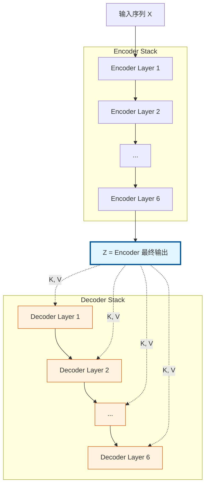
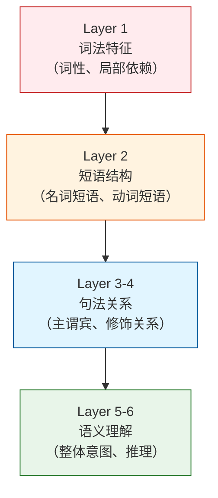
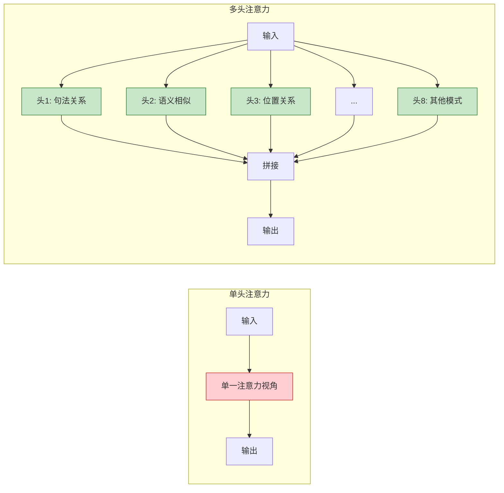

# Q8: Decoder Cross-Attention 的连接方式 & 深度与宽度的价值

## 问题
1. 在 Decoder 中，第 i 层的 Cross-Attention 是使用 Encoder 的最终输出还是第 i 层的输出？
2. Encoder/Decoder 都有深度（N 层）和宽度（多头），这些分别有什么价值？

## 回答

---

## 问题 1：Cross-Attention 连接到 Encoder 的哪一层？

### **答案：使用 Encoder 的最终输出（第 6 层）**

所有 Decoder 层的 Cross-Attention 都连接到 **Encoder 的最终输出** $Z^{(6)}$，而不是对应层的输出。

### **数学表示**



**Encoder 输出**：
$$Z = \text{Encoder}^{(6)}(X) \in \mathbb{R}^{n \times d_{model}}$$

**Decoder 第 $i$ 层的 Cross-Attention**：
$$\text{CrossAttn}^{(i)}(Y^{(i)}, Z) = \text{softmax}\left(\frac{Q^{(i)} K^T}{\sqrt{d_k}}\right) V$$

其中：
- $Q^{(i)} = Y^{(i)} W_Q^{(i)}$：来自 Decoder 第 $i$ 层
- $K = Z W_K^{(i)}$，$V = Z W_V^{(i)}$：来自 **Encoder 最终输出** $Z$

**所有层共享相同的 Encoder 输出 $Z$**。

### **为什么这样设计？**

#### **1. 编码质量的考量**

**Encoder 的层次化编码**：
```
Layer 1: 局部特征（词性、局部依赖）
Layer 2: 中层特征（短语结构）
Layer 3-4: 高层特征（句法关系）
Layer 5-6: 全局语义（整体理解）
```

**最终层的优势**：
- 融合了所有层的信息
- 包含最丰富的语义表示
- 已经过 6 层的非线性变换和全局交互

**使用中间层的问题**：
- 信息不完整（未经过后续层的精炼）
- 语义理解较浅
- 可能丢失全局信息

#### **2. 简化架构设计**

**方案对比**：

| 方案 | 描述 | 优点 | 缺点 |
|------|------|------|------|
| **使用最终输出**<br/>（论文采用） | 所有 Decoder 层连接 $Z^{(6)}$ | 简单、统一<br/>信息最丰富 | Encoder 信息固定 |
| 逐层连接 | Decoder 层 $i$ 连接 Encoder 层 $i$ | 层次对齐 | 需要层数一致<br/>早期层信息不足 |
| 多层连接 | 连接所有 Encoder 层 | 信息最全 | 复杂、参数多 |

**论文选择的理由**：
- **架构简洁**：只需传递一个 $Z$
- **计算高效**：Encoder 只运行一次，所有 Decoder 层复用
- **灵活性**：Encoder 和 Decoder 层数可以不同

#### **3. 梯度流动**

**使用最终输出**：
```
Loss → Decoder → Z^(6) → Encoder 所有层
```
- 梯度可以流向 Encoder 的所有层
- 所有层都能得到监督信号

**使用中间层**：
```
Loss → Decoder Layer i → Encoder Layer i
```
- 早期 Encoder 层梯度可能较弱
- 不同 Decoder 层对 Encoder 层的梯度不均衡

### **实验验证**

虽然论文没有明确说明，但从公开的 Transformer 实现（如 tensor2tensor、fairseq）可以确认：

```python
# PyTorch Transformer 实现
class Transformer(nn.Module):
    def forward(self, src, tgt):
        # Encoder 输出一次
        memory = self.encoder(src)  # (src_len, batch, d_model)

        # 所有 Decoder 层使用相同的 memory
        output = self.decoder(tgt, memory)
        return output

class TransformerDecoder(nn.Module):
    def forward(self, tgt, memory):
        for layer in self.layers:
            # 每层都使用相同的 memory
            tgt = layer(tgt, memory)  # memory 来自 Encoder 最终输出
        return tgt
```

### **其他架构的对比**

#### **BERT（Encoder-Only）**
- 没有 Decoder，没有 Cross-Attention
- 双向编码

#### **GPT（Decoder-Only）**
- 没有 Encoder，没有 Cross-Attention
- 只有 Masked Self-Attention

#### **T5（Encoder-Decoder）**
- 与原始 Transformer 相同
- 使用 Encoder 最终输出

#### **跨层连接的变体（研究方向）**

一些研究尝试改进连接方式：

**DenseNet-style Connection**：
$$\text{CrossAttn}^{(i)} = f(Y^{(i)}, [Z^{(1)}, Z^{(2)}, ..., Z^{(6)}])$$

**优点**：
- Decoder 可以选择性关注不同层次的特征

**缺点**：
- 复杂度增加
- 参数量增加
- 实际提升有限

---

## 问题 2：深度（N 层）与宽度（多头）的价值

这是理解 Transformer 表达能力的关键问题！

### **深度 vs 宽度对比表**

| 维度 | 深度（N 层） | 宽度（h 个头） |
|------|-------------|---------------|
| **定义** | 垂直堆叠的层数 | 并行的注意力头数 |
| **论文值** | $N=6$ | $h=8$ |
| **作用范围** | 序列信息 | 特征子空间 |
| **主要价值** | 层次化抽象 | 多样化表示 |
| **计算** | 串行 | 并行 |

---

### **一、深度（N 层）的价值**

#### **1. 层次化特征学习**

**类比视觉 CNN**：
```
Layer 1: 边缘、纹理（低层特征）
Layer 2-3: 形状、部件（中层特征）
Layer 4-6: 物体、场景（高层特征）
```

**Transformer 的层次化**：



**示例**：
```
输入: "The bank by the river is steep"

Layer 1: 识别 "bank" 有多义性
Layer 2: 关联 "bank" 与 "river"
Layer 3: 理解 "bank" 指河岸（非银行）
Layer 4: 理解整句意思（河岸陡峭）
```

#### **2. 增加模型容量**

**参数量与层数的关系**：
- 单层 Encoder：~3M 参数
- 6 层 Encoder：~18M 参数
- 12 层（BERT-Base）：~36M 参数

**容量 ∝ 深度**：
- 更多层 → 更多参数 → 更强表达能力
- 可以学习更复杂的函数

#### **3. 复合函数的表达**

**数学上**：
$$f^{(N)} = f^{(6)} \circ f^{(5)} \circ ... \circ f^{(1)}$$

每层都是非线性变换，复合后可以表达极其复杂的函数。

**通用近似定理**：
- 理论上，无限宽的单层网络可以近似任何函数
- 实践中，深层窄网络比浅层宽网络更高效

#### **4. 梯度流动与残差连接**

**深度网络的挑战**：
- 梯度消失/爆炸
- 难以训练

**Transformer 的解决**：
$$Y^{(l+1)} = \text{LayerNorm}(Y^{(l)} + \text{Sublayer}(Y^{(l)}))$$

**残差路径**：
```
输入 → +→+→+→+→+→+→ 输出
       ↓ ↓ ↓ ↓ ↓ ↓
       L1 L2 L3 L4 L5 L6
```

梯度可以直接流回输入，支持深层网络训练。

#### **5. 实验验证：深度的影响**

| 层数 | BLEU（英德） | 参数量 | 说明 |
|------|-------------|--------|------|
| 2 | 22.1 | ~6M | 太浅，容量不足 |
| 4 | 24.3 | ~12M | 较好 |
| **6** | **25.8** | ~18M | **最优（论文）** |
| 8 | 26.1 | ~24M | 边际收益递减 |
| 12 | 26.3 | ~36M | 训练更困难 |

**观察**：
- 深度增加，性能提升
- 但存在收益递减点
- 过深可能导致优化困难

---

### **二、宽度（多头）的价值**

#### **1. 多视角信息提取**

**单头 vs 多头**：



**不同头学习不同模式**：

**示例**（来自论文的可视化）：
```
句子: "The animal didn't cross the street because it was too tired"

头1 (句法): "it" → "animal" (主语关系)
头2 (语义): "tired" → "animal" (属性关系)
头3 (距离): "it" → 附近的词
头4 (位置): 关注位置编码模式
...
```

#### **2. 降低单头维度，保持总容量**

**参数分配策略**：

| 配置 | 头数 $h$ | 每头维度 $d_k$ | 总维度 | 参数量 |
|------|---------|---------------|--------|--------|
| 单头 | 1 | 512 | 512 | 512×512×3 |
| **多头（论文）** | **8** | **64** | **512** | **512×512×3** |
| 更多头 | 16 | 32 | 512 | 512×512×3 |

**关键设计**：
$$h \times d_k = d_{model}$$

保持总维度不变，参数量相同，但：
- 多个头并行学习
- 每个头专注于不同子空间

#### **3. 子空间的多样性**

**数学解释**：

每个头的投影矩阵 $W_Q^{(i)}, W_K^{(i)}, W_V^{(i)}$ 将 $d_{model}$ 维空间映射到 $d_k$ 维子空间。

$$\text{head}_i = \text{Attention}(XW_Q^{(i)}, XW_K^{(i)}, XW_V^{(i)})$$

**不同的 $W^{(i)}$ → 不同的子空间 → 关注不同的模式**

**类比 PCA**：
- PCA 找到主成分方向
- Multi-Head 让模型学习多个重要方向

#### **4. 增强表达能力，避免平均化**

**单头的问题**：
$$\text{Attention}(Q, K, V) = \text{softmax}\left(\frac{QK^T}{\sqrt{d_k}}\right)V$$

输出是 Value 的**加权平均**，可能丢失信息。

**多头的优势**：
$$\text{MultiHead} = \text{Concat}(\text{head}_1, ..., \text{head}_8)W^O$$

- 每个头可以关注不同信息
- 拼接后信息更丰富
- $W^O$ 学习如何整合多个头的信息

#### **5. 并行计算效率**

**多头可以完全并行**：
```python
# 伪代码
for i in range(8):  # 可并行
    head[i] = attention(Q[i], K[i], V[i])

output = concat(head) @ W_O
```

**实际实现**：
```python
# 重塑为 (batch, n_heads, seq_len, d_k)
Q = Q.view(batch, seq_len, n_heads, d_k).transpose(1, 2)
K = K.view(batch, seq_len, n_heads, d_k).transpose(1, 2)
V = V.view(batch, seq_len, n_heads, d_k).transpose(1, 2)

# 批量矩阵乘法，完全并行
scores = Q @ K.transpose(-2, -1)
```

GPU 可以高效并行计算所有头。

#### **6. 实验验证：头数的影响**

**论文 Table 3, Row (A)**：

| 头数 $h$ | $d_k$ | $d_v$ | BLEU | 说明 |
|---------|-------|-------|------|------|
| 1 | 512 | 512 | 24.9 | 单头性能差 |
| 4 | 128 | 128 | 25.5 | 较好 |
| **8** | **64** | **64** | **25.8** | **最优** |
| 16 | 32 | 32 | 25.4 | 过多头性能下降 |
| 32 | 16 | 16 | 25.1 | 维度过小 |

**观察**：
- 单头明显弱于多头（24.9 vs 25.8）
- 8 个头达到最优平衡
- 过多头（32）导致每头维度太小（16），表达能力下降

---

### **三、深度与宽度的协同作用**

#### **1. 互补关系**

```
深度（层数）: 垂直方向的信息提炼
   ↕
 Layer 6  ← 全局语义
 Layer 5
 Layer 4
 Layer 3
 Layer 2
 Layer 1  ← 局部特征
   ↑
  输入

宽度（多头）: 水平方向的多样化
   →  →  →  →  →  →  →  →
 [头1][头2][头3][头4][头5][头6][头7][头8]
  句法 语义 位置 距离  ...
```

#### **2. 配置策略**

**不同模型的选择**：

| 模型 | 层数 | 头数 | $d_{model}$ | 参数量 | 说明 |
|------|------|------|-------------|--------|------|
| Transformer-Base | 6 | 8 | 512 | 65M | 论文 |
| Transformer-Big | 6 | 16 | 1024 | 213M | 更宽 |
| BERT-Base | 12 | 12 | 768 | 110M | 更深 |
| BERT-Large | 24 | 16 | 1024 | 340M | 深且宽 |
| GPT-2 | 48 | 25 | 1600 | 1.5B | 极深极宽 |
| GPT-3 | 96 | 96 | 12288 | 175B | 超大规模 |

**趋势**：
- 小模型：平衡深度和宽度（6 层 × 8 头）
- 大模型：同时增加深度和宽度
- 超大模型：深度和宽度都极大

#### **3. 性能与计算的权衡**

**增加深度**：
- ✅ 显著提升性能
- ❌ 串行计算，延迟增加
- ❌ 梯度流动更困难

**增加宽度**：
- ✅ 提升性能（但边际收益递减）
- ✅ 完全并行，延迟不变
- ❌ 参数量增加

**最优策略**（经验法则）：
- 先增加深度到 12-24 层
- 再增加宽度（头数和 $d_{model}$）
- 保持 $d_k = d_{model} / h$ 在 32-128 之间

---

### **四、可视化总结**

#### **深度的作用**
```
输入: "The quick brown fox jumps"

Layer 1: [The] [quick] [brown] [fox] [jumps]
         ↓ 识别词性

Layer 2: [The quick brown fox] [jumps]
         ↓ 形成短语

Layer 3: [主语: The quick brown fox] [谓语: jumps]
         ↓ 句法分析

Layer 6: 语义理解: 一只敏捷的棕色狐狸正在跳跃
```

#### **宽度的作用**
```
句子: "The fox jumps over the dog"

头1: fox → quick (属性关系)
头2: fox → jumps (主谓关系)
头3: jumps → over (动词-介词)
头4: over → dog (介词-宾语)
头5: The → fox (限定关系)
头6: 位置编码模式
头7: 全局上下文
头8: 其他模式

→ 拼接所有头的信息 → 完整理解
```

---

## 总结

### **问题 1：Cross-Attention 连接方式**

✅ **使用 Encoder 的最终输出**（第 6 层）

**原因**：
- 信息最丰富、最完整
- 架构简洁、计算高效
- 梯度流动更好

### **问题 2：深度与宽度的价值**

#### **深度（N 层）**
- 🎯 **层次化特征学习**（低层→高层）
- 🎯 **增加模型容量**（更多参数）
- 🎯 **复合非线性变换**（表达复杂函数）

#### **宽度（h 个头）**
- 🎯 **多视角信息提取**（不同模式）
- 🎯 **子空间多样性**（并行学习）
- 🎯 **避免信息平均化**（保留细节）

#### **协同作用**
$$\text{Transformer 能力} = \underbrace{\text{深度}}_{\text{垂直抽象}} \times \underbrace{\text{宽度}}_{\text{水平多样性}}$$

深度提供层次化理解，宽度提供多角度观察，两者结合造就了 Transformer 的强大表达能力。

---

## 相关主题
- Encoder-Decoder 逐层连接的变体研究
- 深度网络的梯度流动分析
- 多头注意力的可解释性研究
- 深度 vs 宽度的理论分析（Neural Tangent Kernel）
- 大模型的缩放定律（Scaling Laws）
