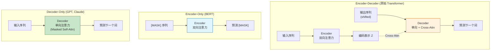

# Q9: 为什么 LLM 只使用 Decoder 架构？

## 问题
现代大语言模型（LLM）为什么只使用 Decoder 架构，而不使用原始 Transformer 的 Encoder-Decoder 架构？

## 回答

这是理解现代 LLM 设计的关键问题。答案涉及到任务特性、架构效率、训练方式等多个方面。

---

### 一、三种 Transformer 架构对比



#### **对比表**

| 特性 | Encoder-Decoder | Encoder-Only | Decoder-Only |
|------|----------------|--------------|--------------|
| **代表模型** | T5, BART | BERT, RoBERTa | GPT, Claude, LLaMA |
| **注意力方向** | 双向 + 单向 | 双向 | 单向（Causal） |
| **Cross-Attention** | ✅ 有 | ❌ 无 | ❌ 无 |
| **典型任务** | 翻译、摘要 | 分类、理解 | 生成、对话 |
| **参数效率** | 低（两个栈） | 中 | 高 |
| **推理效率** | 低 | 中 | 高（KV Cache） |
| **统一建模** | ❌ 难 | ❌ 难 | ✅ 容易 |

---

### 二、为什么选择 Decoder-Only？

#### **原因 1：任务特性的转变**

**原始 Transformer 设计目标**：
- **机器翻译**：源语言 → 目标语言
- 明确的**输入-输出**对应
- 需要对齐（alignment）

**现代 LLM 目标**：
- **文本生成**：给定前文 → 生成后文
- **统一建模**：所有任务都是"续写"
- 无需显式的输入-输出分离

**任务重构**：

```
传统 Encoder-Decoder:
输入: "Translate to French: I love AI"
Encoder: 编码 "I love AI"
Decoder: 生成 "J'aime l'IA"

Decoder-Only:
输入: "Translate to French: I love AI\nFrench:"
输出: " J'aime l'IA"
```

**关键洞察**：
> **所有 NLP 任务都可以重构为"给定上文，预测下文"**

示例：
- **翻译**：`Translate: {source}\nTranslation: {target}`
- **问答**：`Question: {q}\nAnswer: {a}`
- **摘要**：`Article: {text}\nSummary: {summary}`
- **对话**：`User: {msg}\nAssistant: {reply}`

#### **原因 2：参数效率**

**Encoder-Decoder 的冗余**：

```
Encoder:
  6 layers × 3M params/layer = 18M params

Decoder:
  6 layers × 3M params/layer = 18M params

总计: 36M params
```

**问题**：
- Encoder 只在处理输入时使用
- Decoder 既要理解输入（通过 Cross-Attention），又要生成输出
- **职责重复**：都在理解输入

**Decoder-Only 的优势**：

```
Decoder-Only:
  6 layers × 3M params/layer = 18M params

总计: 18M params (减少 50%)
```

**关键**：
- Decoder 本身的 Self-Attention 已经可以理解输入
- 不需要单独的 Encoder
- **参数利用更充分**

**实验证明**（GPT-2 论文）：
- 同样参数量下，Decoder-Only 性能优于 Encoder-Decoder
- 相同性能下，Decoder-Only 参数更少

#### **原因 3：统一的训练目标**

**Encoder-Decoder 的复杂性**：

```python
# 训练时需要两种模式
# 1. Encoder: 双向理解输入
# 2. Decoder: 单向生成输出

loss = 0
# Encoder 处理输入
encoder_output = encoder(source)

# Decoder 自回归生成
for t in range(target_length):
    output = decoder(target[:t], encoder_output)
    loss += cross_entropy(output, target[t])
```

**Decoder-Only 的简洁性**：

```python
# 统一的自回归语言建模
for t in range(sequence_length):
    output = decoder(input[:t])
    loss += cross_entropy(output, input[t])

# 输入和输出是同一个序列！
```

**训练目标统一**：
$$\mathcal{L} = -\sum_{t=1}^{T} \log P(x_t | x_{<t})$$

- 最大化给定上文预测下一个词的概率
- 无需区分"输入"和"输出"
- **简单、统一、可扩展**

#### **原因 4：推理效率（KV Cache）**

**Encoder-Decoder 的推理**：

```python
# 每次生成都需要：
1. Encoder 处理输入 (固定成本)
2. Decoder 自回归生成 (变化成本)

时间复杂度:
- Encoder: O(n² × d) - 每次推理都要计算
- Decoder: O(m² × d) - 自回归
- Cross-Attention: O(m × n × d) - 每步都要计算
```

**Decoder-Only 的推理（KV Cache 优化）**：

```python
# 首次生成 token 1:
kv_cache = []
output_1 = decoder(input, kv_cache)  # 完整计算

# 生成 token 2:
# 只需计算新 token 的 K, V，复用之前的
output_2 = decoder(new_token, kv_cache)  # 增量计算

# 生成 token t:
output_t = decoder(new_token, kv_cache)  # O(1) 每步
```

**KV Cache 机制**：

```
生成第 t 个 token 时：
1. 计算新 token 的 Q, K, V
2. 将新的 K, V 添加到 cache
3. 使用新 Q 和所有缓存的 K, V 计算注意力
4. 时间复杂度：O(t × d) 而非 O(t² × d)
```

**Encoder-Decoder 为什么难用 KV Cache？**
- Cross-Attention 的 K, V 来自 Encoder
- Encoder 输出固定，可以缓存
- 但架构更复杂，实现更困难
- Decoder-Only 架构更纯粹，优化更容易

#### **原因 5：扩展性（Scaling）**

**缩放定律（Scaling Laws）研究发现**：

$$\text{Performance} \propto \text{Parameters}^{\alpha} \times \text{Data}^{\beta} \times \text{Compute}^{\gamma}$$

**Decoder-Only 的优势**：
1. **参数效率更高**：相同参数下性能更好
2. **架构简单**：更容易扩展到极大规模
3. **训练稳定**：统一目标，梯度流动更好

**大模型演进**：
```
GPT-1:   117M  params (Decoder-Only)
GPT-2:   1.5B  params (Decoder-Only)
GPT-3:   175B  params (Decoder-Only)
GPT-4:   ~1.8T params (Decoder-Only, 据传)
```

**对比 Encoder-Decoder**：
```
T5-Small:  60M  params
T5-Base:   220M params
T5-Large:  770M params
T5-XXL:    11B  params (很少有更大的)
```

**为什么 Encoder-Decoder 难以扩展？**
- 两个栈的参数分配需要平衡
- Cross-Attention 增加复杂度
- 训练和推理都更困难

#### **原因 6：In-Context Learning 的发现**

**GPT-3 的关键发现**：
- Decoder-Only 模型具有强大的 **in-context learning** 能力
- 只需给几个示例，无需微调就能完成任务

**Few-Shot Prompting**：
```
Input:
Translate English to French:
sea otter => loutre de mer
peppermint => menthe poivrée
plush girafe => girafe peluche
cheese =>

Output:
fromage
```

**Encoder-Decoder 的局限**：
- 需要明确的输入-输出分离
- 难以灵活适应 few-shot 格式
- In-context learning 能力较弱

**Decoder-Only 的优势**：
- 自然支持任意长度的上下文
- 可以灵活模仿示例模式
- **统一的序列建模**使 in-context learning 自然涌现

---

### 三、Decoder-Only 的具体实现

#### **架构细节**

**原始 Transformer Decoder**：
```
1. Masked Self-Attention (看不到未来)
2. Cross-Attention (连接 Encoder)  ← 移除
3. Feed-Forward Network
```

**Decoder-Only（GPT-style）**：
```
1. Masked Self-Attention (Causal Attention)
2. Feed-Forward Network
```

**数学公式**：

原始 Decoder 层：
$$Y^{(l+1)} = \text{LN}(\text{LN}(\text{LN}(Y^{(l)} + \text{MaskedAttn}(Y^{(l)})) + \text{CrossAttn}(Y, Z)) + \text{FFN}(\cdot))$$

Decoder-Only 层（移除 Cross-Attention）：
$$Y^{(l+1)} = \text{LN}(\text{LN}(Y^{(l)} + \text{CausalAttn}(Y^{(l)})) + \text{FFN}(\cdot))$$

#### **Causal Attention（因果注意力）**

与 Masked Self-Attention 完全相同：

$$\text{Attention}(Q, K, V) = \text{softmax}\left(\text{Mask}\left(\frac{QK^T}{\sqrt{d_k}}\right)\right)V$$

**下三角掩码**：
```
[[1, 0, 0, 0],
 [1, 1, 0, 0],
 [1, 1, 1, 0],
 [1, 1, 1, 1]]
```

确保位置 $i$ 只能看到位置 $\leq i$ 的信息。

---

### 四、Decoder-Only 的实际应用

#### **训练过程**

```python
# 输入序列
text = "The quick brown fox jumps over the lazy dog"
tokens = tokenize(text)  # [1, 234, 567, 89, ...]

# 自回归训练
for i in range(1, len(tokens)):
    input = tokens[:i]        # 前 i 个 token
    target = tokens[i]        # 第 i+1 个 token

    logits = model(input)     # 预测
    loss += cross_entropy(logits[-1], target)
```

**关键**：
- 输入和目标来自同一个序列
- 训练时一次性计算所有位置（并行）
- 使用掩码确保不看到未来

#### **推理过程**

```python
# 给定 prompt
prompt = "Once upon a time"
tokens = tokenize(prompt)

# 自回归生成
for _ in range(max_new_tokens):
    logits = model(tokens)       # 预测下一个 token
    next_token = sample(logits)  # 采样
    tokens.append(next_token)    # 添加到序列

    if next_token == EOS:
        break

output = detokenize(tokens)
```

---

### 五、为什么还有 Encoder-Decoder 模型？

虽然 Decoder-Only 占主导，但 Encoder-Decoder 仍在某些场景有优势：

#### **适合 Encoder-Decoder 的任务**

1. **严格的输入-输出分离**
   - 机器翻译（固定源语言 → 目标语言）
   - 文档摘要（长文档 → 短摘要）

2. **需要双向理解输入**
   - 填空任务（完形填空）
   - 句子重排

3. **输入输出长度差异大**
   - 长文档摘要（1000 tokens → 50 tokens）
   - 数据到文本（结构化数据 → 自然语言）

#### **代表模型**

- **T5**（Text-to-Text Transfer Transformer）
  - 所有任务统一为 text-to-text
  - 但仍使用 Encoder-Decoder
  - 适合理解和生成平衡的任务

- **BART**（Denoising Autoencoder）
  - 预训练：重构被破坏的文本
  - 微调：生成任务

---

### 六、Encoder-Only vs Decoder-Only

#### **Encoder-Only（BERT-style）的特点**

**优势**：
- 双向上下文理解
- 适合分类、理解任务

**劣势**：
- 不能直接生成文本
- 需要额外的生成头
- 不适合开放式生成

**典型应用**：
- 文本分类
- 命名实体识别
- 问答（抽取式）

#### **为什么不用 Encoder-Only 做 LLM？**

**生成能力的限制**：
```
BERT 训练目标: 预测 [MASK] 位置的词
输入: "The [MASK] is shining"
输出: "sun"

无法自回归生成:
输入: "Once upon a time"
输出: "there was a..." ← BERT 做不到
```

**Decoder-Only 的通用性**：
- 既能理解（通过自注意力）
- 又能生成（自回归）
- **一个架构搞定所有任务**

---

### 七、总结对比表

| 维度 | Encoder-Decoder | Decoder-Only (LLM) |
|------|----------------|-------------------|
| **参数效率** | ❌ 低（双栈） | ✅ 高（单栈） |
| **训练简洁性** | ❌ 复杂（双目标） | ✅ 简单（统一 LM） |
| **推理效率** | ❌ 低 | ✅ 高（KV Cache） |
| **扩展性** | ❌ 难（双栈平衡） | ✅ 易（单栈直接扩） |
| **In-Context Learning** | ❌ 弱 | ✅ 强 |
| **任务通用性** | ❌ 需要重构 | ✅ 自然统一 |
| **生成质量** | 中 | ✅ 高 |
| **适用场景** | 特定任务 | **通用 LLM** |

---

## 最终答案

### **为什么 LLM 只用 Decoder？**

1. **任务重构**：所有 NLP 任务都可以统一为"续写"
2. **参数效率**：相同参数下性能更好
3. **训练简洁**：统一的语言建模目标
4. **推理高效**：KV Cache 优化
5. **可扩展性**：更容易扩展到超大规模
6. **In-Context Learning**：自然支持 few-shot 学习

### **核心哲学转变**

```
传统 NLP (2017):
  "不同任务需要不同架构"
  翻译 → Encoder-Decoder
  分类 → Encoder-Only

现代 LLM (2020+):
  "一个架构解决所有问题"
  所有任务 → Decoder-Only 续写
```

### **Decoder-Only 的胜利**

$$\text{LLM} = \text{Decoder-Only} + \text{大规模数据} + \text{大参数} + \text{In-Context Learning}$$

这种架构的成功，标志着 NLP 从**任务特定模型**转向**通用语言智能**的范式转变。

---

## 相关主题
- GPT 系列的架构演进
- T5 vs GPT：Encoder-Decoder vs Decoder-Only 对比
- KV Cache 的详细实现
- In-Context Learning 的涌现机制
- Scaling Laws（缩放定律）
- Prefix LM vs Causal LM
- 未来：可能的架构创新方向
