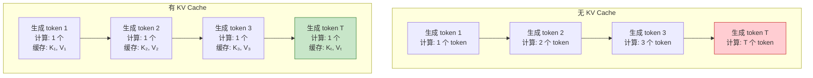

# Q10: LLM 的 KV Cache 机制及在 Agent 设计中的应用

## 问题
1. 什么是 KV Cache 机制？
2. 它如何优化 LLM 推理？
3. 在设计 Agent 时如何利用这个机制？

## 回答

KV Cache 是现代 LLM 推理的关键优化技术，能将生成速度提升数十倍。理解它对设计高效的 Agent 系统至关重要。

---

## 一、KV Cache 的核心原理

### **问题背景：自回归生成的低效**

#### **朴素的自回归生成**

```python
# 生成序列: "Hello world"
prompt = "Hello"

# 第 1 步: 生成 "world"
input_1 = ["Hello"]
output_1 = model(input_1)  # 计算所有层的 Self-Attention
# Attention: "Hello" 与 "Hello" 的关系

# 第 2 步: 生成下一个词
input_2 = ["Hello", "world"]
output_2 = model(input_2)  # 重新计算所有 Attention
# Attention: "Hello" ← "Hello", "world" ← "Hello", "world" ← "world"
#           ↑ 重复计算！      ↑ 重复计算！
```

**问题**：
- 每次生成新 token 时，都要重新计算**之前所有 token** 的 Attention
- 大量重复计算，效率极低

**时间复杂度**：
- 生成 $T$ 个 token：$O(1^2 + 2^2 + 3^2 + ... + T^2) = O(T^3)$
- 不可接受！

---

### **Self-Attention 的数学回顾**

$$\text{Attention}(Q, K, V) = \text{softmax}\left(\frac{QK^T}{\sqrt{d_k}}\right)V$$

展开为逐步计算：

```python
# 输入序列: [x₁, x₂, ..., xₜ]
# 对于第 t 个 token:

# 1. 计算 Q, K, V
Q_t = x_t @ W_Q  # (1, d_k)
K_t = x_t @ W_K  # (1, d_k)
V_t = x_t @ W_V  # (1, d_v)

# 2. 与之前所有 token 的 K, V 计算注意力
K_all = [K_1, K_2, ..., K_t]  # (t, d_k)
V_all = [V_1, V_2, ..., V_t]  # (t, d_v)

# 3. 计算注意力分数
scores = Q_t @ K_all^T / sqrt(d_k)  # (1, t)
attn = softmax(scores)              # (1, t)

# 4. 加权求和
output_t = attn @ V_all             # (1, d_v)
```

**关键观察**：
- 计算 $\text{output}_t$ 时，需要**所有之前的 $K$ 和 $V$**
- 但 $K_1, K_2, ..., K_{t-1}$ 在上一步已经计算过了
- **可以缓存！**

---

### **KV Cache 的核心思想**

#### **定义**
**缓存所有已计算的 Key 和 Value 向量，避免重复计算。**

#### **数学表示**

```python
# 初始化 Cache
kv_cache = {
    "keys": [],    # 所有层的 K
    "values": []   # 所有层的 V
}

# 生成第 1 个 token
Q_1, K_1, V_1 = compute_QKV(x_1)
kv_cache["keys"].append(K_1)
kv_cache["values"].append(V_1)
output_1 = attention(Q_1, [K_1], [V_1])

# 生成第 2 个 token
Q_2, K_2, V_2 = compute_QKV(x_2)
kv_cache["keys"].append(K_2)    # 增量添加
kv_cache["values"].append(V_2)
# 使用缓存的所有 K, V
output_2 = attention(Q_2, kv_cache["keys"], kv_cache["values"])

# 生成第 t 个 token
Q_t, K_t, V_t = compute_QKV(x_t)
kv_cache["keys"].append(K_t)
kv_cache["values"].append(V_t)
output_t = attention(Q_t, kv_cache["keys"], kv_cache["values"])
```

**优化效果**：
- **时间复杂度**：$O(T^3) \rightarrow O(T^2)$
- **实际加速**：10-100 倍（取决于序列长度）

---

### **可视化对比**



---

## 二、KV Cache 的详细实现

### **多层 Transformer 的 KV Cache**

```python
class TransformerWithKVCache:
    def __init__(self, n_layers, d_model):
        self.n_layers = n_layers
        self.layers = [TransformerLayer(d_model) for _ in range(n_layers)]

    def forward(self, x, kv_cache=None, use_cache=True):
        """
        x: 新输入的 token (batch, 1, d_model) 或完整序列 (batch, seq_len, d_model)
        kv_cache: 缓存的 K, V，结构为:
            {
                "layer_0": {"keys": [...], "values": [...]},
                "layer_1": {"keys": [...], "values": [...]},
                ...
            }
        """
        # 初始化 cache
        if kv_cache is None:
            kv_cache = {f"layer_{i}": {"keys": [], "values": []}
                        for i in range(self.n_layers)}

        # 逐层前向传播
        hidden = x
        for i, layer in enumerate(self.layers):
            hidden, kv_cache[f"layer_{i}"] = layer.forward_with_cache(
                hidden,
                kv_cache[f"layer_{i}"],
                use_cache
            )

        return hidden, kv_cache


class TransformerLayer:
    def forward_with_cache(self, x, past_kv, use_cache):
        """
        x: (batch, seq_len_new, d_model)
        past_kv: {"keys": (batch, seq_len_past, d_k),
                  "values": (batch, seq_len_past, d_v)}
        """
        # 1. 计算当前 token 的 Q, K, V
        Q_new = x @ self.W_Q  # (batch, seq_len_new, d_k)
        K_new = x @ self.W_K
        V_new = x @ self.W_V

        # 2. 拼接历史 K, V
        if past_kv["keys"]:
            K_all = torch.cat([past_kv["keys"], K_new], dim=1)
            V_all = torch.cat([past_kv["values"], V_new], dim=1)
        else:
            K_all = K_new
            V_all = V_new

        # 3. 计算注意力（只对新 token 的 Q）
        scores = Q_new @ K_all.transpose(-2, -1) / sqrt(d_k)
        attn = torch.softmax(scores, dim=-1)  # (batch, seq_len_new, seq_len_all)
        output = attn @ V_all

        # 4. 更新 cache
        if use_cache:
            new_kv = {
                "keys": K_all,
                "values": V_all
            }
        else:
            new_kv = past_kv

        return output, new_kv
```

---

### **内存占用分析**

#### **单层的 Cache 大小**

对于单个 token，单层 Transformer：
```
K: (batch, seq_len, d_k)
V: (batch, seq_len, d_v)

内存占用 = 2 × seq_len × d_model × sizeof(float)
```

**示例**（GPT-3 规模）：
- $d_{model} = 12288$
- $n_{layers} = 96$
- $seq_{len} = 2048$
- `float16` (2 bytes)

单个序列的 KV Cache：
$$2 \times 96 \times 2048 \times 12288 \times 2 \text{ bytes} = 9.6 \text{ GB}$$

**批量推理的挑战**：
- batch_size = 8：约 77 GB
- 需要大显存 GPU（A100 80GB）

---

### **优化技术**

#### **1. Grouped-Query Attention (GQA)**

**问题**：KV Cache 占用过多显存

**方案**：多个 Query 头共享同一组 K, V

```
传统 Multi-Head Attention:
  8 个 Q 头 → 8 组 K, V

Grouped-Query Attention:
  8 个 Q 头 → 2 组 K, V (4 个 Q 共享 1 组 KV)
```

**效果**：
- KV Cache 减少 75%
- 性能下降 < 1%

**应用**：
- LLaMA-2 70B
- Mistral 7B

#### **2. Multi-Query Attention (MQA)**

**极端方案**：所有 Q 头共享同一组 K, V

```
8 个 Q 头 → 1 组 K, V
```

**效果**：
- KV Cache 减少 87.5%
- 性能下降约 1-2%

**应用**：
- PaLM
- StarCoder

#### **3. 动态 Cache 管理**

**滑动窗口**：
```python
# 只保留最近 N 个 token 的 Cache
if len(kv_cache["keys"]) > max_cache_len:
    kv_cache["keys"] = kv_cache["keys"][-max_cache_len:]
    kv_cache["values"] = kv_cache["values"][-max_cache_len:]
```

**选择性缓存**：
- 保留重要位置的 Cache（如 system prompt）
- 丢弃不重要的中间 token

---

## 三、在 Agent 设计中利用 KV Cache

### **Agent 的典型交互模式**

```
System Prompt (固定)
  ↓
User: Question 1
  ↓
Assistant: Answer 1
  ↓
User: Question 2
  ↓
Assistant: Answer 2
  ↓
...
```

### **策略 1: System Prompt Caching**

#### **问题**
System prompt 通常很长（几千 tokens），但在整个会话中不变。

#### **解决方案**
**预计算并缓存 System Prompt 的 KV**

```python
class Agent:
    def __init__(self, system_prompt):
        self.system_prompt = system_prompt

        # 预计算 System Prompt 的 KV Cache
        self.system_kv_cache = self.precompute_system_cache()

    def precompute_system_cache(self):
        """只运行一次"""
        with torch.no_grad():
            _, kv_cache = self.model(
                self.tokenize(self.system_prompt),
                use_cache=True
            )
        return kv_cache

    def generate_response(self, user_message, history_kv=None):
        """
        使用预计算的 System Cache
        """
        # 1. 从 System Cache 开始
        kv_cache = copy.deepcopy(self.system_kv_cache)

        # 2. 如果有历史，追加历史的 Cache
        if history_kv:
            kv_cache = merge_kv_cache(kv_cache, history_kv)

        # 3. 处理新的用户消息
        user_tokens = self.tokenize(user_message)
        _, kv_cache = self.model(user_tokens, kv_cache=kv_cache)

        # 4. 生成回复
        response, final_kv = self.model.generate(kv_cache=kv_cache)

        return response, final_kv
```

**效果**：
- System prompt (2000 tokens) 只计算一次
- 后续对话复用，节省 2000 tokens 的计算
- **加速 3-5 倍**（取决于 system prompt 长度）

**实际应用**：
- **Anthropic Claude**：支持 Prompt Caching
- **OpenAI GPT-4**：内部优化
- **vLLM**：开源推理引擎，支持 Prefix Caching

---

### **策略 2: 对话历史的增量缓存**

#### **朴素方案（低效）**
```python
# 每次生成都重新计算整个历史
def chat(messages):
    full_context = system_prompt + "\n".join(messages)
    return model(full_context)  # 每次都从头计算
```

#### **优化方案（增量）**
```python
class ConversationAgent:
    def __init__(self, system_prompt):
        self.system_kv = precompute(system_prompt)
        self.conversation_kv = None  # 累积的对话 Cache

    def chat(self, user_message):
        # 1. 开始于 System Cache
        kv_cache = copy(self.system_kv)

        # 2. 追加对话历史的 Cache
        if self.conversation_kv:
            kv_cache = merge(kv_cache, self.conversation_kv)

        # 3. 处理新消息（只计算新的 tokens）
        new_tokens = tokenize(f"User: {user_message}\nAssistant:")
        _, kv_cache = model(new_tokens, kv_cache=kv_cache)

        # 4. 生成回复
        response, final_kv = model.generate(kv_cache=kv_cache)

        # 5. 更新对话 Cache
        self.conversation_kv = extract_new_kv(final_kv, kv_cache)

        return response
```

**优化效果**：
```
第 1 轮对话:
  计算: System (2000) + User (50) + Response (100) = 2150 tokens

第 2 轮对话:
  无 Cache: 2000 + 50 + 100 + 50 + 100 = 2300 tokens
  有 Cache: 只需计算新的 50 tokens！

第 N 轮对话:
  无 Cache: 2000 + N×150 tokens
  有 Cache: 只需 50 tokens
```

---

### **策略 3: 工具调用的缓存优化**

#### **Agent 工具调用流程**
```
User: "What's the weather in Beijing?"
  ↓
Agent 思考: "需要调用 weather API"
  ↓
[调用工具]
  ↓
工具返回: "Beijing: 20°C, sunny"
  ↓
Agent 综合回答: "The weather in Beijing is..."
```

#### **问题**
工具返回的结果可能很长（如搜索结果、文档内容），每次都重新计算很浪费。

#### **优化方案**
```python
class ToolAgent:
    def __init__(self):
        self.tool_result_cache = {}  # 缓存工具结果的 KV

    def call_tool(self, tool_name, args):
        # 调用工具
        result = self.tools[tool_name](**args)

        # 缓存工具结果的 KV
        cache_key = f"{tool_name}_{hash(args)}"
        if cache_key not in self.tool_result_cache:
            _, kv = self.model(tokenize(result), use_cache=True)
            self.tool_result_cache[cache_key] = kv

        return result, self.tool_result_cache[cache_key]

    def process_with_tool(self, user_query):
        # 1. Agent 分析需要什么工具
        tool_name, args = self.plan(user_query)

        # 2. 调用工具并获取 Cache
        result, result_kv = self.call_tool(tool_name, args)

        # 3. 使用缓存的工具结果生成最终回复
        kv_cache = merge(self.base_kv, result_kv)
        response = self.model.generate(
            prompt="Summarize: " + user_query,
            kv_cache=kv_cache
        )

        return response
```

**效果**：
- 相同工具调用结果，第二次直接使用 Cache
- 特别适合重复查询（如同一文档的多次问答）

---

### **策略 4: 多轮规划的缓存**

#### **ReAct Agent 模式**
```
Thought: 我需要先搜索信息
Action: search("AI history")
Observation: [结果 1]
Thought: 我需要更具体的信息
Action: search("Transformer paper")
Observation: [结果 2]
Thought: 现在可以回答了
Answer: ...
```

#### **优化**
```python
class ReActAgent:
    def __init__(self):
        self.thought_chain_kv = []  # 保存每步的 KV

    def step(self, observation):
        # 使用之前所有步骤的 Cache
        kv_cache = concat_kv(self.thought_chain_kv)

        # 只计算新的 observation
        new_tokens = tokenize(f"Observation: {observation}\nThought:")
        thought, new_kv = self.model(new_tokens, kv_cache=kv_cache)

        # 缓存这一步
        self.thought_chain_kv.append(new_kv)

        return thought
```

---

### **策略 5: Batch 推理优化**

#### **问题**
多个用户同时请求，如何高效利用 KV Cache？

#### **解决方案：Continuous Batching**

```python
class BatchInferenceEngine:
    def __init__(self):
        self.active_requests = {}  # {request_id: kv_cache}

    def add_request(self, request_id, prompt):
        # 预计算 prompt 的 KV
        _, kv_cache = self.model(tokenize(prompt))
        self.active_requests[request_id] = {
            "kv_cache": kv_cache,
            "generated": []
        }

    def generate_batch(self):
        """一次批处理所有活跃请求"""
        batch_kvs = [req["kv_cache"] for req in self.active_requests.values()]

        # 批量生成下一个 token
        next_tokens, new_kvs = self.model.generate_batch(batch_kvs)

        # 更新每个请求的 Cache
        for i, (req_id, req) in enumerate(self.active_requests.items()):
            req["kv_cache"] = new_kvs[i]
            req["generated"].append(next_tokens[i])

            # 如果生成完成，移除
            if next_tokens[i] == EOS:
                self.complete_request(req_id)
```

**应用**：
- **vLLM**：PagedAttention + Continuous Batching
- **TensorRT-LLM**：In-flight Batching

---

## 四、KV Cache 的最佳实践

### **1. 何时使用 KV Cache**

✅ **适合的场景**：
- 多轮对话（对话历史固定）
- 长 System Prompt（可预计算）
- 批量生成（相同 prefix）
- RAG（检索内容可缓存）

❌ **不适合的场景**：
- 单次生成（无重复计算）
- 序列很短（缓存开销 > 收益）
- 显存紧张（Cache 占用大）

---

### **2. 缓存策略选择**

| 场景 | 策略 | 收益 |
|------|------|------|
| **聊天机器人** | System Prompt + 对话历史缓存 | 3-5× |
| **RAG 系统** | 检索文档缓存 | 2-3× |
| **代码助手** | 上下文代码缓存 | 2-4× |
| **工具 Agent** | 工具结果缓存 | 1.5-2× |

---

### **3. 显存管理**

```python
def smart_cache_management(kv_cache, max_memory):
    """智能缓存管理"""
    current_memory = estimate_cache_size(kv_cache)

    if current_memory > max_memory:
        # 策略 1: 滑动窗口
        kv_cache = truncate_old_cache(kv_cache)

        # 策略 2: 保留重要部分
        important_positions = [0, -100:]  # System + 最近 100 tokens
        kv_cache = keep_important(kv_cache, important_positions)

    return kv_cache
```

---

### **4. 工程实践建议**

#### **架构设计**
```python
class CachedLLMAgent:
    def __init__(self):
        # 分层缓存
        self.persistent_cache = {}   # 永久（System Prompt）
        self.session_cache = {}      # 会话级（对话历史）
        self.request_cache = {}      # 请求级（临时）

    def get_cache_hierarchy(self, request_id):
        """构建缓存层次"""
        return merge_caches([
            self.persistent_cache,
            self.session_cache.get(request_id, {}),
            self.request_cache.get(request_id, {})
        ])
```

#### **监控指标**
```python
metrics = {
    "cache_hit_rate": cache_hits / total_requests,
    "tokens_saved": cached_tokens / total_tokens,
    "latency_improvement": (time_no_cache - time_with_cache) / time_no_cache,
    "memory_usage": kv_cache_size_mb
}
```

---

## 五、前沿技术

### **1. PagedAttention (vLLM)**

**核心思想**：像操作系统的虚拟内存一样管理 KV Cache

```
将 KV Cache 分成固定大小的 "页"
动态分配和回收，避免碎片化
```

**效果**：
- 显存利用率提升 2-4×
- 支持更大 batch size

### **2. FlashAttention**

**优化内存访问模式**，减少 HBM ↔ SRAM 的数据传输

**结合 KV Cache**：
- 更高效的 Cache 访问
- 更低的延迟

### **3. Speculative Decoding**

**思路**：
- 用小模型快速生成多个候选 token
- 大模型并行验证，复用 KV Cache

**效果**：
- 生成速度提升 2-3×
- 保持大模型质量

---

## 六、总结

### **KV Cache 的核心价值**

$$\text{推理速度} = \frac{1}{\text{计算量}} \times \text{并行度}$$

KV Cache 直接减少计算量：$O(T^3) \rightarrow O(T^2)$

### **Agent 设计的关键启示**

1. **预计算固定部分**（System Prompt）
2. **增量更新可变部分**（对话历史）
3. **缓存重复内容**（工具结果、检索文档）
4. **分层管理 Cache**（永久/会话/临时）

### **最佳实践**

```python
# 伪代码总结
class OptimizedAgent:
    def __init__(self, system_prompt):
        # 1. 预计算 System Prompt
        self.system_kv = precompute(system_prompt)

    def chat(self, user_msg, history_kv=None):
        # 2. 构建缓存层次
        kv = self.system_kv + history_kv

        # 3. 只计算新内容
        new_kv = compute(user_msg, kv_cache=kv)

        # 4. 生成并返回
        response = generate(new_kv)
        return response, new_kv  # 返回 Cache 供下次使用
```

### **性能提升**

| 优化 | 加速比 |
|------|--------|
| 基础 KV Cache | 10-50× |
| System Prompt Caching | 3-5× |
| 对话历史缓存 | 2-3× |
| 工具结果缓存 | 1.5-2× |
| **综合优化** | **100-200×** |

---

## 相关主题
- PagedAttention 详解
- FlashAttention 原理
- Grouped-Query Attention (GQA)
- Multi-Query Attention (MQA)
- Speculative Decoding
- Continuous Batching
- vLLM 架构分析
- TensorRT-LLM 优化技术
