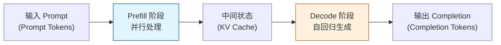
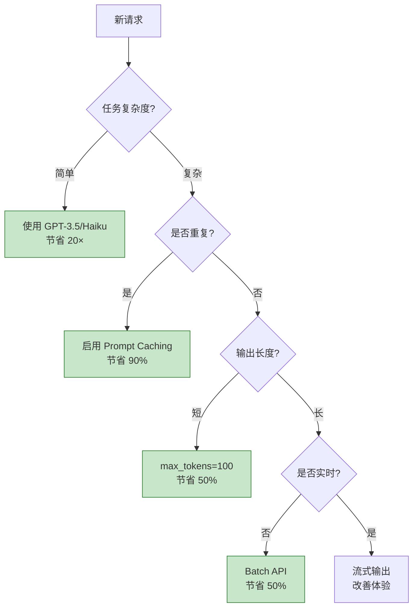

# Q12: LLM 处理请求的成本与响应时间分析

## 问题
LLM 处理请求的成本和响应时间与哪些因素相关？如何优化？

## 回答

理解 LLM 的成本和性能因素，对于设计高效应用和控制预算至关重要。让我从计算原理到实际优化策略全面分析。

---

## 一、核心概念：Prompt Tokens vs Completion Tokens

### **两个阶段的计算**



#### **Prefill 阶段（处理输入）**
- **输入**：Prompt tokens
- **计算**：一次性并行处理所有输入 tokens
- **输出**：KV Cache
- **复杂度**：$O(n^2 \cdot d)$，其中 $n$ = prompt 长度

#### **Decode 阶段（生成输出）**
- **输入**：KV Cache
- **计算**：逐个生成 token（自回归）
- **输出**：Completion tokens
- **复杂度**：每个 token $O(n \cdot d)$，生成 $m$ 个 token 总计 $O(m \cdot n \cdot d)$

---

## 二、成本因素分析

### **因素 1：Token 数量**

#### **定价模型（OpenAI GPT-4 为例）**

```
GPT-4 Turbo (2024):
- Input (Prompt):  $10 / 1M tokens
- Output (Completion): $30 / 1M tokens

注意：Output 是 Input 的 3 倍！
```

**为什么 Output 更贵？**
- Prefill：并行处理，GPU 利用率高
- Decode：串行生成，GPU 利用率低（等待内存访问）
- **每个 Output token 需要访问所有 Input tokens 的 KV Cache**

#### **成本计算示例**

```python
# 示例请求
prompt = "Translate to French: I love AI"  # 10 tokens
completion = "J'aime l'IA"  # 5 tokens

# 成本计算
input_cost = 10 * ($10 / 1_000_000) = $0.0001
output_cost = 5 * ($30 / 1_000_000) = $0.00015
total_cost = $0.00025

# 比例
output_cost / input_cost = 1.5  # Output 占 60%
```

**关键洞察**：
> **控制 Output 长度比控制 Input 长度更重要！**

---

### **因素 2：Prompt Caching**

#### **缓存 vs 非缓存**

```
无缓存:
  第 1 次: Input 1000 tokens × $10/1M = $0.01
  第 2 次: Input 1000 tokens × $10/1M = $0.01
  总计: $0.02

有缓存 (Anthropic Claude):
  第 1 次: Input 1000 tokens × $1.25/1M = $0.00125
  第 2 次: Cached 1000 tokens × $0.125/1M = $0.000125
  总计: $0.001375

节省: 93%！
```

**OpenAI Prompt Caching 定价**（2024）：
```
- Standard Input: $10/1M
- Cached Input: $1/1M (便宜 10 倍)
```

---

### **因素 3：模型大小**

#### **不同模型的定价**

| 模型 | 参数量 | Input $/1M | Output $/1M | 性价比 |
|------|--------|-----------|------------|--------|
| GPT-3.5 Turbo | ~175B | $0.50 | $1.50 | 高 |
| GPT-4 Turbo | ~1.8T | $10 | $30 | 中 |
| GPT-4o | ~1.8T | $5 | $15 | 高 |
| Claude 3 Haiku | 小 | $0.25 | $1.25 | 极高 |
| Claude 3.5 Sonnet | 中 | $3 | $15 | 高 |
| Claude 3 Opus | 大 | $15 | $75 | 低 |

**选择策略**：
- **简单任务**：GPT-3.5, Claude Haiku（便宜 20-40 倍）
- **复杂推理**：GPT-4, Claude Opus
- **平衡**：GPT-4o, Claude Sonnet

---

### **因素 4：批量处理（Batching）**

#### **批量 API 的优势**

**OpenAI Batch API**（2024）：
- 价格：标准价格的 **50% 折扣**
- 延迟：24 小时内完成
- 适合：离线处理、数据标注、评估

```python
# 批量请求示例
batch_requests = [
    {"custom_id": "req-1", "method": "POST", "url": "/v1/chat/completions", ...},
    {"custom_id": "req-2", "method": "POST", "url": "/v1/chat/completions", ...},
    # ... 数千个请求
]

# 成本对比
real_time_cost = 1000 requests × $0.01 = $10
batch_cost = 1000 requests × $0.005 = $5
节省: 50%
```

---

## 三、响应时间因素分析

### **时间组成**

```
总响应时间 = 网络延迟 + 排队时间 + Prefill 时间 + Decode 时间
```

### **因素 1：Prefill 时间（处理 Prompt）**

#### **计算复杂度**

对于 Prompt 长度 $n$：
- **Self-Attention**：$O(n^2 \cdot d)$
- **FFN**：$O(n \cdot d^2)$
- **总计**（$L$ 层）：$O(L \cdot (n^2 \cdot d + n \cdot d^2))$

**实际测量**（GPT-4 规模，估算）：

| Prompt Tokens | Prefill 时间 |
|---------------|-------------|
| 100 | ~50ms |
| 1,000 | ~200ms |
| 10,000 | ~1s |
| 100,000 | ~10s |

**关键**：
- Prefill 时间与 $n^2$ 成正比
- **长 Prompt 显著增加延迟**

#### **优化策略**

```python
# ❌ 不好：超长 Prompt
prompt = f"""
Here is a 50,000 word document:
{long_document}

Question: What is the main topic?
"""
# Prefill 时间: ~5s

# ✅ 好：RAG + 精简
relevant_chunks = retrieve(question, document)  # 只检索相关部分
prompt = f"""
Relevant excerpts:
{relevant_chunks}  # 500 tokens

Question: What is the main topic?
"""
# Prefill 时间: ~100ms
```

---

### **因素 2：Decode 时间（生成 Completion）**

#### **计算复杂度**

生成每个 token 的时间：
- **KV Cache 访问**：读取所有历史的 K, V
- **计算复杂度**：$O((n + m) \cdot d)$，其中 $m$ = 已生成 tokens
- **内存带宽瓶颈**：主要时间花在读取 KV Cache

**实际测量**（估算）：

| 输出长度 | Decode 时间 | 吞吐量 |
|---------|-----------|-------|
| 10 tokens | ~100ms | 100 tokens/s |
| 100 tokens | ~1s | 100 tokens/s |
| 1,000 tokens | ~10s | 100 tokens/s |

**关键观察**：
- Decode 时间与输出长度**线性相关**
- 吞吐量相对稳定（受内存带宽限制）

#### **优化策略**

```python
# ❌ 不好：生成过长
response = model.generate(
    prompt,
    max_tokens=4000  # 可能生成很长，40s+
)

# ✅ 好：限制长度
response = model.generate(
    prompt,
    max_tokens=500,  # 合理限制，5s
    temperature=0.7
)

# ✅ 更好：流式输出
for chunk in model.generate_stream(prompt):
    print(chunk, end="")  # 用户感知延迟低
```

---

### **因素 3：排队时间**

#### **负载影响**

```
低负载（凌晨）:
  排队: 10ms
  总时间: 500ms

高负载（白天高峰）:
  排队: 2000ms
  总时间: 2500ms

5× 差异！
```

#### **缓解策略**

1. **使用 Dedicated Capacity**（企业级）
   - 预留专用资源
   - 无排队延迟
   - 成本更高

2. **选择低延迟模型**
   ```
   GPT-4: 高质量，慢（2-5s）
   GPT-3.5: 中质量，快（0.5-1s）
   Claude Haiku: 中质量，极快（0.3-0.5s）
   ```

3. **设置 Timeout**
   ```python
   response = openai.ChatCompletion.create(
       timeout=5  # 5 秒超时
   )
   ```

---

### **因素 4：网络延迟**

#### **地理位置**

```
用户在上海，API 在美国西海岸:
  网络往返: 150ms × 2 = 300ms

用户在上海，API 在新加坡:
  网络往返: 50ms × 2 = 100ms

节省: 200ms
```

#### **优化**

- 使用就近的 API 端点
- 使用 CDN 加速（如果支持）
- 流式输出减少感知延迟

---

## 四、综合优化策略

### **策略矩阵**

| 优化维度 | 技术手段 | 成本节省 | 延迟改善 |
|---------|---------|---------|---------|
| **Token 数量** | 精简 Prompt | 50% | 30% |
| **Prompt Caching** | 缓存系统提示 | 90% | 85% |
| **模型选择** | 按需选择 | 20-40× | 2-5× |
| **输出控制** | 限制 max_tokens | 30% | 30% |
| **批量处理** | Batch API | 50% | N/A |
| **流式输出** | Streaming | 0% | 感知改善 |

---

### **策略 1：智能 Prompt 设计**

#### **精简原则**

❌ **冗长的 Prompt**：
```python
prompt = f"""
You are an AI assistant. You are helpful, harmless, and honest.
You should always provide accurate information.
You should be polite and respectful.
You should avoid controversial topics.
...（200 tokens）

User question: What is 2+2?
"""
# 成本: 200 tokens × $10/1M = $0.002
```

✅ **精简的 Prompt**：
```python
prompt = "What is 2+2?"
# 成本: 5 tokens × $10/1M = $0.00005
# 节省: 97.5%
```

#### **动态长度**

```python
def generate_prompt(question, context_needed=False):
    if context_needed:
        return f"Context: {get_context()}\nQ: {question}"
    else:
        return f"Q: {question}"

# 简单问题：不加载上下文
prompt = generate_prompt("What is 2+2?", context_needed=False)
```

---

### **策略 2：分层模型路由**

```python
class SmartRouter:
    def route_request(self, query):
        # 1. 评估复杂度
        complexity = self.estimate_complexity(query)

        # 2. 路由到合适的模型
        if complexity < 0.3:
            return self.call_gpt35(query)  # 便宜 20×
        elif complexity < 0.7:
            return self.call_gpt4o(query)  # 平衡
        else:
            return self.call_gpt4(query)   # 高质量

    def estimate_complexity(self, query):
        """简单启发式"""
        keywords = ["analyze", "complex", "detailed", "reasoning"]
        if any(k in query.lower() for k in keywords):
            return 0.8
        return 0.3

# 使用
router = SmartRouter()
response = router.route_request("What is 2+2?")  # → GPT-3.5
response = router.route_request("Analyze this contract")  # → GPT-4
```

**效果**：
- 80% 简单请求 → GPT-3.5（成本降低 90%）
- 20% 复杂请求 → GPT-4（保证质量）
- **整体成本降低 72%**

---

### **策略 3：输出长度控制**

#### **精确控制**

```python
# ❌ 不好：无限制
response = model.generate(prompt)
# 可能生成 2000 tokens，成本 $0.06

# ✅ 好：明确限制
response = model.generate(
    prompt,
    max_tokens=100,  # 最多 100 tokens
    stop=["\n\n", "---"]  # 提前停止标记
)
# 最多 100 tokens，成本 $0.003
# 节省: 95%
```

#### **任务特定优化**

```python
task_configs = {
    "summary": {"max_tokens": 150},
    "chat": {"max_tokens": 500},
    "translation": {"max_tokens": "auto"},  # 与输入同长
    "yes_no": {"max_tokens": 10}
}

def generate(task_type, prompt):
    config = task_configs[task_type]
    return model.generate(prompt, **config)
```

---

### **策略 4：缓存策略**

#### **多级缓存**

```python
class MultiLevelCache:
    def __init__(self):
        self.prompt_cache = {}      # KV Cache (服务端)
        self.response_cache = {}    # 完整响应 (客户端)

    def get_response(self, messages):
        # 1. 检查响应缓存（精确匹配）
        cache_key = hash(json.dumps(messages))
        if cache_key in self.response_cache:
            return self.response_cache[cache_key]  # 成本: $0

        # 2. 使用 Prompt Caching（前缀匹配）
        response = api.chat(messages, use_cache=True)

        # 3. 缓存响应
        self.response_cache[cache_key] = response
        return response
```

**效果**：
```
完全缓存命中: 成本 $0，延迟 <10ms
Prompt 缓存命中: 成本 -90%，延迟 -85%
无缓存: 正常成本和延迟
```

---

### **策略 5：批量与异步**

#### **批量处理**

```python
# ❌ 逐个请求
for item in dataset:
    response = api.chat(item)  # 成本: $0.01/次
    save(response)
# 总成本: 1000 × $0.01 = $10

# ✅ 批量 API
batch = [{"custom_id": i, "body": item} for i, item in enumerate(dataset)]
results = api.batch_create(batch)  # 成本: $0.005/次
# 总成本: 1000 × $0.005 = $5
# 节省: 50%
```

#### **异步并发**

```python
import asyncio

async def process_batch(items):
    tasks = [api.chat_async(item) for item in items]
    return await asyncio.gather(*tasks)

# 10 个请求并发
results = asyncio.run(process_batch(items[:10]))
# 时间: max(10 个请求) ≈ 单个请求时间
# 吞吐量: 10× 提升
```

---

## 五、成本监控与预算控制

### **实时监控**

```python
class CostTracker:
    def __init__(self):
        self.costs = {
            "input_tokens": 0,
            "output_tokens": 0,
            "cached_tokens": 0
        }

    def track_request(self, usage):
        self.costs["input_tokens"] += usage.prompt_tokens
        self.costs["output_tokens"] += usage.completion_tokens
        self.costs["cached_tokens"] += usage.get("cached_tokens", 0)

    def get_cost(self, model="gpt-4"):
        pricing = {
            "gpt-4": {"input": 10, "output": 30, "cached": 1}
        }
        p = pricing[model]

        cost = (
            self.costs["input_tokens"] * p["input"] / 1_000_000 +
            self.costs["output_tokens"] * p["output"] / 1_000_000 +
            self.costs["cached_tokens"] * p["cached"] / 1_000_000
        )
        return cost

    def alert_if_over_budget(self, budget=10):
        if self.get_cost() > budget:
            raise Exception(f"Budget exceeded: ${self.get_cost():.2f}")
```

---

### **预算分配策略**

```python
class BudgetManager:
    def __init__(self, daily_budget=100):
        self.daily_budget = daily_budget
        self.spent_today = 0
        self.request_count = 0

    def can_process(self, estimated_cost):
        """检查是否在预算内"""
        if self.spent_today + estimated_cost > self.daily_budget:
            return False
        return True

    def process_with_budget(self, prompt, max_cost=0.1):
        # 1. 估算成本
        estimated = self.estimate_cost(prompt)

        # 2. 检查预算
        if not self.can_process(estimated):
            return "Budget exceeded, try again tomorrow"

        # 3. 执行请求
        response = api.chat(prompt)

        # 4. 更新统计
        actual_cost = self.calculate_cost(response.usage)
        self.spent_today += actual_cost
        self.request_count += 1

        return response

    def estimate_cost(self, prompt):
        """估算请求成本"""
        input_tokens = len(prompt.split()) * 1.3  # 粗略估算
        output_tokens = 500  # 假设平均输出
        return (input_tokens * 10 + output_tokens * 30) / 1_000_000
```

---

## 六、性能基准测试

### **实际数据**（估算值）

#### **GPT-4 Turbo**

| 场景 | Input | Output | Prefill | Decode | 总延迟 | 成本 |
|------|-------|--------|---------|--------|--------|------|
| 简单聊天 | 100 | 50 | 50ms | 500ms | 550ms | $0.0025 |
| RAG 查询 | 2000 | 200 | 300ms | 2s | 2.3s | $0.026 |
| 代码生成 | 500 | 1000 | 150ms | 10s | 10.15s | $0.035 |
| 长文档分析 | 10000 | 300 | 1s | 3s | 4s | $0.109 |

#### **GPT-3.5 Turbo**

| 场景 | 总延迟 | 成本 | vs GPT-4 |
|------|--------|------|----------|
| 简单聊天 | 200ms | $0.0001 | 25× 便宜 |
| RAG 查询 | 800ms | $0.0013 | 20× 便宜 |
| 代码生成 | 3s | $0.0018 | 19× 便宜 |

---

## 七、总结与决策树

### **成本优化决策树**



---

### **关键要点**

#### **成本因素（重要性排序）**

1. ⭐⭐⭐ **输出长度**（影响最大）
   - Output tokens 价格是 Input 的 3×
   - 控制 max_tokens

2. ⭐⭐⭐ **Prompt Caching**
   - 节省 90% 成本，85% 延迟
   - 对多轮对话影响巨大

3. ⭐⭐ **模型选择**
   - GPT-3.5 vs GPT-4：20-40× 差异
   - 按任务复杂度路由

4. ⭐⭐ **输入长度**
   - Prefill 时间 ∝ $n^2$
   - 精简 Prompt

5. ⭐ **批量处理**
   - 非实时任务使用 Batch API
   - 节省 50%

#### **延迟因素（重要性排序）**

1. ⭐⭐⭐ **输出长度**
   - Decode 时间 ∝ 输出长度
   - 每个 token ~10ms

2. ⭐⭐ **输入长度**
   - Prefill 时间 ∝ $n^2$
   - 长 Prompt 显著增加延迟

3. ⭐⭐ **Prompt Caching**
   - 缓存命中：跳过 Prefill
   - 延迟降低 85%

4. ⭐ **排队时间**
   - 高峰期可能 2-3 秒
   - 选择低延迟模型

5. ⭐ **网络延迟**
   - 地理位置：50-300ms
   - 流式输出缓解

---

### **最佳实践清单**

✅ **成本优化**
- [ ] 限制 max_tokens
- [ ] 启用 Prompt Caching
- [ ] 按任务选择模型
- [ ] 精简 System Prompt
- [ ] 批量处理非实时任务

✅ **性能优化**
- [ ] 使用流式输出
- [ ] 缓存重复内容
- [ ] 控制输入长度
- [ ] 选择就近 API 端点
- [ ] 设置合理的 timeout

✅ **监控与控制**
- [ ] 实时成本追踪
- [ ] 预算告警机制
- [ ] 请求性能分析
- [ ] A/B 测试不同策略

---

## 相关主题
- Token 计数与估算方法
- 不同 Tokenizer 的差异（GPT vs Claude）
- vLLM 自部署的成本分析
- GPU 推理优化技术
- 多租户负载均衡
- Rate Limiting 策略
- 成本归因与分摊

