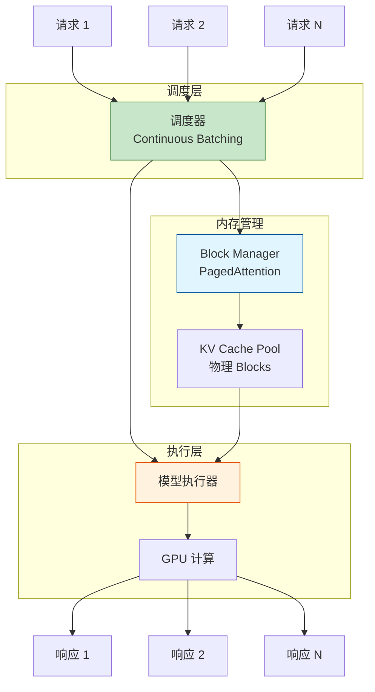

# Q14: GPU 并发与批处理优化

## 问题

GPU 支持分时复用吗？如果 Decode 阶段 GPU 利用率低（15%），能否通过多用户并发来提高利用率，从而降低成本？

## 回答

**简短答案：是的，但实现非常复杂！**

这正是现代 LLM 推理系统（vLLM、TensorRT-LLM 等）的核心优化方向。GPU 确实可以通过**并发批处理**提高利用率，但面临独特的挑战。

---

## 一、GPU "分时复用" 的本质

### **传统 GPU 分时复用**

#### **CUDA 的并发机制**

GPU 本身并不是真正的"分时"（time-slicing），而是**空间并行**：

```
GPU 硬件结构:
┌─────────────────────────────────┐
│  108 个 SM (Streaming Multiprocessor) │
│  ┌──┬──┬──┬──┬──┬──┬──┬──┐   │
│  │SM│SM│SM│SM│SM│SM│SM│SM│   │
│  └──┴──┴──┴──┴──┴──┴──┴──┘   │
│  每个 SM: 64 个 CUDA 核心      │
└─────────────────────────────────┘
```

**CUDA 流（Stream）并发**：
```python
# 两个独立的计算任务
stream1 = torch.cuda.Stream()
stream2 = torch.cuda.Stream()

with torch.cuda.stream(stream1):
    output1 = model1(input1)  # 使用部分 SM

with torch.cuda.stream(stream2):
    output2 = model2(input2)  # 使用另一部分 SM

# 两个任务可以并行执行（如果资源足够）
```

**关键限制**：
- 需要足够的 **SM**（计算资源）
- 需要足够的 **显存**（HBM）
- 需要足够的 **内存带宽**

---

### **LLM 推理的特殊性**

#### **为什么 LLM 不同？**

**传统深度学习任务**（如图像分类）：
```
输入: Batch of images (固定大小)
      [Image1, Image2, ..., ImageN]

模型: CNN

输出: Batch of predictions
      [Pred1, Pred2, ..., PredN]

特点:
- 所有输入长度相同
- 计算量相同
- 完美并行
```

**LLM 推理任务**：
```
用户 1: "Hello" → 生成 50 tokens
用户 2: "Translate this long document..." → 生成 500 tokens
用户 3: "Yes or no?" → 生成 2 tokens

特点:
- 输入长度不同 (5 vs 2000 tokens)
- 输出长度不同 (2 vs 500 tokens)
- 生成时间不同 (0.2s vs 5s)
- KV Cache 大小不同
```

**关键挑战**：
> **LLM 推理是动态的、异步的、长度不一的序列生成任务**

---

## 二、朴素批处理的问题

### **静态批处理（Static Batching）**

#### **传统做法**

```python
# 收集一批请求
batch = [
    Request(prompt="Hello", max_tokens=50),
    Request(prompt="What is AI?", max_tokens=100),
    Request(prompt="Yes", max_tokens=5)
]

# 填充（Padding）到相同长度
inputs = pad_sequences([r.prompt for r in batch])
# Shape: (batch_size, max_seq_len)

# 批量推理
outputs = model.generate(inputs, max_tokens=100)
```

#### **问题 1：Padding 浪费**

```
请求 1: "Hello_______________" (5 有效 + 15 填充)
请求 2: "What is AI?________" (15 有效 + 5 填充)
请求 3: "Yes________________" (3 有效 + 17 填充)

计算量:
  有效: 5 + 15 + 3 = 23 tokens
  实际: 20 + 20 + 20 = 60 tokens

浪费: 37 / 60 = 62% 的计算！
```

**Padding 导致巨大浪费！**

---

#### **问题 2：生成长度不一**

```
用户 1: 生成 5 tokens   → 0.5s 完成
用户 2: 生成 50 tokens  → 5s 完成
用户 3: 生成 100 tokens → 10s 完成

静态批处理:
  必须等最慢的用户 3 完成（10s）
  用户 1 在 0.5s 就完成了，但要等 9.5s！

GPU 利用:
  0-0.5s:  3 个请求（100% batch）
  0.5-5s:  2 个请求（67% batch）
  5-10s:   1 个请求（33% batch）

平均利用: (1 + 0.67 + 0.33) / 3 ≈ 67%
```

**长尾请求拖累整体效率！**

---

#### **问题 3：显存占用**

```
Batch size = 8
Max sequence length = 2048

KV Cache 大小:
  2 × 96 layers × 8 batch × 2048 seq × 12288 d × 2 bytes
  ≈ 75 GB

问题:
- 大部分序列远小于 2048
- Padding 部分的 KV Cache 完全浪费
- 显存利用率低
```

---

## 三、动态批处理（Continuous Batching）

### **核心思想**

> **请求完成后立即移出，新请求立即加入，保持 batch 动态变化**

```
时刻 0:   [Req1, Req2, Req3, Req4]  (batch=4)
         生成第 1 个 token

时刻 1:   [Req1, Req2, Req3, Req4]  (batch=4)
         Req1 完成! → 移出
         Req5 加入 → 补充

时刻 2:   [Req5, Req2, Req3, Req4]  (batch=4)
         生成下一个 token

时刻 3:   [Req5, Req2, Req3, Req4]  (batch=4)
         Req3 完成! → 移出
         Req6 加入 → 补充

...
```

**关键优势**：
- ✅ **无需等待**：完成的请求立即返回
- ✅ **动态补充**：新请求立即加入
- ✅ **高利用率**：batch 始终保持满载

---

### **实现示例**

```python
class ContinuousBatchingEngine:
    def __init__(self, max_batch_size=8):
        self.active_requests = {}  # {request_id: RequestState}
        self.pending_queue = []
        self.max_batch_size = max_batch_size

    def add_request(self, request):
        """新请求加入队列"""
        self.pending_queue.append(request)

    def step(self):
        """生成一步（一个 token）"""
        # 1. 补充 batch（如果有空位）
        while len(self.active_requests) < self.max_batch_size and self.pending_queue:
            new_req = self.pending_queue.pop(0)
            self.active_requests[new_req.id] = new_req

        # 2. 批量生成下一个 token
        batch_inputs = [req.get_next_input() for req in self.active_requests.values()]
        batch_outputs = self.model.generate_step(batch_inputs)

        # 3. 更新每个请求
        completed = []
        for req_id, output in zip(self.active_requests.keys(), batch_outputs):
            req = self.active_requests[req_id]
            req.append_token(output)

            if req.is_finished():
                completed.append(req_id)

        # 4. 移除完成的请求
        for req_id in completed:
            finished_req = self.active_requests.pop(req_id)
            self.return_result(finished_req)

    def run(self):
        """持续运行"""
        while self.active_requests or self.pending_queue:
            self.step()
```

---

### **效果对比**

#### **静态批处理**

```
时间线:
0s ────────────── 10s
Req1: ████         (5 tokens, 0.5s, 等待 9.5s)
Req2: ████████████ (50 tokens, 5s, 等待 5s)
Req3: ██████████████████ (100 tokens, 10s)

平均延迟: (0.5 + 5 + 10) / 3 = 5.17s
吞吐量: 155 tokens / 10s = 15.5 t/s
```

#### **连续批处理**

```
时间线:
0s ─ 0.5s ──── 5s ──── 10s
Req1: ████ (返回)
Req2: ████████████ (返回)
Req3: ██████████████████ (返回)
Req4:      ████ (新加入, 0.5s 返回)
Req5:           ████████ (新加入, 4s 返回)
Req6:                    ████ (新加入)

平均延迟: (0.5 + 5 + 10 + 0.5 + 4 + ...) / N
吞吐量: (155 + 5 + 40 + ...) / 10s ≈ 25+ t/s
```

**提升**：
- 吞吐量：+60%
- 延迟：短请求无需等待
- GPU 利用：始终满 batch

---

## 四、显存管理的挑战

### **KV Cache 的碎片化问题**

#### **问题描述**

```
显存布局（传统）:
┌──────────────────────────────────────┐
│ Req1 KV Cache (2048 tokens)          │  ← 固定分配
├──────────────────────────────────────┤
│ Req2 KV Cache (2048 tokens)          │
├──────────────────────────────────────┤
│ Req3 KV Cache (2048 tokens)          │
└──────────────────────────────────────┘

实际使用:
Req1: 只用 50 tokens   (浪费 2048 - 50 = 1998)
Req2: 只用 500 tokens  (浪费 1548)
Req3: 用满 2048 tokens

总浪费: (1998 + 1548) / (3 × 2048) = 58%
```

**传统内存分配问题**：
- 必须预先分配最大长度
- 大量空间浪费
- 限制了 batch size

---

### **PagedAttention（vLLM 的解决方案）**

#### **核心思想**

> **像操作系统的虚拟内存一样管理 KV Cache**

**操作系统的虚拟内存**：
```
虚拟地址空间 → 物理内存（分页）

进程 A: [Page 0] [Page 1] [Page 2]
        ↓        ↓        ↓
物理:   [Frame 5] [Frame 2] [Frame 8]

优势:
- 不连续的物理内存
- 按需分配
- 共享页（如代码段）
```

**PagedAttention**：
```
KV Cache 虚拟空间 → 物理 GPU 内存（分块）

Req1: [Block 0] [Block 1] [Block 2]
      ↓         ↓         ↓
物理:  [Slot 5]  [Slot 2]  [Slot 8]

优势:
- 不连续的 GPU 内存
- 按需分配（动态增长）
- 共享 Block（如 System Prompt）
```

---

#### **详细设计**

```python
class PagedKVCache:
    def __init__(self, block_size=16, num_blocks=1000):
        """
        block_size: 每个 block 包含多少个 token 的 KV
        num_blocks: 物理内存中有多少个 block
        """
        self.block_size = block_size

        # 物理内存：预分配所有 block
        self.physical_blocks = torch.zeros(
            num_blocks,           # 总 block 数
            2,                    # K, V
            num_layers,           # 层数
            block_size,           # 每 block 的 token 数
            d_model               # 维度
        )

        # 空闲 block 池
        self.free_blocks = set(range(num_blocks))

        # 请求的 block 表
        self.block_tables = {}  # {request_id: [block_id1, block_id2, ...]}

    def allocate(self, request_id, num_tokens):
        """为请求分配 KV Cache"""
        # 计算需要多少个 block
        num_blocks_needed = math.ceil(num_tokens / self.block_size)

        # 分配 block
        allocated_blocks = []
        for _ in range(num_blocks_needed):
            if not self.free_blocks:
                raise OutOfMemoryError("No free blocks!")
            block_id = self.free_blocks.pop()
            allocated_blocks.append(block_id)

        # 记录 block 表
        self.block_tables[request_id] = allocated_blocks
        return allocated_blocks

    def append_token(self, request_id, new_kv):
        """为请求追加新 token 的 KV"""
        blocks = self.block_tables[request_id]
        current_length = len(blocks) * self.block_size

        # 如果当前 block 满了，分配新 block
        if current_length % self.block_size == 0:
            new_block = self.free_blocks.pop()
            blocks.append(new_block)

        # 写入 KV
        block_id = blocks[-1]
        offset = (current_length % self.block_size)
        self.physical_blocks[block_id, :, :, offset, :] = new_kv

    def free(self, request_id):
        """释放请求的 KV Cache"""
        blocks = self.block_tables.pop(request_id)
        self.free_blocks.update(blocks)

    def get_kv(self, request_id):
        """获取请求的完整 KV Cache"""
        blocks = self.block_tables[request_id]
        # 按 block 表拼接（非连续）
        kv_list = [self.physical_blocks[bid] for bid in blocks]
        return torch.cat(kv_list, dim=2)  # 沿 seq_len 维度拼接
```

---

#### **优势演示**

**传统分配**：
```
显存总量: 80 GB (A100)
单个请求最大: 2048 tokens × 9.6 MB ≈ 10 GB
最大 batch: 80 / 10 = 8

实际使用:
  Req1: 50 tokens   (使用 0.24 GB, 分配 10 GB)
  Req2: 500 tokens  (使用 2.4 GB,  分配 10 GB)
  ...

  最多支持 8 个请求
```

**PagedAttention**：
```
显存总量: 80 GB
Block size: 16 tokens × 9.6 MB ≈ 0.15 GB

物理 block 数: 80 / 0.15 ≈ 533 blocks

实际使用:
  Req1: 50 tokens   = 4 blocks   (0.6 GB)
  Req2: 500 tokens  = 32 blocks  (4.8 GB)
  Req3: 50 tokens   = 4 blocks   (0.6 GB)
  ...

  可支持: 533 / 平均 block 数 ≈ 20+ 请求
```

**提升**：
- Batch size: 8 → 20+（2.5× 提升）
- 显存利用率：40% → 90%
- 吞吐量：+2-3×

---

### **Prefix Sharing（前缀共享）**

#### **应用场景**

许多请求共享相同的前缀：

```
System Prompt (固定):
"You are a helpful assistant. Answer concisely and accurately."
(100 tokens)

请求:
  User1: System + "What is AI?"
  User2: System + "Translate: Hello"
  User3: System + "Summarize: ..."

都共享相同的 System Prompt!
```

#### **PagedAttention 的共享**

```python
# System Prompt 的 KV Cache
system_kv_blocks = [Block0, Block1, Block2]  # 100 tokens = 7 blocks

# 用户 1 的 block 表
block_tables[user1] = [Block0, Block1, Block2, Block10, Block11]
                       ↑ 共享 System     ↑ 私有部分

# 用户 2 的 block 表
block_tables[user2] = [Block0, Block1, Block2, Block20, Block21]
                       ↑ 共享 System     ↑ 私有部分

# 物理内存
Block0, Block1, Block2: 被多个请求共享（只存一份）
```

**效果**：
```
无共享:
  100 用户 × 100 tokens System Prompt = 10,000 tokens = 96 GB

有共享:
  100 tokens × 1 份 = 100 tokens = 0.96 GB

节省: 99%!
```

---

## 五、实际系统架构

### **vLLM 的完整架构**



---

### **调度算法**

```python
class vLLMScheduler:
    def __init__(self, max_batch_size=256):
        self.running = []      # 正在生成的请求
        self.waiting = []      # 等待的请求
        self.max_batch = max_batch_size
        self.block_manager = BlockManager()

    def schedule(self):
        """每步调度决策"""
        # 1. 移除完成的请求
        self.running = [r for r in self.running if not r.is_finished()]

        # 2. 尝试添加新请求
        while len(self.running) < self.max_batch and self.waiting:
            new_req = self.waiting[0]

            # 检查是否有足够的 block
            blocks_needed = self.estimate_blocks(new_req)
            if self.block_manager.can_allocate(blocks_needed):
                self.waiting.pop(0)
                self.block_manager.allocate(new_req.id, blocks_needed)
                self.running.append(new_req)
            else:
                break  # 显存不足，等待

        # 3. 返回当前 batch
        return self.running

    def estimate_blocks(self, request):
        """估算请求需要的 block 数"""
        prompt_len = len(request.prompt)
        max_gen_len = request.max_tokens
        total_len = prompt_len + max_gen_len
        return math.ceil(total_len / BLOCK_SIZE)
```

---

### **性能对比**

#### **基准测试**（ShareGPT 数据集）

| 系统 | 吞吐量 (req/s) | 延迟 P50 (s) | 延迟 P99 (s) | Batch Size |
|------|---------------|-------------|-------------|-----------|
| **HuggingFace** | 1.2 | 8.5 | 25.3 | 8 |
| **FasterTransformer** | 2.1 | 5.2 | 18.7 | 16 |
| **vLLM** | **5.8** | **2.3** | **7.1** | **50+** |

**vLLM 提升**：
- 吞吐量：4.8× vs HuggingFace
- 延迟：3.7× 更低（P50）
- Batch size：6× 更大

---

## 六、为什么仍然有成本差异？

### **即使优化后的现实**

虽然 Continuous Batching + PagedAttention 大幅提升了效率，但：

#### **1. Decode 仍然受限于内存带宽**

```
即使 batch_size = 64:
  每个 token 仍需读取完整 KV Cache

单个请求:
  内存访问: 4.7 GB / token

Batch 64:
  内存访问: 64 × 4.7 GB = 300 GB
  A100 带宽: 1.5 TB/s
  时间: 300 / 1500 = 0.2s

但计算只需:
  64 × 118B FLOPs / 312 TFLOPS = 0.024s

内存仍是瓶颈（8× 慢）！
```

---

#### **2. Batch 的不均衡性**

```
理想情况: batch 始终满载 (64)
实际情况:
  高峰期: batch = 64（满载）
  低峰期: batch = 10（部分载）

平均: ~30-40

GPU 利用率:
  高峰: 40%
  低峰: 15%
  平均: 25-30%
```

**仍然低于 Prefill 的 80%！**

---

#### **3. 长尾请求**

```
99% 请求: 50-200 tokens（快）
1% 请求:  2000+ tokens（慢）

长请求:
- 占用 KV Cache 久
- 阻塞新请求加入
- 降低平均 batch size
```

---

#### **4. 硬件限制**

```
A100 80GB:
  最优 batch (PagedAttention): ~50-80

但受限于:
- 内存带宽（1.5 TB/s）
- SM 数量（108）
- Tensor Core 利用率

实际平均 batch: ~30-40
实际 GPU 利用率: ~25-35%
```

---

### **成本对比（优化后）**

#### **Prefill**
```
GPU 利用率: 80%
Batch size: 32（容易达到）
吞吐量: 5000 tokens/s
成本: $10/1M tokens
```

#### **Decode（优化后）**
```
GPU 利用率: 30%（提升了，但仍低）
Batch size: 40（PagedAttention）
吞吐量: 800 tokens/s（提升 8×）
成本: $30/1M tokens

成本降低:
  未优化: $100/1M → 优化后: $30/1M（3× 降低）
  但仍比 Prefill 贵 3×
```

---

## 七、总结

### **GPU 并发的实现**

| 技术 | 作用 | 提升 |
|------|------|------|
| **Continuous Batching** | 动态调度，无需等待 | 吞吐量 +60% |
| **PagedAttention** | 显存高效管理 | Batch size +2.5× |
| **Prefix Sharing** | 共享公共前缀 | 显存 -90% |
| **综合效果** | vLLM | 吞吐量 +4-5× |

---

### **为什么仍有成本差异？**

即使有这些优化：

1. **内存带宽瓶颈不变**
   - Arithmetic Intensity 仍然低
   - 每 token 必须读 KV Cache

2. **批处理效率有限**
   - 请求长度不一
   - 长尾请求影响
   - 平均 batch < 最大 batch

3. **GPU 利用率差距**
   - Prefill: 80%（计算密集）
   - Decode: 30%（内存密集）

4. **机会成本仍存在**
   - 同样 GPU 时间，Prefill 仍能处理更多 token

---

### **定价的合理性**

```
优化前:
  Decode 真实成本: ~$1000/1M tokens
  定价: $30/1M（97% 补贴）

优化后:
  Decode 真实成本: ~$50/1M tokens（降低 20×）
  定价: $30/1M（40% 补贴）

仍然补贴，但合理多了！
```

---

### **关键洞察**

$$\boxed{\text{并发优化} \neq \text{消除内存瓶颈}}$$

**并发批处理的价值**：
- ✅ 提升吞吐量（4-5×）
- ✅ 降低延迟（短请求）
- ✅ 提高显存利用率（2-3×）
- ✅ 支持更大 batch（2-3×）

**但无法改变**：
- ❌ Arithmetic Intensity 低
- ❌ 内存带宽瓶颈
- ❌ 串行生成特性

**结论**：
> **优化大幅降低了成本（20×），但 Decode 本质上仍是内存密集型任务，成本高于 Prefill 是合理的。**

---

## 相关主题

- vLLM 源码分析
- PagedAttention 详细实现
- Continuous Batching 调度算法
- KV Cache 压缩技术
- Speculative Decoding（推测解码）
- Multi-LoRA 并发推理
- Tensor Parallelism（张量并行）
- Pipeline Parallelism（流水线并行）
- Memory-Efficient Attention 变体
- GPU 内存带宽优化技术
