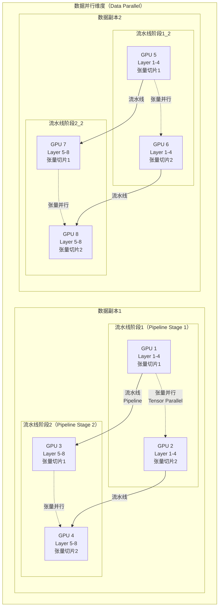
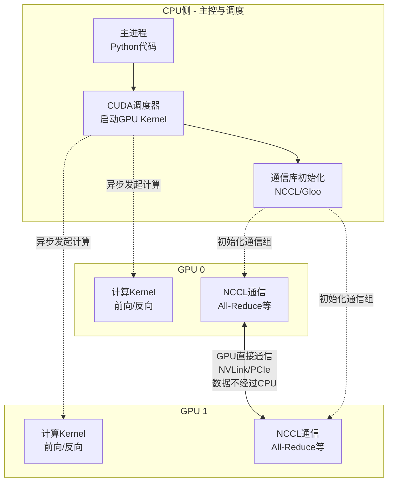
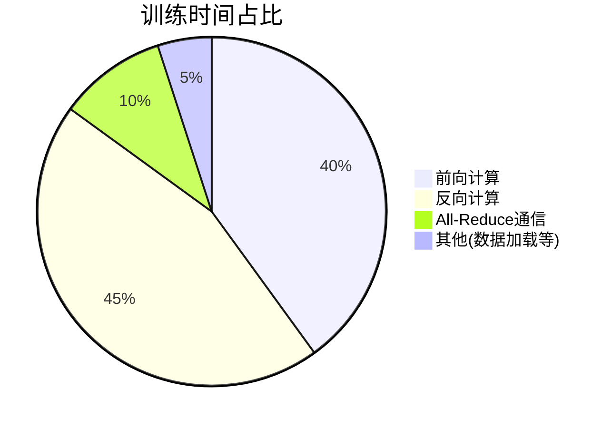

# 多GPU协同训练与推理

## 问题
多张显卡是如何协同工作，来完成同一个大模型的训练或推理的？

## 回答

在大模型训练和推理中，多GPU协同工作主要有以下几种策略，实际应用中通常会结合使用。

### 1. 数据并行（Data Parallelism, DP）

**核心原理：**
- 每个GPU拥有模型的**完整副本**
- 将一个大batch的数据分割到不同GPU上
- 各GPU独立计算梯度，然后同步梯度进行参数更新

**数学表示：**

假设batch size为 $B$，有 $N$ 个GPU：
- 每个GPU处理 $B/N$ 个样本
- GPU $i$ 计算局部梯度：

$$
g_i = \frac{1}{B/N} \sum_{j=1}^{B/N} \nabla L(x_j, \theta)
$$

- 全局梯度通过All-Reduce操作聚合：

$$
g = \frac{1}{N} \sum_{i=1}^{N} g_i
$$

**通信模式：**
- 使用All-Reduce操作同步梯度
- 通信量：$O(\text{模型参数量})$
- 参数更新后，所有GPU的模型保持一致

**优缺点：**
- ✅ 实现简单，适合模型能装入单卡显存的情况
- ✅ 扩展性好，加速比接近线性
- ❌ 模型参数被复制 $N$ 份，显存利用率低
- ❌ 不适用于超大模型（单卡装不下）

### 2. 模型并行（Model Parallelism, MP）

**核心原理：**
- 将模型的**不同层**分配到不同GPU
- 数据在GPU之间流动，每个GPU负责部分层的计算

**分割示例（以12层Transformer为例）：**
```
GPU 0: Embedding + Layer 1-4
GPU 1: Layer 5-8
GPU 2: Layer 9-12 + Output Head
```

**计算流程：**
- **前向传播：** 数据依次通过 GPU 0 → GPU 1 → GPU 2
- **反向传播：** 梯度反向传递 GPU 2 → GPU 1 → GPU 0

**通信开销：**
- 需要在GPU间传递激活值和梯度
- 通信量：$O(\text{batch\_size} \times \text{seq\_len} \times d_{model})$

**优缺点：**
- ✅ 可以训练单卡装不下的大模型
- ❌ GPU利用率低（同一时刻只有一个GPU在工作）
- ❌ 通信开销大（层与层之间需要频繁传递数据）
- ❌ 存在严重的GPU空闲问题（bubble time）

### 3. 流水线并行（Pipeline Parallelism, PP）

**核心原理：**
- 模型并行的改进版，解决GPU空闲问题
- 将一个batch分成多个**micro-batch**
- 流水线式处理，提高GPU利用率

**执行流程示意（3个GPU，4个micro-batch）：**

```mermaid
gantt
    title Pipeline Parallelism 执行时序
    dateFormat X
    axisFormat %s

    section GPU 0
    F1 (前向): 0, 1
    F2: 1, 2
    F3: 2, 3
    F4: 3, 4
    B1 (反向): 6, 7
    B2: 7, 8
    B3: 8, 9
    B4: 9, 10

    section GPU 1
    F1: 1, 2
    F2: 2, 3
    F3: 3, 4
    F4: 4, 5
    B1: 5, 6
    B2: 6, 7
    B3: 7, 8
    B4: 8, 9

    section GPU 2
    F1: 2, 3
    F2: 3, 4
    F3: 4, 5
    F4: 5, 6
    B1: 4, 5
    B2: 5, 6
    B3: 6, 7
    B4: 7, 8
```



**关键要点：**
- F = Forward pass（前向传播），B = Backward pass（反向传播）
- 通过micro-batch流水线，多个GPU可以并行工作
- 仍存在bubble time（图中的空白区域），但比纯模型并行大幅改善

**数学分析：**

设：
- $p$ = 流水线阶段数（GPU数量）
- $m$ = micro-batch数量
- $t_f$ = 单个micro-batch前向传播时间
- $t_b$ = 单个micro-batch反向传播时间

Bubble time占比：
$$
\text{Bubble Ratio} = \frac{p-1}{m} \times \frac{t_f + t_b}{t_f + t_b} = \frac{p-1}{m}
$$

**优缺点：**
- ✅ 提高GPU利用率，减少空闲时间
- ✅ 可以训练更大的模型
- ❌ 仍有bubble time（$m$ 越大越好，但受显存限制）
- ❌ 需要权衡micro-batch大小和训练稳定性

### 4. 张量并行（Tensor Parallelism, TP）

**核心原理：**
- 将单个层的**参数矩阵**切分到多个GPU
- 所有GPU同时计算同一层的不同部分
- 层内并行，消除了模型并行的GPU空闲问题

**Self-Attention层的张量切分：**

假设隐藏维度 $d_{model} = 1024$，使用2个GPU进行张量并行：

**方案1：按输出维度切分**

Q、K、V投影矩阵按列切分：
```
GPU 0: W_Q[:, 0:512], W_K[:, 0:512], W_V[:, 0:512]
GPU 1: W_Q[:, 512:1024], W_K[:, 512:1024], W_V[:, 512:1024]
```

**计算过程：**

1. **输入复制**：输入 $X \in \mathbb{R}^{B \times L \times d_{model}}$ 复制到两个GPU

2. **并行计算投影**：
   - GPU 0: $Q_0 = XW_{Q0}$, $K_0 = XW_{K0}$, $V_0 = XW_{V0}$
   - GPU 1: $Q_1 = XW_{Q1}$, $K_1 = XW_{K1}$, $V_1 = XW_{V1}$

3. **并行计算注意力**：
   - GPU 0: $\text{Attention}_0(Q_0, K_0, V_0)$
   - GPU 1: $\text{Attention}_1(Q_1, K_1, V_1)$

4. **拼接结果**：通过All-Gather操作收集并拼接 $[\text{Attention}_0; \text{Attention}_1]$

**Feed-Forward层的张量切分：**

两层全连接 $\text{FFN}(x) = \text{ReLU}(xW_1 + b_1)W_2 + b_2$

按列切分第一层，按行切分第二层：
```
GPU 0: W1[:, 0:2048], W2[0:2048, :]
GPU 1: W1[:, 2048:4096], W2[2048:4096, :]
```

计算流程：
1. GPU 0计算：$h_0 = \text{ReLU}(xW_{1,0})$
2. GPU 1计算：$h_1 = \text{ReLU}(xW_{1,1})$
3. 各自计算：$y_0 = h_0 W_{2,0}$, $y_1 = h_1 W_{2,1}$
4. All-Reduce求和：$y = y_0 + y_1$

**通信开销：**
- All-Gather和All-Reduce操作
- 通信量：$O(\text{batch\_size} \times \text{seq\_len} \times d_{model})$

**优缺点：**
- ✅ GPU利用率高，所有GPU同时工作
- ✅ 适合层内参数量大的模型
- ❌ 通信频繁，对GPU间互联带宽要求高（需要NVLink）
- ❌ 扩展性受限（通常不超过8卡）

### 5. 混合并行策略（3D Parallelism）

实际大模型训练通常结合多种策略，形成**3D并行**：

**组合方式：**
- **数据并行（Data Parallel）**：跨数据副本
- **流水线并行（Pipeline Parallel）**：跨层
- **张量并行（Tensor Parallel）**：层内

**架构示意图：**



**配置原则：**
1. **张量并行度**（2-8）：受单机GPU互联带宽限制
2. **流水线并行度**（2-16）：根据模型层数和单阶段层数决定
3. **数据并行度**（任意）：剩余GPU全部用于数据并行

**实际案例：GPT-3 (175B参数)**
- 数据并行度：64
- 模型并行度：8（张量并行）
- 总GPU数：512 (64 × 8)
- 训练硬件：V100 GPU集群

### 6. ZeRO优化（Zero Redundancy Optimizer）

**核心思想：**
消除数据并行中的参数、梯度和优化器状态的冗余存储。

**传统数据并行的显存占用：**

对于每个GPU，显存分为：
1. **模型参数**：$\Psi$ (假设FP16，2字节/参数)
2. **梯度**：$\Psi$ (2字节/参数)
3. **优化器状态**：
   - Adam优化器需要存储momentum和variance
   - FP32精度：$2 \times 4\Psi = 8\Psi$ 字节

总计：$2\Psi + 2\Psi + 8\Psi = 12\Psi$ 字节

**ZeRO的三个阶段：**

**ZeRO-1：分片优化器状态**
- 每个GPU只存储 $1/N$ 的优化器状态
- 显存占用：$2\Psi + 2\Psi + \frac{8\Psi}{N} = 4\Psi + \frac{8\Psi}{N}$
- 节省：$8\Psi(1 - 1/N)$

**ZeRO-2：分片梯度**
- 进一步分片梯度存储
- 显存占用：$2\Psi + \frac{2\Psi}{N} + \frac{8\Psi}{N} = 2\Psi + \frac{10\Psi}{N}$
- 节省：$10\Psi(1 - 1/N)$

**ZeRO-3：分片模型参数**
- 连模型参数也分片存储
- 显存占用：$\frac{2\Psi + 2\Psi + 8\Psi}{N} = \frac{12\Psi}{N}$
- 节省比例：$N$ 倍

**动态参数收集：**

ZeRO-3在计算时动态收集所需参数：
1. **前向传播**：收集当前层参数 → 计算 → 释放
2. **反向传播**：收集当前层参数和梯度 → 计算 → 释放

**通信开销：**
- All-Gather参数：每层一次
- Reduce-Scatter梯度：每层一次
- 总通信量与数据并行相当，但时间点分散

**优缺点：**
- ✅ 显著减少显存占用（最多 $N$ 倍）
- ✅ 可训练超大模型
- ❌ 增加通信次数和计算overhead
- ❌ 需要高带宽网络支持

### 7. 推理优化策略

大模型推理时的多GPU协同有特殊考虑：

**1. 模型并行 + 张量并行**
- 单个请求延迟敏感，不适合数据并行
- 通常使用张量并行（层内）+ 流水线并行（跨层）
- 目标：最小化单次推理延迟

**2. 批处理（Batching）**
- 将多个用户请求合并成一个batch
- 提高GPU利用率和吞吐量
- 挑战：不同请求的序列长度不同（需要padding）

**3. KV Cache共享**
- 对于相同的prompt前缀，共享KV Cache
- 减少重复计算，节省显存
- 适用于多轮对话、批量生成等场景

**4. 动态批处理（Continuous Batching）**
- 传统批处理：等待整个batch中最长序列完成
- 动态批处理：序列完成后立即替换为新请求
- 显著提高吞吐量（vLLM、TGI等实现）

**5. 模型量化**
- INT8量化：推理速度提升2-4倍
- INT4量化：显存占用降低4倍
- 结合多GPU，可部署更大模型

**推理架构示例（8卡服务）：**
```
请求1 → 负载均衡 → [GPU 0-3] 张量并行推理实例1
请求2 →         → [GPU 4-7] 张量并行推理实例2
```
或
```
请求 → [GPU 0-7] 单个张量并行实例（更大模型）
```

## 总结

多GPU协同训练和推理的核心是在**计算效率、通信开销、显存占用**之间找到平衡：

| 策略 | 适用场景 | 主要优势 | 主要限制 |
|-----|---------|---------|---------|
| 数据并行 | 模型适中、数据量大 | 实现简单、扩展性好 | 模型冗余、显存浪费 |
| 模型并行 | 超大模型 | 突破单卡限制 | GPU利用率低 |
| 流水线并行 | 超大模型 | 提高利用率 | 存在bubble time |
| 张量并行 | 层内参数量大 | 利用率最高 | 通信频繁、扩展性差 |
| ZeRO | 显存受限 | 显存优化显著 | 通信和计算overhead |
| 3D并行 | 千亿级模型训练 | 综合最优 | 配置复杂 |

**实践建议：**
1. 中等模型（<10B）：数据并行 + ZeRO-2
2. 大模型（10B-100B）：数据并行 + 张量并行（2-8卡）
3. 超大模型（>100B）：3D并行（DP + PP + TP）
4. 推理服务：张量并行 + 动态批处理 + KV Cache优化

---

## 追问与深入讨论

### 追问1：多GPU的协调是通过CPU完成的吗？

**答案：部分通过CPU，但主要是GPU之间直接通信。**

#### CPU和GPU的角色分工



#### 详细的工作流程

**1. CPU的职责（控制流）：**

```python
# 伪代码示例
import torch.distributed as dist

# CPU侧：初始化分布式环境
dist.init_process_group(backend='nccl', rank=rank, world_size=world_size)

for batch in dataloader:
    # CPU侧：调度GPU kernel启动
    output = model(batch)        # CPU发起前向计算kernel
    loss = criterion(output)
    loss.backward()              # CPU发起反向计算kernel

    # CPU侧：发起同步操作（实际传输由GPU完成）
    dist.all_reduce(grad)        # CPU调用NCCL，GPU执行通信

    optimizer.step()
```

- **启动训练脚本**：管理多个进程（每个GPU一个进程）
- **调度GPU Kernel**：调用CUDA API启动计算任务
- **协调同步点**：设置barrier，确保各GPU在关键点同步
- **管理通信组**：初始化NCCL通信环境

**2. GPU的职责（数据流）：**

- **独立计算**：前向传播、反向传播、梯度计算
- **直接通信**：通过NCCL库，GPU间点对点传输数据
- **数据不回CPU**：梯度、激活值等大数据完全在GPU间流动

#### NCCL通信机制

**NCCL (NVIDIA Collective Communications Library)** 是GPU间通信的核心：

**通信路径示例（8卡A100，DGX系统）：**

```
GPU 0 ←→ GPU 1 ←→ GPU 2 ←→ GPU 3
  ↕       ↕       ↕       ↕
GPU 4 ←→ GPU 5 ←→ GPU 6 ←→ GPU 7

连接方式：NVLink 3.0（600 GB/s双向）
拓扑结构：NVSwitch全连接
```

**All-Reduce实现（Ring算法）：**

1. **Reduce-Scatter阶段**：每个GPU将数据切片，发送给下一个GPU
2. **All-Gather阶段**：每个GPU收集所有切片，重建完整数据
3. **全程在GPU间直接传输**，CPU只负责发起调用

#### 为什么不经过CPU？

**性能对比：**

| 路径 | 带宽 | 延迟 | 适用性 |
|-----|-----|------|--------|
| GPU → CPU → GPU | ~32 GB/s (PCIe) | ~10-20 μs | ❌ 瓶颈大 |
| GPU → GPU (PCIe P2P) | ~32 GB/s | ~5 μs | ⚠️ 可用但慢 |
| GPU → GPU (NVLink) | ~600 GB/s | ~1-2 μs | ✅ 最优 |

**结论：** CPU是"总指挥"，GPU是"执行者"。CPU发号施令，GPU独立作战并互相通信。

---

### 追问2：多GPU切割是PyTorch等框架支持的吗？

**答案：PyTorch原生支持部分并行策略，更高级的并行需要专门库。**

#### PyTorch原生支持

**1. DataParallel (DP) - 已过时，不推荐**

```python
import torch.nn as nn

# 单进程，多线程方式
model = nn.DataParallel(model, device_ids=[0, 1, 2, 3])
output = model(input)  # 自动数据并行
```

**特点：**
- ✅ 使用极简单，一行代码
- ❌ 性能差（数据通过CPU中转）
- ❌ GPU 0负载不均（参数gather在GPU 0）
- ❌ Python GIL限制（单进程多线程）
- **不推荐使用**

**2. DistributedDataParallel (DDP) - 推荐的数据并行方案**

```python
import torch.distributed as dist
from torch.nn.parallel import DistributedDataParallel as DDP

# 多进程启动（每个GPU独立进程）
dist.init_process_group(backend='nccl', init_method='env://')
model = model.to(device)
model = DDP(model, device_ids=[local_rank])

# 训练循环
for batch in dataloader:
    output = model(batch)
    loss.backward()
    optimizer.step()  # DDP自动同步梯度
```

**特点：**
- ✅ 每个GPU独立进程，无GIL限制
- ✅ 使用NCCL，GPU直接通信
- ✅ 性能优秀，接近线性扩展
- ✅ 支持单机多卡和多机多卡
- **适用：数据并行**

**启动方式：**
```bash
# torchrun启动（推荐）
torchrun --nproc_per_node=8 train.py

# 或传统方式
python -m torch.distributed.launch --nproc_per_node=8 train.py
```

**3. FSDP (Fully Sharded Data Parallel) - PyTorch 1.11+**

```python
from torch.distributed.fsdp import FullyShardedDataParallel as FSDP
from torch.distributed.fsdp import ShardingStrategy

# ZeRO-3风格的数据并行
model = FSDP(
    model,
    sharding_strategy=ShardingStrategy.FULL_SHARD,  # ZeRO-3
    # sharding_strategy=ShardingStrategy.SHARD_GRAD_OP,  # ZeRO-2
)
```

**特点：**
- ✅ PyTorch官方的ZeRO实现
- ✅ 显存优化，可训练更大模型
- ✅ 与PyTorch生态集成好
- **适用：数据并行 + ZeRO优化**

**对比DeepSpeed ZeRO：**
- FSDP更易用，与PyTorch原生集成
- DeepSpeed功能更强（支持TP、PP），性能略优

#### 专门的并行库

**1. DeepSpeed (微软) - 全能型并行库**

```python
import deepspeed

# 配置文件方式
ds_config = {
    "train_batch_size": 16,
    "gradient_accumulation_steps": 1,
    "optimizer": {"type": "Adam", "params": {"lr": 0.001}},
    "fp16": {"enabled": True},
    "zero_optimization": {
        "stage": 3,  # ZeRO-3
        "offload_optimizer": {"device": "cpu"}  # CPU offload
    }
}

model_engine, optimizer, _, _ = deepspeed.initialize(
    model=model,
    model_parameters=model.parameters(),
    config=ds_config
)

# 训练循环
for batch in dataloader:
    loss = model_engine(batch)
    model_engine.backward(loss)
    model_engine.step()
```

**支持的并行策略：**
- ✅ **ZeRO-1/2/3**：显存优化
- ✅ **流水线并行（PP）**：`pipeline_parallel_size`
- ✅ **张量并行（TP）**：需要配合Megatron
- ✅ **3D并行**：DP + PP + TP
- ✅ **CPU/NVMe Offload**：超大模型训练

**配置示例（3D并行）：**
```json
{
    "train_batch_size": 512,
    "pipeline": {
        "pipeline_parallel_size": 4,
        "pipe_partitioned": true
    },
    "tensor_parallel": {
        "tp_size": 2
    },
    "zero_optimization": {"stage": 1}
}
```

**2. Megatron-LM (NVIDIA) - 性能极致的Transformer并行**

```python
# Megatron需要深度修改模型代码
from megatron import mpu
from megatron.model import GPTModel

# 需要手动实现张量并行切分
class ParallelAttention(nn.Module):
    def __init__(self, hidden_size, num_heads):
        super().__init__()
        self.hidden_size = hidden_size
        self.num_heads = num_heads

        # 按张量并行切分
        self.query_key_value = mpu.ColumnParallelLinear(
            hidden_size,
            3 * hidden_size,
            gather_output=False
        )

        self.dense = mpu.RowParallelLinear(
            hidden_size,
            hidden_size,
            input_is_parallel=True
        )
```

**特点：**
- ✅ 性能最优（NVIDIA官方优化）
- ✅ 专为Transformer设计（GPT、BERT、T5）
- ✅ 支持TP + PP + DP
- ❌ 需要深度改写模型代码
- ❌ 学习曲线陡峭

**适用场景：**
- 训练千亿级Transformer模型
- 需要极致性能和效率
- 有专业团队维护

**3. Hugging Face Accelerate - 统一接口**

```python
from accelerate import Accelerator

# 自动选择并行策略
accelerator = Accelerator()
model, optimizer, dataloader = accelerator.prepare(
    model, optimizer, dataloader
)

# 训练代码无需修改
for batch in dataloader:
    outputs = model(**batch)
    loss = outputs.loss
    accelerator.backward(loss)
    optimizer.step()
```

**特点：**
- ✅ 统一API，兼容DDP、FSDP、DeepSpeed
- ✅ 代码改动最小
- ✅ 自动设备管理
- ⚠️ 性能略逊于直接使用底层库

**配置方式：**
```bash
# 交互式配置
accelerate config

# 自动生成配置文件 ~/.cache/huggingface/accelerate/default_config.yaml
```

#### 框架支持对比总结

| 方案 | 支持的并行 | 易用性 | 性能 | 适用场景 |
|-----|----------|-------|------|---------|
| **PyTorch DDP** | 数据并行 | ⭐⭐⭐⭐⭐ | ⭐⭐⭐⭐ | 中小模型，单机/多机 |
| **PyTorch FSDP** | DP + ZeRO | ⭐⭐⭐⭐ | ⭐⭐⭐⭐ | 大模型，显存受限 |
| **DeepSpeed** | DP+PP+TP+ZeRO | ⭐⭐⭐ | ⭐⭐⭐⭐⭐ | 超大模型，全面优化 |
| **Megatron-LM** | DP+PP+TP | ⭐⭐ | ⭐⭐⭐⭐⭐ | GPT/BERT，极致性能 |
| **Accelerate** | 自动选择 | ⭐⭐⭐⭐⭐ | ⭐⭐⭐⭐ | 快速原型，实验 |

**实践建议：**
- **研究/实验**：Accelerate（快速迭代）
- **中型生产**：DDP或FSDP（稳定可靠）
- **大规模训练**：DeepSpeed（功能全面）
- **极致优化**：Megatron-LM（需要专业团队）

---

### 追问3：GPU间数据传输成本如何？

**答案：取决于互联方式，差异可达20倍以上。**

#### 不同互联方式的性能参数

| 互联技术 | 典型带宽（双向） | 延迟 | 成本 | 使用场景 |
|---------|----------------|------|------|---------|
| **NVLink 2.0** | 300 GB/s | ~1-2 μs | 包含在V100卡内 | V100 DGX系统 |
| **NVLink 3.0** | 600 GB/s | ~1-2 μs | 包含在A100卡内 | A100 DGX系统 |
| **NVLink 4.0** | 900 GB/s | <1 μs | 包含在H100卡内 | H100 DGX系统 |
| **NVSwitch** | 4.8 TB/s 交换容量 | <1 μs | DGX专有 | 8卡全连接 |
| **PCIe 3.0 x16** | 16 GB/s | ~10 μs | 标准配置 | 消费级GPU |
| **PCIe 4.0 x16** | 32 GB/s | ~5 μs | 标准配置 | 数据中心GPU |
| **PCIe 5.0 x16** | 64 GB/s | ~3-5 μs | 新一代服务器 | 2023+服务器 |
| **InfiniBand HDR** | 200 Gb/s = 25 GB/s | ~1-2 μs | ~$5000/卡 | 跨节点通信 |
| **以太网 100GbE** | 100 Gb/s = 12.5 GB/s | ~10-50 μs | ~$1000/卡 | 跨节点通信 |
| **以太网 400GbE** | 400 Gb/s = 50 GB/s | ~5-20 μs | ~$3000/卡 | 新一代集群 |

#### DGX系统架构示例

**DGX A100（8x A100 80GB）拓扑：**

```
        [NVSwitch - 4.8 TB/s交换容量]
               /  |  |  |  |  |  \
             /    |  |  |  |  |    \
          A100  A100 A100 A100 A100  A100
          GPU0  GPU1 GPU2 GPU3 GPU4  GPU5

每个GPU到NVSwitch: 6x NVLink (600 GB/s)
任意两GPU间通信: 全带宽，无瓶颈
```

**对比：8x A100 PCIe服务器拓扑：**

```
         CPU - PCIe Switch - PCIe 4.0
         /  |   |   |   |   |   |  \
      GPU0 GPU1 GPU2 GPU3 GPU4 GPU5 GPU6 GPU7

每个GPU到CPU: PCIe 4.0 x16 (32 GB/s)
GPU间需经过PCIe Switch或CPU: 带宽受限
```

#### 传输成本计算实例

**场景：GPT-3 13B模型，8卡训练，单次All-Reduce**

**模型参数量：** 13B × 2字节(FP16) = 26 GB

**Ring All-Reduce通信量：**
$$
\text{通信量} = \frac{2(N-1)}{N} \times \text{数据大小} = \frac{2 \times 7}{8} \times 26\text{GB} = 45.5\text{GB}
$$

**不同互联方式的时间：**

1. **NVLink 3.0 (600 GB/s)**
   $$
   t = \frac{45.5\text{GB}}{600\text{GB/s}} = 76\text{ms}
   $$

2. **PCIe 4.0 (32 GB/s)**
   $$
   t = \frac{45.5\text{GB}}{32\text{GB/s}} = 1422\text{ms} = 1.42\text{s}
   $$
   **慢18.7倍！**

3. **InfiniBand HDR (25 GB/s) 跨节点**
   $$
   t = \frac{45.5\text{GB}}{25\text{GB/s}} = 1820\text{ms} = 1.82\text{s}
   $$
   **慢24倍！**

#### 训练性能实测对比

**GPT-3 13B训练，batch_size=32，seq_len=2048：**

| 配置 | 每步时间 | 吞吐量 (tokens/s) | GPU利用率 | 扩展效率 |
|-----|---------|------------------|-----------|---------|
| **1x A100 (基线)** | 850ms | 77K | 95% | 100% |
| **8x A100 NVLink** | 110ms | 595K | 88% | **96.5%** |
| **8x A100 PCIe** | 200ms | 327K | 60% | 53% |
| **8x A100 IB (跨节点)** | 250ms | 262K | 48% | 42% |

**关键观察：**
- **NVLink**：扩展效率96.5%，几乎线性加速
- **PCIe**：扩展效率53%，通信成为严重瓶颈
- **跨节点**：扩展效率42%，网络延迟和带宽限制显著

#### 通信开销占比分析

**单步训练时间分解（8x A100 NVLink，GPT-3 13B）：**



- **计算时间**：85ms（前向40ms + 反向45ms）
- **通信时间**：11ms（All-Reduce）
- **重叠效率**：通过计算-通信重叠，实际通信只占5-10ms

**计算-通信重叠技术：**

PyTorch DDP自动实现重叠：
```python
# 反向传播过程
for layer in reversed(layers):
    layer.backward()  # 计算梯度
    # DDP自动触发：已计算完的层的梯度立即开始All-Reduce
    # 而后续层仍在计算梯度 → 通信与计算重叠
```

**理想情况：** 通信完全隐藏在计算中
**实际情况：** 可隐藏50-80%的通信时间

#### 不同模型规模的通信占比

| 模型规模 | 参数量 | 计算时间 | 通信时间(NVLink) | 通信占比 |
|---------|-------|---------|----------------|---------|
| GPT-2 Small | 125M | 15ms | 1ms | 6% |
| GPT-2 Large | 1.5B | 120ms | 12ms | 9% |
| GPT-3 13B | 13B | 850ms | 76ms | 8% |
| GPT-3 175B | 175B | 需模型并行 | - | >20% |

**规律：**
- 中小模型：通信占比<10%，数据并行高效
- 超大模型：通信占比>20%，需要张量并行或模型并行

#### 成本-收益权衡

**NVLink vs PCIe的经济性分析：**

**硬件成本（8x A100 80GB）：**
- DGX A100（NVLink）：~$200,000
- 8x A100 PCIe服务器：~$120,000
- **价格差：** $80,000 (67%溢价)

**训练时间（GPT-3 13B，100万步）：**
- NVLink：110ms/step × 1M = 30.6小时
- PCIe：200ms/step × 1M = 55.6小时
- **时间节省：** 25小时 (45%)

**电费成本（$0.10/kWh，8x A100 = 3.2kW）：**
- NVLink：30.6h × 3.2kW × $0.10 = $9.79
- PCIe：55.6h × 3.2kW × $0.10 = $17.79
- **节省：** $8/训练

**ROI分析：**
- 假设项目周期需要100次完整训练
- 时间节省：2500小时 = 104天
- **对于大规模训练：NVLink是必需品，而非奢侈品**

#### 优化策略总结

**1. 梯度累积（减少通信频率）**
```python
for i, batch in enumerate(dataloader):
    loss = model(batch) / accumulation_steps
    loss.backward()

    if (i + 1) % accumulation_steps == 0:
        optimizer.step()  # 只在这里同步
        optimizer.zero_grad()
```
- 通信频率降低 `accumulation_steps` 倍
- 等效增大batch size

**2. 混合精度通信**
```python
# DeepSpeed ZeRO配置
"fp16": {
    "enabled": True,
    "loss_scale": 0,
    "initial_scale_power": 16,
    "loss_scale_window": 1000,
    "hysteresis": 2,
    "min_loss_scale": 1
}
```
- 梯度用FP16传输：通信量减半
- 参数更新用FP32：保持精度

**3. ZeRO优化（减少通信量）**
- ZeRO-1：通信量不变
- ZeRO-2：通信量略增（但可忽略）
- ZeRO-3：通信量增加，但通过分散到各层降低峰值

**4. 张量并行（高带宽互联）**
- 只在单机内使用（NVLink）
- 不跨节点（网络带宽不足）

**5. 流水线并行（降低通信频率）**
- 层间传递激活值：通信量小
- 适合跨节点部署

---

## 延伸思考

### 为什么DGX系统这么贵？

不仅仅是GPU本身，还包括：
1. **NVLink/NVSwitch互联**：专有硬件，成本高
2. **定制主板和散热**：支持高密度GPU
3. **优化的软件栈**：NCCL、容器优化
4. **可靠性和支持**：企业级服务

### 未来趋势

1. **更高带宽互联**：
   - NVLink 5.0：预计1.8 TB/s
   - CXL (Compute Express Link)：统一CPU-GPU-内存

2. **异构计算**：
   - GPU + TPU + NPU混合
   - 专用AI芯片（如Cerebras WSE）

3. **光互联**：
   - 硅光子技术
   - 跨机架低延迟通信

4. **软件优化**：
   - 自动混合并行策略选择
   - 编译器级别的通信优化
