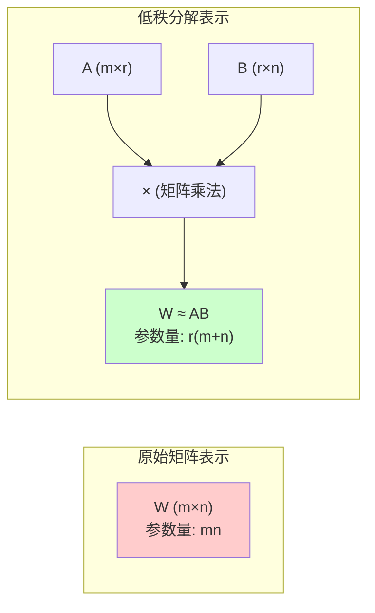

# 低秩分解的数学原理

## 问题
请介绍低秩分解的数学原理

## 回答

低秩分解是 LoRA 的核心数学基础。下面从数学角度详细解释这个概念。

### 1. 矩阵的秩（Rank）

矩阵的**秩**是指矩阵中线性无关的行（或列）的最大数量。

对于矩阵 $W \in \mathbb{R}^{m \times n}$：
- **满秩**：$\text{rank}(W) = \min(m, n)$
- **低秩**：$\text{rank}(W) = r < \min(m, n)$

**直观理解**：秩表示矩阵包含的"独立信息量"。低秩意味着矩阵中存在冗余信息。

### 2. 低秩分解的基本思想

如果矩阵 $W \in \mathbb{R}^{m \times n}$ 的秩为 $r$，可以分解为两个更小矩阵的乘积：

$$W = AB$$

其中：
- $A \in \mathbb{R}^{m \times r}$
- $B \in \mathbb{R}^{r \times n}$
- $r \ll \min(m, n)$（r 远小于 m 和 n）

**参数量对比**：
- 原始矩阵：$m \times n$ 个参数
- 分解后：$m \times r + r \times n = r(m + n)$ 个参数
- 当 $r \ll \min(m, n)$ 时，参数量大幅减少

### 3. 数学示例

假设 $W \in \mathbb{R}^{1000 \times 1000}$，秩 $r = 10$：

**原始参数量**：
$$1000 \times 1000 = 1,000,000$$

**分解后参数量**：
$$1000 \times 10 + 10 \times 1000 = 20,000$$

**压缩比**：
$$\frac{20,000}{1,000,000} = 2\%$$

这意味着我们只需要原始参数量的 2% 就能表示这个低秩矩阵！

### 4. 奇异值分解（SVD）

低秩分解最经典的方法是 **SVD（Singular Value Decomposition）**：

$$W = U\Sigma V^T$$

其中：
- $U \in \mathbb{R}^{m \times m}$：左奇异向量矩阵（正交矩阵）
- $\Sigma \in \mathbb{R}^{m \times n}$：对角奇异值矩阵，$\Sigma = \text{diag}(\sigma_1, \sigma_2, \ldots, \sigma_r, 0, \ldots, 0)$
- $V \in \mathbb{R}^{n \times n}$：右奇异向量矩阵（正交矩阵）
- $\sigma_1 \geq \sigma_2 \geq \ldots \geq \sigma_r > 0$：奇异值（按降序排列）

**低秩近似**（保留前 r 个最大奇异值）：

$$W \approx U_r \Sigma_r V_r^T = \sum_{i=1}^{r} \sigma_i u_i v_i^T$$

其中 $U_r, V_r$ 分别是 $U, V$ 的前 r 列。

#### 4.1 SVD 计算示例

让我们通过一个简单的例子来理解 SVD 的计算过程。

**原始矩阵**：
$$W = \begin{bmatrix} 3 & 1 \\ 1 & 3 \\ 1 & 1 \end{bmatrix} \in \mathbb{R}^{3 \times 2}$$

**步骤 1：计算 $W^T W$**

$$W^T W = \begin{bmatrix} 3 & 1 & 1 \\ 1 & 3 & 1 \end{bmatrix} \begin{bmatrix} 3 & 1 \\ 1 & 3 \\ 1 & 1 \end{bmatrix} = \begin{bmatrix} 11 & 7 \\ 7 & 11 \end{bmatrix}$$

**步骤 2：计算 $W^T W$ 的特征值和特征向量**

特征方程：$\det(W^T W - \lambda I) = 0$

$$\det\begin{bmatrix} 11-\lambda & 7 \\ 7 & 11-\lambda \end{bmatrix} = (11-\lambda)^2 - 49 = 0$$

解得特征值：
- $\lambda_1 = 18$
- $\lambda_2 = 4$

对应的**奇异值**（特征值的平方根）：
- $\sigma_1 = \sqrt{18} = 3\sqrt{2} \approx 4.243$
- $\sigma_2 = \sqrt{4} = 2$

对应的特征向量（归一化后）：
- $v_1 = \frac{1}{\sqrt{2}}\begin{bmatrix} 1 \\ 1 \end{bmatrix}$
- $v_2 = \frac{1}{\sqrt{2}}\begin{bmatrix} 1 \\ -1 \end{bmatrix}$

因此右奇异向量矩阵：
$$V = \begin{bmatrix} \frac{1}{\sqrt{2}} & \frac{1}{\sqrt{2}} \\ \frac{1}{\sqrt{2}} & -\frac{1}{\sqrt{2}} \end{bmatrix}$$

**步骤 3：计算左奇异向量 $U$**

使用关系式 $u_i = \frac{1}{\sigma_i} W v_i$：

$$u_1 = \frac{1}{3\sqrt{2}} W v_1 = \frac{1}{3\sqrt{2}} \begin{bmatrix} 3 & 1 \\ 1 & 3 \\ 1 & 1 \end{bmatrix} \begin{bmatrix} \frac{1}{\sqrt{2}} \\ \frac{1}{\sqrt{2}} \end{bmatrix} = \frac{1}{3\sqrt{2}} \begin{bmatrix} 4/\sqrt{2} \\ 4/\sqrt{2} \\ 2/\sqrt{2} \end{bmatrix} = \begin{bmatrix} 2/3 \\ 2/3 \\ 1/3 \end{bmatrix}$$

$$u_2 = \frac{1}{2} W v_2 = \frac{1}{2} \begin{bmatrix} 3 & 1 \\ 1 & 3 \\ 1 & 1 \end{bmatrix} \begin{bmatrix} \frac{1}{\sqrt{2}} \\ -\frac{1}{\sqrt{2}} \end{bmatrix} = \frac{1}{2} \begin{bmatrix} 2/\sqrt{2} \\ -2/\sqrt{2} \\ 0 \end{bmatrix} = \begin{bmatrix} 1/\sqrt{2} \\ -1/\sqrt{2} \\ 0 \end{bmatrix}$$

为了形成完整的正交基，还需要第三个向量 $u_3$（与前两个正交）：
$$u_3 = \begin{bmatrix} 1/3 \\ 1/3 \\ -2/3 \end{bmatrix}$$

**步骤 4：组装 SVD 分解**

$$W = U \Sigma V^T$$

其中：
$$U = \begin{bmatrix} 2/3 & 1/\sqrt{2} & 1/3 \\ 2/3 & -1/\sqrt{2} & 1/3 \\ 1/3 & 0 & -2/3 \end{bmatrix}, \quad \Sigma = \begin{bmatrix} 3\sqrt{2} & 0 \\ 0 & 2 \\ 0 & 0 \end{bmatrix}, \quad V^T = \begin{bmatrix} \frac{1}{\sqrt{2}} & \frac{1}{\sqrt{2}} \\ \frac{1}{\sqrt{2}} & -\frac{1}{\sqrt{2}} \end{bmatrix}$$

**步骤 5：低秩近似（秩 r=1）**

如果只保留最大的奇异值 $\sigma_1 = 3\sqrt{2}$：

$$W_1 = \sigma_1 u_1 v_1^T = 3\sqrt{2} \begin{bmatrix} 2/3 \\ 2/3 \\ 1/3 \end{bmatrix} \begin{bmatrix} \frac{1}{\sqrt{2}} & \frac{1}{\sqrt{2}} \end{bmatrix} = \begin{bmatrix} 2 & 2 \\ 2 & 2 \\ 1 & 1 \end{bmatrix}$$

**误差分析**：

原始矩阵：
$$W = \begin{bmatrix} 3 & 1 \\ 1 & 3 \\ 1 & 1 \end{bmatrix}$$

秩-1 近似：
$$W_1 = \begin{bmatrix} 2 & 2 \\ 2 & 2 \\ 1 & 1 \end{bmatrix}$$

近似误差（Frobenius 范数）：
$$\|W - W_1\|_F = \sigma_2 = 2$$

能量保留率：
$$\frac{\sigma_1^2}{\sigma_1^2 + \sigma_2^2} = \frac{18}{18 + 4} = \frac{18}{22} \approx 81.8\%$$

**参数量对比**：
- 原始矩阵 $W$：$3 \times 2 = 6$ 个参数
- 秩-1 分解 $W_1 = u_1 \sigma_1 v_1^T$：只需存储 $u_1$（3个值）、$\sigma_1$（1个值）、$v_1$（2个值）= 6 个参数
- 但如果用 $W_1 = AB$ 形式，$A \in \mathbb{R}^{3 \times 1}$，$B \in \mathbb{R}^{1 \times 2}$：$3 + 2 = 5$ 个参数

这个例子展示了：
1. **计算过程**：如何通过特征值分解得到 SVD
2. **低秩近似**：仅用秩-1 矩阵就能保留 81.8% 的信息
3. **参数效率**：虽然这个小矩阵不太明显，但在大矩阵中优势显著

### 5. 为什么低秩分解有效？

**核心洞察**：许多实际矩阵（尤其是神经网络权重）都具有低秩或近似低秩的性质。

原因包括：

1. **信息冗余**：神经网络学到的特征往往存在相关性，不同神经元的权重向量可能指向相似的方向

2. **过参数化**：现代神经网络的参数数量远多于实际需要，存在大量冗余

3. **能量集中**：大部分"重要信息"集中在少数几个主要方向（大奇异值对应的方向）

**能量占比**：
$$\text{能量保留率} = \frac{\sum_{i=1}^{r} \sigma_i^2}{\sum_{i=1}^{\min(m,n)} \sigma_i^2}$$

通常前 $r$ 个奇异值（$r$ 远小于总数）就能保留 90%+ 的能量。

### 6. LoRA 中的低秩分解

LoRA 的核心思想是：**权重更新矩阵 $\Delta W$ 具有低秩性质**

$$W' = W + \Delta W = W + BA$$

其中：
- $W \in \mathbb{R}^{d \times k}$：冻结的预训练权重（不更新）
- $\Delta W = BA$：低秩更新矩阵
- $B \in \mathbb{R}^{d \times r}$：低秩分解的第一个矩阵
- $A \in \mathbb{R}^{r \times k}$：低秩分解的第二个矩阵
- $r \ll \min(d, k)$：秩远小于原始维度

**关键假设**：微调时的权重变化 $\Delta W$ 本质上是低秩的，因此可以用很少的参数（通过 $B$ 和 $A$）来表示。这个假设在论文的实验中得到了验证。

### 7. 可视化理解

当 $r \ll \min(m, n)$ 时，右边的参数量远小于左边。

### 8. 数学性质总结

**Frobenius 范数下的最优近似**：
SVD 给出的秩 r 近似是 Frobenius 范数意义下的最优低秩近似：

$$\min_{\text{rank}(W_r)=r} \|W - W_r\|_F = \|W - U_r\Sigma_r V_r^T\|_F = \sqrt{\sum_{i=r+1}^{\min(m,n)} \sigma_i^2}$$

这意味着通过保留最大的 r 个奇异值，我们得到了最好的低秩近似（在平方误差意义下）。

**低秩分解的梯度**：
在训练过程中，对于 $\Delta W = BA$：

$$\frac{\partial L}{\partial A} = B^T \frac{\partial L}{\partial \Delta W}$$

$$\frac{\partial L}{\partial B} = \frac{\partial L}{\partial \Delta W} A^T$$

这使得低秩分解可以通过标准的反向传播进行训练。

## 总结

低秩分解的数学原理为 LoRA 提供了理论基础：
1. **参数效率**：用 $r(m+n)$ 个参数近似 $mn$ 个参数的矩阵
2. **信息保留**：低秩近似可以保留矩阵的主要信息（大奇异值对应的方向）
3. **训练友好**：可以通过标准反向传播进行优化
4. **理论保证**：SVD 提供了最优低秩近似的数学保证

这些数学性质共同解释了为什么 LoRA 能够用极少的参数实现有效的模型微调。
