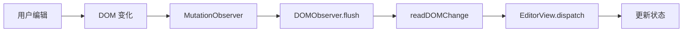
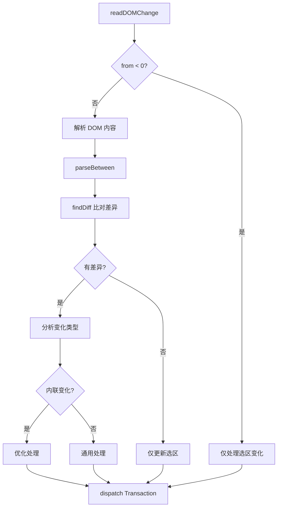
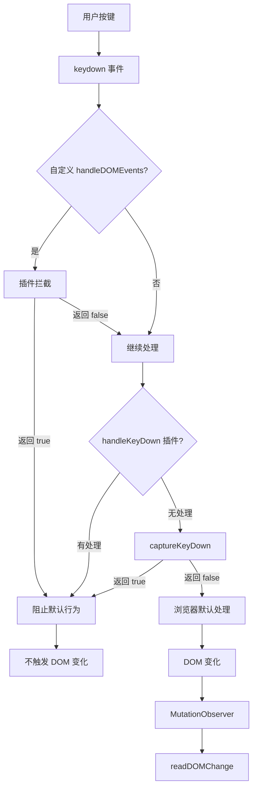
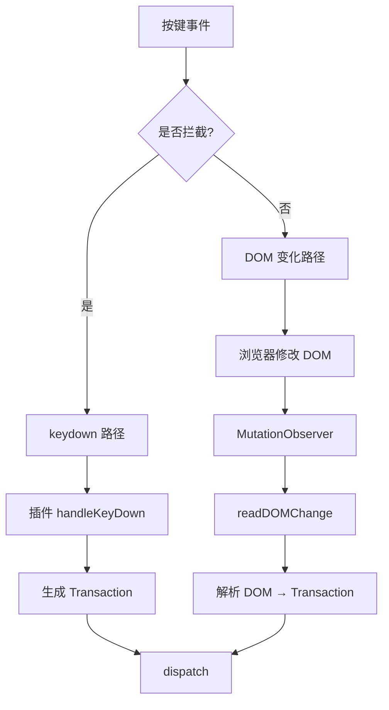
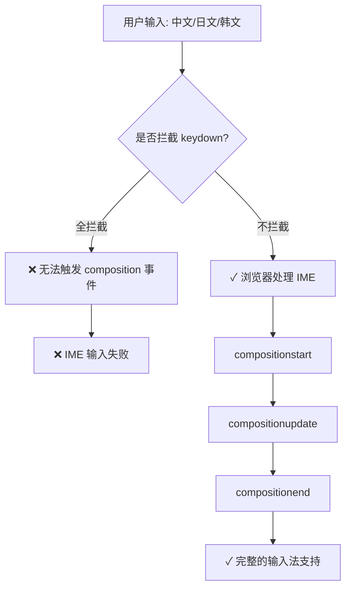
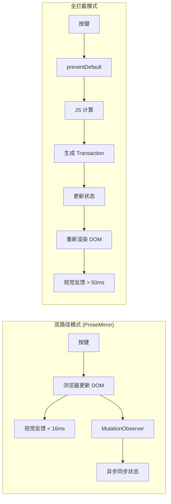
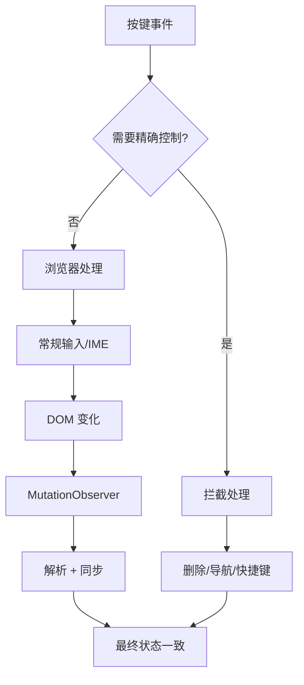
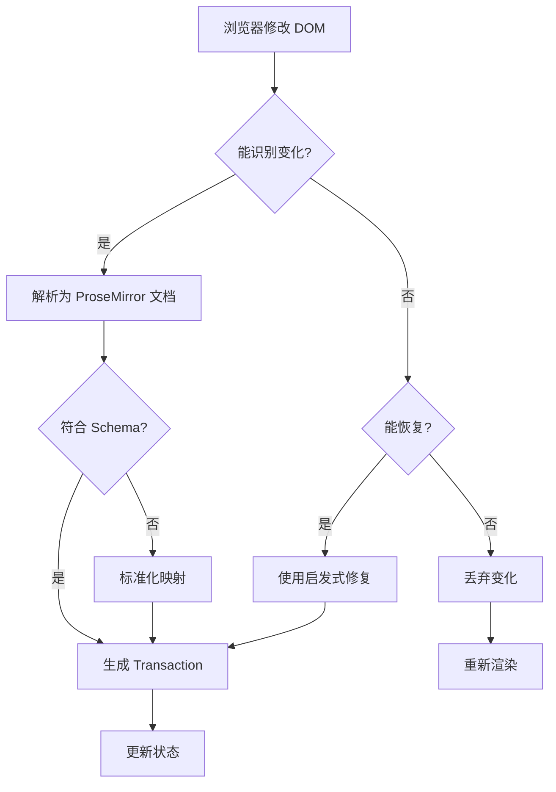

# 015 - readDOMChange 编辑路径分析

## 问题
`readDOMChange` 看起来是处理编辑的一条主要路径，请帮忙分析这个路径的主要逻辑。

## 回答

`readDOMChange` 是 ProseMirror 处理用户编辑操作的核心路径之一。它负责将浏览器 DOM 的变化转换为 ProseMirror 的 Transaction。完整的流程如下：

### 1. 触发机制（DOMObserver）



**DOMObserver 的职责**：
- 使用 `MutationObserver` API 监听 DOM 变化（`childList`、`characterData`、`attributes`）
- 将 mutation 记录放入队列，并在适当时机调用 `flush()`
- 通过 `registerMutation()` 计算变化的文档位置范围 `[from, to]`
- 调用 `handleDOMChange`（即 `readDOMChange`）处理变化

**关键代码** (domobserver.ts:166-224)：
```typescript
flush() {
  let mutations = this.pendingRecords()
  // ...
  let from = -1, to = -1, typeOver = false, added: Node[] = []
  for (let i = 0; i < mutations.length; i++) {
    let result = this.registerMutation(mutations[i], added)
    if (result) {
      from = from < 0 ? result.from : Math.min(result.from, from)
      to = to < 0 ? result.to : Math.max(result.to, to)
      if (result.typeOver) typeOver = true
    }
  }
  // ...
  this.handleDOMChange(from, to, typeOver, added)
}
```

### 2. readDOMChange 核心逻辑

`readDOMChange` 函数位于 domchange.ts:81-277，其处理流程可以概括为：



#### 2.1 参数说明

```typescript
function readDOMChange(
  view: EditorView,
  from: number,        // 变化的起始位置
  to: number,          // 变化的结束位置
  typeOver: boolean,   // 是否是覆盖类型的变化
  addedNodes: Node[]   // 新增的 DOM 节点
)
```

#### 2.2 处理流程

**第一步：选区变化优先处理** (85-100 行)

如果 `from < 0`，表示没有内容变化，仅有选区变化：
```typescript
if (from < 0) {
  let newSel = selectionFromDOM(view, origin)
  if (newSel && !view.state.selection.eq(newSel)) {
    let tr = view.state.tr.setSelection(newSel)
    view.dispatch(tr)
  }
  return
}
```

**第二步：解析变化区域的 DOM** (102-109 行)

```typescript
// 扩展到共同祖先的边界
let $before = view.state.doc.resolve(from)
let shared = $before.sharedDepth(to)
from = $before.before(shared + 1)
to = view.state.doc.resolve(to).after(shared + 1)

// 解析 DOM 内容为 ProseMirror 节点
let parse = parseBetween(view, from, to)
```

`parseBetween` 函数（domchange.ts:15-56）的作用：
- 使用 `DOMParser` 解析指定范围的 DOM 节点
- 尝试恢复选区位置信息
- 返回 `{doc, sel, from, to}` 结构

**第三步：比较差异** (122 行)

```typescript
let change = findDiff(
  compare.content,      // 旧内容
  parse.doc.content,    // 新内容
  parse.from,
  preferredPos,
  preferredSide
)
```

`findDiff` 函数（353-377 行）使用双向扫描算法：
- 从前向后找到第一个差异点（`start`）
- 从后向前找到最后一个差异点（`endA`、`endB`）
- 根据 `preferredSide` 调整边界（处理光标位置偏好）

**第四步：处理特殊情况** (124-196 行)

这部分包含大量浏览器兼容性处理：
- iOS/Android 的 Enter 键模拟
- Backspace 操作检测
- Chrome composition 特殊处理
- 选区覆盖优化

**第五步：生成 Transaction** (223-241 行)

```typescript
let mkTr = (base?: Transaction) => {
  let tr = base || view.state.tr.replace(
    chFrom, chTo,
    parse.doc.slice(change.start - parse.from, change.endB - parse.from)
  )
  if (parse.sel) {
    let sel = resolveSelection(view, tr.doc, parse.sel)
    if (sel) tr.setSelection(sel)
  }
  if (compositionID) tr.setMeta("composition", compositionID)
  return tr.scrollIntoView()
}
```

**第六步：内联编辑优化** (244-276 行)

如果是内联内容的变化（`inlineChange`），会进行细粒度的优化：

```typescript
if (inlineChange) {
  if ($from.pos == $to.pos) {
    // 删除操作
    let tr = mkTr(view.state.tr.delete(chFrom, chTo))
    let marks = doc.resolve(change.start).marksAcross(doc.resolve(change.endA))
    if (marks) tr.ensureMarks(marks)
    view.dispatch(tr)
  } else if (/* 标记变化检测 */) {
    // 添加/删除标记
    if (markChange.type == "add") tr.addMark(chFrom, chTo, markChange.mark)
    else tr.removeMark(chFrom, chTo, markChange.mark)
    view.dispatch(tr)
  } else if (/* 文本插入 */) {
    // 纯文本插入
    let text = $from.parent.textBetween($from.parentOffset, $to.parentOffset)
    if (!view.someProp("handleTextInput", f => f(view, chFrom, chTo, text, deflt)))
      view.dispatch(deflt())
  } else {
    view.dispatch(mkTr())
  }
} else {
  view.dispatch(mkTr())
}
```

### 3. 数学模型抽象

readDOMChange 可以抽象为一个函数映射：

$$
\text{readDOMChange}: (\text{DOM}, \Delta_{\text{DOM}}) \to \text{Transaction}
$$

其中：
- $\text{DOM}$ 表示当前 DOM 状态
- $\Delta_{\text{DOM}}$ 表示 DOM 的变化（mutation records）
- $\text{Transaction}$ 是 ProseMirror 的状态转换

具体步骤可表示为：

$$
\begin{align}
\text{DOM}'_{[from, to]} &= \text{parseBetween}(\text{DOM}, from, to) \\
\Delta &= \text{findDiff}(\text{Doc}_{[from, to]}, \text{DOM}'_{[from, to]}) \\
\text{Steps} &= \text{optimize}(\Delta, \text{context}) \\
\text{Transaction} &= \text{Steps} + \text{Selection} + \text{Metadata}
\end{align}
$$

其中 `optimize` 步骤包括：
- 识别删除、插入、标记变化
- 处理浏览器特殊情况
- 调用插件的 `handleTextInput`、`handleKeyDown` 钩子

### 4. 关键设计要点

1. **延迟更新**：变化先在 DOM 中发生，ProseMirror 通过观察者模式异步同步
2. **差异最小化**：使用 `findDiff` 精确定位变化范围，避免不必要的操作
3. **选区恢复**：在 DOM 解析过程中记录选区位置，确保 Transaction 后选区正确
4. **浏览器兼容**：大量针对 Chrome、Safari、Firefox、IE 的特殊处理
5. **插件扩展**：通过 `handleTextInput`、`handleKeyDown` 允许插件拦截和自定义处理
6. **Composition 支持**：特殊处理输入法组合输入，通过 `compositionID` 标记相关事务

### 5. 调用栈示例

基于你提供的调用栈：

```
dispatchTransaction()         // 用户定义的 dispatch 回调
EditorView.dispatch()         // 应用 transaction，更新状态
readDOMChange()              // 将 DOM 变化转换为 transaction
flush()                      // 处理累积的 mutations
DOMObserver.observer()       // MutationObserver 回调
[浏览器 DOM 变化]
```

### 参考信息

- `parseBetween` 使用 `DOMParser` 将 DOM 转换回 ProseMirror 文档结构
- `findDiff` 算法类似 diff 算法，但针对 ProseMirror 的 Fragment 结构优化
- 内联变化（inlineChange）的判断条件：变化在同一个父节点内，且父节点是内联内容
- 浏览器兼容性代码占了相当大的比重，说明 DOM 编辑行为在不同浏览器中差异显著

---

## 追问：常规的字母输入，由浏览器直接处理（contenteditable），那么哪些键被屏蔽了？

## 回答

ProseMirror 虽然依赖浏览器的 `contenteditable` 来处理基本的文字输入，但它会**拦截并自定义处理**某些特定按键，以确保编辑行为的可控性和跨浏览器一致性。

### 1. 键盘事件处理架构



**事件处理顺序** (input.ts:105-135)：
1. 检查是否在 composition（输入法组合）状态
2. 调用插件的 `handleKeyDown` 钩子
3. 调用 `captureKeyDown` 进行内置处理
4. 如果都返回 `false`，交给浏览器默认处理

### 2. 被 captureKeyDown 拦截的按键

`captureKeyDown` 函数 (capturekeys.ts:322-345) 拦截以下按键：

#### 2.1 删除键

| 按键 | keyCode | 说明 |
|------|---------|------|
| **Backspace** | 8 | 向前删除 |
| **Delete** | 46 | 向后删除 |
| **Ctrl-H** (Mac) | 72 + ctrl | Backspace 的替代键 |
| **Ctrl-D** (Mac) | 68 + ctrl | Delete 的替代键 |

**拦截原因**：
- 处理非文本节点（如图片、组件）的删除
- 在文本块边界处的特殊删除逻辑
- 跳过不可编辑的节点

**代码片段** (capturekeys.ts:324-327)：
```typescript
if (code == 8 || (browser.mac && code == 72 && mods == "c")) {
  return stopNativeHorizontalDelete(view, -1) || skipIgnoredNodes(view, -1)
} else if ((code == 46 && !event.shiftKey) || (browser.mac && code == 68 && mods == "c")) {
  return stopNativeHorizontalDelete(view, 1) || skipIgnoredNodes(view, 1)
}
```

#### 2.2 特殊控制键

| 按键 | keyCode | 说明 |
|------|---------|------|
| **Enter** | 13 | 换行 |
| **Esc** | 27 | 退出选择等 |

**拦截原因**：
- Enter 键需要根据上下文插入不同的块结构（段落、列表项等）
- Esc 用于退出节点选择状态

**代码片段** (capturekeys.ts:328-329)：
```typescript
} else if (code == 13 || code == 27) {
  return true
```

#### 2.3 方向键（条件拦截）

| 按键 | keyCode | Mac 替代键 | 说明 |
|------|---------|------------|------|
| **Left** | 37 | Ctrl-B | 向左移动 |
| **Right** | 39 | Ctrl-F | 向右移动 |
| **Up** | 38 | Ctrl-P | 向上移动 |
| **Down** | 40 | Ctrl-N | 向下移动 |

**拦截条件**：
- 光标在非文本节点旁边（需要选择节点而非移动光标）
- 跨越块级节点边界
- 需要跳过不可编辑的节点
- Safari 特定 bug 修复

**代码片段** (capturekeys.ts:330-339)：
```typescript
} else if (code == 37 || (browser.mac && code == 66 && mods == "c")) {
  let dir = code == 37 ? (findDirection(view, view.state.selection.from) == "ltr" ? -1 : 1) : -1
  return selectHorizontally(view, dir, mods) || skipIgnoredNodes(view, dir)
} else if (code == 39 || (browser.mac && code == 70 && mods == "c")) {
  let dir = code == 39 ? (findDirection(view, view.state.selection.from) == "ltr" ? 1 : -1) : 1
  return selectHorizontally(view, dir, mods) || skipIgnoredNodes(view, dir)
} else if (code == 38 || (browser.mac && code == 80 && mods == "c")) {
  return selectVertically(view, -1, mods) || skipIgnoredNodes(view, -1)
} else if (code == 40 || (browser.mac && code == 78 && mods == "c")) {
  return safariDownArrowBug(view) || selectVertically(view, 1, mods) || skipIgnoredNodes(view, 1)
```

#### 2.4 编辑相关快捷键（总是拦截）

| 快捷键 | keyCode | 说明 |
|--------|---------|------|
| **Mod-B** | 66 + mod | 粗体（预留给插件处理） |
| **Mod-I** | 73 + mod | 斜体（预留给插件处理） |
| **Mod-Y** | 89 + mod | 重做 |
| **Mod-Z** | 90 + mod | 撤销 |

注：Mod = Mac 上的 Cmd，其他平台的 Ctrl

**代码片段** (capturekeys.ts:340-342)：
```typescript
} else if (mods == (browser.mac ? "m" : "c") &&
           (code == 66 || code == 73 || code == 89 || code == 90)) {
  return true
```

**拦截原因**：这些快捷键通常由插件（如 `prosemirror-history`）提供具体实现。

### 3. 特殊情况处理

#### 3.1 Composition（输入法组合输入）

```typescript
// input.ts:108
if (inOrNearComposition(view, event)) return
```

在输入法组合过程中（如中文拼音输入），大部分按键事件会被忽略，交给浏览器处理，直到 `compositionend` 事件触发。

#### 3.2 keypress 事件拦截

除了 `keydown`，ProseMirror 还监听 `keypress` 事件 (input.ts:141-159)：

**被拦截的情况**：
- 非文本选择（如节点选择）时的字符输入
- 跨父节点的选择时的字符输入

```typescript
let sel = view.state.selection
if (!(sel instanceof TextSelection) || !sel.$from.sameParent(sel.$to)) {
  let text = String.fromCharCode(event.charCode)
  let deflt = () => view.state.tr.insertText(text).scrollIntoView()
  if (!/[\r\n]/.test(text) && !view.someProp("handleTextInput", f => f(view, sel.$from.pos, sel.$to.pos, text, deflt)))
    view.dispatch(deflt())
  event.preventDefault()
}
```

#### 3.3 Android Chrome Enter 键特殊处理

```typescript
// input.ts:114
if (browser.android && browser.chrome && event.keyCode == 13) return
```

Android Chrome 的 Enter 键会触发混乱的 composition 事件序列，因此完全跳过处理。

#### 3.4 iOS Enter 键延迟处理

```typescript
// input.ts:121-129
if (browser.ios && event.keyCode == 13 && !event.ctrlKey && !event.altKey && !event.metaKey) {
  let now = Date.now()
  view.input.lastIOSEnter = now
  view.input.lastIOSEnterFallbackTimeout = setTimeout(() => {
    if (view.input.lastIOSEnter == now) {
      view.someProp("handleKeyDown", f => f(view, keyEvent(13, "Enter")))
      view.input.lastIOSEnter = 0
    }
  }, 200)
}
```

iOS 虚拟键盘在 Enter 键上的行为不可靠，需要设置标记让 `readDOMChange` 识别并模拟 Enter 键处理。

### 4. 未被拦截的按键

**常规字母和数字输入**：
- A-Z, a-z
- 0-9
- 标点符号（除快捷键组合外）
- 空格键

这些按键的 `keydown` 事件不会被拦截，浏览器会直接修改 DOM，然后由 `MutationObserver` 捕获变化，最终通过 `readDOMChange` 路径处理。

**未组合修饰键的其他按键**：
- Tab（除非插件处理）
- PageUp/PageDown
- Home/End
- 等等

### 5. 双路径处理机制

ProseMirror 采用**双路径处理**机制：



**设计哲学**：
- **需要精确控制的按键**（删除、导航、特殊快捷键）→ 拦截，通过命令系统处理
- **常规输入**（字母、数字）→ 不拦截，让浏览器处理 DOM，再解析回 ProseMirror 状态

### 6. 总结表格

| 类别 | 按键 | 处理方式 |
|------|------|----------|
| **总是拦截** | Enter, Esc | 由插件/命令处理 |
| **总是拦截** | Mod-B/I/Y/Z | 预留给插件 |
| **条件拦截** | Backspace, Delete | 节点删除时拦截 |
| **条件拦截** | 方向键 | 跨节点、边界时拦截 |
| **不拦截** | A-Z, 0-9, 空格等 | 浏览器处理 → readDOMChange |
| **特殊处理** | Composition 相关 | 延迟到 compositionend |
| **特殊处理** | Android/iOS Enter | 平台特定逻辑 |

### 参考信息

- `captureKeyDown` 返回 `true` 表示已处理，会调用 `event.preventDefault()` 阻止默认行为
- 返回 `false` 表示未处理，交给浏览器执行默认行为（通常是修改 DOM）
- 方向键的处理非常复杂，需要考虑：RTL 文本方向、节点选择、文本块边界等
- `skipIgnoredNodes` 确保光标不会停留在尺寸为 0 的装饰节点上

---

## 追问：为什么要走双路径模式，而不是全部拦截并进行处理呢？

## 回答

这是一个非常核心的架构设计问题。ProseMirror 选择双路径模式而非全拦截模式，主要基于以下几个关键原因：

### 1. IME（输入法）支持的必要性

**最关键的原因**：如果拦截所有按键，将**无法支持输入法（IME - Input Method Editor）**。



**输入法工作原理**：
- 用户输入拼音（如 "nihao"）
- 浏览器的 IME 显示候选词（"你好"、"拟好"等）
- 用户选择后确认
- 触发 `compositionend` 事件

如果拦截了常规键盘输入，这个过程将被打断。代码中有大量针对 composition 的特殊处理 (input.ts:434-556)：

```typescript
// input.ts:436-450
// 日文 IME 在 Safari 上的特殊处理
// 参考: https://www.stum.de/2016/06/24/handling-ime-events-in-javascript/
function inOrNearComposition(view: EditorView, event: Event) {
  if (view.composing) return true
  // 日文输入法使用 Enter 键确认字符选择
  // 在 Safari 上，Enter 会同时触发 compositionend 和 keydown
  // 必须忽略 keydown 以避免意外插入换行
  if (browser.safari && Math.abs(event.timeStamp - view.input.compositionEndedAt) < 500) {
    view.input.compositionEndedAt = -2e8
    return true
  }
  return false
}
```

### 2. 性能优化

**浏览器原生文本编辑引擎的性能优势**：

| 方面 | 浏览器原生处理 | JavaScript 拦截处理 |
|------|----------------|---------------------|
| **延迟** | ~0ms（同步 DOM 更新） | 5-20ms（事件处理 + JS 执行） |
| **渲染** | 硬件加速 | 需要通过 JS 操作 DOM |
| **文本重排** | 浏览器优化的布局算法 | 手动计算位置 |
| **光标闪烁** | 原生光标（CSS caret） | 需要模拟 |

**数据流对比**：



对于常规输入，用户能感知到延迟差异（特别是在移动设备上）。

### 3. 浏览器编辑特性的复用

**浏览器 contenteditable 提供的免费功能**：

1. **文本整形（Text Shaping）**
   - 连字（Ligatures）：fi → fi
   - 复杂文字系统（阿拉伯文、印度文等）
   - 双向文本（BiDi）支持

2. **辅助功能（Accessibility）**
   - 屏幕阅读器集成
   - 系统级输入辅助
   - 语音输入支持

3. **平台集成**
   - macOS：Emoji 选择器（Ctrl-Cmd-Space）
   - Windows：触摸键盘
   - 移动设备：虚拟键盘、自动更正、预测输入

如果全部拦截，这些功能需要**手动实现**，工作量巨大且难以达到原生体验。

### 4. 跨浏览器一致性的平衡

**代码中大量的浏览器特定处理** (input.ts:114, 121-129, 446-450)：

```typescript
// Android Chrome Enter 键完全跳过
if (browser.android && browser.chrome && event.keyCode == 13) return

// iOS Enter 键延迟处理
if (browser.ios && event.keyCode == 13 && !event.ctrlKey && !event.altKey && !event.metaKey) {
  let now = Date.now()
  view.input.lastIOSEnter = now
  view.input.lastIOSEnterFallbackTimeout = setTimeout(() => {
    if (view.input.lastIOSEnter == now) {
      view.someProp("handleKeyDown", f => f(view, keyEvent(13, "Enter")))
    }
  }, 200)
}
```

**双路径策略**：
- 对于**行为一致且可预测**的按键（如删除、导航）→ 拦截统一处理
- 对于**行为差异大且复杂**的输入（如文字、IME）→ 让浏览器处理，然后解析 DOM

全拦截模式需要处理**每个浏览器每个版本**的按键行为差异，维护成本指数级增长。

### 5. Composition 期间的 DOM 保护

在输入法组合过程中，ProseMirror 需要**避免干扰浏览器的 IME 行为** (viewdesc.ts:808-809)：

```typescript
// 组合输入期间可能需要保护正在编辑的 DOM 节点
if (localComposition) this.protectLocalComposition(view, localComposition)
```

如果拦截所有输入，就无法维持 composition 状态，导致：
- 中文拼音无法显示
- 候选词列表消失
- 用户体验断裂

### 6. 全拦截模式的技术挑战

假设要实现全拦截，需要解决：

#### 6.1 输入法模拟

```javascript
// 伪代码：需要手动实现 IME
function handleKeyPress(event) {
  event.preventDefault()

  if (isPinyinInput(event)) {
    // 需要：
    // 1. 维护拼音缓冲区
    // 2. 调用词典 API 获取候选词
    // 3. 渲染候选词浮层
    // 4. 处理候选词选择
    // 5. 处理声调输入
    // 6. 处理多音字
    // ... (数千行代码)
  }

  // 类似地需要处理：日文、韩文、阿拉伯文、印度文等
}
```

这实际上是在**重新实现操作系统级的输入法系统**，工作量不可接受。

#### 6.2 光标和选区管理

```javascript
// 需要手动管理光标位置、闪烁动画、双向文本等
class CustomCaret {
  position: {x: number, y: number}
  blinkInterval: number

  render() {
    // 计算光标在文本中的像素位置
    // 处理 RTL 文本
    // 处理 emoji、代理对
    // 处理连字符
    // ... (复杂的布局计算)
  }
}
```

#### 6.3 实时性能

每次按键都需要：
1. 阻止默认行为
2. 解析按键
3. 计算新状态
4. 生成 Transaction
5. 应用 Transaction
6. 比对文档差异
7. 更新 DOM
8. 重新计算选区位置
9. 更新光标

在 60fps 的要求下（16.6ms/帧），这个流程很容易导致卡顿。

### 7. ProseMirror 的实际策略

**精确控制 vs 性能权衡**：



**代码体现** (input.ts:130-134)：

```typescript
if (view.someProp("handleKeyDown", f => f(view, event)) ||
    captureKeyDown(view, event)) {
  event.preventDefault()  // 拦截
} else {
  setSelectionOrigin(view, "key")  // 不拦截，让浏览器处理
}
```

### 8. 真实案例：全拦截编辑器的教训

一些早期富文本编辑器尝试过全拦截模式，遇到的问题：

1. **Google Docs（早期版本）**：
   - 完全自绘编辑区
   - IME 支持问题频出
   - 辅助功能缺失
   - 后续逐步改用 contenteditable

2. **Draft.js（Facebook）**：
   - 尝试完全控制输入
   - 在移动端和 IME 上体验差
   - 社区逐渐转向其他方案

3. **Slate.js（早期版本）**：
   - 全拦截 + 自己控制 contenteditable
   - 频繁遇到浏览器兼容性问题
   - 后续版本大幅改进策略

### 9. 总结

**双路径模式是工程上的最优解**：

| 维度 | 双路径模式 | 全拦截模式 |
|------|-----------|-----------|
| **IME 支持** | ✓ 原生支持 | ❌ 需手动实现 |
| **性能** | ✓ 原生速度 | ❌ JS 延迟 |
| **辅助功能** | ✓ 系统集成 | ❌ 需手动实现 |
| **开发成本** | ✓ 适中 | ❌ 极高 |
| **维护成本** | ✓ 可控 | ❌ 随浏览器数量线性增长 |
| **精确控制** | △ 部分控制 | ✓ 完全控制 |

**设计哲学**：
- **信任浏览器**在它擅长的领域（文本输入、IME、渲染）
- **控制浏览器**在它行为不一致的领域（删除、导航、结构化编辑）
- 通过 `readDOMChange` 路径，最终保证状态一致性

这正是 ProseMirror 的核心创新之一：找到了**可控性**和**原生体验**之间的最佳平衡点。

### 参考信息

- ProseMirror 官方文档：[ProseMirror Reference manual](https://prosemirror.net/docs/ref/)
- Marijn Haverbeke（作者）博客：[ProseMirror](https://marijnhaverbeke.nl/blog/prosemirror.html)
- IME 处理参考：https://www.stum.de/2016/06/24/handling-ime-events-in-javascript/
- 社区讨论：[Mutation observation - discuss.ProseMirror](https://discuss.prosemirror.net/)
- contenteditable 的 DOM 修改由 ProseMirror 严格控制，用户不应直接修改编辑器的内部 DOM

---

## 追问：如果某款浏览器上有特殊的 HotKey 触发 command，且未被拦截，该 command 由浏览器原生执行，并可能错误地修改 DOM 导致不能反向生成 document？这种可能性是否存在？

## 回答

这个问题非常尖锐！**这种可能性确实存在**，而且是 ProseMirror 双路径模式必须面对的一个真实风险。让我详细分析这个问题及 ProseMirror 的应对策略。

### 1. 问题的真实案例

#### 1.1 浏览器原生格式化快捷键

不同浏览器对 contenteditable 的快捷键支持不一致：

| 快捷键 | Chrome/Edge | Firefox | Safari |
|--------|-------------|---------|--------|
| **Ctrl-B** | Bold (`<b>`) | 书签功能 | Bold (`<b>`) |
| **Ctrl-I** | Italic (`<i>`) | Italic (`<i>`) | Italic (`<i>`) |
| **Ctrl-U** | Underline (`<u>`) | 查看源代码 | Underline (`<u>`) |
| **Ctrl-K** | 插入链接 | 搜索 | - |

**问题示例**：
```html
<!-- 用户在 Chrome 按下 Ctrl-B -->
<!-- 浏览器可能插入 -->
<b>text</b>

<!-- 或者 -->
<strong>text</strong>

<!-- 或者更糟糕的 -->
<span style="font-weight: bold">text</span>
```

如果 ProseMirror 的 schema 只定义了 `strong` 标记，而浏览器插入了 `<b>` 或 `<span style="...">`，就会出现解析问题。

#### 1.2 execCommand 的不可预测性

浏览器的 `document.execCommand()` 行为高度不一致：

```javascript
// 不同浏览器执行相同命令可能产生不同 DOM
document.execCommand('bold')

// Chrome 可能生成：
<strong>text</strong>

// 老版本 IE 可能生成：
<b>text</b>

// 某些情况下可能生成：
<span style="font-weight: bold">text</span>
```

### 2. ProseMirror 的多层防御机制

ProseMirror 通过多层机制来处理这个问题：

#### 2.1 第一层：预防性拦截

**拦截已知危险的快捷键** (capturekeys.ts:340-342)：

```typescript
if (mods == (browser.mac ? "m" : "c") &&
    (code == 66 || code == 73 || code == 89 || code == 90)) { // Mod-[biyz]
  return true  // 拦截！阻止浏览器默认行为
}
```

ProseMirror 会拦截 Mod-B（粗体）、Mod-I（斜体）等，**即使没有插件处理**，也会阻止浏览器的默认行为。

**设计意图**：宁可什么都不做，也不要让浏览器随意修改 DOM。

#### 2.2 第二层：DOM 解析器的容错

**DOMParser 的灵活解析规则** (domchange.ts:58-77)：

```typescript
function ruleFromNode(dom: DOMNode): Omit<TagParseRule, "tag"> | null {
  let desc = dom.pmViewDesc
  if (desc) {
    return desc.parseRule()
  } else if (dom.nodeName == "BR" && dom.parentNode) {
    // Safari 的特殊情况处理
    if (browser.safari && /^(ul|ol)$/i.test(dom.parentNode.nodeName)) {
      let skip = document.createElement("div")
      skip.appendChild(document.createElement("li"))
      return {skip} as any
    } else if (dom.parentNode.lastChild == dom ||
               browser.safari && /^(tr|table)$/i.test(dom.parentNode.nodeName)) {
      return {ignore: true}  // 忽略意外的 BR
    }
  } else if (dom.nodeName == "IMG" &&
             (dom as HTMLElement).getAttribute("mark-placeholder")) {
    return {ignore: true}  // 忽略标记占位符
  }
  return null
}
```

**解析策略**：
- 如果 DOM 节点有 `pmViewDesc`（ProseMirror 自己创建的），使用精确的解析规则
- 如果是陌生节点，尝试根据标签名推断
- 如果无法识别，**忽略或跳过**

#### 2.3 第三层：Schema 的标准化映射

**DOMParser 配置** (来自 prosemirror-model)：

```typescript
// Schema 定义时可以指定多种 DOM 表示映射到同一个标记
const schema = new Schema({
  marks: {
    strong: {
      parseDOM: [
        {tag: "strong"},
        {tag: "b"},  // 允许 <b> 也解析为 strong
        {style: "font-weight", getAttrs: value =>
          /^(bold(er)?|[5-9]\d{2,})$/.test(value) && null}  // 允许 style
      ],
      toDOM: () => ["strong", 0]  // 但总是输出 <strong>
    }
  }
})
```

**策略**：
- **输入宽容**：允许多种 DOM 形式（`<b>`、`<strong>`、`font-weight: bold`）
- **输出严格**：总是生成规范的 `<strong>` 标签
- 这样即使浏览器插入了非标准的标记，也能解析回正确的文档

#### 2.4 第四层：parseRule 的兜底机制

**NodeViewDesc.parseRule** (viewdesc.ts:725-749)：

```typescript
parseRule() {
  // 实验性功能：允许节点选择性重新解析
  if (this.node.type.spec.reparseInView) return null

  // 返回精确的解析规则
  let rule: Omit<TagParseRule, "tag"> = {
    node: this.node.type.name,
    attrs: this.node.attrs
  }

  if (!this.contentDOM) {
    // 如果没有内容 DOM，直接使用已有内容
    rule.getContent = () => this.node.content
  } else if (!this.contentLost) {
    rule.contentElement = this.contentDOM
  } else {
    // Chrome 有时会随机重建父节点
    // 尝试找到新的父节点
    for (let i = this.children.length - 1; i >= 0; i--) {
      let child = this.children[i]
      if (this.dom.contains(child.dom.parentNode)) {
        rule.contentElement = child.dom.parentNode as HTMLElement
        break
      }
    }
    if (!rule.contentElement) rule.getContent = () => Fragment.empty
  }
  return rule
}
```

**关键点**：
- 如果 DOM 结构被意外修改，ProseMirror 会尝试恢复
- 如果无法恢复，返回空内容（Fragment.empty）而不是崩溃
- 注释明确提到 Chrome 会"随机重建父节点"，这正是对浏览器不可控行为的防御

### 3. 无法解析时的降级策略

#### 3.1 部分失败，局部恢复

如果某个区域无法正确解析，ProseMirror 会：

1. **最小化损失**：只丢弃无法解析的部分
2. **保留可解析内容**：其他部分正常工作
3. **触发重渲染**：下一次状态更新时，用正确的 DOM 替换错误部分

**代码体现** (domchange.ts:122-131)：

```typescript
let change = findDiff(compare.content, parse.doc.content, parse.from, preferredPos, preferredSide)

if (!change) {
  // 如果解析后的内容与原内容一致，说明没有实际变化
  // 只更新选区
  if (parse.sel) {
    let sel = resolveSelection(view, view.state.doc, parse.sel)
    if (sel && !sel.eq(view.state.selection)) {
      view.dispatch(view.state.tr.setSelection(sel))
    }
  }
  return
}
```

如果 `parseBetween` 失败或返回空内容，`findDiff` 会检测到，ProseMirror 可以选择：
- 忽略这次变化
- 强制重新渲染

#### 3.2 最坏情况：丢弃变化

```typescript
// 如果 DOM 被严重污染，ProseMirror 宁可丢弃这次编辑
// 也不会让错误的状态进入文档模型
if (cannotParse(dom)) {
  view.updateState(view.state)  // 用干净的状态重新渲染
}
```

这是**断舍离策略**：与其让错误数据污染整个文档，不如丢弃一次输入。

### 4. 真实世界的问题案例

#### 4.1 Firefox 的 Ctrl-B 书签冲突

**问题**：Firefox 中 Ctrl-B 是打开书签，不会触发 bold

**影响**：如果用户期望 Ctrl-B 是粗体，但按下后没反应

**ProseMirror 的处理**：
- 拦截 Mod-B (capturekeys.ts:341)
- 交给插件系统处理（如 prosemirror-example-setup）
- 统一行为跨浏览器

#### 4.2 Safari 的列表编辑问题

**问题** (domchange.ts:63-69)：

```typescript
// Safari replaces the list item or table cell with a BR
// directly in the list node (?!) if you delete the last
// character in a list item or table cell (#708, #862)
if (browser.safari && /^(ul|ol)$/i.test(dom.parentNode.nodeName)) {
  let skip = document.createElement("div")
  skip.appendChild(document.createElement("li"))
  return {skip} as any
}
```

Safari 会在删除列表项最后一个字符时，生成 `<ul><br></ul>`（完全不符合 HTML 规范）。

**ProseMirror 的应对**：
- 检测到这个模式
- 注入虚拟的 `<div><li></li></div>` 结构
- 让解析器跳过错误的 `<br>`

### 5. 为什么不能 100% 防御

**理论上的限制**：

1. **无限的浏览器版本和 bug**
   - 新浏览器版本可能引入新的意外行为
   - 无法预测所有可能的 DOM 变化

2. **浏览器扩展的干扰**
   - Grammarly、字典扩展等会修改 DOM
   - 无法完全防御第三方干扰

3. **性能权衡**
   - 如果每次都完全验证 DOM，性能会下降
   - 只能采样检查（通过 MutationObserver）

### 6. ProseMirror 的务实策略



**核心原则**：

1. **预防优于治疗**：拦截已知危险的快捷键
2. **宽进严出**：解析时宽容，输出时严格
3. **容错降级**：无法解析时宁可丢弃也不崩溃
4. **最终一致性**：即使出现短暂的不一致，下次渲染时修复

### 7. 开发者的最佳实践

为了减少这类问题，ProseMirror 用户应该：

1. **定义完整的 parseDOM 规则**：

```typescript
const schema = new Schema({
  marks: {
    strong: {
      parseDOM: [
        {tag: "strong"},
        {tag: "b"},
        {style: "font-weight=bold"},
        {style: "font-weight=700"}
      ],
      toDOM: () => ["strong", 0]
    }
  }
})
```

2. **使用 keymap 插件覆盖所有常用快捷键**：

```typescript
import {keymap} from "prosemirror-keymap"
import {toggleMark} from "prosemirror-commands"

keymap({
  "Mod-b": toggleMark(schema.marks.strong),
  "Mod-i": toggleMark(schema.marks.em),
  "Mod-u": toggleMark(schema.marks.underline)
})
```

3. **监控解析失败**（高级）：

```typescript
const parser = DOMParser.fromSchema(schema)
const parsed = parser.parse(dom)

if (parsed.content.size === 0 && dom.textContent.length > 0) {
  console.error("解析失败！DOM 内容无法转换为文档")
  // 触发回退机制
}
```

### 8. 总结

| 问题 | 可能性 | ProseMirror 防御 | 残留风险 |
|------|--------|------------------|----------|
| **浏览器快捷键执行 execCommand** | 高 | 预防性拦截 Mod-B/I/Y/Z | 低 |
| **生成非标准 HTML** | 中 | Schema 多源映射 | 低 |
| **DOM 结构被破坏** | 低 | parseRule 容错 + 重渲染 | 中 |
| **完全无法解析** | 极低 | 丢弃变化 + 强制刷新 | 低 |

**你的担心是合理的**：这确实是双路径模式的一个真实风险。但 ProseMirror 通过：
- **多层防御**
- **务实的容错**
- **最终一致性保证**

将这个风险降低到可接受的水平。在实践中，这种完全无法恢复的情况**极其罕见**，因为：
1. 常见的危险快捷键都被拦截
2. Schema 的 parseDOM 规则足够宽容
3. 即使出现问题，影响范围也是局部的

这正是**工程权衡**：为了获得 IME 支持、性能和原生体验，接受极小概率的解析失败风险。

### 参考信息

- [contentEditable, CTRL-B CTRL-I and saving - Stack Overflow](https://stackoverflow.com/questions/11935487/contenteditable-ctrl-b-ctrl-i-and-saving)
- [ProseMirror Commands](https://github.com/prosemirror/prosemirror-commands)
- [Keybindings discussion - discuss.ProseMirror](https://discuss.prosemirror.net/t/keybindings-when-contenteditable-true/2280)
- execCommand API 已被标记为废弃（deprecated），现代浏览器正在逐步移除
- ProseMirror 的设计理念是不依赖 execCommand，而是通过 Transaction 系统实现所有编辑操作
