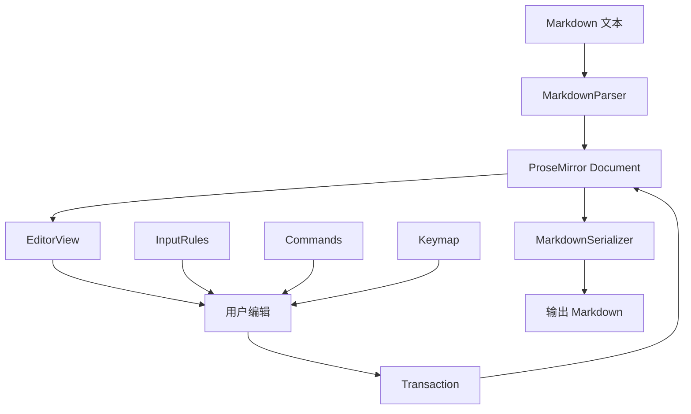
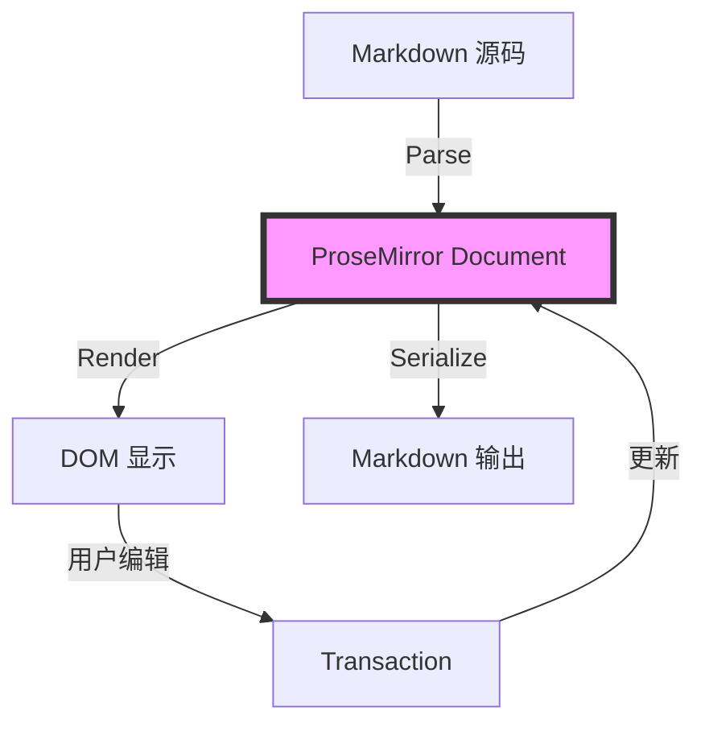
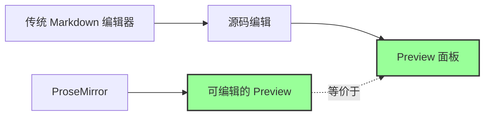
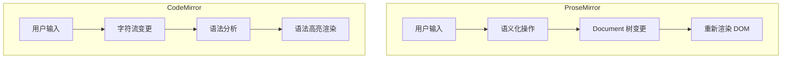

# 016 - 在 ProseMirror 基础上构建 Markdown 编辑器

## 问题
如果要在 ProseMirror 的基础上构建一个 Markdown 的编辑器，需要做些什么？

## 回答

在 ProseMirror 基础上构建 Markdown 编辑器是一个常见需求。好消息是 ProseMirror 官方提供了完整的支持，且社区有丰富的实践经验。

### 1. 核心架构概览



**三个核心部分**：
1. **解析器（Parser）**：Markdown → ProseMirror Document
2. **编辑器（Editor）**：提供所见即所得的编辑体验
3. **序列化器（Serializer）**：ProseMirror Document → Markdown

### 2. 必需的依赖包

```bash
npm install prosemirror-model \
            prosemirror-state \
            prosemirror-view \
            prosemirror-markdown \
            prosemirror-inputrules \
            prosemirror-commands \
            prosemirror-keymap \
            prosemirror-schema-basic \
            prosemirror-schema-list \
            markdown-it
```

**各包职责**：

| 包 | 职责 |
|----|------|
| `prosemirror-markdown` | Markdown 解析和序列化 |
| `prosemirror-inputrules` | 输入规则（如 `**text**` → 粗体）|
| `prosemirror-schema-basic` | 基础 Schema（段落、标题等）|
| `prosemirror-schema-list` | 列表支持 |
| `markdown-it` | Markdown 解析引擎 |

### 3. 定义 Schema

ProseMirror 需要一个与 Markdown 语法对应的 Schema：

```typescript
import { Schema } from "prosemirror-model"
import { schema as basicSchema } from "prosemirror-schema-basic"
import { addListNodes } from "prosemirror-schema-list"

// 基于 basicSchema 添加列表支持
const schema = new Schema({
  nodes: addListNodes(basicSchema.spec.nodes, "paragraph block*", "block"),
  marks: basicSchema.spec.marks
})
```

**对应关系**：

| Markdown 语法 | ProseMirror 节点/标记 |
|---------------|----------------------|
| `# Heading` | `heading` node (level: 1) |
| `## Heading 2` | `heading` node (level: 2) |
| `**bold**` | `strong` mark |
| `*italic*` | `em` mark |
| `` `code` `` | `code` mark |
| `[link](url)` | `link` mark |
| `- list` | `bullet_list` + `list_item` |
| `1. list` | `ordered_list` + `list_item` |
| `` ```code``` `` | `code_block` node |
| `> quote` | `blockquote` node |

### 4. 配置解析器和序列化器

```typescript
import {
  defaultMarkdownParser,
  defaultMarkdownSerializer
} from "prosemirror-markdown"

// 使用默认解析器
const parser = defaultMarkdownParser

// 使用默认序列化器
const serializer = defaultMarkdownSerializer

// 解析 Markdown 到文档
const doc = parser.parse("# Hello\n\nThis is **bold** text")

// 序列化文档到 Markdown
const markdown = serializer.serialize(doc)
```

**自定义解析器**（如需扩展语法）：

```typescript
import { MarkdownParser } from "prosemirror-markdown"
import MarkdownIt from "markdown-it"

const md = new MarkdownIt("commonmark", { html: false })

const customParser = new MarkdownParser(schema, md, {
  // 节点解析规则
  blockquote: { block: "blockquote" },
  paragraph: { block: "paragraph" },
  list_item: { block: "list_item" },
  bullet_list: { block: "bullet_list" },
  ordered_list: { block: "ordered_list", getAttrs: tok => ({
    order: +tok.attrGet("start") || 1
  })},
  heading: { block: "heading", getAttrs: tok => ({
    level: +tok.tag.slice(1)
  })},
  code_block: { block: "code_block", noCloseToken: true },
  fence: { block: "code_block", getAttrs: tok => ({
    params: tok.info || ""
  }), noCloseToken: true },
  hr: { node: "horizontal_rule" },
  image: { node: "image", getAttrs: tok => ({
    src: tok.attrGet("src"),
    title: tok.attrGet("title") || null,
    alt: tok.children?.[0]?.content || null
  })},
  hardbreak: { node: "hard_break" },

  // 标记解析规则
  em: { mark: "em" },
  strong: { mark: "strong" },
  link: { mark: "link", getAttrs: tok => ({
    href: tok.attrGet("href"),
    title: tok.attrGet("title") || null
  })},
  code_inline: { mark: "code", noCloseToken: true }
})
```

**自定义序列化器**：

```typescript
import { MarkdownSerializer } from "prosemirror-markdown"

const customSerializer = new MarkdownSerializer({
  // 节点序列化规则
  blockquote(state, node) {
    state.wrapBlock("> ", null, node, () => state.renderContent(node))
  },
  code_block(state, node) {
    state.write("```" + (node.attrs.params || "") + "\n")
    state.text(node.textContent, false)
    state.ensureNewLine()
    state.write("```")
    state.closeBlock(node)
  },
  heading(state, node) {
    state.write(state.repeat("#", node.attrs.level) + " ")
    state.renderInline(node)
    state.closeBlock(node)
  },
  horizontal_rule(state, node) {
    state.write(node.attrs.markup || "---")
    state.closeBlock(node)
  },
  bullet_list(state, node) {
    state.renderList(node, "  ", () => (node.attrs.bullet || "-") + " ")
  },
  ordered_list(state, node) {
    let start = node.attrs.order || 1
    let maxW = String(start + node.childCount - 1).length
    let space = state.repeat(" ", maxW + 2)
    state.renderList(node, space, i => {
      let nStr = String(start + i)
      return state.repeat(" ", maxW - nStr.length) + nStr + ". "
    })
  },
  list_item(state, node) {
    state.renderContent(node)
  },
  paragraph(state, node) {
    state.renderInline(node)
    state.closeBlock(node)
  },
  image(state, node) {
    state.write(" +
                (node.attrs.title ? " " + state.quote(node.attrs.title) : "") + ")")
  },
  hard_break(state, node, parent, index) {
    for (let i = index + 1; i < parent.childCount; i++)
      if (parent.child(i).type != node.type) {
        state.write("\\\n")
        return
      }
  },
  text(state, node) {
    state.text(node.text!)
  }
}, {
  // 标记序列化规则
  em: { open: "*", close: "*", mixable: true, expelEnclosingWhitespace: true },
  strong: { open: "**", close: "**", mixable: true, expelEnclosingWhitespace: true },
  link: {
    open(_state, mark, parent, index) {
      return isPlainURL(mark, parent, index, 1) ? "<" : "["
    },
    close(state, mark, parent, index) {
      return isPlainURL(mark, parent, index, -1) ? ">"
        : "](" + state.esc(mark.attrs.href) +
          (mark.attrs.title ? " " + state.quote(mark.attrs.title) : "") + ")"
    }
  },
  code: { open(_state, _mark, parent, index) {
    return backticksFor(parent.child(index), -1)
  }, close(_state, _mark, parent, index) {
    return backticksFor(parent.child(index - 1), 1)
  }, escape: false }
})

// 辅助函数
function backticksFor(node, side) {
  let ticks = /`+/g, m, len = 0
  if (node.isText) while (m = ticks.exec(node.text!))
    len = Math.max(len, m[0].length)
  let result = len > 0 && side > 0 ? " `" : "`"
  for (let i = 0; i < len; i++) result += "`"
  if (len > 0 && side < 0) result += " "
  return result
}

function isPlainURL(link, parent, index, side) {
  if (link.attrs.title || !/^\w+:/.test(link.attrs.href)) return false
  let content = parent.child(index + (side < 0 ? -1 : 0))
  if (!content.isText || content.text != link.attrs.href ||
      content.marks[content.marks.length - 1] != link) return false
  if (index == (side < 0 ? 1 : parent.childCount - 1)) return true
  let next = parent.child(index + (side < 0 ? -2 : 1))
  return !link.isInSet(next.marks)
}
```

### 5. 创建编辑器状态和视图

```typescript
import { EditorState } from "prosemirror-state"
import { EditorView } from "prosemirror-view"
import { keymap } from "prosemirror-keymap"
import { baseKeymap } from "prosemirror-commands"

// 初始 Markdown 内容
const initialMarkdown = `# Hello World

This is a **markdown** editor built with *ProseMirror*.

- Item 1
- Item 2
- Item 3

\`\`\`javascript
console.log("Hello")
\`\`\`
`

// 创建状态
const state = EditorState.create({
  doc: parser.parse(initialMarkdown),
  plugins: [
    keymap(baseKeymap),
    // 后续会添加更多插件
  ]
})

// 创建视图
const view = new EditorView(document.querySelector("#editor"), {
  state,
  dispatchTransaction(transaction) {
    let newState = view.state.apply(transaction)
    view.updateState(newState)

    // 实时输出 Markdown
    const markdown = serializer.serialize(newState.doc)
    document.querySelector("#output").textContent = markdown
  }
})
```

### 6. 添加 InputRules（Markdown 快捷输入）

InputRules 让用户可以通过输入 Markdown 语法直接触发格式化：

```typescript
import { inputRules, wrappingInputRule, textblockTypeInputRule,
         smartQuotes, emDash, ellipsis } from "prosemirror-inputrules"

// 标题规则：# Space → Heading 1
function headingRule(nodeType, maxLevel) {
  return textblockTypeInputRule(
    new RegExp("^(#{1," + maxLevel + "})\\s$"),
    nodeType,
    match => ({ level: match[1].length })
  )
}

// 代码块规则：``` → Code Block
function codeBlockRule(nodeType) {
  return textblockTypeInputRule(/^```$/, nodeType)
}

// 引用规则：> Space → Blockquote
function blockQuoteRule(nodeType) {
  return wrappingInputRule(/^\s*>\s$/, nodeType)
}

// 有序列表规则：1. Space → Ordered List
function orderedListRule(nodeType) {
  return wrappingInputRule(
    /^(\d+)\.\s$/,
    nodeType,
    match => ({ order: +match[1] }),
    (match, node) => node.childCount + node.attrs.order == +match[1]
  )
}

// 无序列表规则：- Space → Bullet List
function bulletListRule(nodeType) {
  return wrappingInputRule(/^\s*([-+*])\s$/, nodeType)
}

// 内联标记规则
function markInputRule(regexp, markType, getAttrs) {
  return new InputRule(regexp, (state, match, start, end) => {
    let attrs = getAttrs instanceof Function ? getAttrs(match) : getAttrs
    let tr = state.tr
    if (match[1]) {
      let textStart = start + match[0].indexOf(match[1])
      let textEnd = textStart + match[1].length
      if (textEnd < end) tr.delete(textEnd, end)
      if (textStart > start) tr.delete(start, textStart)
      end = start + match[1].length
    }
    tr.addMark(start, end, markType.create(attrs))
    tr.removeStoredMark(markType)
    return tr
  })
}

// **bold** 规则
const strongRule = markInputRule(/\*\*([^*]+)\*\*$/, schema.marks.strong)

// *italic* 规则
const emRule = markInputRule(/\*([^*]+)\*$/, schema.marks.em)

// `code` 规则
const codeRule = markInputRule(/`([^`]+)`$/, schema.marks.code)

// 组合所有规则
const markdownInputRules = inputRules({
  rules: [
    ...smartQuotes,
    ellipsis,
    emDash,
    headingRule(schema.nodes.heading, 6),
    codeBlockRule(schema.nodes.code_block),
    blockQuoteRule(schema.nodes.blockquote),
    orderedListRule(schema.nodes.ordered_list),
    bulletListRule(schema.nodes.bullet_list),
    strongRule,
    emRule,
    codeRule
  ]
})
```

### 7. 添加命令和快捷键

```typescript
import { toggleMark, setBlockType, wrapIn } from "prosemirror-commands"
import { wrapInList, splitListItem, liftListItem,
         sinkListItem } from "prosemirror-schema-list"

// 定义命令
const commands = {
  // 切换粗体
  toggleStrong: toggleMark(schema.marks.strong),

  // 切换斜体
  toggleEm: toggleMark(schema.marks.em),

  // 切换代码
  toggleCode: toggleMark(schema.marks.code),

  // 设置标题
  makeH1: setBlockType(schema.nodes.heading, { level: 1 }),
  makeH2: setBlockType(schema.nodes.heading, { level: 2 }),
  makeH3: setBlockType(schema.nodes.heading, { level: 3 }),

  // 设置段落
  makeParagraph: setBlockType(schema.nodes.paragraph),

  // 设置代码块
  makeCodeBlock: setBlockType(schema.nodes.code_block),

  // 包裹引用
  wrapBlockquote: wrapIn(schema.nodes.blockquote),

  // 包裹列表
  wrapBulletList: wrapInList(schema.nodes.bullet_list),
  wrapOrderedList: wrapInList(schema.nodes.ordered_list),

  // 列表操作
  splitListItem: splitListItem(schema.nodes.list_item),
  liftListItem: liftListItem(schema.nodes.list_item),
  sinkListItem: sinkListItem(schema.nodes.list_item)
}

// 定义快捷键映射
const markdownKeymap = keymap({
  "Mod-b": commands.toggleStrong,
  "Mod-i": commands.toggleEm,
  "Mod-`": commands.toggleCode,
  "Shift-Ctrl-1": commands.makeH1,
  "Shift-Ctrl-2": commands.makeH2,
  "Shift-Ctrl-3": commands.makeH3,
  "Shift-Ctrl-0": commands.makeParagraph,
  "Ctrl->": commands.wrapBlockquote,
  "Shift-Ctrl-8": commands.wrapBulletList,
  "Shift-Ctrl-9": commands.wrapOrderedList,
  "Enter": commands.splitListItem,
  "Tab": commands.sinkListItem,
  "Shift-Tab": commands.liftListItem
})
```

### 8. 完整的编辑器实例

```typescript
import { EditorState, Plugin } from "prosemirror-state"
import { EditorView } from "prosemirror-view"
import { history, undo, redo } from "prosemirror-history"
import { dropCursor } from "prosemirror-dropcursor"
import { gapCursor } from "prosemirror-gapcursor"

// 创建完整状态
const state = EditorState.create({
  doc: parser.parse(initialMarkdown),
  plugins: [
    markdownInputRules,       // Markdown 输入规则
    keymap(markdownKeymap),   // Markdown 快捷键
    keymap(baseKeymap),       // 基础快捷键
    history(),                // 撤销/重做
    dropCursor(),             // 拖放光标
    gapCursor(),              // 间隙光标
    keymap({
      "Mod-z": undo,
      "Mod-y": redo,
      "Mod-Shift-z": redo
    })
  ]
})

// 创建视图
const view = new EditorView(document.querySelector("#editor"), {
  state,
  dispatchTransaction(transaction) {
    let newState = view.state.apply(transaction)
    view.updateState(newState)

    // 实时同步 Markdown
    updateMarkdownOutput(newState.doc)
  }
})

function updateMarkdownOutput(doc) {
  const markdown = serializer.serialize(doc)
  document.querySelector("#markdown-output").value = markdown
}

// 从 Markdown 输入更新编辑器
function updateEditorFromMarkdown(markdown) {
  const doc = parser.parse(markdown)
  const state = view.state
  const tr = state.tr.replaceWith(0, state.doc.content.size, doc.content)
  view.dispatch(tr)
}

// 绑定 Markdown 输入框
document.querySelector("#markdown-input").addEventListener("input", (e) => {
  updateEditorFromMarkdown(e.target.value)
})
```

### 9. 编辑器模式选择

根据需求可以选择不同的编辑器模式：

#### 9.1 所见即所得模式（WYSISYG）

```typescript
// 完全隐藏 Markdown 语法，用户看到的是渲染后的效果
const wysiwygView = new EditorView(document.querySelector("#editor"), {
  state,
  dispatchTransaction(transaction) {
    let newState = this.state.apply(transaction)
    this.updateState(newState)
  }
})
```

**特点**：
- 用户输入 `**text**` 后自动转换为粗体显示
- 所见即所得的编辑体验
- 背后存储的是 ProseMirror Document，可序列化为 Markdown

#### 9.2 混合模式（Hybrid）

```typescript
// 编辑时显示 Markdown 语法，但有语法高亮和辅助
const hybridView = new EditorView(document.querySelector("#editor"), {
  state,
  nodeViews: {
    // 自定义代码块渲染
    code_block(node) {
      const dom = document.createElement("pre")
      const code = document.createElement("code")
      code.textContent = node.textContent
      code.className = `language-${node.attrs.params || "plain"}`
      dom.appendChild(code)
      // 使用语法高亮库
      hljs.highlightElement(code)
      return { dom }
    }
  }
})
```

**特点**：
- 保留部分 Markdown 语法可见性
- 提供语法高亮
- 特殊块（如代码、表格）使用富渲染

#### 9.3 分屏模式（Split View）

```html
<div class="editor-container">
  <div id="prosemirror-editor" class="editor-pane"></div>
  <div id="markdown-preview" class="preview-pane"></div>
</div>
```

```typescript
const splitView = new EditorView(document.querySelector("#prosemirror-editor"), {
  state,
  dispatchTransaction(transaction) {
    let newState = this.state.apply(transaction)
    this.updateState(newState)

    // 实时更新预览
    const markdown = serializer.serialize(newState.doc)
    renderMarkdownPreview(markdown)
  }
})

function renderMarkdownPreview(markdown) {
  const html = md.render(markdown)
  document.querySelector("#markdown-preview").innerHTML = html
}
```

**特点**：
- 左侧是 ProseMirror 编辑器
- 右侧是 Markdown 实时预览
- 适合需要查看最终效果的场景

### 10. 高级功能

#### 10.1 粘贴 Markdown

```typescript
import { Plugin } from "prosemirror-state"

const pasteMarkdownPlugin = new Plugin({
  props: {
    handlePaste(view, event, slice) {
      const text = event.clipboardData?.getData("text/plain")
      if (!text) return false

      // 尝试解析为 Markdown
      try {
        const doc = parser.parse(text)
        const tr = view.state.tr.replaceSelection(
          new Slice(doc.content, 0, 0)
        )
        view.dispatch(tr)
        return true
      } catch (e) {
        // 如果不是有效的 Markdown，使用默认粘贴
        return false
      }
    }
  }
})
```

#### 10.2 导出 Markdown 文件

```typescript
function exportMarkdown() {
  const markdown = serializer.serialize(view.state.doc)
  const blob = new Blob([markdown], { type: "text/markdown" })
  const url = URL.createObjectURL(blob)

  const a = document.createElement("a")
  a.href = url
  a.download = "document.md"
  a.click()

  URL.revokeObjectURL(url)
}
```

#### 10.3 导入 Markdown 文件

```typescript
function importMarkdown() {
  const input = document.createElement("input")
  input.type = "file"
  input.accept = ".md,.markdown"

  input.onchange = async (e) => {
    const file = e.target.files[0]
    if (!file) return

    const text = await file.text()
    const doc = parser.parse(text)

    const tr = view.state.tr.replaceWith(
      0, view.state.doc.content.size,
      doc.content
    )
    view.dispatch(tr)
  }

  input.click()
}
```

#### 10.4 协同编辑支持

```typescript
import { collab, sendableSteps, getVersion, receiveTransaction } from "prosemirror-collab"

const collabPlugin = collab({ version: 0 })

// 发送本地变更到服务器
function sendToServer(view) {
  const sendable = sendableSteps(view.state)
  if (sendable) {
    fetch("/collab", {
      method: "POST",
      headers: { "Content-Type": "application/json" },
      body: JSON.stringify({
        version: sendable.version,
        steps: sendable.steps.map(s => s.toJSON()),
        clientID: sendable.clientID
      })
    })
  }
}

// 接收服务器变更
function receiveFromServer(view, data) {
  const tr = receiveTransaction(
    view.state,
    data.steps.map(s => Step.fromJSON(schema, s)),
    data.clientIDs
  )
  view.dispatch(tr)
}
```

### 11. 常见问题和解决方案

#### 11.1 GFM 扩展支持（表格、删除线等）

```typescript
import { MarkdownParser } from "prosemirror-markdown"
import MarkdownIt from "markdown-it"
import markdownItGfm from "markdown-it-github-task-lists"

const md = new MarkdownIt("commonmark")
  .use(markdownItGfm)

// 扩展 Schema
const gfmSchema = new Schema({
  nodes: schema.spec.nodes.append({
    table: { /* table node spec */ },
    table_row: { /* row node spec */ },
    table_cell: { /* cell node spec */ }
  }),
  marks: schema.spec.marks.append({
    strikethrough: {
      parseDOM: [{ tag: "s" }, { tag: "del" }],
      toDOM: () => ["del", 0]
    }
  })
})

// 添加表格和删除线的解析规则
const gfmParser = new MarkdownParser(gfmSchema, md, {
  // ... 添加表格相关的 token 映射
  strikethrough: { mark: "strikethrough" }
})
```

#### 11.2 数学公式支持

```typescript
import katex from "katex"

// 添加 math 节点
const mathSchema = new Schema({
  nodes: schema.spec.nodes.append({
    math_inline: {
      inline: true,
      group: "inline",
      content: "text*",
      atom: true,
      parseDOM: [{ tag: "span.math-inline" }],
      toDOM: (node) => ["span", { class: "math-inline" }, 0]
    },
    math_display: {
      group: "block",
      content: "text*",
      atom: true,
      parseDOM: [{ tag: "div.math-display" }],
      toDOM: (node) => ["div", { class: "math-display" }, 0]
    }
  }),
  marks: schema.spec.marks
})

// 自定义 NodeView 渲染
const mathNodeView = (node, view, getPos) => {
  const dom = document.createElement("span")
  dom.className = "math-inline"

  try {
    katex.render(node.textContent, dom, { throwOnError: false })
  } catch (e) {
    dom.textContent = node.textContent
  }

  return { dom }
}
```

#### 11.3 实时保存

```typescript
import { debounce } from "lodash"

const autoSave = debounce((doc) => {
  const markdown = serializer.serialize(doc)
  localStorage.setItem("draft", markdown)
  console.log("Auto-saved")
}, 1000)

const autoSavePlugin = new Plugin({
  view() {
    return {
      update(view, prevState) {
        if (!view.state.doc.eq(prevState.doc)) {
          autoSave(view.state.doc)
        }
      }
    }
  }
})
```

### 12. 完整项目结构

```
markdown-editor/
├── src/
│   ├── schema/
│   │   └── markdown-schema.ts    # Schema 定义
│   ├── parser/
│   │   └── markdown-parser.ts    # 解析器配置
│   ├── serializer/
│   │   └── markdown-serializer.ts # 序列化器配置
│   ├── plugins/
│   │   ├── input-rules.ts        # InputRules
│   │   ├── keymap.ts             # 快捷键
│   │   ├── paste.ts              # 粘贴处理
│   │   └── autosave.ts           # 自动保存
│   ├── commands/
│   │   └── markdown-commands.ts  # 命令定义
│   ├── views/
│   │   └── editor-view.ts        # 编辑器视图
│   └── index.ts                  # 入口文件
├── public/
│   ├── index.html
│   └── styles.css
├── package.json
└── README.md
```

### 13. 总结

构建 ProseMirror Markdown 编辑器的**核心步骤**：

1. **安装依赖**：`prosemirror-markdown` + 相关插件
2. **定义 Schema**：对应 Markdown 语法结构
3. **配置解析器**：Markdown → ProseMirror Document
4. **配置序列化器**：ProseMirror Document → Markdown
5. **添加 InputRules**：支持 Markdown 快捷输入
6. **添加命令和快捷键**：增强编辑体验
7. **选择编辑器模式**：WYSIWYG / Hybrid / Split View
8. **扩展功能**：GFM、数学公式、协同编辑等

**优势**：
- 利用 ProseMirror 的强大编辑能力
- Markdown 和富文本的无缝转换
- 可扩展性强
- 性能优秀

**挑战**：
- 需要理解 ProseMirror 的核心概念
- 复杂语法（表格、数学公式）需要额外工作
- 需要处理 Markdown 变体（CommonMark、GFM 等）的差异

### 参考信息

- [ProseMirror Markdown Example](https://prosemirror.net/examples/markdown/)
- [prosemirror-markdown - GitHub](https://github.com/ProseMirror/prosemirror-markdown)
- [prosemirror-inputrules - GitHub](https://github.com/prosemirror/prosemirror-inputrules)
- [Add Inline Styles with Markdown Syntax](https://dragonman225.js.org/prosemirror-inputrules-md-regex.html)
- [prosemirror-remark](https://github.com/marekdedic/prosemirror-remark) - 基于 remark 的替代方案
- [Building a Rich Text Editor with Markdown - Medium](https://medium.com/knowledge-keeper/building-a-rich-text-editor-with-protected-content-using-prosemirror-with-markdown-d62718ef0eb2)
- markdown-it 是默认使用的 Markdown 解析引擎，支持 CommonMark 规范

---

## 追问：关于编辑器模式的澄清

### 问题 1：ProseMirror Document 是对应 WYSIWYG 模式吧？它不是直接编辑 Markdown 源代码？效果与 preview 是差不多的吧？

### 回答 1：完全正确！

你的理解非常准确。让我详细说明：

#### ProseMirror Document 的本质



**ProseMirror Document 是结构化的文档模型**，不是文本：

```javascript
// Markdown 源码（纯文本）
const markdown = `# Hello
This is **bold** text`

// ProseMirror Document（结构化数据）
{
  type: "doc",
  content: [
    {
      type: "heading",
      attrs: { level: 1 },
      content: [{ type: "text", text: "Hello" }]
    },
    {
      type: "paragraph",
      content: [
        { type: "text", text: "This is " },
        {
          type: "text",
          text: "bold",
          marks: [{ type: "strong" }]
        },
        { type: "text", text: " text" }
      ]
    }
  ]
}
```

**关键区别**：

| 维度 | Markdown 源码 | ProseMirror Document |
|------|---------------|----------------------|
| **数据类型** | 字符串（纯文本） | 树形结构（JSON-like） |
| **存储格式** | `# Hello\n**bold**` | 节点 + 标记的嵌套结构 |
| **编辑方式** | 逐字符编辑 | 语义化操作（插入节点、应用标记） |
| **显示效果** | 原始语法可见 | 渲染后的富文本 |

#### WYSIWYG 模式的实际效果

**用户看到的**：

```
┌─────────────────────────────┐
│ Hello                       │  <- 大号字体（h1）
│                             │
│ This is bold text           │  <- "bold" 是粗体显示
│                             │
│ • Item 1                    │  <- 实际的项目符号
│ • Item 2                    │
└─────────────────────────────┘
```

**用户不会看到**：
```markdown
# Hello

This is **bold** text

- Item 1
- Item 2
```

**与 Preview 的关系**：

你说得对！ProseMirror 编辑器中**看到的就是 Preview 效果**，只是它是可编辑的：



#### 实际演示

**传统 Markdown 编辑器**：

```
编辑区                     预览区
┌──────────────┐         ┌──────────────┐
│# Title       │         │ Title        │ (h1)
│              │         │              │
│**bold**      │         │ bold         │ (粗体)
│              │         │              │
│- item        │   →     │ • item       │ (列表)
└──────────────┘         └──────────────┘
   源码可见                  渲染效果
```

**ProseMirror Markdown 编辑器**：

```
编辑区（唯一的区域）
┌──────────────┐
│ Title        │ (h1) ← 直接显示为大标题
│              │
│ bold         │ ← "bold" 显示为粗体，光标可以在里面
│              │
│ • item       │ ← 实际的列表项，可以直接编辑
└──────────────┘
  WYSIWYG = Preview
```

#### 用户操作的本质

**在 ProseMirror 中**，用户操作是语义化的：

```typescript
// 用户选中 "text" 并按 Cmd-B
// 不是插入 "**" 字符
// 而是执行：
toggleMark(schema.marks.strong)

// 这会创建一个 Transaction：
tr.addMark(from, to, schema.marks.strong.create())

// Document 变化：
// Before: { text: "text" }
// After:  { text: "text", marks: [{ type: "strong" }] }
```

**在传统 Markdown 编辑器中**，用户操作是文本级的：

```typescript
// 用户选中 "text" 并按 Cmd-B
// 实际是字符串操作：
selectedText = "text"
newText = "**" + selectedText + "**"

// 结果：
// Before: "text"
// After:  "**text**"
```

#### InputRules 的作用

InputRules 让 ProseMirror 看起来"像"在编辑 Markdown，但本质仍是 WYSIWYG：

```typescript
// 用户输入 "**bold**"
// 通过 InputRules 识别模式
// 自动转换为：
// 1. 删除 "**bold**" 文本
// 2. 插入带 strong 标记的 "bold" 节点
// 3. 显示为粗体

// 最终用户看到的是：
// "bold" (粗体显示，没有 ** 符号)
```

---

### 问题 2：如果是源代码编辑模式，涉及到语法处理，ProseMirror 不是好的选择，CodeMirror 是更好的选择？

### 回答 2：完全正确！

你的判断非常准确。让我详细对比：

#### 两者的设计目标

**ProseMirror**：
- 设计目标：富文本编辑（WYSIWYG）
- 核心理念：结构化文档模型
- 适用场景：用户不需要看到底层标记

**CodeMirror**：
- 设计目标：源代码编辑
- 核心理念：字符流 + 语法高亮
- 适用场景：程序员编辑代码、纯文本标记语言

#### 技术架构对比



#### 功能对比表

| 功能 | ProseMirror | CodeMirror |
|------|-------------|------------|
| **语法高亮** | ❌ 不支持（本质是富文本） | ✅ 核心功能 |
| **代码折叠** | ❌ 不适用 | ✅ 原生支持 |
| **行号显示** | ❌ 不适用 | ✅ 原生支持 |
| **括号匹配** | ❌ 不支持 | ✅ 原生支持 |
| **自动缩进** | ❌ 不适用 | ✅ 语言感知 |
| **多光标编辑** | ❌ 不支持 | ✅ 支持 |
| **Markdown 语法可见** | ❌ 被渲染为富文本 | ✅ 原始文本可见 |
| **富文本编辑** | ✅ 核心功能 | ❌ 不支持 |
| **结构化操作** | ✅ 原生支持 | ❌ 需要额外实现 |
| **协同编辑** | ✅ 设计内建支持 | ✅ 需要额外配置 |

#### 实际对比示例

**CodeMirror 编辑 Markdown**：

```markdown
┌────────────────────────────────────┐
│  1  # Title                        │ <- 语法高亮
│  2                                 │
│  3  This is **bold** text.         │ <- ** 符号可见
│  4                                 │
│  5  ```javascript                  │ <- 三个反引号可见
│  6  console.log("Hello")           │ <- 代码高亮
│  7  ```                            │
│  8                                 │
│  9  - Item 1                       │ <- - 符号可见
│ 10  - Item 2                       │
└────────────────────────────────────┘
   有行号、语法高亮、折叠、源码完全可见
```

**ProseMirror 编辑 Markdown**：

```
┌────────────────────────────────────┐
│ Title                              │ <- 渲染为大标题
│                                    │
│ This is bold text.                 │ <- "bold" 显示为粗体
│                                    │
│ console.log("Hello")               │ <- 代码块（可能有高亮）
│                                    │
│ • Item 1                           │ <- 渲染为列表
│ • Item 2                           │
└────────────────────────────────────┘
   无行号、所见即所得、源码不可见
```

#### 为什么 CodeMirror 更适合源码编辑

**1. 字符级精确控制**

```javascript
// CodeMirror：直接操作字符
editor.replaceRange("**", {line: 0, ch: 5}, {line: 0, ch: 5})
// 结果：在第 0 行第 5 个字符插入 "**"

// ProseMirror：只能操作节点和标记
// 无法直接插入 "**" 字符并让它保持可见
```

**2. 语法分析能力**

```javascript
// CodeMirror 内置 Markdown 模式
import { markdown } from "@codemirror/lang-markdown"

const view = new EditorView({
  extensions: [markdown()]
})

// 自动识别并高亮：
// - 标题 (#)
// - 粗体 (**)
// - 链接 ([](url))
// - 代码块 (```)
// 等等...
```

**3. 多语言支持**

```javascript
// CodeMirror 可以嵌套语言高亮
// Markdown 中的代码块可以根据语言标识高亮

```javascript
console.log("This is highlighted as JS")
\`\`\`

```python
print("This is highlighted as Python")
\`\`\`
```

**4. 开发者友好的功能**

- **Vim/Emacs 模式**：CodeMirror 有完整的 Vim 绑定
- **命令面板**：类似 VSCode 的命令系统
- **扩展系统**：基于字符流的扩展更灵活

#### 混合方案：最佳实践

很多现代 Markdown 编辑器采用**混合架构**：

**方案 1：双模式切换**

```typescript
// 用户可以切换模式
enum EditorMode {
  WYSIWYG,  // 使用 ProseMirror
  SOURCE    // 使用 CodeMirror
}

class MarkdownEditor {
  prosemirror: EditorView
  codemirror: CodeMirrorView
  mode: EditorMode

  switchMode(newMode: EditorMode) {
    if (newMode === EditorMode.WYSIWYG) {
      // 从 CodeMirror 获取 Markdown
      const markdown = this.codemirror.state.doc.toString()
      // 解析并加载到 ProseMirror
      const doc = parser.parse(markdown)
      this.prosemirror.updateState(...)
      // 显示 ProseMirror，隐藏 CodeMirror
    } else {
      // 从 ProseMirror 序列化 Markdown
      const markdown = serializer.serialize(this.prosemirror.state.doc)
      // 加载到 CodeMirror
      this.codemirror.dispatch({
        changes: { from: 0, to: this.codemirror.state.doc.length, insert: markdown }
      })
      // 显示 CodeMirror，隐藏 ProseMirror
    }
  }
}
```

**方案 2：分屏显示**

```
┌─────────────────────────────────────────────┐
│                                             │
│  CodeMirror (源码编辑)   │  ProseMirror   │
│                          │  (实时预览)     │
│  # Title                 │                 │
│                          │  Title          │
│  **bold** text           │                 │
│                          │  bold text      │
│  - Item 1                │                 │
│  - Item 2                │  • Item 1       │
│                          │  • Item 2       │
│                          │                 │
└─────────────────────────────────────────────┘
```

**方案 3：内嵌代码块使用 CodeMirror**

```typescript
// 在 ProseMirror 中，代码块节点使用 CodeMirror 渲染
const codeBlockNodeView = (node, view, getPos) => {
  const dom = document.createElement("div")

  // 在 ProseMirror 中嵌入 CodeMirror
  const cmView = new CodeMirrorView({
    doc: node.textContent,
    parent: dom,
    extensions: [
      javascript() // 根据语言选择高亮
    ]
  })

  return {
    dom,
    update(node) {
      if (node.type.name !== "code_block") return false
      cmView.dispatch({
        changes: {
          from: 0,
          to: cmView.state.doc.length,
          insert: node.textContent
        }
      })
      return true
    },
    destroy() {
      cmView.destroy()
    }
  }
}
```

#### 实际产品案例

| 产品 | 架构选择 | 原因 |
|------|---------|------|
| **Typora** | ProseMirror-like（自研） | 纯 WYSIWYG，无源码模式 |
| **VSCode Markdown** | CodeMirror 6 | 程序员工具，源码优先 |
| **Notion** | 自研编辑器 | Block-based，类似 ProseMirror |
| **HackMD** | CodeMirror + 预览面板 | 协作源码编辑 |
| **StackEdit** | CodeMirror + ProseMirror 混合 | 支持双模式切换 |
| **Obsidian** | CodeMirror 6 | 源码优先，支持 Vim |

#### 选择建议

**选择 ProseMirror 如果**：
- ✅ 用户群体是非技术人员
- ✅ 希望提供类似 Word 的编辑体验
- ✅ 需要协同编辑（ProseMirror 设计内建支持）
- ✅ Markdown 只是存储格式，不需要用户看到
- ✅ 需要结构化的文档操作（复制粘贴保留格式等）

**选择 CodeMirror 如果**：
- ✅ 用户群体是开发者/技术写作者
- ✅ 需要精确控制 Markdown 语法
- ✅ 需要语法高亮、行号、代码折叠等特性
- ✅ 用户习惯源码编辑
- ✅ 需要 Vim/Emacs 键绑定
- ✅ 需要处理非常大的文档（CodeMirror 性能更好）

**选择混合方案如果**：
- ✅ 用户群体混合（技术+非技术）
- ✅ 需要同时满足两种需求
- ✅ 有开发资源维护两个编辑器
- ✅ 需要在不同场景切换模式

#### 总结

你的两个理解都**完全正确**：

1. **ProseMirror Document 是 WYSIWYG 模式**
   - 用户看到的就是渲染后的效果（= Preview）
   - 不是直接编辑 Markdown 源码
   - 源码是通过序列化生成的

2. **源码编辑应该用 CodeMirror**
   - ProseMirror 不适合源码编辑
   - CodeMirror 专门为此设计
   - 提供语法高亮、折叠、行号等必备功能

**实践建议**：
- 简单应用：单选一个（根据用户群体）
- 复杂应用：考虑混合方案（让用户选择模式）
- 代码块：ProseMirror + 嵌入 CodeMirror（最佳体验）

### 参考信息

- [CodeMirror 6](https://codemirror.net/) - 现代源码编辑器
- [ProseMirror vs CodeMirror 讨论](https://discuss.prosemirror.net/)
- [Typora 的编辑器设计](https://support.typora.io/) - 纯 WYSIWYG 案例
- [VSCode Markdown 编辑器](https://code.visualstudio.com/docs/languages/markdown) - 源码优先案例
- CodeMirror 6 的 Markdown 支持基于 Lezer 解析器，性能和准确性都很高
- ProseMirror 的 contenteditable 方式在移动端表现更好，CodeMirror 在桌面端更强
