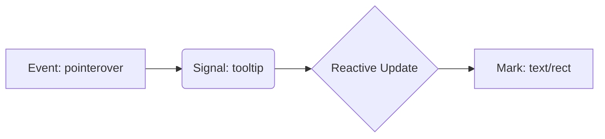

# Vega 基础概念：Scales, Axes, Signals 与内存模型

本文件记录了关于 Vega 可视化语法的核心概念学习，包括比例尺、坐标轴、信号交互以及底层原理。

## 1. Scales (比例尺) 与 Axes (坐标轴)

### 核心区别
- **Scales (数学映射)**：负责将数据空间（Domain）映射到可视化空间（Range）。它是不可见的数学函数。
  - **Domain**：输入数据范围（例如：$0 \dots 100$）。
  - **Range**：输出像素范围（例如：$0 \dots 400px$）。
- **Axes (视觉组件)**：Scale 的可视化表现。负责绘制刻度线、标签和轴线。

### 坐标系规则
Vega 使用计算机图形学标准的左上角原点坐标系：
- 原点 $(0, 0)$ 位于绘图区域左上角。
- $x$ 轴向右增加。
- $y$ 轴向下增加。

为了实现符合数学直觉的“向上增长”柱状图，通常会在 $y$ 轴的 Scale 中通过控制 Range 来翻转坐标（例如：数据 $0$ 映射到像素 $200$，数据 $Max$ 映射到像素 $0$）。

## 2. 图表旋转逻辑
在 Vega 中旋转图表（如将垂直柱状图转为水平）需要物理层面的变更：
1. **交换 Scale 定义**：让 $x$ 轴映射数值，让 $y$ 轴映射分类。
2. **变更 Marks 属性**：
   - 垂直：使用 `x` 定位分类，`y/y2` 表达高度。
   - 水平：使用 `y` 定位分类，`x/x2` 表达宽度。

## 3. Signals (信号) 与交互
Signals 是 Vega 中的响应式变量，连接了用户事件与图表状态。

- **事件监听**：通过 `on` 数组监听 DOM 事件（如 `pointerover`）。
- **数据捕获**：使用 `datum` 关键字获取当前交互图形背后的数据行。
- **自动隐藏**：当 Signal 无效（如 `undefined`）导致坐标计算失败时，Vega 渲染器通常会自动跳过该 Mark 的绘制。

## 4. 内存模型与性能
- **引用传递**：每个 Mark 绑定的 `datum` 只是对原始数据数组中对应对象的**引用**，而非深拷贝。因此内存占用不会随 Mark 数量线性爆炸。
- **Scenegraph (场景图)**：Vega 在内存中维护一棵图形树。
- **渲染器**：
  - **SVG**：每个 Mark 对应一个 DOM 节点，适合少量（<1k）交互图形。
  - **Canvas**：通过 JS 遍历场景图绘制，适合处理大规模（10k - 100k）数据点。

## 5. Vega 与 D3 的关系
- **集成关系**：Vega 内部大量使用了 D3 的子模块（如 `d3-scale`, `d3-shape`）进行数学计算。
- **模式差异**：
  - **D3 (命令式)**：手动操作 DOM，控制“怎么画”。
  - **Vega (声明式)**：编写 JSON 配置，描述“画什么”。
- **架构优势**：Vega 抽象了 Scenegraph 层，使得同一份配置可以无缝切换 SVG 和 Canvas 渲染，并内置了 D3 所不具备的响应式数据流引擎。
