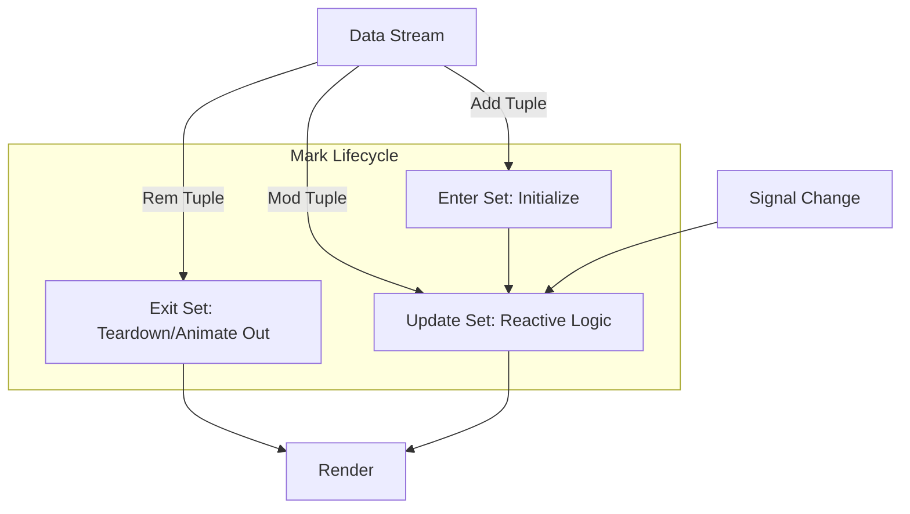

# QA: Marks 的编码生命周期 (Encoding Lifecycle)

## 问题
1. `marks.enter` 是响应式的吗？
2. 除了 `enter`, `exit`, `update` 外，还有哪些编码集 (Encode Sets)？

## 回答

这是一个非常专业且切中要害的问题，直接关乎 Vega 的性能优化机制。

### 1. `marks.enter` 是响应式的吗？

**简单回答：不是（有条件的）。**

**详细解释：**
*   **触发时机**：`enter` 编码集**仅在**数据项（Datum）**首次**被创建并添加到场景图中时执行一次。
*   **响应性**：
    *   如果后续 `Signal` 发生变化，`enter` 块中的逻辑**不会**重新运行。
    *   只有当数据源 (`data`) 发生变化，导致有**新**的数据项产生时，这些**新**项才会运行 `enter`。
*   **用途**：用于设置那些**恒定不变**的属性（例如：初始位置、固定的宽度、或者不需要随交互改变的颜色）。这极大地减少了每一帧渲染时的计算量。

**对比 `update`**：
*   `update` 编码集是**全响应式**的。任何相关的 Signal 变化、数据变化都会触发 `update` 重新计算。
*   **关键机制**：当 `enter` 运行完后，Vega 会紧接着自动运行一次 `update`。所以，通常我们将动态属性放在 `update` 中，静态属性放在 `enter` 中。

### 2. 完整的编码集 (Encode Sets)

除了你提到的，Vega 的 Mark Definition 一共支持以下四个标准的编码集：

#### 1. `enter` (初始化)
*   **时机**：数据项**创建**时。
*   **作用**：初始化属性。只运行一次。
*   **典型用途**：设置非数据驱动的静态样式，或初始坐标。

#### 2. `update` (更新)
*   **时机**：
    1.  `enter` 执行后紧接着执行。
    2.  任何依赖的 Signal 变化时。
    3.  数据流发生变化导致该 Mark 需要重绘时。
*   **作用**：**核心动态逻辑**。处理交互、动画起始状态、随数据变化的属性。
*   **典型用途**：颜色高亮 (`hover`), 位置更新 (`dragging`).

#### 3. `exit` (销毁)
*   **时机**：数据项被**移除**（不再存在于当前数据流中）时。
*   **作用**：定义元素消失前的状态。通常配合动画使用。
*   **典型用途**：设置透明度为 0 (`"opacity": 0`)，让元素淡出而不是瞬间消失。

#### 4. `hover` (鼠标悬停 - 语法糖)
*   **时机**：鼠标指针悬停在 Mark 上时。
*   **注意**：这是一个快捷方式。底层实际上是通过事件流监听器实现的，但在 Spec 中提供这个快捷入口非常方便。它等价于定义了鼠标事件监听并触发更新。
*   **典型用途**：改变鼠标光标 (`"cursor": "pointer"`) 或临时颜色改变。

### 3. 生命周期图解

### 总结
Vega 的这种设计是为了**性能**。通过区分“只算一次” (`enter`) 和“经常要算” (`update`)，它可以避免在每一帧交互中重新计算大量不变的几何属性。

*   如果你把 `x` 坐标放在 `enter` 里，当你缩放 (`scale` domain 变化) 时，点是不会动的！
*   如果你想让点随缩放移动，`x` 坐标必须放在 `update` 里。
