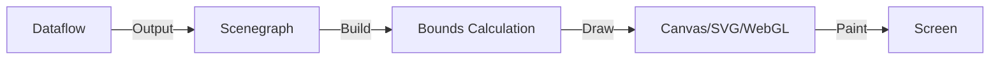

# Scenegraph 与渲染 (Scenegraph & Rendering)

在 Dataflow 计算完所有属性后，我们得到了一个包含位置、颜色、形状信息的 **Scenegraph (场景图)**。现在的任务是：如何把它变成屏幕上的像素？

## 1. 渲染管线 (Rendering Pipeline)

### A. 场景图 (Scenegraph)
它是一个纯粹的数据结构（JavaScript 对象树），不包含任何 DOM 节点或绘图上下文。
*   它独立于渲染后端。这意味着同一个 Scenegraph 可以被“打印”到 Canvas，也可以被“转换”为 SVG 字符串，甚至是 Headless 环境下的 PDF。

### B. 边界计算 (Bounds Calculation)
这是渲染前最重要的一步。
*   **任务**：计算每个 Item、每个 Mark、每个 Group 的几何边界框 (Bounding Box)。
*   **目的**：
    1.  **自动布局**：父级 Group 需要知道子级多大，才能调整大小。
    2.  **脏矩形检测 (Dirty Rectangle)**：如果只有左上角的一个点变红了，渲染器不需要重绘整个 1920x1080 的画布，只需要重绘那 10x10 的区域。
*   **复杂性**：这是计算密集型的。比如文本的宽度测量、贝塞尔曲线的极值计算。

### C. 渲染器 (Renderers)

Vega 内置了两个主要的渲染器：

#### 1. Canvas Renderer (默认)
*   **原理**：遍历 Scenegraph 树，调用 HTML5 Canvas 2D API (`ctx.rect`, `ctx.fill`)。
*   **优势**：
    *   **性能**：处理大量对象（10k+）时远快于 SVG。
    *   **内存**：不创建 DOM 节点。
*   **劣势**：不支持 CSS 样式（所有样式必须在 Vega Spec 里写死）。

#### 2. SVG Renderer
*   **原理**：遍历 Scenegraph 树，生成对应的 SVG DOM 节点 (`<rect>`, `<path>`)。
*   **优势**：
    *   **无损缩放**：矢量图，打印清晰。
    *   **调试**：可以用浏览器开发者工具检查每个元素。
*   **劣势**：当节点数超过 1000 时，DOM 操作会显著拖慢浏览器。

## 2. 脏检查与增量渲染 (Dirty Check & Incremental Rendering)

为了实现高帧率动画，Vega 的 Canvas 渲染器使用了脏矩形技术：

1.  **标记脏 Item**：当 Encoder 更新了某个 Item 的 `x` 属性时，该 Item 被标记为 Dirty。
2.  **计算重绘区域**：
    *   Union(旧位置的 Bounds, 新位置的 Bounds)。
    *   这个区域就是必须擦除和重绘的区域。
3.  **剪裁与绘制**：
    *   `ctx.save()`
    *   `ctx.beginPath(); ctx.rect(dirtyBox); ctx.clip();` (设置剪裁区)
    *   **重绘**：虽然遍历了场景图，但只有落在剪裁区内的元素才会被真正绘制（Canvas 内部优化）。
    *   `ctx.restore()`

## 3. Headless Rendering (服务端渲染)
由于 Scenegraph 不依赖 DOM，Vega 可以在 Node.js 环境下运行。
*   **vega-canvas**: 使用 `node-canvas` 模拟 Canvas API。
*   **用途**：在服务器端生成图片报告，发送给前端或生成 PDF。

## 总结
Vega 的渲染层设计实现了**状态与表现的分离**。
*   Dataflow 只管算数。
*   Scenegraph 只是数据结构。
*   Renderer 负责把它画出来。
这种松耦合使得 Vega 可以轻松切换后端（甚至未来切换到 WebGPU），同时通过边界计算和脏矩形技术保证了 Canvas 渲染的高性能。

---

# 追问：Scenegraph 细节对比 (DOM vs Canvas vs Pixi)

## 追问
1.  Scenegraph 是否可以理解为一种类似 DOM 的数据结构？
2.  使用 Canvas 时，如果某个 Item 被修改了，需要重绘，那么它怎么清除之前的绘制？
3.  Vega 的 Scenegraph 与 PixiJS 的 Scenegraph 有什么异同？

## 回答

### 1. Scenegraph vs. DOM
**是的，非常类似。**
Vega Scenegraph 在概念上就是一种 **Virtual DOM**。
*   **相同点**：
    *   **树状结构**：都有父子关系 (Parent-Child)。
    *   **属性驱动**：节点外观由属性 (`x`, `fill`, `opacity`) 决定。
    *   **事件冒泡**：Vega 实现了类似 DOM 的事件传播机制（Picking -> Bubble）。
*   **不同点**：
    *   **轻量级**：Vega Node 只是普通的 JS Object，没有 DOM Element 那么沉重（没有原型链上的几百个方法）。
    *   **专用性**：专为可视化设计，没有复杂的排版引擎（CSS Layout），只有基于 Bounds 的简单布局。

### 2. Canvas 的“清除”机制
这是一个非常好的问题，因为 Canvas 是即时模式 (Immediate Mode)，画上去就忘。

Vega 的处理流程如下：
1.  **保存旧状态**：在更新 Item 属性之前，Vega 已经记住了它**上一次渲染时**的 Bounding Box (Bounds A)。
2.  **更新属性**：Dataflow 运行，Item 移动到新位置。
3.  **计算新状态**：计算新的 Bounding Box (Bounds B)。
4.  **计算脏区域 (Dirty Region)**：
    `DirtyRect = Union(Bounds A, Bounds B)`
    *   为什么要 Union？因为你需要擦掉**原来的痕迹** (A)，同时也需要画出**新的图形** (B)。
5.  **擦除与重绘**：
    *   `ctx.clearRect(DirtyRect)`：这一步其实是把这块区域**挖空**（变成透明）。
    *   **重绘重叠物**：因为挖空可能把背景里没变的东西也擦掉了（比如底下的网格线，或者叠在上面的另一个点），所以必须**重绘所有与 DirtyRect 相交 (Intersect) 的 Items**，即使它们自己没变。
    *   这就是为什么 Scenegraph 必须保留所有对象引用的原因——为了重绘那些“无辜被擦掉”的邻居。

### 3. Vega vs. PixiJS Scenegraph
两者都是 2D Scenegraph，但目标完全不同：

| 特性 | Vega Scenegraph | PixiJS Scenegraph |
| :--- | :--- | :--- |
| **核心目标** | **精确的数据映射** (Data Visualization) | **高性能游戏渲染** (Game Engine) |
| **渲染后端** | Canvas 2D (主要), SVG | WebGL (主要), Canvas 2D (回退) |
| **层级管理** | 严格对应 Data Grouping (`group` mark) | 自由的 `Container` 嵌套 |
| **变换矩阵** | 相对简单的 Transform | 完整的 Matrix 变换 (GPU 友好) |
| **脏检查** | **CPU 密集型** (Bounds Calculation) | **GPU 友好型** (通常重绘全屏或利用 Shader) |
| **文本处理** | 极度重视精确排版和换行 | 相对基础 (通常用 Bitmap Font) |

**总结差异**：
*   **Vega** 更像是一个**排版引擎**。它花费大量 CPU 时间在计算“这个字到底多宽”、“坐标轴怎么对齐”上，以保证视觉的准确性。
*   **PixiJS** 是一个**渲染引擎**。它假设你已经知道位置了，它的任务是用最快的速度（批处理、WebGL）把几万个精灵贴图扔到屏幕上。

---

# 追问：谁更轻量 (Vega vs Pixi)？

## 追问
Vega 和 Pixi 的 Scenegraph 谁更轻量？

## 回答
**在内存占用（单个节点对象大小）上，Vega 显著更轻量。**

### 1. Vega Item 极度精简
Vega 的 Scenegraph 节点（Item）几乎就是一个纯粹的 JSON 对象 (POJO)。
*   它主要只包含你定义的那些属性（x, y, fill）。
*   它没有复杂的原型链继承，没有绑定几十个方法。
*   **设计目的**：为了能够承载数百万个数据点。如果每个点都是一个沉重的对象，内存早就爆了。

### 2. PixiJS DisplayObject 相对较重
PixiJS 的 `DisplayObject`（及其子类 `Sprite`, `Graphics`）是为了功能丰富性设计的。
*   每个节点都携带了完整的变换矩阵 (Transform Matrix)、透明度、滤镜 (Filters)、遮罩 (Masks)、交互管理器 (Interaction Manager) 等引用。
*   虽然 Pixi 也有优化，但它的设计初衷是管理“几千个精灵”，而不是“几百万个数据点”。
*   **注意**：Pixi 处理百万级对象通常不使用 Scenegraph 节点，而是使用 `ParticleContainer`，这其实就是退化到了类似 Vega 的处理方式（放弃个体的复杂性，只保留位置和纹理信息）。

### 结论
*   如果你要存 **100 万个点**：**Vega** 的结构更紧凑，内存开销更小。
*   如果你要管理 **1000 个带物理效果、点击事件和复杂嵌套的游戏角色**：**PixiJS** 的结构虽然重，但提供了必要的运行时功能支持。

简而言之：**Vega 是“数据优先”的轻量，PixiJS 是“功能优先”的重量。**
