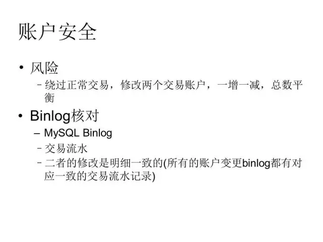

+++
title = "账务系统设计及应用"
description = "账务系统设计及应用"
date = 2016-06-15
draft = false
template = "blog/page.html"

[extra]
toc = true
+++

摘要：本文来自中生代技术交流群的分享。分享者：王在祥，现任快塑网 CTO，具有20年IT从业经验，目前负责大宗商品电商快塑网的B2B平台，
有丰富的产品和研发管理经验。本文将分享来自实战的关于电商B2B平台账务系统设计经验。 [原文连接](https://mp.weixin.qq.com/s/I8A_zF6MTkMle8o6uI8Wag)

> 王在祥 
> 20年IT从业经验，混战过银行、航空旅游等行业。全栈工程师。编程语言爱好者、新轮子爱好者、scala爱好者。混迹过银行、航空旅游等行业，
> 担任过 易网通商旅 CTO、好易电子联行 CTO，现任快塑网 CTO。唯品会SOA架构OSP创建者。业余马拉松爱好者。
>
本次分享的主题是“帐务系统设计及其在电商的应用”，主要介绍复式记账方法，以及其在电商中的应用。

内容概要

- 背景介绍
- 复式记账法
- 帐务系统基本要素
- 在电商平台的应用

# 背景介绍

首先申明一下，这一块并不是定位于专业的财务系统而谈的，我本人也没有专业的财务知识和相关工作经验。但是很多的业务系统、电商系统都涉及到资金的结算问题，
而且这一块往往也是业务中最为复杂的一块，大部分的技术人员并不懂财务知识，往往采用一些类似于”收付记账“的思路，来记录资金的变化，往往会越往后走，
系统越来越复杂，而且资金之间的关系也会越来越混乱，账算不清楚，也会带来财务安全方面的很多问题。我之前有过银行核心系统建设的一些经验，
感觉将这一块的思路应用在非财务系统中，可以化繁为简、以静制动，管好钱和账，往往能够起到很神奇的效果。

比如说对快塑网，我们的订单就涉及到复杂的资金结算关系，由于是大宗商品，客单价很高，线下的业务流程比较复杂，收付款一块的复杂度是很高的，
传统的方式，是收付款在独立的财务系统中解决，但这样，又难以和运营流程很好的结合起来。我们之前就是采用类似于”收付记账“的方法，简单的纪录收付款流水，
这种方式随着业务的变化、以及运营的精细化，越来越难移满足要求。举个简单的例子，单单订单收款流水，就要考虑到不同的收款渠道
（银行转账、资金帐户、金融贷款、预收款）、收款用途（保证金、货款、运费、违约金）。

再其次，我们需要在内部对订单进行精细化的核算，区分订单内的货物毛利、物流毛利、金融毛利，而每一项毛利又需要核算采购端、销售端的比例。
而且这个是一个不断变化的过程，随着不同的订单的收款时间、付款时间、收款方式、付款方式、订单的履约情况而变化，想想，要把这么多财务数据核算清楚，
采用传统的“业务流水”是一件非常困难，乃至不可能的任务。

再其次，我们需要在内部对订单进行精细化的核算，区分订单内的货物毛利、物流毛利、金融毛利，而每一项毛利又需要核算采购端、销售端的比例。
而且这个是一个不断变化的过程，随着不同的订单的收款时间、付款时间、收款方式、付款方式、订单的履约情况而变化，想想，要把这么多财务数据核算清楚，
采用传统的“业务流水”是一件非常困难，乃至不可能的任务。

# 复式记账法

其实，刚才说的这些问题，在专业的财务系统中可能并不是一个很大的问题。其实，传统的财务系统，也是采用“收付”记账法的方式进行的，有些类似于我们搞一个Excel，
很简单的几列： 时间、 收款金额、付款金额、用途，等等。但这种方式很难以解决企业运作中复杂的资金关系，因此，现在已经废弃掉了。现在的财务系统，
都是采用“复式记账”的方式。

程序员一般都不懂会计知识，不过，我建议大家都做一些了解。会计知识不仅可以应用于我们的软件设计，而且也可以帮助我们去阅读一个公司的财报，
顺便做一点“价值投资”的事情，说不定赚的比工程师要多很多呢。:)

复式记账法的核心思想是会计恒等式：资产 ＝ 负债 ＋ 所有者权益。这个也是所有的企业财务报表的核心。 银行帐户资金、应收款、预收款、固定资产
（电脑、办公桌椅）等都属于资产，短期借款、应付款、预售款等都是负债，而公积金、未分配利润、实收资本等等属于所有这权益。 一般的，在业务运营类系统中，
不太会涉及到所有者权益这一类的帐户。

作为会计恒等式的一个扩展：资产 ＋ 支出（费用）＝ 负债 ＋ 所有者权益 ＋ 收入（收益），收入、支出这两类帐户是企业运作过程中的最为常见的业务，
比如销售收入、采购支出、费用补贴、利息收入、利息支出等等。收入类帐户的性质与负债类相似，是在等式的右边。支出类帐户的性质与资产类相似，是在等式的左边。

对于初次接触会计知识的同学，这些是非常绕口的。收入为什么和负债在一起，明明收入构成了我的资产啊，而费用怎么又与资产在一起，明明费用是我的”负债“啊？
这些，是很难解释清楚的。建议，初次接触会计知识的同学，千万不要纠结于这些”绕口“的概念，大不了把帐户结构明确打印出来，照单接收，不理解也不要纠结。

按照会计等式，任何一项经济业务都会引起资产与权益之间至少两个项目发生增减变动，而且增减变动的金额相等。因此对每一笔经济业务的发生，都可以以相等的
金额在两个或两个相关账户中作等额双重记录。这种记账如实反映了经济事物的客观联系，是一种科学的记账方法。其实，在“收付”记账中，我们已经隐含了这个因素，
我们会补充纪录一下本次收付款的“用途”，其实，也就是描述对方的一些性质。知识，复式记账法把这一块标准化了，是对“收付记账”的一次科学的升级。

对帐户的变更记录有2种：借记、贷记。对不同性质的帐户（也可以称呼为会计科目），定义是不一样的。比如资产类帐户，例如存款，会导致帐户余额增加，
我们称之为“借记”，如果是取款，会导致帐户余额减少，我们称之为“贷记”，而对负债类帐户，比如收到预付款，会导致余额增加，我们称之为“贷记”，
而归还预付款或者使用预付款，会导致余额减少，我们称之为“借记”，这个可以参考上述的表格。

再次“友情提示”，为什么银行存款增加是“借记”，我们根本没有借款啊？大家千万不要纠结于这个字眼，此借非彼借。如果搞不懂，直接查查表，千万别纠字眼。

# 帐务系统基本要素

这里介绍一下帐务系统的一些基本概念。这些概念也只是我们之前在银行核心系统中的一些约定，并不代表是”行业标准“。

关于“帐户”，会计帐户，也称之为“会计科目”，另外，我们还会有业务帐户，比如对”预收款“，我们会对每一个客户设立一个业务帐户。这两个帐户是在两个不同的体系中的，
一个是会计层面，一个是业务层面，但又有相关性：会计帐户一般是对应的”业务帐户“的汇总。我们也把”业务帐户“称之为”分户账“。

有两种记账的模式，一种是直接操作“科目”，对其进行借记、贷记，这种方式会记录会计记账流水，同时更新客户的余额。另外一种是只操作业务帐户，
比如存款、取款等操作，只修改分户账，记录业务流水。而定时的（比如在每天日结时），对当天的业务流水进行批量处理，再记录会计流水、更新会计科目的余额。
两种方式各有优缺点，批量的方式将记账延后，性能可能更高，而且，一些中间的操作（譬如取消的流水）无需处理。而实时操作复杂性要高很多，但实时操作可以
实时的反应会计科目的最新余额，也是有价值的。具体如何选取，在实践中需要平衡，根据业务需要选取。

一般的，会计科目我们不会选择“自增”的方式，而是和财务人员一起协商，确定一个有意义的编码，这个对于后续的交流，是非常有帮助的。比如说，我们在银行的时候，
我们的活期存款的科目是：02870100，这个代号是有一定的业务含义的，这是一个二级科目，一级 0287 代表活期，奇数结尾时负债类科目
（与企业不同，在银行，存款时负债而非资产），01 是二级，这个科目没有下设子科目。

科目之间的父子关系：比如说 定期存款 有1年定期、2年定期、3年定期等组成，可以设立“定期存款”科目和“1年定期存款”科目，两者是父子关系。一般的，
父科目的余额是全部子科目余额的总和，具有子科目的父科目，不应该直接进行记账操作。否则会导致数据的矛盾。

一般的，不同的业务流水，会有不同的记账方式，具体而言，就是要借记哪些帐户、贷记哪些帐户，相应的记账金额如何确定？这些一般是在业务设计时就需要确定的，
开发可以写死在代码中，也可以考虑使用配置的方式来进行。考虑到如何记账是一个相对易变的行为（不同时期、不同的业务模式、不同的管理策略，
都可能调整同一笔业务流水的记账方式），采用配置的方式可以更敏捷的应对这种变化，而且，将这一块的逻辑从业务流水中解偶出来，也是很有价值的。

接下来，我们介绍一下“平衡体系”，这里有静态的平衡： 资产 ＝ 负债 ＋ 所有者权益， 也有动态的平衡，即每一笔会计流水，都要满足： 有借必有贷，借贷必相等。

有了这两个平衡关系，我们在每天（或者每个周期开始），应该满足静态平衡，在每个日终（或者周期结束），也应该满足静态平衡。任何时候，系统的这个平衡关系出现打破，
一定是系统出现了BUG。一个能够自我平衡和问题检测的系统，是多么优美的一件事情，这也也是“复式记账法”带来的一个优势价值。

第二个平衡是“总分一致”，即总账 ＝ ∑分户账。

比如在银行系统中，每天众多的存款、取款、开户、销户操作，分户账的变化是频繁的，这个和总账是否一致，也是非常重要的。我们早期的银行系统，由于安全性
的问题，经常会出现一些内部人员作案的情况。比如，我直接操作我们帐户，将存款余额增加100万，如果不进行总分核对，就可能查询不出来。

由于总账有自己的平衡体系（外加业务监控管理体系），再加上总分核对（我们不可能每天对上万的分帐户进行逐一核查），我们基本上可以实现业务系统的
关键数据的“自平衡”检查。这个对于防范业务风险是非常有必要的。

除了系统间的平衡关系之外，还有一个很重要的平衡：“账款一致”，账是系统内的帐户（科目）余额，是个数字，款是实在的现金，是我们在银行帐户的余额
（对银行核心系统，就是柜台钱箱中的现金）是需要一致的。这个平衡是非常有作用的。

静态平衡 ＋ 动态平衡 ＋ 总分核对 ＋ 账款一致， 这几个平衡关系一环套一环，构建了一套非常优美、完善的自平衡体系，即包括会计总账、也涉及到分户账，
并和“现金”这个实体概念进行核对。这一系列的平衡关系，确保帐户数据的一致性、安全性。

另外，如果直接修改某2个帐户，而不记录业务流水（业务流水有别的方式进行核查），那么是否可以破坏呢？这一块，在银行体系中也有对应的安全措施，
比如加上MAC字段，手工修改数据库的成本就大为增加。另外，采用binlog相结合的方式，也可以检查出没有正常业务流水的“直接修改帐户”的操作，
从而进一步的增加整个帐务系统的安全性。

# 在电商平台的应用
下面，我就附上2个应用这一方法的实践。可供大家参考。

其一是在腾讯电商时应用于电商支付结算。 

其二是目前我们在快塑网应用的订单结算。

我们在快塑网应用“复式记账”来应对订单结算时，是享受到了这张模式带给我们的“红利”的。简单的来说，在应用“收付”记账模式时，要表达复杂的资金关系是非常困难的。
采用了“复式记账”模式后，这个困难从“开发团队”转移到了“产品团队”，只要产品层面能够清晰的描述出来，开发的实现就变得简单，基本上是一个翻译的工作。

合理的设置好帐户结构、以及确定好每一笔业务流水的记账方式（这一方面可以请教公司的财务专家），剩下的问题就迎刃而解了。

这是我们的订单结算所涉及到的帐户结构。

这个帐务结构的设计，是“非专业的“，我们是站在业务运营的角度上，并没有刻意的追求是否符合”财务“标准。不过，有一些财务经验还是会很有帮助的。
这一块，也可以咨询公司的财务同事，获得建议。

这是一个业务流水，如何进行记账的范例。同样，也是“非财务专业”的。

