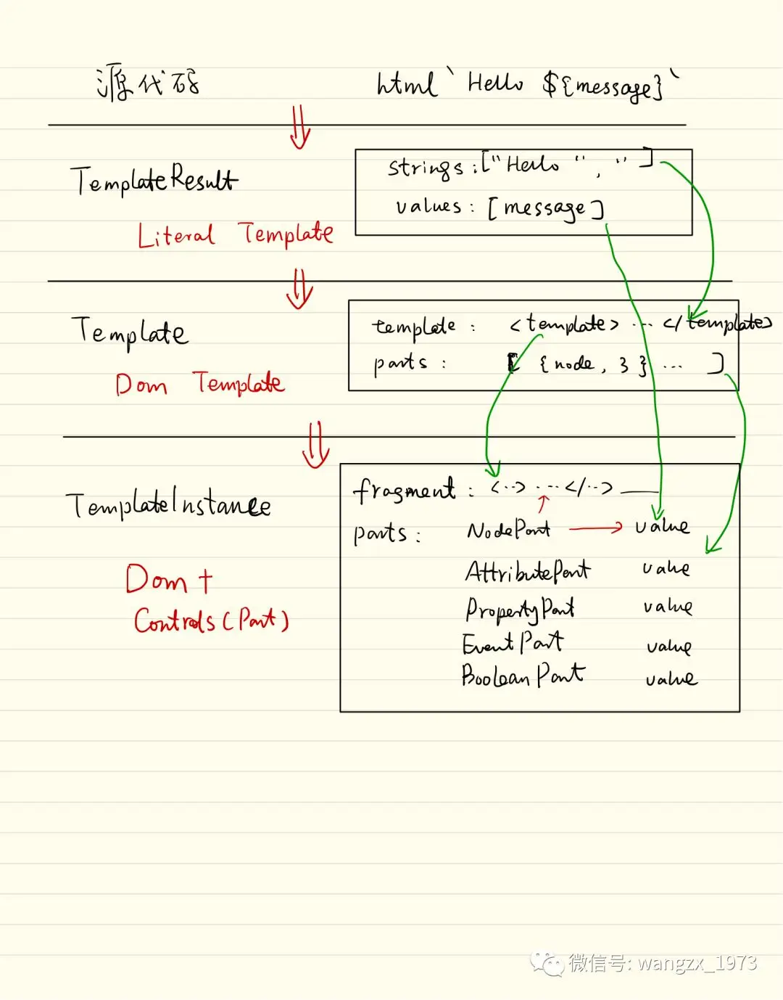

+++
title = "LitElement & LitHtml 探秘"
description = "本文对 WEB 前端框架（库）Lit 的渲染原理进行分析，以及对 webcomponent 技术演化的一些思考"
date = 2019-11-04
draft = false
template = "blog/page.html"
+++

在Polymer的最新Blog中，介绍了新的webcomponent开发框架：LitElement 。作为一个Polymer的资深粉，这些年一直处在且爱且恨之中：
爱 Polymer之组件化架构（当然更多归根于webcomponent底层标准），爱 Polymer 之概念简单，恨 Polymer 之不痛不痒之社区生态，
尤其在国内，几乎是无人问津，亦恨 Polymer 之版本更新，摧枯拉朽，从V1到V2到V3，哪一个版本更替都是大刀阔斧，从不考虑向下兼容。
而V3刚出，现在又冒出一个LitElement，且又是一个完全颠覆 V3的设计。
虽然最近很长时间以来，我对前端技术甚少问津，但还是很好奇 LitHtml 究竟是何方神圣，能够让Polymer 要在 历经3年发布3个大版本之后，另起炉灶，重树新标呢？

按照官方的Guide，动手启动一个Hello World之旅，了解一下 LitHtml 的奥妙之所在，还是有很多的收获的。

## 更标准
LitElement 完全基于最新的WebComponent标准
- Custom Element V1
  CustomElement 是 webcomponent 的核心规范，区别于React、VUE、Angular等一系列的“自定义元素”的框架，Custom Element在浏览器底层提供了扩展
  element 的能力，并且统一了扩展 Element 与内置 Element 的 attribute、property、method、event 的模型。

  如果说React、VUE、Angular的“自定义元素”是开发时期的语法糖那么Custom Element则是运行时期的对象模型，我们可以做很多原本不能做的事情：

    - 在运行期，直接在 DOM inspector 等工具中，浏览组件，或对其进行动态的调整，如调整 attribute、property、CSS等。
    - 可以更好的与其它的组件框架集成，例如从React中直接使用webcomponent，对其它技术无感适配。

- Shadow DOM V1
  Shadow DOM为自定义的组件提供了包括CSS、事件的有效隔离，不再担心不同的组件之间的样式、事件污染了。这相当于为自定义组件提供了一个有效的保护伞。

- JavaScript Module
  Polymer V1、V2中都引入了一个新的技术 HTML Imports，尝试使用HTML作为一种新的module载体，这个思路并没有得到业界的广泛支持，
  反而大家更为倾向于支持基于ES6的Module技术。从 Polymer V3开始，也向这一思路对齐，废弃了HTML Imports，而是使用ES6 Module。
  这样带来的优点是在开发方式上与React、VUE等更加一致，当然也更加依赖 ES6 的语言特性。

- 更匹配 OO 思想（或者说组件模型）。
    - 一个自定义组件 就是一个 继承了 LitElement 的ES6 Class。
    - 有自己的 properties，部分的properties可以映射到 attribute
    - 有自己的 method，可以响应外部的请求
    - 有自己的 event，可以将变化广播出去。
    - 当然，LitElement 并不严格意义的匹配传统的组件 OO 模型，例如 property 的定义方式有所不同，这个可以使用 typescript 这类支持
      @decorator 特性的语言来进行语法糖适配。但在底层模型上LitElement与经典的OO组件模型是一致的。
    - 当然，如果说 Vue/React 也是组件模型，那么不同之处，就在基于 WebComponent 是一个 ABI 级别、运行期级别的组件模型，而非开发期级别
      的组件模型，这也解决了不同框架之间的组件协同。

## 更小巧
核心的 LitElement + LitHtml 非常小巧，目前版本的全部源代码（Module)共 28个文件，其中：
- LitElement 共 3个Module，632行源代码，25K。
- LitHtml 核心 共 14 个Module，1326 行源代码， 54K。
- LitHtml 扩展标记，共11个 Module，978行源代码，44K

核心的源代码行数不超过2000行（还没有剔除注释），其可读性也是非常好，熟悉的话，1天就可以全部阅读完成了，运行期也很小，gzip后大约40K左右。

相比Polymer V1 - V3 的版本，LitElement应该是一个很小的实现了，这里面，非常奥妙的地方是 LitHtml，理解了 LitHtml，LitElement
其实只是一个很简单的 webcomponent 封装了。实际上，gluonjs 就是另外一个基于 LitHtml 的 webcomponent 封装。

所以接下来，我们来看看：What is LitHtml？Why LitHtml？

## What is LitHtml?
LitHtml目前是Polymer下的一个子项目，从其名字来看，可以理解为 Literal Html，是一个基于字符流的HTML模版引擎。

模版引擎，是解决UI渲染这一类问题的最为常见的模式，最早是服务端的PHP、JSP、ASP等，就是典型的脚本化的模板引擎技术，后面演变到了组件化，
例如 JSF、ASP.NET等。然后，模板引擎技术，开始延展到了浏览器前端。

（翻翻旧账：作者在2005年，也创造了一个前端模板的轮子：[easyajax](easyajax.sf.net)，在当时，还是一个非常有效的生产力工具，也在我主导的多个项目中进行了应用，
相比当时传统的JavaScript开发，easyajax 带来的开发体验是非常好的， 对当时我们的前端效率有非常显著的提升）

浏览器端的模板引擎，有两大流派：
- DOM based template。典型制作包括：easyajax、polymer、angularjs、Vue。
- Literal based template。后端的JSP、PHP等都算是这一类。react是开启Literal based template的一个成功之作。

在很长一段时间，DOM based template占据主流，Literal based template其实更多在后端渲染，直至reactjs获得成功。作为一个创造过 DOM based template
轮子的工程师，我当时也很难理解，为什么要选择这种模式？有什么优势？

- 我最早理解 React设计的出发点是：React 是后端工程师创造的前端轮子（虽然我主要也算是后端工程师），其最早确实是应用在服务端的，逐步的转移到前端。
  在后端的话，没有浏览器构造的DOM，Literal Based实现更为简单。
- React 是 Fuctional Program 思维， UI = f(data)，让一批有函数式情结的后端工程师，来整天应对 OOP 的世界，完全是三观不正，遍体不适的场景。
  （自打我从Scala入手转变到FP后，我目前也是深刻的除在这样一种状态之下）。于是，React就呼之欲出了。大家千万不要认为会用map、foreach就是函数式编程了
- UI = f(data) 是一个很华丽的转身，非常满足了FP工程师的审美洁癖，但性能呢？要知道后端工程师，对性能也是非常之耿耿于怀的，于是VDOM和Diff算法就呼之欲出了。
- JSX(Literal Termplate) + VDOM + Diff = ReactJS，一个新物种诞生并获得了巨大的成功。除了Facebook的推手，其本身也是足够有价值的。

这个推理过程完全是我自己的揣测，是否真的如是，就不得而知了。不过，React确实开启了全新的前端开发新的思维模型，使得我们不再局限于原有的DOM based，
也可以使用完全FP的方式，来解决UI的问题。

LitHtml的很多思路是继承了React的，只是在实现方式上另辟蹊径，这也是我在这篇文章中试图分析的内容。

- 放弃 JSX 语法，采用ES6的 tag template技术，实现殊途同归。
    ```javascript
    // JSX
    class ShoppingList extends React.Component {
        render() {
            return  <div className="shopping-list">
            <h1>Shopping List for {this.props.name}</h1>
            <ul>
            <li>Instagram</li>
            <li>WhatsApp</li>
            </ul>
              </div>
        }
    }
        // Taged Template
    render() { 
        return html`<div className="shopping-list">
            <h1>Shopping List for {this.props.name}</h1>
            <ul>
              <li>Instagram</li>
              <li>WhatsApp</li>
            </ul>
          </div>`
    }
    ```
  应该说，如果在当年有了tagged template，React的工程师就不需要自己创造一个JSX了。JSX完全是不得已而为之的东西。
  ES6中的template + tagged template语法糖，简直就是送给LitHtml的一个最佳礼物。这个差异完全是环境原因引起的。不过，后来者总是会占更多的便宜，
  无论是思想上可以站在前人的肩膀之上，还是在工具上，有更丰富的工具可以随手使用。总之，LitHtml基于tagged template，带来的优势就是：
    - 浏览器原生支持，无需预编译、预处理。
    - tagged tempalte 扩展能力更强，简直是为DSL定制的扩展大法。


- 其它的使用方法与 React 相似，不过，LitHtml 更专注为一个渲染引擎，不尝试提供组件、应用框架的东西，因此，概念极少，基本上就一个构造 html 模板，
  然后就是 render 过程了。在React中的组件技术等，都从LitHtml中剔除了（转移到类似于 LitElement、GlonJS这样的组件框架之中。）因此，学习使用LitHtml是非常简单的。

  ```javascript
  const result = myTemplate({title: 'Hello', body: 'lit-html is cool'});
  render(result, document.body);
  ```
  那么，除了语法上的差异（JSX vs tagged template）相比React，LitHtml在render上到底有什么特别支持呢？是否可以达到React的性能，或者超越呢？


## Example 1
我们先选择一个简单的案例，来剖析LitHtml的渲染过程

```html
<script type="module">
import {LitElement, html} from '@polymer/lit-element';
class MyElement extends LitElement {
    static get properties() {
        return {
            mood: { type: String }
        }
    }
    constructor(){
        super();
        this.mood = "happy";
    }
    render() {
        return html`Hello ${this.mood}`
    }
}
customElements.define("my-element", MyElement);
</script>
<body>
    <my-element></my-element>
</body>
```

## 构造TemplateResult
`html'Hello ${this.mood}'` 这一行代码，构造的是一个TemplateResult对象。这一个过程的原理可以参考：Tagged Template String。
这是ES6的语言特性，不属于 LitHtml 的私有特征，因此，阅读下面章节之前，一定要先了解这个语言特性。

（如果你是Scala的用户，那么这就是Scala中的字符串插值，大部分新式的语言都开始支持这个特性了。）

```javascript
class TemplateResult {
    strings: TemplateStringsArray;   // string[]
    value:  any[];
    type:  string;  // either html or svg
    processor: TemplateProcessor;
}
```
TemplateResult 是一个值对象，strings是模板内容，在我们的这个例子中，就是 `["Hello ", ""]`, value就是模板中的值，在我们的这个例子中，就是 `[ this.modd ]`。

一个需要特别关注的是：在后续调用 render方法时， Hello ${this.mood} 是重用第一次的模板的，也就是说，后续创建的TemplateResult对象，
其 strings 值与第一次调用时是完全一致的，可以理解为编译时期就确定的一个常量值，而变化的只有 value 数组。


## 渲染过程
LitHtml 使用 `LitHtml.render( container, templateResult ) ` 来完成一次渲染（即生成或更新container下的DOM结构）。

1. 首次渲染
    - 对应于 TemplateResult是一个Literal版本的模板对象，Template则是一个DOM版本的模板对象。
    - 在 TemplateResult中模板是以字符串形式存在。Template中则是以html template元素存在。
    - 在TemplateResult中，动态的值是以 value[] 存在，而在 Template中，则是以 ( index ) 形式存在，
      index 是该值在DOM中的node index。（按照标准遍历顺序）。
    - 指向最终渲染的 DOM。或者是 fragement、attribute、event等。
    - 维护DOM中各个动态部分的 Part[]。
    - render时，LitHtml并不是将 TemplateResult 关联到 container 本身，相反，而是在 container 中创建子元素。
      (由于 TemplateResult 本身可能是 `<div>...</div> <div>...</div>` 等多个元素片段，并不一定对应到单个的Node。
    - startNode 和 endNode 是 LitHtml 自己创建的在DOM中的 Comment 元素，这些元素占据DOM位置，但并不影响喧软过程。
      NodePart创建的元素将介于这两个元素之间。
    - 根据 templateResult 创建一个 `<template>` 元素。这个过程相当于完成从 Literal 到 DOM 的一个转换。
      对应到本示例中，相当于创建了如下的一个 DOM
      ```html
      <template>Hello <!----></template>
      ```
    - 创建一个 Template 对象。
      ```javascript
         class Template {
             element: HtmlTemplateElement;
             parts: TemplatePart[]
         }
         class TemplatePart {
             type: string; // node | attribute
             index: number; // for node and attribute
             name: string    // for attribute
             strings: string[] // for attribute
         }
       ```  
      
    - 根据 Template 对象创建 TemplateInstance 对象。
      Template 只是一个DOM模板（dom + parts)，并不真正与渲染的DOM树关联。
      而 TemplateInstance 则是一个运行时的示例，是作为所有使用 模板 够早的 NodePart 的 Model。

      TemplateInstance 则是：

      ```javascript
      class TemplateInstance {
        template: Template;
        _fragment:  Fragement;
        _parts: Part[];
      }
      ```

      下图是一个完整的渲染数据流：

      

    - 删除 container 下的所有子节点。render会根据 html 模板，重新更新 container 下的全部显示内容。
    - 新创建一个 NodePart 对象，并关联到 container。
      LitHtml中，Part 充当了MVC模式中的一个控制器，它连接了 Model（模版内容）、View（DOM Node)，并完成更新过程。

      在本示例中，新创建的NodePart 连接了 TemplateResult（Model)、container（View)，并控制这个渲染过程。
      ```javascript
        interface Part {
            value: any;
            setValue(value: any): void;
            commit(): void;
        }
        class NodePart implements Part {
            startNode, endNode: Node;
            value: any;
            __pendingValue: any;
        }
      ```

      part.setValue ( templateResult ) 将 templateResult 作为 part 的新值。

      part.commit 提交新值 (templateResult)，这个会更新 part 对应的 DOM。

2. 后续渲染

    对 cotainer 进行第二次的渲染时，其基本流程如下：

    - 检查当前 TemplateInstance 的模板是否与 result 的模板是否一致？
    - 如果下一次 render 使用的是另外一个模板，则相当于完成重新渲染，其过程与首次渲染完全相同，参见上面的分析过程。
    - 如果使用的是相同的模板，则表示只有模板中的值会变化。
    - 将每一个 TemplateResult 的新值更新到对应的 Part 的新值，并提交。
    - 假设是一个NodePart，新值是 String，则对应的位置会替换成TEXT。（如果原来的节点还存在且是 TEXT，
      则在原node上更新值，否则，删除原来的节点，创建一个新的TEXT节点）
    - 假设是一个NodePart，新值是TemplateResult，即嵌套的html模板，则递归处理这个过程。（
      如果原NodePart是一个TemplateResult，且具有相同的模板，则只有其中动态的部分被替换，否则整体替换。）
    - 检查 container 是否有对应的 NodePart，如果有，则直接将 TemplateResult 作为value更新对应的 part。
      这个过程不再需要上面的 从 TemplateResult -> Template -> TemplateInstance 的过程，
      而是直接找到 NodePart，更新其值。NodePart 更新 TemplateResult 的过程
    - 如果 container 没有 对应的 part，则表明是首次render，使用上一节介绍的流程进行渲染：
      从 TemplateResult -> Template -> TemplateInstance。

## LitHtml更高效吗？

上面解析了 LitHtml 的渲染过程，整个流程是非常简单的，那么，这个过程采取了那些措施，使得其具有更高的性能呢？
相比 React 会更高效吗？

1. Tagged Template String 执行相比 JSX 更高效。JSX每次render时，都需要完整的构造一个虚拟DOM，
   而LitHtml，则只是重构一个 轻量级的 TemplateResult 对象，变化的只有 value 集合。
   当VDOM较大时，LitHtml的速度会快1-2个数量级。而且，TemplateResult 在memory foot上也要远远小于 VDOM。
2. 从 TemplateResult 到 `<template>` 的过程，是直接从 TemplateResult 构造 html ，然后使用 template.innerHTML
   完成解析的。这个过程使用浏览器自己的语法解析器来完成的。由于使用了 template 技术，
   这个DOM是一个DocumentFragement，并不是真实DOM的一部分，内存占用小。
3. 实际渲染的DOM生成，是从 template.importNode 来完成DOM的复制。而不是向React一样逐个Dom节点的创建。
   对于较大的DOM，这个首次渲染的效率会高很多。
4. 在增量更新的过程中，LitHtml 和 React 相类似，都是按照相同层次的节点重用的方式，
   React通过 diff(VDOM, DOM)来实现增量更新，而LitHtml并没有使用diff算法，而是基于相同模板的渲染，
   只需要对动态部分进行更新即可。两者殊途同归，但LitHtml的计算过程更加轻巧。

那么，LitHtml是如何处理大数组循环对应的 DOM 更新呢？如下面的例子：

```javascript
let myTemplate = (items) => html`<ul> ${items.map( i => html`<li>item ${i}</li>`) } </ul>`

var items = [1,2,3,4,5,6,7,8,9,10];
render( myTemplate(items),   div);

items.remove(1)
render(myTemplate(items), div);
```

当 items 删除掉 1 时，上面的代码，其实是对所有行都更新了，而最小的成本，应该是直接将第一行删除，保留其他的DOM节点。

很遗憾，LitHtml并不会自动帮你做这个优化，不过，你可以使用 LitHtml 的 Repeat 指令，参考如下：

```javascript
import {repeat} from "@lit-html/directives/repeat";

let myTemplate = (items) => html`<ul>
${ repeat( items,  (i) => i,  (i, index) => html`<li>item ${i}</li>`) }
</ul>
`
render( myTemplate(items), div);
```

实际上，LitHtml开放了 Part 的操作API，这使得我们可以对标准的渲染行为进行定制，比如这里的repeat就是这样的一次定制。

# LitElement

基于 LitHtml 这个高效的渲染引擎，LiElement 其实只是一个非常轻量级的 WebComponent 封装，主要的特性包括：
1. WebComponent 生命周期模型支持。
2. 单向的数据绑定模型。

## 后续
后续有机会，我会进一步分析：
1. LitElement vs PolymerElement 比较一下主要的特征，是否会对应用开发更友好。
2. why one-way databinding and why not two-way databinding ?
   双向数据绑定是Polymer的一个重要特征，可是LitElement放弃了该特性，采用了与React一致的单项数据绑定。
   对此，我个人持有不同意见，也希望在后续的阶段进一步的对这2种模式进行分析。