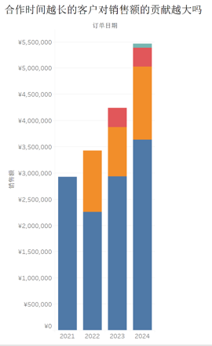
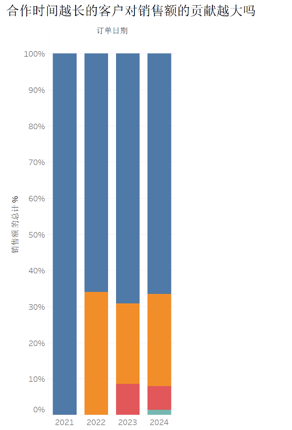
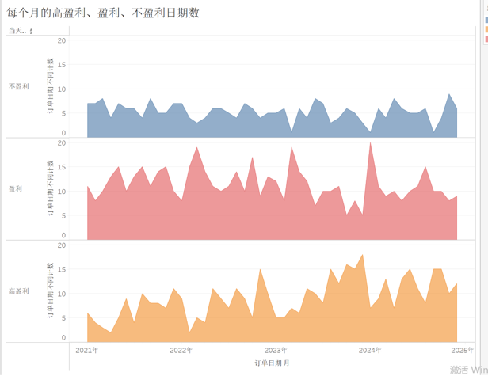

+++
title = "数据分析之表达式语言：Tabular"
description = "本文是数据分析表达式语言系列之一，主要介绍我对 Tabular 的理解。"
date = 2024-09-04
draft = false
template = "blog/page.html"
+++

本文是数据分析表达式语言系列之二，主要介绍我对 Tabular 的理解。

首先说明，我对 taular 这个产品的熟悉程度是最低的，只是有限的试用了，并重点是在学习 [15 大详细级别表达式](https://www.tableau.com/zh-cn/blog/LOD-expressions#:~:text=Tableau)
这个系列文档时，按照教程进行的一些练习，重点在与理解 LOD 表达式的使用。

## 场景1: 客户订单频率
```
[Number of orders per customer]  := { FIXED [Customer Name] : COUNTD([Order ID]) }

- 行: countd([Customer Name])
- 列: [Number of orders per customer] 作为维度
```

这个可以理解为：
1. 计算子图： 订单
2. 以 LOD 为维度时，等同于 DAX 的计算列 (以当前行的 Customer Name为筛选条件，计算 `CountD([Order Id])` )：
   ```sql
   [Number of orders per customer] = CALCULATE( DISTINCTCOUNT(Orders[Order ID]), ALLEXCEPT(Orders[Customer Name]) )
   ```
   在这里, LOD expression 相比 DAX 更加简洁，更容易理解。
3. 在每一行上，计算出 Numbers of orders per customer 的值，作为一个维度。
4. 以`[Numbers of orders per customer]`为筛选维度，进而计算出 `countd([Customer Name]`) 的值。

可以基于 [Number of orders per customer] 计算度量，此时，需要使用聚合函数，诸如 SUM, MAX 等，其原理与计算列是一致的。
FIXED LOD 只会计算出单行的值，因此，可以作为计算列直接使用。

## 场景2: 阵列分析


```
[客户首次下单时间] := { FIXED [Customer Name] : year(MIN([Order Date])) }

- 行: year([Order Date])
- 列：SUM([销售额])
- 颜色：[客户首次下单时间] as 维度，排序

如果是现实百分比，则分析设置为：

- 行: year([Order Date])
- 列：SUM([销售额]) / sum({ EXCLUDE [客户首次下单年份]: SUM([销售额])})
- 颜色：[客户首次下单时间] as 维度，排序
```
1. 我这里是通过手写计算公式的方式来实现，官方示例可以通过 表快速计算 来实现，操作更简单。
2. 在能使用LOD 表达的场景来看，确实比 DAX 更加简单。
3. Tabular 的 数据展示，设计的非常合理，其中，轴除了 column, row 轴两条常规周之外，还有：
   - 颜色轴：可作为维度（用于分组）、度量（用于渲染不同的颜色）
   - 大小轴：可用于维度、度量
   - 标签轴：可用于维度、度量
4. LOD 本身是一个集合，作为维度使用时，或者其是单行集合，例如 FIXED LOD, 或者 INCLUDE LOD，或者其是多行集合，例如 EXCLUDE LOD。
   作为多行集合，需要使用 聚合函数 计算出单个标量值。或者 attr() 函数，如果多行具有相同值，则返回之。
5. Tablular 提供了一些表间快速计算的功能。（后续单独分析一下 tabular 的表计算函数）

## 场景3: 每日利润 KPI

```
[当天利润] := { fixed [订单日期]: SUM([利润]) }

[当天盈利性质] := 
   if [当天盈利] > 2000 then "高盈利" 
   ELSEIF  [当天盈利] > 0 then "盈利" 
   else "不盈利"
   end
   
 - 行：【当天盈利性质】, countd([订单日期])
 - 列： DATETRUNC('month', [订单日期])
 - 颜色： [当天盈利性质] as 维度  
```

## 场景4: 
未完，待续。