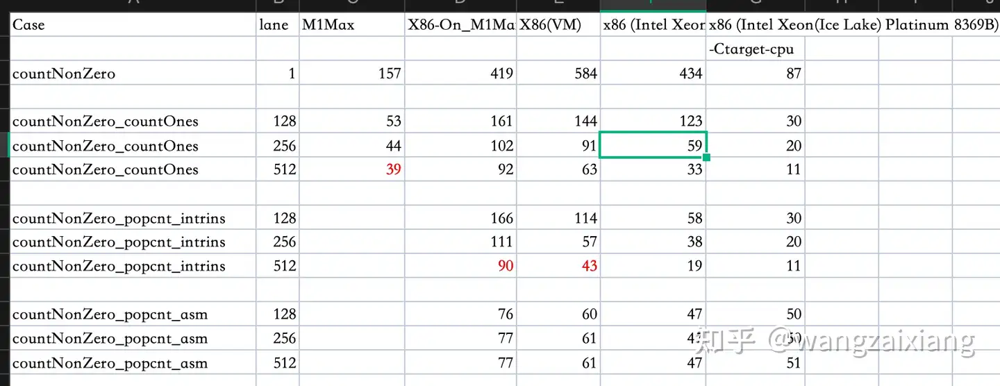

+++
title = "向量学习"
description = "本文记录学习向量化过程中的一些资料、示例代码、实际效果，以加深对这项技术的理解"
date = 2024-05-13T12:00:00+00:00
draft = false
template = "blog/page.html"

[taxonomies]
authors = ["wangzx"]

[extra]
toc = true
+++

本文是想通过案例来学习 vectorize 的 使用、效果，以加深对这项技术的理解。
这个例子是 参考: [ucasfl：ClickHouse 系列 - 向量化执行引擎介绍](https://zhuanlan.zhihu.com/p/605743800) 中介绍的 countBytes 函数，
我使用 rust portable Simd 库来进行练习。

代码可以 从这里访问：[playground](https://play.rust-lang.org/?version=nightly&mode=release&edition=2021&gist=e5f7c81e71e467adad2d372d13625f16)

或者参考如下代码：
```rust
#![feature(portable_simd)]
#![feature(stdsimd)]

use std::mem::{size_of};
use std::simd::{SimdPartialEq, ToBitMask};
use std::simd::{u8x16, u8x32, u8x64};
use std::simd::Simd;

fn fill_data(bytes: &mut [u8]) {
    for i in 0..bytes.len() {
        let random = rand::random::<u16>();
        bytes[i] = if random % 8 < 4 { 0 } else { random as u8 };
    }
}

fn main() {

    let mut bytes = [0; 1024];
    let random = rand::random::<usize>();
    fill_data(&mut bytes);
    {
        run1("countNonZero_inline", 1, 1_000_000, || {
            bytes[random % 1024] += 1;
            countNonZero_inline(&bytes)
        });
    }

    println!();

    {
        run1("countNonZeroV128_countOnes_inline", 16,1_000_000, || {
            bytes[random % 1024] += 1;
            countNonZeroV128_countOnes_inline(&bytes)
        });

        run1("countNonZeroV256_countOnes_inline", 32,1_000_000, || {
            bytes[random % 1024] += 1;
            countNonZeroV256_countOnes_inline(&bytes)
        });

        run1("countNonZeroV512_countOnes_inline", 64,1_000_000, || {
            bytes[random % 1024] += 1;
            countNonZeroV512_countOnes_inline(&bytes)
        });
    }

    println!();


    #[cfg(target_arch = "x86_64")]
    {
        run1("countNonZeroV128_popcnt_intrins_inline", 16, 1_000_000, || {
            bytes[random % 1024] += 1;
            countNonZeroV128_popcnt_intrins_inline(&bytes)
        });

        run1("countNonZeroV256_popcnt_intrins_inline", 32, 1_000_000, || {
            bytes[random % 1024] += 1;
            countNonZeroV256_popcnt_intrins_inline(&bytes)
        });

        // require 256bit AVX2
        run1("countNonZeroV256_popcnt_intrins_x86", 32, 1_000_000, || {
            bytes[random % 1024] += 1;
            unsafe { countNonZeroV256_popcnt_intrins_x86(&bytes) }
        });

        run1("countNonZeroV512_popcnt_intrins_inline", 64, 1_000_000, || {
            bytes[random % 1024] += 1;
            countNonZeroV512_popcnt_intrins_inline(&bytes)
        });

        // require 512bit AVX2
        run1("countNonZeroV512_popcnt_intrins_x86", 32, 1_000_000, || {
            bytes[random % 1024] += 1;
            unsafe { countNonZeroV512_popcnt_intrins_x86(&bytes) }
        });
    }
    println!();


    #[cfg(target_arch = "x86_64")]
    {
        run1("countNonZeroV128_popcntAsm_inline", 16, 1_000_000, || {
            bytes[random % 1024] += 1;
            countNonZeroV128_popcntAsm_inline(&bytes)
        });
        run1("countNonZeroV256_popcntAsm_inline", 32, 1_000_000, || {
            bytes[random % 1024] += 1;
            countNonZeroV128_popcntAsm_inline(&bytes)
        });
        run1("countNonZeroV512_popcntAsm_inline", 64, 1_000_000, || {
            bytes[random % 1024] += 1;
            countNonZeroV128_popcntAsm_inline(&bytes)
        });
    }
    println!();

}

fn run1<F>(label: &str, width: usize, loops: usize, mut f: F) where F: FnMut()->usize  {
    let time0 = std::time::Instant::now();
    let mut time1 = time0;
    let end = time0 + std::time::Duration::from_secs(5);
    let mut sum = 0;
    let mut n = 0usize;
    loop {
        for _i in 0..loops {
            sum += f();
        }
        n += loops;
        time1 = std::time::Instant::now();
        if time1 >= end {
            break;
        }
    }

    let elapsed = time1 - time0;
    let avg = elapsed.as_nanos() as f64 / n as f64;
    println!("{label:32}\tlane width: {width}\tsum:{sum:16}\ttimes:{elapsed:?}\ttime:{avg:?}ns/iter");
}


#[inline(always)]
fn countNonZero_inline(bytes: &[u8]) -> usize {
    let mut count = 0;
    for &byte in bytes {
        if byte != 0 {
            count += 1;
        }
    }
    count
}

#[inline(never)]
fn countNonZero(bytes: &[u8]) -> usize {
    let mut count = 0;
    for &byte in bytes {
        if byte != 0 {
            count += 1;
        }
    }
    count
}


#[cfg(target_arch = "x86_64")]
#[inline(always)]
fn countNonZeroV128_popcnt_intrins_inline(bytes: &[u8]) -> usize {
    type VT = u8x16;
    let mut count = 0;
    let mut i = 0;
    let zero = VT::splat(0);
    while i + size_of::<VT>() <= bytes.len() {
        let chunk = VT::from_slice(&bytes[i..]);
        let cmp = chunk.simd_ne(zero);
        let bits: u64 = cmp.to_bitmask() as u64;

        count += unsafe { std::arch::x86_64::_popcnt64(bits as i64) as usize };
        i += size_of::<VT>();
    }
    if i < bytes.len() {
        count += countNonZero_inline(&bytes[i..]);
    }
    count
}

#[cfg(target_arch = "x86_64")]
#[inline(always)]
fn countNonZeroV256_popcnt_intrins_inline(bytes: &[u8]) -> usize {
    type VT = u8x32;
    let mut count = 0;
    let mut i = 0;
    let zero = VT::splat(0);
    while i + size_of::<VT>() <= bytes.len() {
        let chunk = VT::from_slice(&bytes[i..]);
        let cmp = chunk.simd_ne(zero);
        let bits: u64 = cmp.to_bitmask() as u64;

        count += unsafe { std::arch::x86_64::_popcnt64(bits as i64) as usize };
        i += size_of::<VT>();
    }
    if i < bytes.len() {
        count += countNonZero_inline(&bytes[i..]);
    }
    count
}

#[cfg(target_arch = "x86_64")]
#[inline(always)]
unsafe fn countNonZeroV256_popcnt_intrins_x86(bytes: &[u8]) -> usize {
    use core::arch::x86_64::*;
    type VT = __m256i;
    let mut count = 0;
    let mut i = 0;
    let zero = _mm256_setzero_si256() ;
    while i + size_of::<VT>() <= bytes.len() {
        let chunk = _mm256_loadu_epi8(bytes.as_ptr().add(i) as *const i8);
        let mask = _mm256_cmp_epi8_mask(chunk, zero, _MM_CMPINT_NE);

        count +=  mask.count_ones() as usize;
        i += 32;
    }
    if i < bytes.len() {
        count += countNonZero_inline(&bytes[i..]);
    }
    count
}

#[cfg(target_arch = "x86_64")]
#[inline(always)]
fn countNonZeroV512_popcnt_intrins_inline(bytes: &[u8]) -> usize {
    type VT = u8x64;
    let mut count = 0;
    let mut i = 0;
    let zero = VT::splat(0);
    while i + size_of::<VT>() <= bytes.len() {
        let chunk = VT::from_slice(&bytes[i..]);
        let cmp = chunk.simd_ne(zero);
        let bits: u64 = cmp.to_bitmask() as u64;

        count += unsafe { std::arch::x86_64::_popcnt64(bits as i64) as usize };
        i += size_of::<VT>();
    }
    if i < bytes.len() {
        count += countNonZero_inline(&bytes[i..]);
    }
    count
}

#[cfg(target_arch = "x86_64")]
#[inline(always)]
unsafe fn countNonZeroV512_popcnt_intrins_x86(bytes: &[u8]) -> usize {
    use core::arch::x86_64::*;
    type VT = __m512i;
    let mut count = 0;
    let mut i = 0;
    let zero = _mm512_setzero_si512() ;
    while i + size_of::<VT>() <= bytes.len() {
        let chunk = _mm512_loadu_epi8(bytes.as_ptr().add(i) as *const i8);
        let mask = _mm512_cmp_epi8_mask(chunk, zero, _MM_CMPINT_NE);

        count +=  mask.count_ones() as usize;
        i += 64;
    }
    if i < bytes.len() {
        count += countNonZero_inline(&bytes[i..]);
    }
    count
}

////
#[cfg(target_arch = "x86_64")]
#[inline(never)]
fn countNonZeroV128_popcnt_intrins(bytes: &[u8]) -> usize {
    type VT = u8x16;
    let mut count = 0;
    let mut i = 0;
    let zero = VT::splat(0);
    while i + size_of::<VT>() <= bytes.len() {
        let chunk = VT::from_slice(&bytes[i..]);
        let cmp = chunk.simd_ne(zero);
        let bits: u64 = cmp.to_bitmask() as u64;

        count += unsafe { std::arch::x86_64::_popcnt64(bits as i64) as usize };
        i += size_of::<VT>();
    }
    if i < bytes.len() {
        count += countNonZero_inline(&bytes[i..]);
    }
    count
}

#[cfg(target_arch = "x86_64")]
#[inline(never)]
fn countNonZeroV256_popcnt_intrins(bytes: &[u8]) -> usize {
    type VT = u8x32;
    let mut count = 0;
    let mut i = 0;
    let zero = VT::splat(0);
    while i + size_of::<VT>() <= bytes.len() {
        let chunk = VT::from_slice(&bytes[i..]);
        let cmp = chunk.simd_ne(zero);
        let bits: u64 = cmp.to_bitmask() as u64;

        count += unsafe { std::arch::x86_64::_popcnt64(bits as i64) as usize };
        i += size_of::<VT>();
    }
    if i < bytes.len() {
        count += countNonZero_inline(&bytes[i..]);
    }
    count
}

#[cfg(target_arch = "x86_64")]
#[inline(never)]
fn countNonZeroV512_popcnt_intrins(bytes: &[u8]) -> usize {
    type VT = u8x64;
    let mut count = 0;
    let mut i = 0;
    let zero = VT::splat(0);
    while i + size_of::<VT>() <= bytes.len() {
        let chunk = VT::from_slice(&bytes[i..]);
        let cmp = chunk.simd_ne(zero);
        let bits: u64 = cmp.to_bitmask() as u64;

        count += unsafe { std::arch::x86_64::_popcnt64(bits as i64) as usize };
        i += size_of::<VT>();
    }
    if i < bytes.len() {
        count += countNonZero_inline(&bytes[i..]);
    }
    count
}


#[inline(always)]
fn countNonZeroV128_countOnes_inline(bytes: &[u8]) -> usize {
    type VT = Simd<u8, 16>;
    let mut count = 0;
    let mut i = 0;
    let zero = VT::splat(0);
    while i + size_of::<VT>() <= bytes.len() {
        let chunk = VT::from_slice(&bytes[i..]);
        let cmp = chunk.simd_ne(zero);
        let bits = cmp.to_bitmask() as u64;

        count += bits.count_ones() as usize;
        i += size_of::<VT>();
    }
    if i < bytes.len() {
        count += countNonZero_inline(&bytes[i..]);
    }
    count
}


#[inline(always)]
fn countNonZeroV256_countOnes_inline(bytes: &[u8]) -> usize {
    type VT = Simd<u8, 32>;
    let mut count = 0;
    let mut i = 0;
    let zero = VT::splat(0);
    while i + size_of::<VT>() <= bytes.len() {
        let chunk = VT::from_slice(&bytes[i..]);
        let cmp = chunk.simd_ne(zero);
        let bits = cmp.to_bitmask() as u64;

        count += bits.count_ones() as usize;
        i += size_of::<VT>();
    }
    if i < bytes.len() {
        count += countNonZero_inline(&bytes[i..]);
    }
    count
}


#[inline(always)]
fn countNonZeroV512_countOnes_inline(bytes: &[u8]) -> usize {
    type VT = Simd<u8, 64>;
    let mut count = 0;
    let mut i = 0;
    let zero = VT::splat(0);
    while i + size_of::<VT>() <= bytes.len() {
        let chunk = VT::from_slice(&bytes[i..]);
        let cmp = chunk.simd_ne(zero);
        let bits = cmp.to_bitmask() as u64;

        count += bits.count_ones() as usize;
        i += size_of::<VT>();
    }
    if i < bytes.len() {
        count += countNonZero_inline(&bytes[i..]);
    }
    count
}

//// no-inline
#[inline(never)]
fn countNonZeroV128_countOnes(bytes: &[u8]) -> usize {
    type VT = Simd<u8, 16>;
    let mut count = 0;
    let mut i = 0;
    let zero = VT::splat(0);
    while i + size_of::<VT>() <= bytes.len() {
        let chunk = VT::from_slice(&bytes[i..]);
        let cmp = chunk.simd_ne(zero);
        let bits = cmp.to_bitmask() as u64;

        count += bits.count_ones() as usize;
        i += size_of::<VT>();
    }
    if i < bytes.len() {
        count += countNonZero_inline(&bytes[i..]);
    }
    count
}


#[inline(never)]
fn countNonZeroV256_countOnes(bytes: &[u8]) -> usize {
    type VT = Simd<u8, 32>;
    let mut count = 0;
    let mut i = 0;
    let zero = VT::splat(0);
    while i + size_of::<VT>() <= bytes.len() {
        let chunk = VT::from_slice(&bytes[i..]);
        let cmp = chunk.simd_ne(zero);
        let bits = cmp.to_bitmask() as u64;

        count += bits.count_ones() as usize;
        i += size_of::<VT>();
    }
    if i < bytes.len() {
        count += countNonZero_inline(&bytes[i..]);
    }
    count
}


#[inline(never)]
fn countNonZeroV512_countOnes(bytes: &[u8]) -> usize {
    type VT = Simd<u8, 64>;
    let mut count = 0;
    let mut i = 0;
    let zero = VT::splat(0);
    while i + size_of::<VT>() <= bytes.len() {
        let chunk = VT::from_slice(&bytes[i..]);
        let cmp = chunk.simd_ne(zero);
        let bits = cmp.to_bitmask() as u64;

        count += bits.count_ones() as usize;
        i += size_of::<VT>();
    }
    if i < bytes.len() {
        count += countNonZero_inline(&bytes[i..]);
    }
    count
}

#[cfg(target_arch = "x86_64")]
#[inline(always)]
fn countNonZeroV128_popcntAsm_inline(bytes: &[u8]) -> usize {
    use core::arch::asm;

    type VT = u8x16;

    let mut count = 0;
    let mut i = 0;
    let zero = VT::splat(0);
    while i + size_of::<VT>() <= bytes.len() {
        let chunk = VT::from_slice(&bytes[i..]);
        let cmp = chunk.simd_ne(zero);
        let bits: u64 = cmp.to_bitmask() as u64;
        let n: usize;

        // count += unsafe { std::arch::x86_64::_popcnt32(bits as i32) as usize };
        unsafe { asm! {
        "popcnt {y}, {x}", x = in(reg) bits, y = out(reg) n
        } }
        count += n;
        i += size_of::<VT>();
    }
    if i < bytes.len() {
        count += countNonZero_inline(&bytes[i..]);
    }
    count
}

#[cfg(target_arch = "x86_64")]
#[inline(always)]
fn countNonZeroV256_popcntAsm_inline(bytes: &[u8]) -> usize {
    use core::arch::asm;

    type VT = u8x32;

    let mut count = 0;
    let mut i = 0;
    let zero = VT::splat(0);
    while i + size_of::<VT>() <= bytes.len() {
        let chunk = VT::from_slice(&bytes[i..]);
        let cmp = chunk.simd_ne(zero);
        let bits: u64 = cmp.to_bitmask() as u64;
        let n: usize;

        // count += unsafe { std::arch::x86_64::_popcnt32(bits as i32) as usize };
        unsafe { asm! {
        "popcnt {y}, {x}", x = in(reg) bits, y = out(reg) n
        } }
        count += n;
        i += size_of::<VT>();
    }
    if i < bytes.len() {
        count += countNonZero_inline(&bytes[i..]);
    }
    count
}
#[cfg(target_arch = "x86_64")]
#[inline(always)]
fn countNonZeroV512_popcntAsm_inline(bytes: &[u8]) -> usize {
    use core::arch::asm;

    type VT = u8x64;

    let mut count = 0;
    let mut i = 0;
    let zero = VT::splat(0);
    while i + size_of::<VT>() <= bytes.len() {
        let chunk = VT::from_slice(&bytes[i..]);
        let cmp = chunk.simd_ne(zero);
        let bits: u64 = cmp.to_bitmask() as u64;
        let n: usize;

        // count += unsafe { std::arch::x86_64::_popcnt32(bits as i32) as usize };
        unsafe { asm! {
        "popcnt {y}, {x}", x = in(reg) bits, y = out(reg) n
        } }
        count += n;
        i += size_of::<VT>();
    }
    if i < bytes.len() {
        count += countNonZero_inline(&bytes[i..]);
    }
    count
}

/// no-inline
#[cfg(target_arch = "x86_64")]
#[inline(never)]
fn countNonZeroV128_popcntAsm(bytes: &[u8]) -> usize {
    use core::arch::asm;

    type VT = u8x16;

    let mut count = 0;
    let mut i = 0;
    let zero = VT::splat(0);
    while i + size_of::<VT>() <= bytes.len() {
        let chunk = VT::from_slice(&bytes[i..]);
        let cmp = chunk.simd_ne(zero);
        let bits: u64 = cmp.to_bitmask() as u64;
        let n: usize;

        // count += unsafe { std::arch::x86_64::_popcnt32(bits as i32) as usize };
        unsafe { asm! {
        "popcnt {y}, {x}", x = in(reg) bits, y = out(reg) n
        } }
        count += n;
        i += size_of::<VT>();
    }
    if i < bytes.len() {
        count += countNonZero_inline(&bytes[i..]);
    }
    count
}

#[cfg(target_arch = "x86_64")]
#[inline(never)]
fn countNonZeroV256_popcntAsm(bytes: &[u8]) -> usize {
    use core::arch::asm;

    type VT = u8x32;

    let mut count = 0;
    let mut i = 0;
    let zero = VT::splat(0);
    while i + size_of::<VT>() <= bytes.len() {
        let chunk = VT::from_slice(&bytes[i..]);
        let cmp = chunk.simd_ne(zero);
        let bits: u64 = cmp.to_bitmask() as u64;
        let n: usize;

        // count += unsafe { std::arch::x86_64::_popcnt32(bits as i32) as usize };
        unsafe { asm! {
        "popcnt {y}, {x}", x = in(reg) bits, y = out(reg) n
        } }
        count += n;
        i += size_of::<VT>();
    }
    if i < bytes.len() {
        count += countNonZero_inline(&bytes[i..]);
    }
    count
}
#[cfg(target_arch = "x86_64")]
#[inline(never)]
fn countNonZeroV512_popcntAsm(bytes: &[u8]) -> usize {
    use core::arch::asm;

    type VT = u8x64;

    let mut count = 0;
    let mut i = 0;
    let zero = VT::splat(0);
    while i + size_of::<VT>() <= bytes.len() {
        let chunk = VT::from_slice(&bytes[i..]);
        let cmp = chunk.simd_ne(zero);
        let bits: u64 = cmp.to_bitmask() as u64;
        let n: usize;

        // count += unsafe { std::arch::x86_64::_popcnt32(bits as i32) as usize };
        unsafe { asm! {
        "popcnt {y}, {x}", x = in(reg) bits, y = out(reg) n
        } }
        count += n;
        i += size_of::<VT>();
    }
    if i < bytes.len() {
        count += countNonZero_inline(&bytes[i..]);
    }
    count
}

```

1. 128bit: u8x16
2. 256bit: u8x32
3. 512bit: u8x64

这个实现中，对如何进行整数的1位统计分别使用了3种方法：
- count_ones。看rust得实现，采用的算法并不算太高效
- 尝试使用  std::arch::x86_64::_popcnt64(bits as i64)
- 尝试使用 asm 嵌入 popcnt 指令。

后面发现，其实可以使用 `-Ctarget-cpu=native` 来识别 popcnt 特性，从而自动生成 popcnt的代码，这种情况下，可以获得很好的执行效果。

分别在3个平台上进行了测试：
1. M1-MAX
2. X86 on M1-MAX(Rosetta 2)
3. X86(内部虚拟机)
4. X86(阿里云 ecs.c7.xlarge型号，CPU为：Intel Xeon(Ice Lake) Platinum 8369B)
5. ecs.c7.xlarge，启用 -Ctarget-cpu=native



更新：
1. 在 x86 AVX512上，使用 `cargo +nightly rustc --release -- -Ctarget-cpu=native` 选项编译后的性能更佳。应该是使用到了当前CPU的全部能力,
   512bit向量下，达到了11.7ns。
   ```bash
   cargo +nightly rustc -Z build-std --target x86_64-unknown-linux-gnu --release  -- -Ctarget-cpu=native
   ```
   
结论分析：
1. 向量化的版本相比普通循环的版本，有接近10倍的提升。(M1 提升：4倍，X86提升：9倍）portable_simd 实际使用的是 128bit 的向量，
   但可以使用256/512位的API，此时，它会进行展开。
2. 我之前有个误解，portable_simd无法使用到 AVX512等能力。实际上并不然，只要编译时指定 target-cpu，是可以使用到 avx2, avx512等向量能力的。
   portable_simd 是开发向量化算法首选，毕竟可移植性是一个很重要的需求。
3. 在部份场合下，rustc会自动向量化，简单场景下效果会和手动向量化效果差不多。但有不少限制，复杂一些算法，可能无法自动向量化。
4. 尝试使用 x86 私有的 256位向量/512位向量能力，发现性能反而有下降，查看原因是 rustc 没有为 _mm_xxx_ intrinsc 指令生成内联，
   产生了 function call 的开销，这导致了性能的下降。
5. 编写测试代码时，前面的版本，inline时进行了过度的优化（指针对当前的场景进行了特定的优化），其不具备可复制性，干扰了测试。
   调整后的测试数据要好理解很多。（之前的部份优化，导致 512bit 可以优化到4n s 以内，后实际发现是测试代码触发了rustc进行了逻辑优化，
   少执行了不少循环。调整后的代码增加了数据的混乱，避免过度优化）。
6. 使用嵌入汇编后，可能会影响编译器的进一步优化，在案列中，asm版本，在支持 AVX512的CPU上并非最佳，我估计是没有进行循环展开导致的。

## 后续，我会收集基于向量计算的一系列算法，整理一个提纲，例如:

1. C++中的向量计算https://www.zhihu.com/question/450069375/answer/3258826060?utm_psn=1714201317017481216
2. hash 向量算法：是否可以设计一个可基于 SIMD 的hash算法（不是对单个值计算hash，而是对向量计算hash向量）？ 
3. hash join的 向量算法
    1. [40x faster hash joiner with vectorized execution](https://www.cockroachlabs.com/blog/vectorized-hash-joiner/)
    2. 源头：Balancing vectorized query execution with bandwidth-optimized storage (已收藏到 ivySCI 库中第5.4节：Optimizing Hash-Join)，比较难读。
    3. [A Vectorized Hash-Join](https://groups.csail.mit.edu/cag/6.893-f2000/vectorhashjoin.pdf)
4. binary search 的向量算法
5. Simd-json 中的向量计算
6. 加密解密中的向量计算
7. Swiss Table中的向量计算等。Rust HashMap就是基于这个结构的。
8. base64[Designing a SIMD Algorithm from Scratch · mcyoung](https://link.zhihu.com/?target=https%3A//mcyoung.xyz/2023/11/27/simd-base64/)非常好的一篇讲解 vectorize 的文章。
   以 base64 decode为例构造一个向量实现，我觉得 encode 也适合构造一个向量实现，可以拿来练手。
9. Intel 向量指令 https://www.intel.com/content/www/us/en/docs/intrinsics-guide/index.html
10. https://github.com/cloudwego/sonic-rs/blob/main/docs/performance_zh.md sonic-rs如何利用SIMD来加速JSON解析
    
zig 语言有内置的 SIMD 支持，在 Parker Liu 的专栏，有很多值得学习的干货：
1. [Zig语言的SIMD并行计算优化初探](https://zhuanlan.zhihu.com/p/687938028)
2. [Zig语言的SIMD并行计算优化初探--矩阵转置](https://zhuanlan.zhihu.com/p/688345298)
3. [Zig语言的SIMD并行计算优化初探--高通DSP的矩阵转置](https://zhuanlan.zhihu.com/p/688719072)
4. [Zig语言的SIMD并行计算优化初探--并行排序](https://zhuanlan.zhihu.com/p/690008262)
5. [Zig语言的SIMD并行计算优化初探--混合快速排序](https://zhuanlan.zhihu.com/p/695321017)
6. [Zig语言的SIMD并行计算优化初探--多向量并行排序](https://zhuanlan.zhihu.com/p/696657692)
    
也欢迎各位帮忙补充你所知道的应用向量计算的算法。