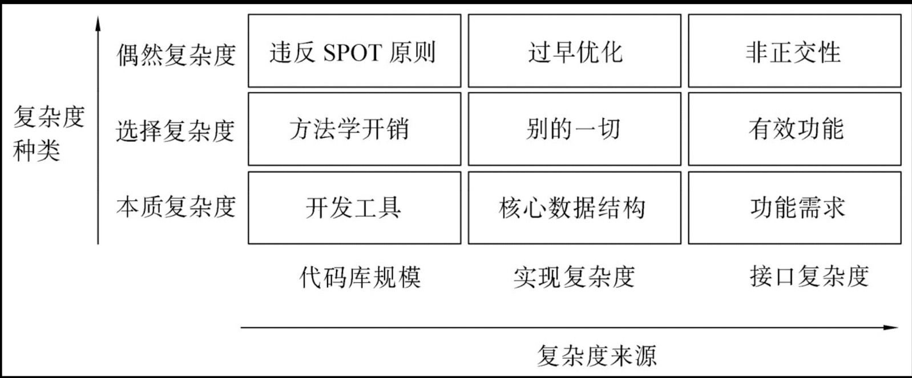

+++
title = "关于软件复杂性"
description = "关于软件复杂性"
date = 2024-10-07
draft = false
template = "blog/page.html"
+++

复杂性是软件开发中最为核心的问题，绝大多数的创新，包括方法论、工具、框架、编程语言等，都可以说是为了应对复杂性的挑战而产生的。众多软件产品、
项目往往消耗巨大的人力、财力，在解决项目中因复杂性带来的维护、BUG、安全问题上。本文收集了一些关于软件复杂性的观点，并叠加了一些个人的思考。

本文主要参考：
- [A Philosophy of Software Design](https://milkov.tech/assets/psd.pdf) 中文版：[软件设计的哲学](https://yingang.github.io/aposd2e-zh/)
  - Chapter 2: The Nature of Complexity
- [The Art of UNIX Programming](https://book.douban.com/subject/1467587/) 中文版：Unix编程艺术 (微信读书上有电子书)
  - Chapter 13: Complexity, As Simple As Possible, but No Simpler.

## 复杂性的定义
在`哲学`一书中，对复杂性进行了如下定义：`软件的复杂性是指那些让系统难以理解的部份`：
- 难以理解：当出现问题时，难以找到问题的原因，对系统的行为难以预测。
- 难以修改：无论是添加新功能、修复BUG、优化性能，无从下手，改不动，或者修改完后引入更多的问题。

这两个问题是相互关联的，因为难以理解（无法理解其结构、流程、算法），会导致难以修改。而因为难以修改，会导致在维护的过程中，引入更多的补丁，导致
系统更为复杂，可理解能力持续下降。

## 复杂性的主要症状
1. 变更放大：对系统的一个小变更，会导致系统中的多个地方进行修改，例如，在一个网站中，修改 banner 的内容、颜色，可能会导致多个页面的修改。
   - 根源之一是：重复。 当存在重复的代码、逻辑时，修改就会蔓延。
   - 耦合：当一个模块发生变更时，会辐射到其他模块，然后继续辐射，最后形成一个巨大的变更范围。
2. 认知负荷：开发人员需要掌握多少知识，才能完成一个任务（例如调用接口、完成某个功能）。理论上，每个功能的实现，深究下去，就会涉及到计算机科学的
   各个领域，例如：操作系统、网络、数据库、编译原理、算法等，可以制造出无穷的复杂性。
   - 根源之一：缺少封装，暴露了太多的细节，加深了外部的认知负担。
   - 根源之二：缺少抽象。把众多功能特性混合在一起，构成一个 macro 模块。
   - 根源之三：不一致性。 对软件产品而言，UI、文档的不一致性会带给用户认知负担。对软件代码而言，命名、接口、行为的不一致性性，会带给维护人员
     理解代码的认知负担。
   - 根源之四：不符合直觉、惯例的设计。每个语言、框架，都有其自己形成的惯用法，最佳实践。
3. 未知的未知（不确定性）。在庞大的认知负荷之下，是不确定性。
  - 缺乏契约定义（边界不明确）：对输入、输出的边界、约束、规范没有明确的定义。
  - 不完备性。系统的行为是否能覆盖契约（边界内）的全部场景，有哪些不能覆盖的场景是未知的。
  - 对某个部件进行修改后，会影响到那些部件（来源、去向），是未知的，当这些事件发生时，BUG 就产生了。

参考 RustforRustaceans 一书第3章：Design Interfaces，是对本章内容的一个很好的注脚。
- Unsurprising: 降低认知负荷
- Flexible
- Obvious: 降低认知负荷
- Constrainted：提高确定性

## 复杂性的原因
1. 依赖性（耦合）导致组件间的复杂性。
   - 高内聚、低耦合原则，就是为了减少依赖关系。
   - 模块化、组件化、服务化，层次化等等，都是为了更好的管控依赖关系。
     
   依赖不可避免，我们需要的是管理依赖：建立规范使得依赖关系更可控（例如组件化、服务化、模块化、层次化），让系统的架构更更加透明，
   对依赖关系进行治理。

2. 晦涩（模糊性）：接口语义定义不清晰，不完备，不一致。

3. 抽象不足：导致复杂的模块。
   - macro module: 一个模块中包含了多个功能（不内聚），职责不清晰，功能混杂。
   - 重复：一个功能分散到多个模块之中。

## 复杂性的分类

在`艺术`一书中，将复杂度分为3类、3个来源：
1. 复杂度种类：
   - 本质复杂度：问题领域自身的复杂性。
   - 选择复杂度：与目标需求相关的复杂性，只能通过改变工程的目标来改变复杂度。
   - 偶然复杂度：可以通过良好的设计、过程来改善的复杂度。
2. 复杂度来源：
   - 代码量复杂度
     
     `艺术`一书中，认为："代码的缺陷密度，每百行代码出错率，往往是一个与实现语言种类无关的常量。更多行的代码意味着更多的 bug，
     而调试常常是开发中最昂贵、最耗时的部分。"，这种说法放到今天，我觉得是不正确的了：
     
     > 代码行数仅是复杂度的一个指标，但相同行数的代码，仍然会有不同的复杂度，甚至差异很大。例如圈复杂度，加入了对分支路径的
     复杂度评估。在这方面，函数式编程语言（如Scala） 相比 过程式编程语言（Java）来说，有着显著的优势。
     > - 代码行数
     > - 圈复杂度（分支、路径）：FP 通过高阶函数减少了分支，降低了数据复杂度。
     > - 数据流复杂度。FP 的数据不变性，形成了 SSA(Static Single Assignment) 形式，降低了数据流复杂度。
     > - 功能密度：更高级的语言、更良好的抽象，也会带来更高的功能密度。一行代码就可以等效于低级语言、低级抽象的多行代码。
   
   - 接口复杂度
     `艺术`一书中提到的 MIT 哲学，侧重于 接口的简单性，而 "New Jersey" 哲学，则侧重于实现的简单性。书中也提到 UNIX 的哲学是偏向于
     接口的简单性，以及处理 signal 的风格，System V 则是偏向于实现的简单性，而 BSD 偏重于接口的简单性。
   
     `哲学`一书中，更是提出了 “Deep Module” 的设置哲学，即强调：
     - 接口设计应当 smaller and simpler，从而减少依赖复杂度，认知复杂度。
     - 模块内部的实现，应该 deep，即包含更多的功能，隐藏更多的细节。而避免 proxy/adapter 这种浅层模块。

     对接口设计 和 模块实现之间的平衡和取舍，有两种说法是很生动、有趣的：
     - 一个糟糕的实现，如果隐藏在一个良好的接口后面，这个糟糕的实现是可以接受的。（这也是敏捷、迭代、TDD、prototype 等方法论的基础）
     - 接口设计应该面向使用者，而不是实现者，把简单留给使用者，把复杂留给实现者。
     - UI(User Interface) 与 API(Application Programming Interface) 两者都是 interface，其设计哲学有诸多相似之处。
     
     我在实际工作中，看到的大部份设计方案，其实是不满足这个原则的，大部份的设计方案都是面向实现者的，优先的出发点是实现的可能性、简单性。而这种
     方式会自然的带来接口设计的不合理性，包括不合理的抽象，不合理的依赖关系，最终会形成一个复杂的系统。所以，我提出了 API 设计要面向用户（调用者）
     从外向内的设计系统。
   
     当然，平衡是必须的：
     - 接口设计的简单性，并不是一件容易的事情，需要有很好的抽象能力。有时这种能力必须建立在目标领域的深入理解、丰富经验之上。在对目标领域不够理解
       的情况下，很难做出简单、优雅的接口设计。 所以，有时，还是需要快速前进，等踩了坑之后，你才会知道正确的设计是什么。
     - 在部份场景下，接口的简单性会带来过高成本的实现复杂度（可能是受当前的技术、资源限制，难以突破），或者追求接口的简单性，会带来严重的性能损失，
       在这种情况下，做必要的妥协是有价值的。（`艺术`一书中列举了系统调用中对无法屏蔽的中断的处理方式，以及 www 中对 404-Not Found 的处理方式
       就是将一定的复杂性从实现者转移到调用者去的很好案例。）
     - 随着技术的演进，今天需要转移到调用者的复杂性，未来可能会变得简单。例如，异步处理的方式，就从最早的 callback 模式，演进到 Future/Promise，
       再到 async/await 模式，每一步都是将复杂性从调用者转移到实现者。 
    
  - 实现复杂度
    在`哲学`一书中，提出的“Deep Module” 的设计哲学，实际上，实现的复杂度 与 接口的简单性 是相辅相成的。
    
    - 早期教条的 UNIX 哲学：宁可放弃功能，也不能放弃简单性。 CLI 与 GUI 之战，就是这种哲学的体现。这也是典型的“因为脏水而丢掉孩子”的做法。
      `哲学`一书中列举了 ed、vi、sam、emacs、wily 等文本编辑器的演进历程。
    
    简单、优雅的接口，往往意味着实现者的复杂度会增加，如何降低实现者的复杂度，拆分（模块化设计、正交化设计）是降低复杂性的：
    - 分拆：正如 二分排序 算法可以将 O(n^2) 降低到 O(nlogn) 一样，降低模块的复杂性，就是一个不断拆分、重组的过程。
    - 正交化：将分拆后的模块，在职责上进行正交化，避免重复的职能。正交化的最佳案列之一就是 WEB 的三个模块：
      - HTML（DOM）：负责内容
      - CSS：负责样式
      - JavaScript：负责行为
      
      WEB 之前的 WFC/Motif 等应用中， DOM 与 CSS 是高度混合的，我写过那种代码，相比 WEB 的开发方式，代码量要大一个数量级，是非常痛苦的，
      大大的限制了 GUI 应用的开发效率。
      
      正交化设计的另外一些场景： 将业务性代码 与 技术性代码（如任务调度、任务编排）等进行正交化。（在我们进行数据处理的 ETL 中，
      就应用到这个拆分，从而大大的简化系统），一般的，业务性代码与业务需求之间有直接的映射关系，易变性强，但技术难度并不大，而技术性代码则具有
      更好的通用性，可以应用于不同的业务场景，但其技术挑战性高。将这二者进行分拆，整个系统的复杂性就大为降低。
      > 对复杂的系统，我们应该对业务进行抽象，将非业务性的功能从业务中分离出来。
      
    - DSL
      
      对复杂的系统，要善于定义 DSL，建立 Domain Specific Language，使用描述式的语言，来定义 what 而非 how。实际上，DSL 语言本身
      就意味着我们完成了对复杂系统的抽象，将复杂的行为转换成了更高阶抽象的描述，从而抓住了复杂之中的本质。大部份的 DSL 语言都是对某个特定复杂
      领域的有效抽象：
      - SQL：对关系型数据库的操作抽象
      - 工作流：对任务编排的抽象
      - React/Vue: 通过类 JSX 或 template 的方式，对 UI 进行抽象（注意这里的描述性，而非操作性）。
      - Makefile/Maven/SBT/Cargo: 对项目构建的抽象
      - IDL: 对接口定义的抽象
      - Regular Expression: 对字符串匹配的抽象
      
      如果能够定义出 DSL，并用于描述系统的逻辑行为时，系统的复杂性会大为降低。
    - 易变性(Volatility)拆分
      
      每个复杂的系统，都有一些部件是易变的：会随着时间、空间的变化而演变，其自身具有不稳定性。一般来说，易变性的部件，是导致系统复杂性提升的重要原因。
      - 对 SAAS 类应用，为不同的客户提供不同的功能。例如，零售系统针对不同的业态提供不同的服务模式。
      - 对 电商类应用，随着业务模式的改变，会有不同的客户服务策略、营销策略、会员策略等。
      - 对 OLAP 类应用，需要接入不同的数据源，面对不同数据源之间对 SQL 支持的差异。
      - 对 Dashboard 类应用，需要面对不同的数据展示需求
      
      对这类系统，我们就需要重点关注如何抽象这一类易变性的部件，将其与稳定性的部件进行分拆，从而实现系统的简化，否则就会陷入“Copy + Modify” 的
      模式，最终形成多个完全不同的系统，维护成本会大大增加。
    
      在 [Right Software](https://rightingsoftware.org) 一书中，提到了避免功能性的分解，而是基于易变性的分解。
      [Design for change](https://seccl.tech/guides/designing-for-change/)
    
    - 动静分离，以静为干
      
      从复杂性中识别出哪些是稳定的、静态的内容。老子曰：重为轻根，静为躁君。在复杂的系统中，我们需要将那些稳定的、静态的内容提取出来，形成一个稳定
      的主干。这一条其实与上一条：易变性拆分是相辅相成的。易变性拆分是将易变的部件提取出来，而动静分离则是将稳定的部件提取出来。
    
    对复杂性进行分拆之后，就面临如何组合，如何治理组合的问题：
    - 垂直拆分：分层
    - 水平拆分：领域化

    > 对降低复杂度的措施，后续持续更新中 ...

## 复杂性的度量

## 复杂性的应对