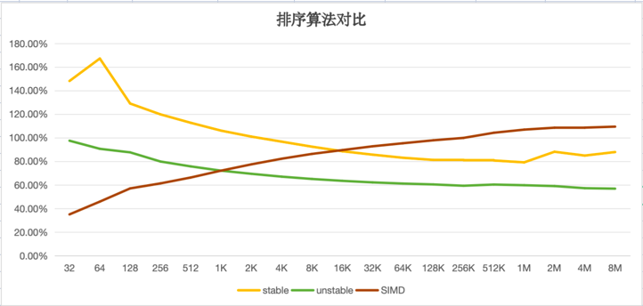

+++
title = "simd 排序"
description = "simd 排序"
date = 2024-11-18
draft = false
template = "blog/page.html"

[extra]
toc = true

+++

最近，阅读了 [SIMD- and Cache-Friendly Algorithm for Sorting an Array of Structures](https://vldb.org/pvldb/vol8/p1274-inoue.pdf)
一文后，动手编写了一个 基于 SIMD 的排序算法，具体代码参考：[SIMD Sort Test](https://github.com/wangzaixiang/vectorize_engine/blob/main/poc/vector_example1/src/bin/test.rs)：

```rust
// file poc/vector_example1/src/sort2.rs

// simd based sort u32x8 
fn sort_u32x8(nums: &mut u32x8) {
...
}

// simd based sort u32x16
fn sort_u32x16(nums: &mut u32x16){
...
}

// simd based sort u32x32
fn sort_u32x32(nums: &mut u32x32)
...
}

// simd based meger sort of 2 u32x16
fn merge_sort_u32x16x2(p1: &mut u32x16, p2: &mut u32x16) {
}

// 基于 merge sort(sort_u32x32 + merge_sort_u32x16x2) 的排序实现，
pub fn sort(nums: &mut [u32]) {
...
}

```

作为对比，测试了 该算法与 Rust 标准库中的 `Slice::sort` 和 `Slice::sort_unstable` 的性能差异：（测试环境： M1-Max 64G）

| 数据量 | Slice::sort(ns) | Slice::sort_unstable(ns) | My SIMD sort(ns) |
|-------|-------------|----------------------|--------------|
|32         |237        |156        |56         |
|64	        |642	    |348	    |176        |
|128	    |1156	    |785        |511        |
|256	    |2454	    |1635       |1255       |
|512	    |5192	    |3488       |3054       |
|1024   	|10857	    |7381	    |7382       |
|2048	    |22746	    |15638	    |17443      |
|4096	    |47517	    |32933	    |40407      |
|8192	    |98424	    |69258	    |91900      |
|16384	    |203153	    |145538	    |205371     |
|32768	    |420905	    |305407	    |455912     |
|65536	    |870353	    |641122	    |999676     |
|131072 	|1809017	|1346237	|2180088    |
|262144	    |3821495	|2797711	|4712874    |
|524288	    |8038367	|6007526	|10383386   |
|1048576	|16589313	|12527798	|22416753   |
|2097152	|38806603	|25994612	|47795221   |
|4194304	|78304628	|52795861	|100198899  |
|8388608	|169534526	|109631584	|211116117  |

由于3个算法都是基于 n*log(2, n) 的，因此，我对 t / (n * log(2,n) 进行了归一化，对比如图：


结论：
1. 在 1K 以下时， SIMD sort 性能比 unstable sort 要更好。（数据量越小的场景，SIMD 版本提升越明显）。
2. 在 16K 以下时， SIMD sort 性能比 stable sort 要更好，（同样，越小的场景，SIMD 版本提升越明显）
3. unstable sort 性能比 stable sort 要好20-30%。（而且不需要额外的空间）

说老实话，得出这个结果有一点沮丧，也因此而翻阅了 rust sort 的文档和源码，了解了 [driftsort](https://github.com/Voultapher/driftsort)
的设计思路，大概得出如下的结论：
- driftsoft 内部有大量基于实际经验的优化（比如对少于20个元素的场景进行插入排序），部份函数也支持 auto vectorization。作为 rust 核心库精心
  挑选的算法，要想打败它，还是有相当挑战的。
- 二分排序法也是 stable 的，因此，和 Slice::sort 对比更合适一些。在16K 以下场景时，SIMD 版本还是有领先优势的。所以输的不算太难看。
- 仔细分析了为什么 SIMD 版本没有预期的好，主要的原因是在 merge sort 部分，SIMD 对新增的每轮 merge 的开销基本上在 1.3-1.4ns/元素，而
  quick sort(driftsoft的核心算法)在 0.5-0.8ns。 我推测的原因是， quick sort 在 进行 pivot partition 时，可以利用到当前数据的局部有序性，
  而仅 move 更少的元素，而 merge sort 则每次都需要 move 全部的元素，未能利用到数据的局部有序性。
- 这也颠覆了我之前的认知：我一直以为二分排序法 与 快速排序法，具有相同的时间复杂度，因此，他们的性能应该是一致的。但实际上，quick sort 还是更快一些。
  （当然，在不追求 stable 的情况下，也可以减少额外的内存需求。stable sort 和 二分排序法，都需要 N/2 的辅助内存用于交换。）


其它：
1. 在进行 ns 级的性能优化时，很容易陷入到过早优化的细节中，在进行这个实验过程中，我刚开始也陷入到过早优化的困惑中，后面果断放弃，先完成代码，再利用
samply 等 profile 工具进行性能对比，最后分析出性能瓶颈，最后发现，你可以充分的信赖 rust 的编译器优化，而最后的性能问题，只会时数据结构上的问题，
譬如，在这里，就是 merge sort 阶段的数据局部性的问题。
2. 后续可以对比 https://github.com/intel/x86-simd-sort/blob/main/src/README.md 这个项目， 对比一下 intel 的解决方案（quick sort版本）， 
在这个基础上，可以评估编写一版 simd 的 quick sort。


