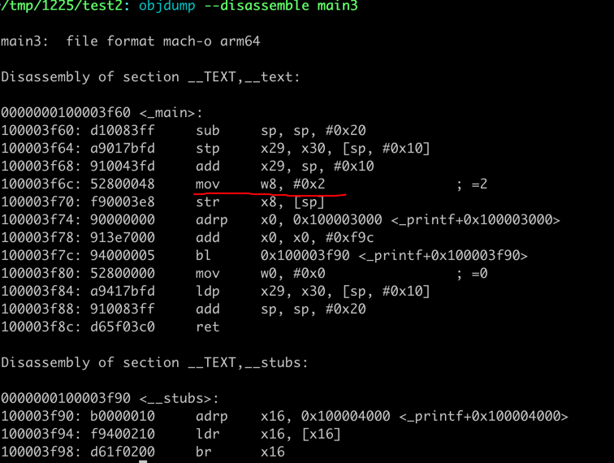
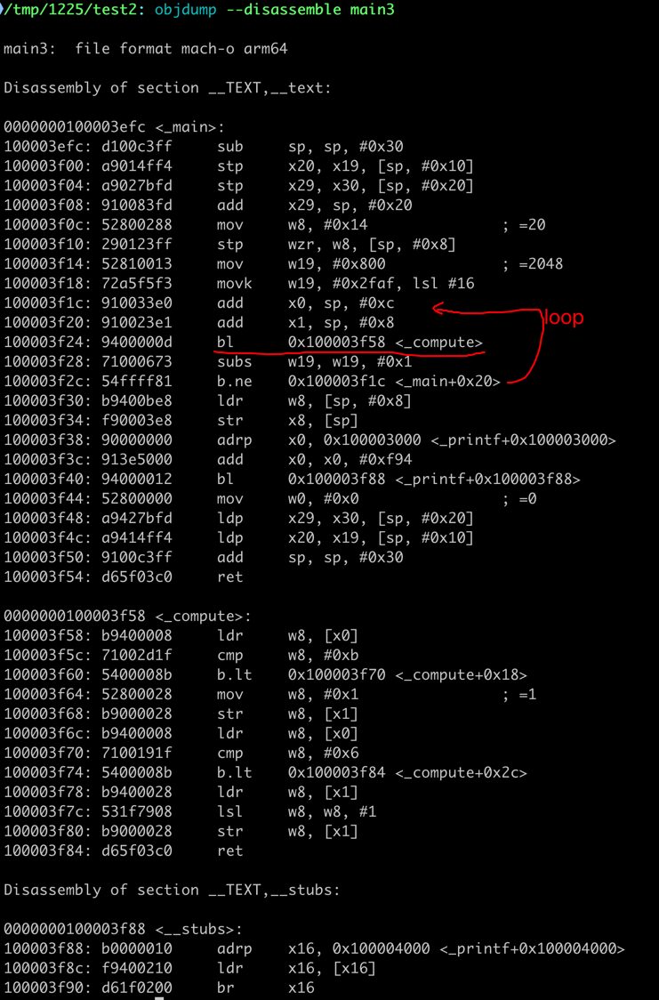
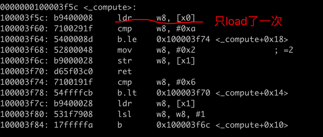
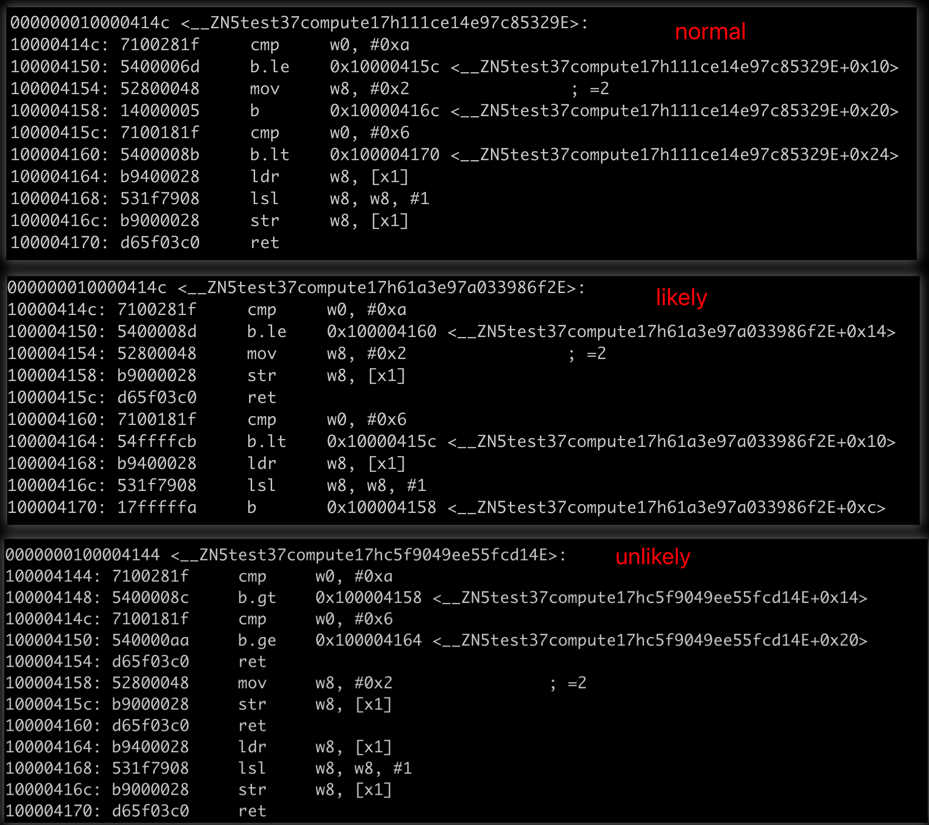

+++
title = "C++/Rust 面向CPU进行优化"
description = "C++/Rust 面向CPU进行优化"
date = 2024-12-27
draft = false
template = "blog/page.html"

[extra]
toc = true
+++

本文是阅读 《从现代CPU 特性和编译的角度分析C++ 代码优化-李成栋》的笔记以及我做的一些实验。

# 单文件编译 vs 多文件编译 & LTO

## 实验

示例代码：
```cpp
void compute(int *input, int *output){

  if(*input > 10) *output = 1;
  if(*input > 5) *output *= 2;

}

# include <stdio.h>
int main(int args, char **argv){

  int i = 20;
  int o = 0;

  for(int j = 0; j < 800000000; j++){
    compute(&i, &o);
  }

  printf("out = %d\n", o);

}
```
1. 单文件版本。
   - clang
     ```text 
       clang -O3 -o compute compute.cpp
       time ./compute
       耗时 0.00s
       
       clang --target=x86_64-macos -O3 -o compute compute.c -- 可以交叉编译为 x86_64 的代码。
     ```
   - gcc 与上类似。
2. 多文件版本。
    将上述文件拆分为 compute.h, compute.cpp, main.cpp 三个文件。
    - clang 不启动 LTO
      ```text
        clang -O3 -o compute compute.cpp main.cpp
        time ./compute
        耗时 0.76s
      ```
    - clang 启动 LTO
      ```text
        clang -O3 -flto -o compute compute.cpp main.cpp
        time ./compute
        耗时 0.00s
      ```
    - gcc 与上类似。

## 结论

|代码结构|LTO| 耗时 |
|---|---|----|
|单文件|否|0.00s|
|多文件|是|0.00s|
|多文件|否|0.76s|

1. 单文件时，clang/gcc 会尽可能的 inline 优化，其产生的代码如下：
   
   > compute 函数的代码在内联后，其值直接被计算出来，而不是通过循环计算。所以耗时为0.00s。
2. 多文件时，除非启动 LTO，否则无法进行内联优化。所以耗时为0.76s。而启动 LTO 后，其代码结构与单文件时类似，所以耗时为0.00s。
   

## What about Rust?
1. Rust 与 C++ 在 inline 方面更为激进：
   - 在 同一个 crate 内，即使是不同的 module，编译器会尽可能的 inline 函数。
   - 在不同的 crate 简，除非使用 `#[inline]` 或者 `#[inline(always)]`，否则无法进行内联优化。这个并不需要开启 LTO。

# Aliasing
## C++
```cpp
void compute(int* __restrict__ input, int* __restrict__ output){

  if(*input > 10) *output = 1;
  if(*input > 5) *output *= 2;

}
```
`__restrict__` 限定了 input 与 output 不会指向同一个地址，(不会是同一个数据的两个别名)，这样编译器可以更好的优化代码，例如，两次 `*input` 
操作就无需从内存中读取两次，而是读取一次后，第二次访问时，可以重复使用该值。

|代码结构| __restrict__ | 耗时    |
|---|--------------|-------|
|多文件| 否            | 0.76s |
|多文件| 是            | 0.76s |

优化结果并不明显：主要是因为 L1 cache 的存在，即使是两次读取，也不会有太大的性能损失。
对应的汇编代码如下：


Aliasing 消除在很多场景下会带来更为明显的优化（这个例子不够明显），可以参考：[Rust vs C++: A Performance Comparison](/blog/rust-cpp-comparison/)

# 分支优化
理论上，分支预测失败会导致流水线的空转，从而导致性能下降。但到底分支预测失败会导致多少性能下降，是否需要引起重视呢？

我之前有在 Rust 的 std 库中看到 `std::intrinsics::likely` 的用法，例如：
```rust
// from core::slice::sort::stable
pub fn sort<T, F: FnMut(&T, &T) -> bool, BufT: BufGuard<T>>(v: &mut [T], is_less: &mut F) {
    // Arrays of zero-sized types are always all-equal, and thus sorted.
    if T::IS_ZST {
        return;
    }

    // Instrumenting the standard library showed that 90+% of the calls to sort
    // by rustc are either of size 0 or 1.
    let len = v.len();
    if intrinsics::likely(len < 2) {
        return;
    }

   ...
```

这个例子提供了对分支预测失败的性能损失的一个评估。我把作者的代码使用 Rust 重写了一遍，然后进行了一些实验。
```rust
#![feature(core_intrinsics)]

#[inline(never)]
pub fn compute(input: &i32, output: &mut i32) {
    #[cfg(not(any(feature = "likely", feature = "unlikely")))]
    {
        if *input > 10 {  // compiler as likely
            *output = 1;
        }
        if *input > 5 {  // compiler as likely
            *output *= 2;
        }
    }

    #[cfg(feature = "likely")]
    {
        if std::intrinsics::likely(*input > 10) {
            *output = 1;
        }
        if std::intrinsics::likely(*input > 5) {
            *output *= 2;
        }
    }
    #[cfg(feature = "unlikely")]
    {
        if std::intrinsics::unlikely(*input > 10) {
            *output = 1;
        }
        if std::intrinsics::unlikely(*input > 5) {
            *output *= 2;
        }
    }
}

pub fn main(){
    let i = 20i32;
    let mut o = 0i32;

    compute(&0i32, &mut o);

    let tm0 = std::time::Instant::now();

    let mut j = 0u32;
    while j < 1_000_000_000u32 {
        unsafe { compute(&i, &mut o); }
        j += 1;
    }

    let tm1 = std::time::Instant::now();

    #[cfg(not(any(feature = "likely", feature = "unlikely")))]
    let msg = "normal";
    #[cfg(feature = "likely")]
    let msg = "likely";
    #[cfg(feature = "unlikely")]
    let msg = "unlikely";

    println!("{msg} out = {} time = {:?}", o, tm1-tm0 );

}
```

| feature  | 耗时     |
|----------|--------|
| normal   | 1.253s |
| unlikely | 1.267s |
| likely   | 0.955s |

对应的代码的差异如下：


从这个生成的代码来看：
1. normal 模式下，编译期的预测与实际数据是一致的，但生成的代码效率与 likely 下的效率像差很大，主要原因应该是 无条件branch 导致的流水线的空转。
2. unlikely 模式下，两个 if 分支的预测都是错误的，其性能相比 likely 下降了 25%， 应该说还是很明显的。
3. 即使是 likely 完全预测准确，也有可能生成不够高效的代码。这里的 normal 模式就是一个例子。在这种情况下，或许最终的方案还是要手写的汇编才能达到最优。

# links
1. [Performance optimization — branchless programming](https://medium.com/@techhara/performance-optimization-technique-branchless-programming-a40c0a35511e)
   这篇文章中的示例，通过消除分支，实现了 6-7倍的性能提升。
2. [Performance optimization—efficient cache programming 1](https://medium.com/@techhara/performance-optimization-efficient-cache-programming-f107dce3bef0)
   通过减少 struct 的大小，提高 cache 命中率，性能提升 31%， cache miss rate 从 39% 降低到 13%。
3. [How to write code to make the cpu execute faster](https://blog.devgenius.io/cpu-cache-how-to-write-code-to-make-the-cpu-execute-faster-cc0cf4969c4b)
   cache 友好的代码编写。
