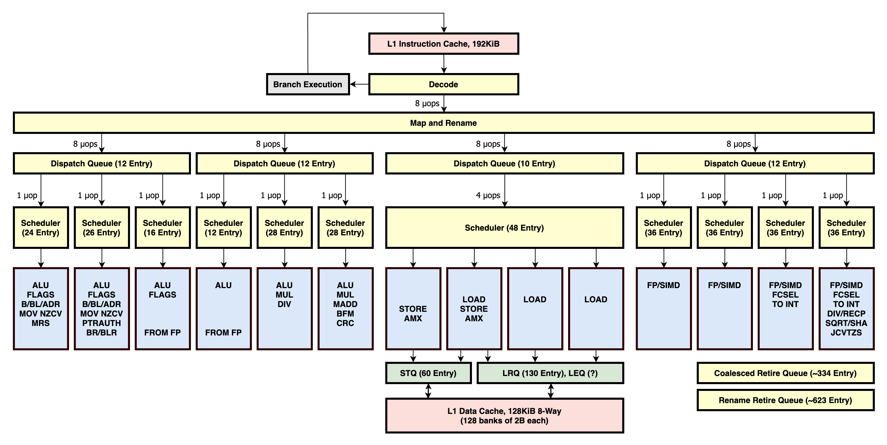

+++
title = "measure IPC for M1"
description = "要挑战CPU的极致性能，IPC是一个重要的指标，本文介绍我在M1进行IPC度量的一些实践，以及因此而获得一些关于CPU的认知。"
date = 2025-02-06
draft = false
template = "blog/page.html"

[extra]
toc = true
+++

现在的高性能CPU基本上都是超标量 + SIMD 支持了，超标量的设计是提高指标并行度（IPC: Instruction Per Cycle）, SIMD 是提高数据并行度。二者
结合在很多高性能的场景下，可以发挥出很好的性能。本文注重与通过一些代码示例来度量 IPC，以及通过 IPC 来认知 CPU 的相关优化特性。

# 1. 如何度量 IPC?
在 x86 平台上，我们可以通过 perf 来度量 IPC（但大部分的云虚拟环境下，perf 都不支持 IPC的度量），但是在 M1 上，perf 并不支持 IPC 度量。

经过不懈的搜索，终于找到了一些 M1 上度量 IPC 的方法，参考：
- [M1: A demo shows how to read Intel or Apple M1 CPU performance counter in macOS.](https://gist.github.com/ibireme/173517c208c7dc333ba962c1f0d67d12) 
- [rust-kperf](https://github.com/El-Naizin/rust-kperf) MacOS 下的未公开的API 的逆向工程。
- [我改进的 M1 IPC 度量小工具](https://github.com/wangzaixiang/m1_ipc_measure) 在上述资料的基础上，我稍微改进的一个命令行工具，可以度量某个命令的 IPC 值。

本文中主要基于上述改进的 M1 IPC 度量小工具来度量 IPC。这个工具还很不完善，主要原因是 M1 的 kperf 库的API 资料还相当缺失，大部份都是通过逆向工程得到的，
我目前对这个 API 还是一知半解，目前这个小工具也只是勉强凑合，限制还很多，这些在该项目的 readme.md 中都有说明。

# 2. the m1 microarchitecture.
本文是在 M1 Max(Mac Book Pro 2021)上进行的， 下文中的 IPC 分析会参考这个 CPU 的特性。这里附上 M1 微架构图（来源：[中文](https://zhuanlan.zhihu.com/p/700865927)、
[原文](https://dougallj.github.io/applecpu/firestorm.html)）



# 3. IPC度量

## 3.1 test1
代码：[完整源代码](https://github.com/wangzaixiang/onebrc_rust/master/src/bin/TestIPC.rs#L44)
```rust
fn test1(){
    let base0 = 1234i64;
    let base1 = 1234i64;
    let mut i1 = 10i64;
    let mut i2 = 20i64;
    let mut i3 = 30i64;
    let mut i4 = 40i64;
    let mut i5 = 50i64;
    let mut i6 = 60i64;
    let mut i7 = 70i64;
    let mut i8 = 80i64;
    let mut i9 = 90i64;
    let mut i10 = 100i64;
    let mut i11 = 110i64;
    let mut i12 = 120i64;

    let time0 = std::time::Instant::now();

    for _ in 0..100_0000_0000u64 {

        unsafe { asm! {
        "add {i1}, {i1}, {base0}",
        "add {i2}, {i2}, {base0}",
        "add {i3}, {i3}, {base0}",
        "add {i4}, {i4}, {base0}",
        "add {i5}, {i5}, {base0}",
        "add {i6}, {i6}, {base0}",
        "add {i7}, {i7}, {base0}",
        "add {i8}, {i8}, {base0}",
        "add {i9}, {i9}, {base0}",
        "add {i10}, {i10}, {base0}",
        "add {i11}, {i11}, {base0}",
        "add {i12}, {i12}, {base0}",
        "add {i1}, {i1}, {base1}",
        "add {i2}, {i2}, {base1}",
        "add {i3}, {i3}, {base1}",
        "add {i4}, {i4}, {base1}",
        "add {i5}, {i5}, {base1}",
        "add {i6}, {i6}, {base1}",
        "add {i7}, {i7}, {base1}",
        "add {i8}, {i8}, {base1}",
        "add {i9}, {i9}, {base1}",
        "add {i10}, {i10}, {base1}",
        "add {i11}, {i11}, {base1}",
        "add {i12}, {i12}, {base1}",
        base0 = in(reg) base0,
        base1 = in(reg) base1,
        i1 = inout(reg) i1,
        i2 = inout(reg) i2,
        i3 = inout(reg) i3,
        i4 = inout(reg) i4,
        i5 = inout(reg) i5,
        i6 = inout(reg) i6,
        i7 = inout(reg) i7,
        i8 = inout(reg) i8,
        i9 = inout(reg) i9,
        i10 = inout(reg) i10,
        i11 = inout(reg) i11,
        i12 = inout(reg) i12,
        }
        }

    }

    let time1 = time0.elapsed();
    println!("test1 total time: {:?}, iteration: {:.2}ns", time1, time1.as_nanos() as f64  / 100_0000_0000.0);
}
```

使用 inline asm 的方式，避免来自rust的优化，这样可以更为直接的观察 CPU 的执行情况。

这个示例循环100亿次，每次循环中执行 12 * 2 次的 add 指令，每12条 add 指令是完全无上下文依赖的，第2组对第一组有依赖，即每隔12条指令有上下文依赖。

度量结果：IPC: 3.74

按照架构图的设计，M1 有 6个 ALU 单元，都可以执行 add 指令， 理论上 IPC 值应该可以 达到 6，但只测试到了 3.74, 这个原因还有待分析。

