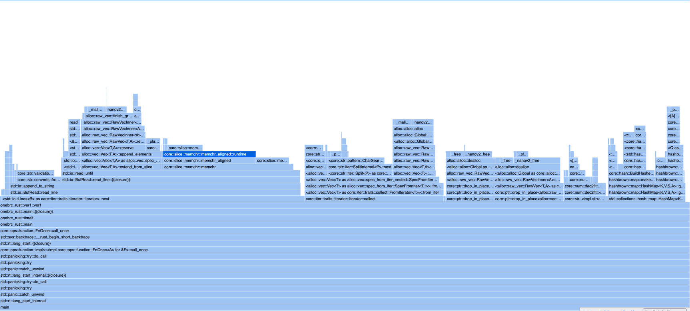
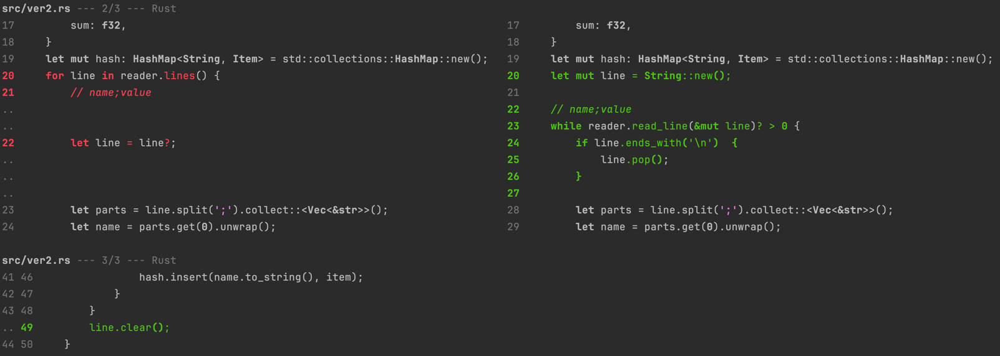
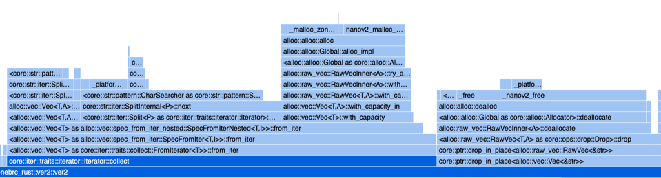
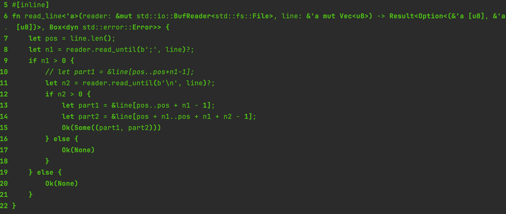
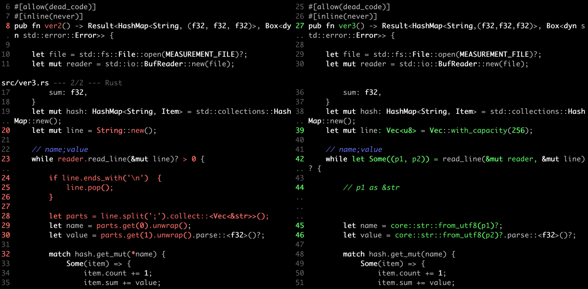
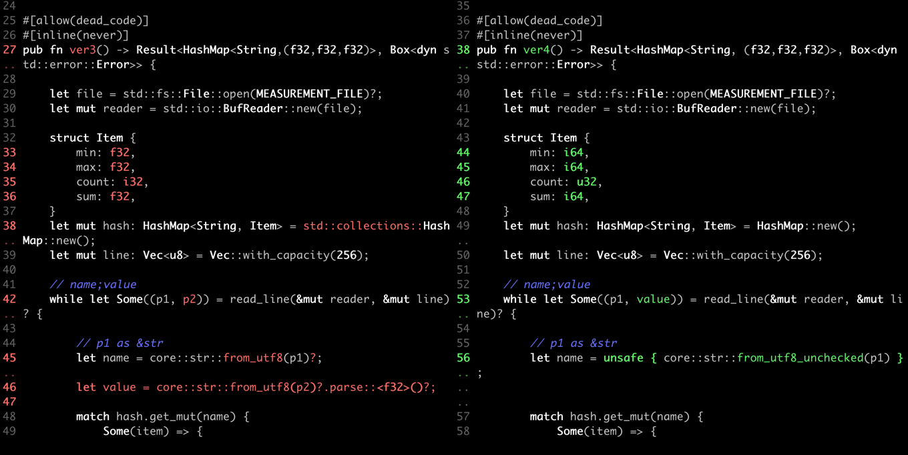
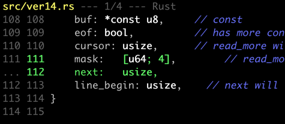

+++
title = "the 1brc program"
description = "本文通过 1brc 这个编程挑战，来展示如何一步一步的进行代码优化，实现极具挑战的性能之旅"
date = 2025-02-06
draft = false
template = "blog/page.html"

[extra]
toc = true
+++

# About 1brc
[1brc](https://github.com/gunnarmorling/1brc) 编程挑战原本是一个使用 Java 处理 10 亿行文本数据，并进行汇总统计的挑战，这个程序的逻辑并不复杂：
1. 读取并分析文本数据，其格式如下：
   ```
    Hamburg;12.0
    Bulawayo;8.9
    Palembang;38.8
    St. John's;15.2
    Cracow;12.6
    Bridgetown;26.9
    Istanbul;6.2
    Roseau;34.4
    Conakry;31.2
    Istanbul;23.0
   ```
   每一行包括一个城市名和一个气温数值，以分号分隔。
2. 统计每一个城市的最高气温、最低气温、平均气温，并输出到标准输出。

程度的挑战在于，需要处理 10亿 行的文本数据（约13.7GB），到底可以在多快的时间内完成这个任务呢？不同于其他的编程挑战，会限定有限的内存、CPU 等资源，
1brc 官方给定的运行环境是 32 core AMD EPYC™ 7502P (Zen2), 128 GB RAM, 还是一个非常强大的机器。本文所使用的执行环境是 M1 Max(Macbook Pro 2021):
8性能核心，2节能核心，64GB RAM，也是一款非常强大的机器。这个挑战是在现代CPU和充裕的内存资源下，到底可以在多快的时间内，完成10亿行文本数据的处理。

原项目是使用Java进行挑战，不过在本文中，我会尝试基于 Rust 来完成这个挑战，毕竟，Rust 距离 CPU 更近，有更多的空间可供我们腾挪。当然，对我来说，也是一次
学习 Rust 的机会。

# ver1: 原始版本 108s

```rust
use crate::MEASUREMENT_FILE;
use std::collections::HashMap;
use std::io::BufRead;

#[allow(dead_code)]
#[inline(never)]
pub fn ver1() -> Result<HashMap<String,(f32,f32,f32)>, Box<dyn std::error::Error>> {

    let file = std::fs::File::open(MEASUREMENT_FILE)?;
    let reader = std::io::BufReader::new(file);

    struct Item {
        min: f32,
        max: f32,
        count: i32,
        sum: f32,
    }
    let mut hash: HashMap<String, Item> = std::collections::HashMap::new();
    for line in reader.lines() {
        // name;value
        let line = line?;
        let parts = line.split(';').collect::<Vec<&str>>();
        let name = parts.get(0).unwrap();
        let value = parts.get(1).unwrap().parse::<f32>()?;

        match hash.get_mut(*name) {
            Some(item) => {
                item.count += 1;
                item.sum += value;
                item.min = item.min.min(value);
                item.max = item.max.max(value);
            }
            None => {
                let item = Item {
                    min: value,
                    max: value,
                    count: 1,
                    sum: value
                };
                hash.insert(name.to_string(), item);
            }
        }
    }


    let result = hash.iter().map(|(name, item)| {
        (name.clone(), (item.min, item.max, item.sum / item.count as f32))
    }).collect();

    Ok( result )
}

```

作为一个基础版本，这段代码可谓是中规中矩：
1. 使用 `BufReader` 逐行读取文件，然后使用 `split` 分割字符串。（如果不使用 BufReader，估计速度还会慢1个数量级）
2. 使用 HashMap 来处理聚合数据。
3. 单线程。（本案例全部基于单线程来进行分析）

性能数据：
1. 耗时：107.9s
2. IPC: 4.91 (看起来还很不错)
3. Branch misses: 0.64%
4. [samply](https://github.com/mstange/samply) profile [link](https://share.firefox.dev/3WMkb80):
   
   ```bash
   samply load profiles/profile-v1.json  
   # 然后使用 firefox 打开 http://localhost:3000 端口即可查看 samply 的 profile 分析图表
   ```
   - read_line: ~46s
     - fill_buf: ~2.76s 这里是真实与OS打交道，读取文件内容的开销（真实的读取文件的开销并不高，远低于其他部分）。 
     - memchr: ~20.5s 是查找换行符的开销。
     - Vec::extend_from_slice: ~12.75s 是复制数据到 Vec 的开销。
     - from_utf8: ~7s, 是处理 UTF-8 的开销。
   - `line.split(';').collect::<Vec<&str>>()` ~22s
     - Vec 分配内存的时间： ~6.5s
   - `hash.get_mut(*name)` ~12s，Rust 的 HashMap 采用了 SIMD 加速，比常规的 HashMap 快了很多。
   - Drop Vec<&str> ~11s: 释放内存的开销居然这么高，如果再加上 Vec/String 的分配开销（~13s），花在内存分配释放上的时间(~16s)，不容小嘘。
   - Drop String ~7.7s
   - `parts.get(1).unwrap().parse::<f32>()?` ~ 6.6s，目前还不是我们的瓶颈点。

第一个基线版本出来了，看起来，read_line 是目前最大的瓶颈，其中真实的 IO 开销并不高（本次测试的电脑有64G内存，因此，文件的内容大概率是全部在 Page Cache中的，
并不会涉及到真实的IO，目前来看，2.76s 读取完全部文件内容，看起来还是比较快的），而花在 查找换行符，复制数据（String）、解析UTF-8、分配和释放内存的耗时占比很比。

# ver2, 89s
在 ver1 中，我们发现 read_line 中 `Vec::extend_from_slice` 上花费了12.75s 的时间，原因是我们每次读取并返回一个新行（String），处理完成后
就释放掉这个该字符串（～7.7s），如果我们不重复分配、释放内存，而是复用一个 String 呢？简单的做如下修改：[详细代码](https://github.com/wangzaixiang/onebrc_rust/blob/master/src/ver2.rs)：


性能数据：
1. 耗时：89.3s (-17.6s, +16.3%)
2. IPC: 4.57
3. Branch misses: 8.4%
4. [samply profile](https://share.firefox.dev/4htrWrC)

看起来不错，几行代码的修改，就提升了16.3%的性能，查看 samply profile, 计划要消除的耗时都如预期的减少了。
1. 内存分配和释放的成本，并没有那么的廉价（当然，这个案例可是10亿次循环，把这个成本给放大了）。对于parser 处理 AST 这样的场景，多遍遍历，
   大量的小对象的分配和释放，这个成本是非常高的。
2. 在 JVM 中，对象的分配和释放更是无处不在，由于没有 value object，所有的对象都在 heap 中分配，而更高效的语言，一定需要 value object,并
   优先在 stack（or in-place）中分配。相比 heap， stack allocate 可以认为是零成本的。当然，JVM的GC机制，可能会比C/Rust等语言在分配/释放内存
   上更加高效：一是由于内存整理，避免了碎片的存在，分配内存成本更低。二是几种的释放，尤其是分代GC下年轻代的复制回收机制，成本相比逐一的回收会有
   显著的提升。但无论如何，如果能避免分配和释放，才是最佳的选择。

# ver3, 65s

消除了 read_line 的内存分配和释放的成本，我们的瓶颈点又转移到了 `line.split(';').collect::<Vec<&str>>()` 上，这个操作的成本是22s，其主要成本也是
花费在 Iterator 的遍历和 Vec 的分配和释放上。由于每一行文本格式比较简单，因此我们重新优化一下我们的代码 [ver3完整连接](https://github.com/wangzaixiang/onebrc_rust/blob/master/src/ver3.rs)：





性能数据：
1. 耗时：65.5s (vs ver2: -23.8s, +26.6%) (vs ver1: -42.4s, +39.4%)
2. IPC: 4.12
3. Branch misses: 0.94%
4. [samply profile](https://share.firefox.dev/4hqukPN)

ver2/ver3 两轮优化后，在 samply profile 中，已经看到没有明显的内存分配、释放的开销了，性能的整体提升达到了39.4%。为我们的优化成就鼓掌。

收获：
1. 在这两轮的优化中，samply 的贡献是最大的，他为我们提供了直观的性能数据。
2. 大部份应用在早期都存在“低垂”的果实，往往只需要较少的代价，就可以取得巨大的性能提升。在实际应用中，这些低垂的果实，可能会获得成倍、
   数十倍的性能提升，而代价则非常微小。

# ver4, 51s

对 ver3 的 profile 数据进行分析发现，&str::from_utf8 花费了 ~9s 的时间，由于我们的输入文件是一个格式良好的文件，在本次性能挑战中，可以忽略
UTF8 检查的成本（当然，在实际应用中，需要权衡输入检查的必要性，不一定能够妥协，不过在一个复杂系统中，应该尽可能的在最外层进行足够的输入校验，避免在
后续内部的处理中重复的进行正确性的检查：即浪费了计算资源，也增加了代码复杂性，参考我在这篇 [blog 中所说的 DBC](@/blog/2024-10-07-complexity/index.md)）

调整后的代码：[完整链接](https://github.com/wangzaixiang/onebrc_rust/blob/master/src/ver4.rs)
```rust
fn read_line<'a>(reader: &mut std::io::BufReader<std::fs::File>, line: &'a mut Vec<u8>) -> Result<Option<(&'a [u8], i64)>, Box<dyn std::error::Error>> {
    let pos = line.len();
    let n1 = reader.read_until(b';', line)?;
    if n1 > 0 {
        // let part1 = &line[pos..pos+n1-1];
        let n2 = reader.read_until(b'\n', line)?;
        if n2 > 0 {
            let part1 = &line[pos..pos + n1 - 1];
            let part2 = &line[pos + n1..pos + n1 + n2 - 1];
            let mut value = 0i64;
            let mut sign = 1;
            for i in part2.iter() {
                if *i == b'.' {
                    continue
                } else if *i == b'-' {
                    sign = -1;
                } else {
                    value = value * 10 + (i - b'0') as i64;
                }
            }
            Ok(Some((part1, value * sign)))
        } else {
            Ok(None)
        }
    } else {
        Ok(None)
    }
}
```


性能数据：
1. 耗时：51.2s (vs ver3: -14.3s, +21.8%) (vs ver2: -38.7s, +43%) (vs ver1: -56.7s, +52.6%)
2. [samply profile](https://share.firefox.dev/40ObCun)

经过 ver4 的优化后，samply profile 中的火焰图变得更加的简单，目前主要的开销包括：
- `std::io::BufRead::read_until` ~ 32s 以 `, \n` 作为分隔符逐一读取 &str
- `std::collections::hash::map::HashMap::get_mut` ~ 15s

低垂的果实似乎已经采摘完毕，这两个感觉都不好进行进一步的优化了。那么我们还能做些什么呢？

# ver5, 48.3s
这个版本尝试对 next_line 进行优化，使用状态机来进行 one scan per line 的处理，效果较为有限，这里就不贴代码和性能数据了，
感兴趣的可以查看[ver5源代码](https://github.com/wangzaixiang/onebrc_rust/blob/master/src/ver4.rs)

# ver6, 30.9s
经过前面5轮的优化，目前最大的瓶颈点是 `std::io::read_until(b';' or b'\n')`，这里涉及到：
- 需要使用 Buffer 的方式从 OS 读取数据到 进程Buffer（固定大小，一般为8K）中。 ~ 3s
- 在 Buffer 中查找下一个分隔符的位置。（每一行有2个分隔符：`;` 和 `\n`) ~ 19.2s
- 从 Buffer 中复制到 Vec 中（读者可以思考为什么需要这次复制，不直接在 Buffer 中处理？）~ 6.7s

我们是否可以避免两次数据复制呢，并减少查找分隔符的成本呢？zero copy 是解决这类问题的一个方向，在 Kafka 等 Java 项目中，使用 sendfile 
这样的系统调用来避免数据的复制，在本例中，我们使用 [mmap](https://www.man7.org/linux/man-pages/man2/mmap.2.html) 来实现 zero copy。

```rust 
use crate::MEASUREMENT_FILE;
use memchr::memchr;
use memmap2::Mmap;
use std::collections::HashMap;


#[inline]
fn parse_value(_buf: &[u8]) -> i32 {    // ~0.5s
    // return 0;
    use std::intrinsics::unlikely;
    let mut sign = 1;
    let mut value = 0;
    for b in _buf {
        if unlikely(*b == b'-') {
            sign = -1;
        }
        else if unlikely(*b == b'.') {
            continue;
        } else {
            value = value * 10 + (*b - b'0') as i32;
        }
    }
    value * sign
}

#[allow(dead_code)]
#[inline(never)]
pub fn ver6() -> Result<HashMap<String, (f32,f32,f32)>, Box<dyn std::error::Error>> {

    let file = std::fs::File::open(MEASUREMENT_FILE)?;

    let mmap = unsafe { Mmap::map(&file)? };
    let mut buf = mmap.as_ref();

    struct Item {
        min: i32,
        max: i32,
        count: u32,
        sum: i32,
    }
    let mut hash: HashMap<String, Item> = HashMap::with_capacity(16384);
    // let mut hash:FxHashMap<String, Item> = FxHashMap::with_capacity_and_hasher(16384, rustc_hash::FxBuildHasher::default());

    let mut callback = |name: &[u8], value: i32| {
        match hash.get_mut(unsafe { core::str::from_utf8_unchecked(name) }) {
            Some(item) => {
                item.count += 1;
                item.sum += value;
                item.min = item.min.min(value);
                item.max = item.max.max(value);
            }
            None => {
                let item = Item {
                    min: value,
                    max: value,
                    count: 1,
                    sum: value
                };
                hash.insert(unsafe { core::str::from_utf8_unchecked(name) }.to_string(), item);
            }
        }
    };

    let mut _no_used = 0;
    // let mut callback = |_name: &[u8], value: i32| {
    //     _no_used += value;
    // };

    loop {
        match memchr(b';', &buf[0..]) { // scan ~14s
            Some(pos1) => {
                let name = &buf[0..pos1];
                let remain = &buf[pos1+1..];
                match memchr(b'\n', remain) {
                    Some(pos2) => {
                        let value = parse_value(&remain[0..pos2]);
                        callback(name, value);      // 7.5s
                        buf = &remain[pos2+1..];
                    }
                    None => {
                        break;
                    }
                }
            }
            None => {
                break;
            }
        }
    }

    let result = hash.iter().map(|(name, item)| {
        (name.to_string(), (item.min as f32 / 10.0, item.max as f32 / 10.0, item.sum as f32 / (10.0 * item.count as f32)))
    }).collect();

    Ok(result)
}
```
[ver6完整源代码](https://github.com/wangzaixiang/onebrc_rust/blob/master/src/ver6.rs)

性能数据：
1. 耗时：31s （vs ver4: -20.3s, +39.6%）（vs ver1: -76.9s, +71.1%）
2. [samply profile](https://share.firefox.dev/4hOMo5W)

采用 zero copy 优化后，我们的性能获得了显著提升，相对于 ver1，耗时缩短到 29%。从 flame graph 中，可以看到，已经没有数据复制的成本了。
目前，最大的几块耗时为：
- `memchr::memchr::memchr` ~ 3.7s
- `onebrc_rust::ver6::parse_value` ~ 4.87s
- `std::collections::hash::map::HashMap::get_mut` ~ 19.5s， 有点奇怪，这里的耗时相比之前的版本，反而增加了。这个以后再分析。

# ver7, 25.5s
查看 ver6 的 flame graph，我们发现 HashMap 中最大的开销是 make_hash, 消耗了～16s 的时间，反而 其他的lookup 操作(~3s)并不大，经查阅资源，

> https://nnethercote.github.io/perf-book/hashing.html
> 
> HashSet and HashMap are two widely-used types. The default hashing algorithm is not specified, but at the time of 
> writing the default is an algorithm called SipHash 1-3. This algorithm is high quality—it provides high protection 
> against collisions—but is relatively slow, particularly for short keys such as integers.
> 

可以看到，在 Rust 的哲学中，HashMap 的设计是为了保证高质量的 hash，而不是为了速度。

按照文中的推荐，我们切换到 [fxhash](https://crates.io/crates/fxhash), 完整源代码参见：[ver7](https://github.com/wangzaixiang/onebrc_rust/blob/master/src/ver7.rs)

性能数据：
1. 耗时：25.5s (vs ver6: -5.5s, +21.5%) (vs ver1: -82.5s, +76.3%)
2. [samply profile](https://share.firefox.dev/4hE32Fs)
    - make_hash 的时间大幅缩短，~5.1s
    - lookup 的时间反而提升，从 ~3s 提升到 ～8.8s. 这个原因后续分析。

切换到 fxhash 后，性能又小幅度的提升，进入到 25s，当然，相比 ver1，我们已经有 4+倍 的性能提升了。

# ver8, 23.25s
在 ver1 - ver7 中，我们都没有使用 SIMD 这一技术，从 ver8 开始，我们将逐步引入 SIMD 技术。先从 查找分隔符开始。在之前的例子中，一直使用
`memchr` 或 read_until(其内部也基于 memchr )，如果查找 crate.io 的文档，我们得知，memchr 内部也会采用 SIMD 技术进行优化，不过如果阅读
源代码，memchr 尽在较大的数组中使用 SIMD，而对小数组则直接遍历。

1. 在 1brc 这个挑战赛中，平均每行的长度为 13.8 字符，而且每行包含2个分隔符，因此，memchr 大部份情况下都没有采用 SIMD 优化。 
2. ver1 - ver7 的版本中，每次都是获取下一个分隔符的位置，这并没有充分发挥 SIMD 的效率。我们完全可以一次读取一个 block(比如64B)，使用
   SIMD 指令一次找出全部的分隔符的位置，然后再进行处理。如果是 64B 的 Block，平均包含 4.6 行的数据，共 9.2 个分隔符。这就相当于原来需要
   9次 memchr 的操作可以在 单个 SIMD 操作中完成。

[ver8源代码](https://github.com/wangzaixiang/onebrc_rust/blob/master/src/ver8.rs)

```rust
#[inline(never)]
pub fn ver8() -> Result<HashMap<String,(f32, f32, f32)>, Box<dyn std::error::Error>> {

    let file = std::fs::File::open(MEASUREMENT_FILE)?;

    let mmap = unsafe { Mmap::map(&file)? };
    let buf = mmap.as_ref();

    struct Item {
        min: i16,
        max: i16,
        count: u32,
        sum: i32,
    }
    // let mut hash = HashMap::with_capacity_and_hasher(16384, fasthash::spooky::Hash64);
    let mut hash:FxHashMap<String, Item> = FxHashMap::with_capacity_and_hasher(16384, rustc_hash::FxBuildHasher::default());

    // let mut sum = 0;
    let mut callback = |name: &[u8], value: i16| {  // ~13.5s 60%
        match hash.get_mut(unsafe { core::str::from_utf8_unchecked(name) }) {
            Some(item) => {
                item.count += 1;
                item.sum += value as i32;
                item.min = item.min.min(value);
                item.max = item.max.max(value);
            }
            None => {
                let item = Item {
                    min: value,
                    max: value,
                    count: 1,
                    sum: value as i32,
                };
                hash.insert(unsafe { core::str::from_utf8_unchecked(name) }.to_string(), item);
            }
        }
    };

    let v01 = u8x64::splat(b';');
    let v02 = u8x64::splat(b'\n');

    enum State {
        BEGIN, POS1
    }
    let mut state2: State = State::BEGIN;     // BEGIN, POS1
    let mut line_begin: usize = 0usize;  // always valid
    let mut pos1: usize = 0;        // when state2 is POS1
    let mut cursor: usize = 0;      // if block_is_tail, cursor can scroll forward, otherwise, cursor is always the head of the block
    let mut block_is_tail: bool = false;
    let mut simd_mask: u64 = {      // when block_is_tail == false, simd_mask is the search mask
        let v1: u8x64 = u8x64::from_slice(buf);        // 64 bytes
        (v1.simd_eq(v01) | v1.simd_eq(v02)).to_bitmask()
    };

    loop {

        let pos: usize =  loop {
            if likely(block_is_tail == false) {    // 1. simd_block
                let first = simd_mask.trailing_zeros(); // 0..64
                if likely(first < 64) {  // 1.1 having a match
                    simd_mask &= !(1 << first);
                    break cursor + first as usize;      // break result 1: from simd_block
                } else {  // 1.2 load next block and continue loop
                    cursor += 64;
                    if likely(cursor + 64 <= buf.len()) { // 1.2.1 load next u8x64 block
                        let v1 = u8x64::from_slice(&buf[cursor..cursor + 64]);
                        simd_mask = (v1.simd_eq(v01) | v1.simd_eq(v02)).to_bitmask();
                    } else {    // 1.2.2 load the tail block
                        block_is_tail = true;
                    }
                    continue;
                }
            } else {  // 2. tail block
                match memchr2(b';', b'\n', &buf[cursor..]) {
                    Some(index) => {
                        let result = cursor + index;
                        cursor += index + 1;
                        break result;   // break result 2: from tail block
                    }
                    None => {
                        unreachable!("tail block should always have a match");
                    }
                }
            }
        };

        match state2 {
            State::BEGIN => {
                pos1 = pos;
                state2 = State::POS1;
            }
            State::POS1 => {
                let pos2 = pos;
                callback(&buf[line_begin..pos1], parse_value(&buf[pos1+1..pos2]));
                state2 = State::BEGIN;
                line_begin = pos2 + 1;
            }
        }

        if unlikely( pos + 1 == buf.len() ) {
            break;
        }

    }

    let result = hash.iter().map(|(name, item)| {
        (name.clone(), (item.min as f32/ 10.0, item.max as f32 / 10.0, item.sum as f32 / item.count as f32 / 10.0))
    }).collect();

    Ok(result)
}

```

性能数据：
1. 耗时: 23.25s (vs ver7: -2.25s, +9.2%) (vs ver1: -84.65s, +78.3%)
2. [samply profile](https://share.firefox.dev/3Er2Afo)

对比ver7, 有小幅度提升（这是因为 v7 中 memchr 的耗时也只有 3s, 并不大）。

切换成 SIMD 处理后，代码稍微又些复杂，这是因为在性能优化的过程中，我会产生越来越多的”自我控制“感，以避免编译期生成不佳的代码，也就是说，在
很多情况下，高性能的代码与 zero cost abstraction 是有矛盾的。当然，后面我们也会看到，这种感觉并不可靠，很多情况下，现代编译期足以生成高效的
代码，并且无悖于 zero cost abstraction。

# ver9, 23.76s
ver9 是在 ver8 的基础上，对 parse_value 进行优化，使用 SIMD 指令进行优化。

```rust
#[inline]
fn parse_value(buf: &[u8]) -> i16 {    // ~0.5s
    // return 0;
    let scale = u16x4::from_array( [100, 10, 0, 1] );
    let sign = if buf[0] == b'-' {-1i16} else {1};
    let offset = if buf[0] == b'-' {1} else {0};
    let v1 = {
        let buf = &buf[offset..];
        let mut arr: [u8; 8] = [b'0' as u8; 8];
        arr[8 - buf.len()..].copy_from_slice(buf);
        u16x4::from_array( [ arr[4] as u16, arr[5] as u16, arr[6] as u16, arr[7] as u16 ] )
    };
    ((v1 - u16x4::splat('0' as u16))  * scale).reduce_sum() as i16 * sign
}
```
[ver9完整源代码](https://github.com/wangzaixiang/onebrc_rust/blob/master/src/ver9.rs)

性能数据：
1. 耗时：23.76s (vs ver8: +0.51s, -2.1%) (vs ver1: -84.14s, +78.1%)
2. [samply profile](https://share.firefox.dev/3EtGoRX)

对 parse_value 进行 SIMD 优化并没有达到预期的结果。我们继续前行。

# ver10, 27.10s
在 ver9 的火焰图上，当前最大的开销是 `std::collections::hash::map::HashMap::get_mut`(~11.7s), ver10 尝试使用一个替代的 HashMap
方案，来减少 hash 的计算开销和 lookup 的开销，不过，这个版本并没有达到预期的效果。 这里就不分析了。

[ver10源代码](https://github.com/wangzaixiang/onebrc_rust/blob/master/src/ver10.rs)

# ver12，13.07s
在 ver10 中，我们尝试自建一个替代的 HashMap，基本的方向是将 city_name 映射为 integer, 然后使用一个稀疏的 Vec 来存储 key-value，
在 ver10 中尝试是失败的，主要是 HashMap 的 Miss 比例过高（50%）,即有50%的 key 都需要进行都多余1次的查找。

在 ver12 中，我们继续优化数据结构，尝试将 flame graph 中目前最大的开销 `std::collections::hash::map::HashMap::get_mut`(~11.7s) 
降下来。

优化后的算法：
1. 将 city_name 映射为 i128, 即仅取 city_name 的最多16字节作为 key。（有些取巧，在测试中，所有的city name 截取前16个字节时，是没有
   重复的。）
2. 使用如下算法将 i128 映射为 i20:
   ```rust
    let key_a: i64 = ??? // 低64位
    let key_b: i64 = ??? // 高64位
    let hash = { // b[0..19] ^ b[20..39] ^ b[40..59] ^ b[64..83] ^ b[84..103] ^ b[104..123]
            let p0 = key_a & mask;
            let p1 = (key_a >> 20) & mask;
            let p2 = (key_a >> 40) & mask;
            let p3 = key_b & mask;
            let p4 = (key_b >> 20) & mask;
            let p5 = (key_b >> 40) & mask;
            p0 ^ p1 ^ p2 ^ p3 ^ p4 ^ p5
        };
   ```
3. 分配一个 2^20 + 1024 的 Vec<AggrItem>, 其中: AggrItem 是每一个汇总项（占用56字节大小）
   ```rust
   struct AggrItem {
    key_a:  u64,     // 32
    key_b:  u64,     // 40
    key: Vec<u8>,    // 24
    min: i16,       // 42
    max: i16,       // 44
    count: u32,     // 48
    sum: i32,       // 52
   }
   ```
4. 根据 city_name 计算 128位的 key 值，并使用上述的 hash 算法，计算 hash 值(0 - 2^20-1), 然后使用该 hash 值直接访问数组
   - 由于可能存在重复的 hash 值，因此，需要比较 key 值是否一致，一致则命中。
   - 不命中则搜索数组中的下一项，直到 hash 值相同
   - 最多搜索1024次，否则直接报错。

设计这个算法的原因是：
1. 1brc 挑战的数据集中，共有443个城市，city_name 长度为 3..33，选取前16个字符时，即可保证唯一性。
2. 设计一个包含 1M 大小的 HashMap，并通过精心设计的 hash 算法，可以确保该 HashMap 的稀疏性，绝大部分的 city 应该唯一命中某个 slot 而无需
   遍历。
3. 使用 i128 作为 key 的唯一性，避免了进行字符串比较的开销。
4. 上述的 hash 算法，是简单的数学运算，相比字符串计算 hash 要快捷很多（且不涉及内存访问）。

[ver12 完整源代码](https://github.com/wangzaixiang/onebrc_rust/blob/master/src/ver12.rs)

性能数据:
1. 耗时： 13.07s (vs ver9: -10.69s, +45.1%) (vs ver1: -93.83s, +87.1%)
2. [samply profile](https://share.firefox.dev/414vPNO)

非常可喜的突破，通过独特设计的 HashMap，我们获得了比使用 `std::collections::hash::map::HashMap` 快得多的性能，原来 HashMap 11.7s 的开销
降低到了 2 s，更让我们的程序相比 ver1 提高了 8+ 倍的性能提升。

现在，主要的耗时：
- 处理分隔符：~3.15s
- parse_value ～4.7s
- hash aggregate: ~2.4s

还可以进行哪些优化呢？

# ver13, 9.12s
在ver9 中，我们使用 SIMD 优化了 parse_value，但是并没有达到预期的效果，如果我们将多行的 value 放到一起来使用 SIMD 呢？另外，loop unroll
也是一种常见的优化手段，在我们前面的版本中，每次循环都是处理1行，而我们现在的版本已经每次读取 64 字节的 block，使用 SIMD 来进行分隔符检测，
那么我们也可以尝试把一个 block 中的多行数据放到一起来处理。根据上面的数据分析，每个block 包含 1-8 行数据，平均为 4.6 行。

```rust
unsafe fn parse_values(val1: &[u8], val2: &[u8], val3: &[u8], val4: &[u8]) -> (i16, i16, i16, i16) {

    let pad_1 = 8 - val1.len() as isize;
    let pad_2 = 8 - val2.len() as isize;
    let pad_3 = 8 - val3.len() as isize;
    let pad_4 = 8 - val4.len() as isize;

    let ptr1 = val1.as_ptr().offset( -pad_1);
    let ptr2 = val2.as_ptr().offset(-pad_2);
    let ptr3 = val3.as_ptr().offset(-pad_3);
    let ptr4 = val4.as_ptr().offset(-pad_4);

    let l1 = u64::from_be_bytes( *(ptr1 as *const [u8;8]) );
    let l2 = u64::from_be_bytes( *(ptr2 as *const [u8;8]) );
    let l3 = u64::from_be_bytes( *(ptr3 as *const [u8;8]) );
    let l4 = u64::from_be_bytes( *(ptr4 as *const [u8;8]) );

    // clear top pad_1 * 8 bits of l1
    let l1 = l1 & (u64::MAX >> (pad_1 * 8));
    let l2 = l2 & (u64::MAX >> (pad_2 * 8));
    let l3 = l3 & (u64::MAX >> (pad_3 * 8));
    let l4 = l4 & (u64::MAX >> (pad_4 * 8));

    let sign_1 = if val1[0] == b'-' { -1 } else { 1 };
    let sign_2 = if val2[0] == b'-' { -1 } else { 1 };
    let sign_3 = if val3[0] == b'-' { -1 } else { 1 };
    let sign_4 = if val4[0] == b'-' { -1 } else { 1 };

    let v: u32x4 = u32x4::from_array([l1 as u32, l2 as u32, l3 as u32,  l4 as u32]);
    let v2: i8x16 = transmute(v);

    let v2  = unsafe { extend_i8x16(v2) };
    // let v2: i16x32 = simd_swizzle!(v2, [7, 6, 5, 4, 3, 2, 1, 0, 15, 14, 13, 12, 11, 10, 9, 8, 23, 22, 21, 20, 19, 18, 17, 16, 31, 30, 29, 28, 27, 26, 25, 24]);

    let scale: i16x16 = i16x16::from_array([ 1, 0, 10, 100, 1, 0, 10, 100, 1, 0, 10, 100, 1, 0, 10, 100 ] );
    let mask = v2.simd_ge(i16x16::splat('0' as i16));
    let v2 = mask.select(v2, i16x16::splat(b'0' as i16));
    let sub = v2 - i16x16::splat(b'0' as i16);      // (c - '0')
    let mul = sub * scale;                                // (c - '0') * scale

    let mul_2 = mul.rotate_elements_right::<2>();       // 100 + 0, 10 + 1
    let sum = mul + mul_2;

    let sum_2 = sum.rotate_elements_right::<1>();       // 100 + 0 + 10 + 1
    let sum = sum + sum_2;

    let array: &[i16;16] = & transmute(sum);
    (sign_1 * array[3], sign_2 * array[7], sign_3 * array[11], sign_4 * array[15])
}

struct FileReader {
    _mmap: Mmap,         // const
    length: usize,      // const
    buf: *const u8,     // const
    eof: bool,          // has more content
    cursor: usize,      // read_more will update, 当前读取位置，已读取并分析结果保存在 mask 中
    mask:   u64,        // read_more will set, next will clear
    line_begin: usize,    // next will update，下一行的开始位置
}

impl FileReader {

    fn new(mmap: Mmap) -> FileReader {
        let length = mmap.len();
        let buf = mmap.as_ptr();
        let u8x64 = u8x64::from_array( unsafe { *( buf as *const[u8;64]) } );
        let mask_v1: u8x64 = u8x64::splat(b';');
        let mask_v2: u8x64 = u8x64::splat(b'\n');
        let mask: Mask<i8, 64> = u8x64.simd_eq(mask_v1) | u8x64.simd_eq(mask_v2);
        let mask = mask.to_bitmask();
        FileReader {
            _mmap: mmap,
            length,
            buf,
            eof: false,
            cursor: 0,
            mask,
            line_begin: 0
        }
    }

    #[inline]
    fn read_block_at_cursor(&mut self) {
        // change to unlikely fastup from 11.5s ~ 6.65s
        if unlikely(self.mask == 0) {    // need more

            self.cursor += 64;

            if likely(self.cursor + 64 <= self.length) {
                let mask_v1: u8x64 = u8x64::splat(b';');
                let mask_v2: u8x64 = u8x64::splat(b'\n');

                let u8x64 = u8x64::from_array( unsafe { *( self.buf.add(self.cursor) as *const[u8;64]) } );
                let mask: Mask<i8, 64> = u8x64.simd_eq(mask_v1) | u8x64.simd_eq(mask_v2);
                self.mask = mask.to_bitmask();
            }
            else {
                self.read_last_block();      //
            }
        }
    }

    #[inline(never)]
    fn read_last_block(&mut self) {
        let ptr = unsafe { self.buf.add(self.cursor) };
        let count = self.length - self.cursor;  // maybe zero
        let slice = unsafe { std::slice::from_raw_parts(ptr, count) };
        let mut base = 0usize;
        loop {
            if base >= count {
                break;
            }
            match memchr2(b';', b'\n', &slice[base..]) {
                Some(index) => {
                    self.mask |= 1 << (base+index);
                    base += index+1;
                }
                _ => {
                    panic!("tail block should always have a match");
                }
            }
        }
        self.eof = true;
    }

    // TODO wrongs for the last line

    fn next(&mut self) -> Option<(&'static [u8], &'static [u8])> {
        if likely(self.eof == false) {
            self.read_block_at_cursor();
            let first = {
                let index = self.mask.trailing_zeros();
                self.mask &= !(1 << index);
                self.cursor + index as usize
            };

            self.read_block_at_cursor();
            let second = {
                let index = self.mask.trailing_zeros();
                self.mask &= !(1 << index);
                self.cursor + index as usize
            };

            let key: &[u8] = unsafe { std::slice::from_raw_parts(self.buf.add(self.line_begin), first - self.line_begin) };
            let value: &[u8] = unsafe { std::slice::from_raw_parts(self.buf.add(first + 1), second - first - 1) };

            let result = (key, value);
            self.line_begin = second + 1;
            Some(result)
        }
        else {
            None
        }
    }
}

...

#[inline(never)]
// based on ver12
pub fn ver13() -> Result<HashMap<String,(f32, f32, f32)>, Box<dyn std::error::Error>> {     // 8.96s

    let file = std::fs::File::open(MEASUREMENT_FILE)?;

    let mmap = unsafe { Mmap::map(&file)? };

    let mut reader = FileReader::new(mmap);

    let mut aggr = AggrInfo::new();

    loop {
        let r1 = reader.next();
        let r2 = reader.next();
        let r3 = reader.next();
        let r4 = reader.next();

        if likely(r4.is_some()) {
            let Some((r1_name, r1_value)) = r1 else { unreachable!() };
            let Some((r2_name, r2_value)) = r2 else { unreachable!() };
            let Some((r3_name, r3_value)) = r3 else { unreachable!() };
            let Some((r4_name, r4_value)) = r4 else { unreachable!() };

            let ptr1 = r1_name.as_ptr();
            let key_a_1: u64 = u64::from_le_bytes( unsafe { *(ptr1 as *const[u8;8]) });
            let key_b_1: u64 = u64::from_le_bytes( unsafe { *(ptr1.add(8) as *const[u8;8]) });

            let ptr2 = r2_name.as_ptr();
            let key_a_2: u64 = u64::from_le_bytes( unsafe { *(ptr2 as *const[u8;8]) });
            let key_b_2: u64 = u64::from_le_bytes( unsafe { *(ptr2.add(8) as *const[u8;8]) });

            let ptr3 = r3_name.as_ptr();
            let key_a_3: u64 = u64::from_le_bytes( unsafe { *(ptr3 as *const[u8;8]) });
            let key_b_3: u64 = u64::from_le_bytes( unsafe { *(ptr3.add(8) as *const[u8;8]) });

            let ptr4 = r4_name.as_ptr();
            let key_a_4: u64 = u64::from_le_bytes( unsafe { *(ptr4 as *const[u8;8]) });
            let key_b_4: u64 = u64::from_le_bytes( unsafe { *(ptr4.add(8) as *const[u8;8]) });


            let len_a_1 = if r1_name.len() >= 8 { 8 } else { r1_name.len() };
            let len_b_1 = if r1_name.len() >= 16 { 8 } else if r1_name.len() > 8 { r1_name.len() - 8 }  else { 0 };

            let len_a_2 = if r2_name.len() >= 8 { 8 } else { r2_name.len() };
            let len_b_2 = if r2_name.len() >= 16 { 8 } else if r2_name.len() > 8 { r2_name.len() - 8 }  else { 0 };

            let len_a_3 = if r3_name.len() >= 8 { 8 } else { r3_name.len() };
            let len_b_3 = if r3_name.len() >= 16 { 8 } else if r3_name.len() > 8 { r3_name.len() - 8 }  else { 0 };

            let len_a_4 = if r4_name.len() >= 8 { 8 } else { r4_name.len()  };
            let len_b_4 = if r4_name.len() >= 16 { 8 } else if r4_name.len() > 8 { r4_name.len() - 8 }  else { 0 };

            let key_a_1 = key_a_1 & MASKS[len_a_1];
            let key_b_1 = key_b_1 & MASKS[len_b_1];
            let key_a_2 = key_a_2 & MASKS[len_a_2];
            let key_b_2 = key_b_2 & MASKS[len_b_2];
            let key_a_3 = key_a_3 & MASKS[len_a_3];
            let key_b_3 = key_b_3 & MASKS[len_b_3];
            let key_a_4 = key_a_4 & MASKS[len_a_4];
            let key_b_4 = key_b_4 & MASKS[len_b_4];

            let (v1, v2, v3, v4) = unsafe { parse_values(r1_value, r2_value, r3_value, r4_value) };
            aggr.save_item(r1_name, key_a_1, key_b_1, v1);
            aggr.save_item(r2_name, key_a_2, key_b_2, v2);
            aggr.save_item(r3_name, key_a_3, key_b_3, v3);
            aggr.save_item(r4_name, key_a_4, key_b_4, v4);

        }
        else {
            if let Some((name, value)) = r1 {
                process_one(name, value, &mut aggr);
            }
            if let Some((name, value)) = r2 {
                process_one(name, value, &mut aggr);
            }
            if let Some((name, value)) = r3 {
                process_one(name, value, &mut aggr);
            }
            break;
        }
    }

    // check_result(&aggr);

    Ok( HashMap::new() )
}

```
ver13 源代码：[ver13](https://github.com/wangzaixiang/onebrc_rust/blob/master/src/ver13.rs)

性能数据：
1. 耗时：9.12s (vs ver12: -3.95s, +30.2%) (vs ver1: -97.58s, +91.4%)
2. [samply profile](https://share.firefox.dev/3Q6KCBh)

parse_values 的耗时从降到了 0.56s，从 4.7s 减少到了 0.56s，甚至超出了我们的预期。当然，1brc 首次进入10秒以内的成绩，相比 ver1 提升了 11.8 倍。

现在，主要的耗时：
- 遍历读取 block：5.35s
- hash aggregator: 1.97s
- parse_values: 0.56s

# ver14, 13.06s
在 ver13 中，我们尝试在一个循环中处理多行数据，获得了很好的效果，是否可以继续这一策略，在一个循环中处理更多的数据？

在 ver14 中，我们尝试一次读取 256 字节大小的 block, 尝试使用 u8x64 （512b) 的向量规模来扫描分隔符，很不幸，这个版本的性能退化到了 13s。


详细源代码：[ver14](https://github.com/wangzaixiang/onebrc_rust/blob/master/src/ver14.rs)

原因分析：
1. M1 只支持 128b 的向量，更大的向量其实是软件模拟，而非硬件支持。
2. 相似的，在 M1 上并没有 native 的 u128 支持，使用 （u64, u64) 替代 u128 可能会性能更佳。（u128底层使用软件模拟）
3. 在循环处理中引入数组等数据结构`mask: [u64;4]`，数组访问等并不利于 SSA 优化，在循环处理中会增加对内存的 load/store 访问，而 SSA 优化后
   能够更好的使用 register 来替代数据，减少内存访问操作。寄存器相比内存（即使是L1 hited）,也会有更低的成本。

性能数据：
1. 耗时：13.06s (vs ver13: +3.94s, -30.2%) (vs ver1: -93.64s, +87.5%)
2. [samply profile](https://share.firefox.dev/4gJ8ztC)

优化失败，绕行...
# ver15, 10.52s
尝试在 ver13 的基础上，每次读取 128B 的 Block，并将分隔符扫描的结果存储在 i128 中（不使用数据，从而可以更好的使用寄存器优化）。

性能数据：
1. 耗时：10.52s (vs ver13: +1.4s, -13.4%) (vs ver1: -90.18s, +84.3%)
2. [samply profile](https://share.firefox.dev/4bbGCJP)

减少内存访问，还是有一定的效果的，相比 v14 要好一些的，但仍然没有达到 ver13 的效果。

# ver16, 8.55s
在 ver15 的技术上，使用 (u64, u64) 替代 u128，尝试进一步优化。

完整源代码：[ver16](https://github.com/wangzaixiang/onebrc_rust/blob/master/src/ver16.rs）

性能数据：
1. 耗时：8.55s (vs ver15: -1.97s, -18.8%) (vs ver13: -0.56s, + 6% )(vs ver1: -92.15s, +86.2%)
2. [samply profile](https://share.firefox.dev/4hTD3d4)

减少到了9秒内。原因是在 ARM 中，通用寄存器是 64 位的，即使是对128位的向量寄存器，单个Lane 也最多仅支持 64b, 在 Rust 中的u128 实际上是通过
软件进行模拟的,对 u128 的操作远比 u64 要低效。在 v16 中，我们直接使用 (u64, u64) 来替代 u128，避免了软件模拟的开销,相比使用 u128 要更快一些。

在 ver16 中，每次只处理 64B 的block, 并将行中的`;` 分隔符 和 行末的 `\n`分隔符的位置分开存储 为 mask1, mask2，这样，在后续处理中，对两个 mask 
的 获取操作可以并行进行，提高指令的并行度。 

# ver17: 16.2s
ver17 尝试对代码进行一些重构，使得代码的可读性更好一些，将主流程的循环处理从主函数中抽出来，转移到 scan_loop 中，同时，将循环的一些上下文变量
从 struct 字段转移到 scan_loop 的局部变量中，当时的考虑是编译器可以更好的进行 SSA 优化，减少内存访问。

rust 在很多情况下，可以直接将 struct 字段的变量也 SSA 优化，到来的优势就是这些字段会直接保存在 register 中，而不是在内存中，访问寄存器相比
访问内存，有更低的成本（虽然在很多情况下，由于L1 Cache的优化以及其他优化，这个差距可能并不明显，但使用寄存器总是更为性能有好的）。

这个版本的性能退化到了 16.2s，原因是在 scan_loop 中，因此，本文不对其进行展开说明，直接跳过。

完整源代码：[ver17](https://github.com/wangzaixiang/onebrc_rust/blob/master/src/ver17.rs)
性能说明：
1. 耗时：16.2s (vs ver16: +7.65s, -89.4%) (vs ver1: -84.48s, +82.4%)
2. [samply profile](https://share.firefox.dev/3QnKGgg)

# ver18: 6.76s
在 ver17 的基础上，我们进行了一些优化：
1. 每次读取 64B 的block，而不是 128B, 64B 的 block 可以更好的匹配 ARM 的 64b 架构。
2. 使用 3 行一个批量的方式进行处理，减少分支预测失败的情况。

完整源代码：[ver18](https://github.com/wangzaixiang/onebrc_rust/blob/master/src/ver18.rs)

性能说明：
1. 耗时：6.76s (vs ver17: -9.44s, -58.4%) (vs ver1: -94.32s, +93.3%)
2. [samply profile](https://share.firefox.dev/4gQ8hB3)

这个版本的性能有了很大的提升，我们进入了 7s 以内的范围（原项目中Java第一名在我本地的单线程成绩为7.10s），ver18 首次超过了 Java Top 1的成绩。
可喜可贺，是否还有更进一步的优化空间呢？

# ver21: 6.17s

# ver22: 5.38s

未完，待续......