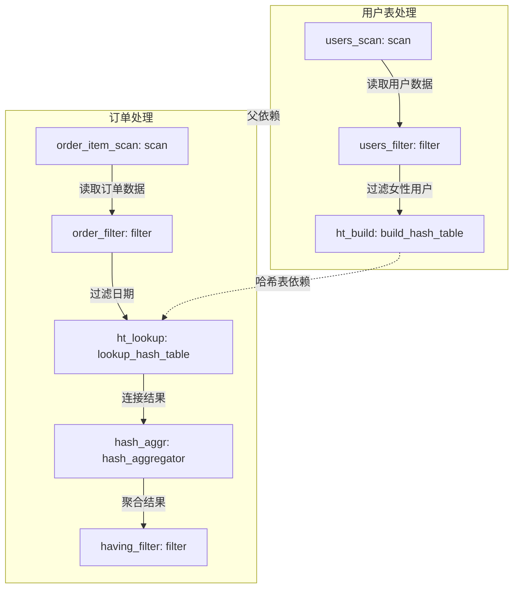
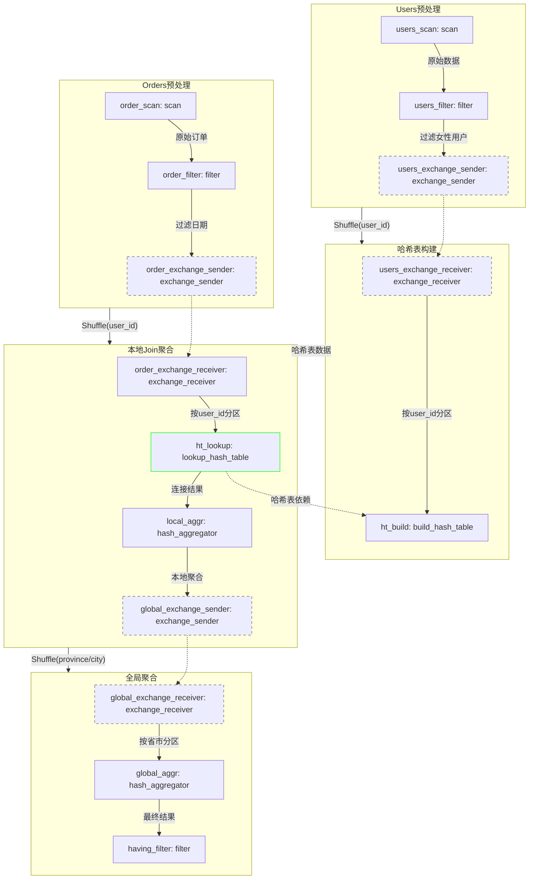
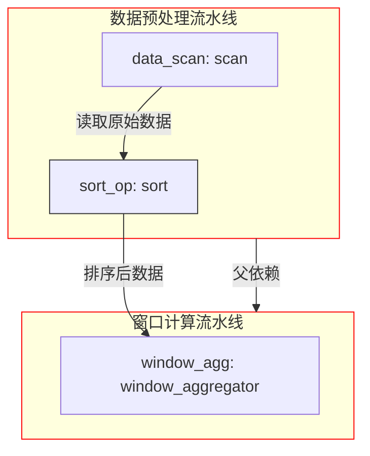

+++
title = "A Query Intermediate Representation Language (Draft)"
description = "QIR 设计草案"
date = 2025-04-02
draft = false
template = "blog/page.html"

[extra]
toc = true
+++


QIR 是一种用于描述关系代数查询的中间语言，SQL 查询可以翻译称为 qir 代码，然后再解释或者编译执行。

# Overview
## What is QIR
QIR (Query Intermediate Representation) 是一种用于描述数据查询的中间表示语言，类似于 SQL 查询的查询计划）。它具有以下特点：

1. 基于关系代数
   - QIR 使用关系代数算子(如 scan、filter、join、aggregation 等)来描述数据处理逻辑
   - 每个算子都有明确定义的输入和输出类型
   - 支持复杂的数据处理操作，如 join、group by、window functions 等
2. AST based
   - QIR 是一种 AST (Abstract Syntax Tree) 表示，而非 bytecode
   - QIR 是函数式的。

3. 类型安全
   - QIR 提供了表结构类型定义，用于类型检查，并且便于JIT优化，减少运行时的检查开销。
   - 每个算子的输入输出类型在编译时进行检查
   - 可以及早发现类型错误，提高代码质量

4. 流水线式处理
   - QIR 使用 pipeline 来组织算子
   - 支持多个 pipeline 之间的依赖关系
   - 便于进行并行化和分布式处理

QIR 的定位类似于 [MonetDB 中的 MAL 语言](https://www.monetdb.org/documentation-Mar2025/dev-guide/monetdb-internals/mal_reference/)，或者 [Sqlite 中的 bytecode](https://sqlite.org/opcode.html).

## Why QIR
1. 可以直接生成、编写 QIR 代码并执行。
2. SQL 查询扩展查询算子较为复杂。QIR 目标是提供更方面的扩展算子能力。
3. 更敏捷的新算子开发、测试流程
   - 实现新的算子、策略。
   - 手动编写 QIR 代码
   - 进行 JIT 优化
   - 达到预期效果后，再改进 Planner 支持新算子（以终为始）
4. 性能优化的实验场
   - 丰富的 Join 算法支持: semi join， anti-semi join， as of join
   - 窗口函数扩展：range between expr and expr
   - 窗口函数扩展：over(partition by expr order by expr where expr)
   - minmax 索引优化
   - bloom 索引优化
   - 分区、分桶查询优化（对Join的支持）
   - profile based optimization
   - vectorized execution. QIR 基于 arrow 数据结构，以向量化的方式进行数据处理
   - JIT: QIR 更便于 JIT

## Query IR 的拓扑图
本文档中的拓扑图使用 mermaid 格式生成，具体格式如下：
1. 每个pipeline 对应一个 subgraph， pipeline 的 父子关系使用红色连接线表示
2. 每个算子，包括 Source， Operators， Sink 对应一个 node. 使用"变量名:算子名"作为 label， 例如："user_filter: filter"， 各个算子之间的数据流使用连接线表示
3. exchange_sender 与 exchange_receiver 之间的连线使用虚线，表示数据交换，其他的数据流使用实线。
4. lookup_hash_table 与 build_hash_table 之间的连线使用绿线相关，表示其数据依赖关系。
5. node 和 link 上的 label 全部使用引号包裹，以避免特殊字符的干扰。

# Examples
## Example 1: 简单查询
```sql
-- table: users(id, name, birthday, email)
select name, email from users where birthday > '1990-01-01';
```

其对应的 qir 代码如下：
```qir 

// type users 是一个表类型信息，用于为后面的代码提供类型检查，例如字段名是否正确，数据类型是否正确等。
type users = table {
    name = "users",
    columns = [
        {name = "id", type = "int"},
        {name = "name", type = "string"},
        {name = "birthday", type = "date"},
        {name = "email", type = "string"}
    ]    
}; 

// source1 是一个 Source operator, 其输出类型为： DataFrame {
//     columns = [
//         {name = "name", type = "string"},
//         {name = "birthday", type = "date"}
//         {name = "email", type = "string"}
//     ]
// }
let source1 = scan(
    name = "users", // table name
    table = users, 
    output = ["name", "birthday", "email"] ); // 从 users 表中读取数据

/// filter1 是一个 ordinary operator, 其输出类型为： DataFrame {
///     columns = [
///         {name = "name", type = "string"},
///         {name = "email", type = "string"}
///     ]
/// }
let filter1 = filter(input = source1, 
    predictor = |row| { row.birthday > date'1990-01-01' },     // 过滤出 birthday > '1990-01-01' 的数据 
    output = ["name", "email"] );   // 输出 name 和 email 字段

/// sink1 是一个 sink operator, 其输出类型与输入类型相同，起到一个收集的作用
let sink1 = identity_sink(input = filter1); 

let pipeline1 = pipeline {
    source = source1,
    operators = [filter1],
    sink = sink1
};

// graph 是一个 topology 类型，用于描述整个查询的拓扑结构，也是单个 qir 文件的最终输出结果。
let graph = topology( main = pipeline1 );
```

## Example 2: simple join
```sql
--- table: order_item(order_item_id: u64, order_date: date, product_id: u32, quantity: u32, amount: decimal)
--- table: product(product_id: u32, product_name: string, category_id: u32)

select product_name, sum(quantity), sum(amount)
from order_item join product on order_item.product_id = product.product_id
group by product_name
```
对应的 qir 代码如下：
```qir
// 定义表结构类型
type order_item = table {
    name = "order_item",
    columns = [
        {name = "order_item_id", type = "u64"},
        {name = "order_date", type = "date"},
        {name = "product_id", type = "u32"},
        {name = "quantity", type = "u32"},
        {name = "amount", type = "decimal"}
    ]
};

type product = table {
    name = "product",
    columns = [
        {name = "product_id", type = "u32"},
        {name = "product_name", type = "string"},
        {name = "category_id", type = "u32"}
    ]
};

// 源操作符
let order_item_source = scan(
    name = "order_item",
    table = order_item,
    output = ["product_id", "quantity", "amount"]  // 只需要参与计算的字段
);

let product_source = scan(
    name = "product_scan",
    table = product,
    output = ["product_id", "product_name"]       // 只需要关联字段和分组字段
);

let ht_build1 = build_hash_table(
	input = product_source,
	key = [ "product_id" ] );

let ht_lookup1 = lookup_hash_table( ht = ht_build1, input = order_item_source, key = ["product_id"],
	output = [ ["quantity", "amount"], // field from lookup side
			   ["product_name"] ]	// field from build side
 );

let hash_aggr1 = hash_aggregator( input = h1_lookup1, 
	group_by = ["product_name"],
	aggregators = [
		sum_aggregator( name="total_quantity", field = "quantity" ),
		sum_aggregator( name="total_amount", field = "amount" )
	],
	output = [ "product_name", "total_quantity", "total_amount" ]
);


let pipeline1 = pipeline( source = product_source, sink = ht_build1 );
let pipeline2 = pipeline( source = order_item_source, operators = [ht_lookup1], sink = hash_aggr1, 
	parent = [pipeline1] );	// pipeline2 依赖 pipeline1, 仅当 pipeline1 执行完成后，才能开始执行


let graph = topology(main = pipeline2);
```

## Example 3: join with filter
```sql
-- table: order_item(order_item_id, order_date, user_id, product_id, quantity, amount)
-- table: users(user_id, name, sex, province, city)
select province, city, count(order_item_id), sum(quantity), sum(amount)
from order_item left join users on order_item.user_id = users.user_id
where order_date >= '2025-01-1' and sex = 'F'
group by province, city
```

```qir
// 定义表结构类型
type order_item = table {
    name = "order_item",
    columns = [
        {name = "order_item_id", type = "u64"},
        {name = "order_date", type = "date"},
        {name = "user_id", type = "u32"},
        {name = "product_id", type = "u32"},
        {name = "quantity", type = "u32"},
        {name = "amount", type = "decimal"}
    ]
};

type users = table {
    name = "users",
    columns = [
        {name = "user_id", type = "u32"},
        {name = "name", type = "string"},
        {name = "sex", type = "string"},
        {name = "province", type = "string"},
        {name = "city", type = "string"}
    ]
};

// 源操作符和过滤（优化版）
let users_scan = scan(
    name = "users",
    table = users,
    output = ["user_id", "sex", "province", "city"]
);

let users_filter = filter(
    input = users_scan,
    predictor = |row| { row.sex == "F" },  // 提前过滤女性用户
    output = ["user_id", "province", "city"]
);

let ht_build = build_hash_table(
    input = users_filter,
    key = ["user_id"]
);

let order_item_scan = scan(
    name = "order_item",
    table = order_item,
    output = ["user_id", "order_item_id", "quantity", "amount", "order_date"]
);

let order_filter = filter(
    input = order_item_scan,
    predictor = |row| { row.order_date >= date'2025-01-01' },
    output = ["user_id", "order_item_id", "quantity", "amount"]
);

let ht_lookup = lookup_hash_table(
    ht = ht_build,
    input = order_filter,
    key = ["user_id"],
    output = [
        ["order_item_id", "quantity", "amount"],  // 订单表字段
        ["province", "city"]                     // 用户表字段（已过滤）
    ],
    join_type = "inner"  // 改为内连接（因为用户表已过滤）
);

let hash_aggr = hash_aggregator(
    input = ht_lookup,
    group_by = ["province", "city"],
    aggregators = [
        count_aggregator(name = "total_orders", field = "order_item_id"),
        sum_aggregator(name = "total_quantity", field = "quantity"),
        sum_aggregator(name = "total_amount", field = "amount")
    ],
    output = ["province", "city", "total_orders", "total_quantity", "total_amount"]
);

// 流水线定义（优化版）
let pipeline1 = pipeline(
    source = users_scan,
    operators = [users_filter],
    sink = ht_build
);

let pipeline2 = pipeline(
    source = order_item_scan,
    operators = [order_filter, ht_lookup, hash_aggr],
    sink = hash_aggr,
    parent = [pipeline1]  // 强依赖
);

let graph = topology(main = pipeline2);
```

## Example 4: join with filter and having 
```sql
-- table: order_item(order_item_id, order_date, user_id, product_id, quantity, amount)
-- table: users(user_id, name, sex, province, city)
select province, city, count(order_item_id), sum(quantity), sum(amount)
from order_item left join users on order_item.user_id = users.user_id
where order_date >= '2025-01-1' and sex = 'F'
group by province, city
having count(order_item_id) > 10
```

等价的 qir 代码：
```qir
// 定义表结构类型（与示例3相同）
type order_item = table {
    name = "order_item",
    columns = [
        {name = "order_item_id", type = "u64"},
        {name = "order_date", type = "date"},
        {name = "user_id", type = "u32"},
        {name = "product_id", type = "u32"},
        {name = "quantity", type = "u32"},
        {name = "amount", type = "decimal"}
    ]
};

type users = table {
    name = "users",
    columns = [
        {name = "user_id", type = "u32"},
        {name = "name", type = "string"},
        {name = "sex", type = "string"},
        {name = "province", type = "string"},
        {name = "city", type = "string"}
    ]
};

// 源操作符和过滤（继承优化逻辑）
let users_scan = scan(
    name = "users",
    table = users,
    output = ["user_id", "sex", "province", "city"]
);

let users_filter = filter(
    input = users_scan,
    predictor = |row| { row.sex == "F" },
    output = ["user_id", "province", "city"]
);

let ht_build = build_hash_table(
    input = users_filter,
    key = ["user_id"]
);

let order_item_scan = scan(
    name = "order_item",
    table = order_item,
    output = ["user_id", "order_item_id", "quantity", "amount", "order_date"]
);

let order_filter = filter(
    input = order_item_scan,
    predictor = |row| { row.order_date >= date'2025-01-01' },
    output = ["user_id", "order_item_id", "quantity", "amount"]
);

let ht_lookup = lookup_hash_table(
    ht = ht_build,
    input = order_filter,
    key = ["user_id"],
    output = [
        ["order_item_id", "quantity", "amount"],
        ["province", "city"]
    ],
    join_type = "inner"
);

// 新增 HAVING 过滤阶段
let hash_aggr = hash_aggregator(
    input = ht_lookup,
    group_by = ["province", "city"],
    aggregators = [
        count_aggregator(name = "total_orders", field = "order_item_id"),
        sum_aggregator(name = "total_quantity", field = "quantity"),
        sum_aggregator(name = "total_amount", field = "amount")
    ],
    output = ["province", "city", "total_orders", "total_quantity", "total_amount"]
);

let having_filter = filter(
    input = hash_aggr,
    predictor = |row| { row.total_orders > 10 },  // HAVING 条件
    output = ["province", "city", "total_orders", "total_quantity", "total_amount"]
);

// 流水线定义
let pipeline1 = pipeline(
    source = users_scan,
    operators = [users_filter],
    sink = ht_build
);

let pipeline2 = pipeline(
    source = order_item_scan,
    operators = [order_filter, ht_lookup, hash_aggr, having_filter],
    sink = having_filter,
    parent = [pipeline1]
);

let graph = topology(main = pipeline2);
```

对应的拓扑图为：




## Example 5: shuffle join
```sql
-- big table join, using shuffle join
-- table: order_item(order_item_id, order_date, user_id, product_id, quantity, amount)
-- table: users(user_id, name, sex, province, city)
select province, city, count(order_item_id), sum(quantity), sum(amount)
from order_item left join users on order_item.user_id = users.user_id
where order_date >= '2025-01-1' and sex = 'F'
group by province, city
having count(order_item_id) > 10
```

对应的 qir 代码如下：
```qir
// 定义表结构类型
type order_item = table {
    name = "order_item",
    columns = [
        {name = "order_item_id", type = "u64"},
        {name = "order_date", type = "date"},
        {name = "user_id", type = "u32"},
        {name = "product_id", type = "u32"},
        {name = "quantity", type = "u32"},
        {name = "amount", type = "decimal"}
    ]
};

type users = table {
    name = "users",
    columns = [
        {name = "user_id", type = "u32"},
        {name = "name", type = "string"},
        {name = "sex", type = "string"},
        {name = "province", type = "string"},
        {name = "city", type = "string"}
    ]
};

// 用户表处理流水线（哈希表构建侧）
let users_scan = scan(
    name = "users",
    table = users,
    output = ["user_id", "sex", "province", "city"]
);

let users_filter = filter(
    input = users_scan,
    predictor = |row| { row.sex == "F" },
    output = ["user_id", "province", "city"]
);

let users_exchange_sender = exchange_sender(
    input = users_filter,
    partition_by = ["user_id"],
    shuffle_mode = "HASH"
);

let users_exchange_receiver = exchange_receiver(
    input = users_exchange_sender,
    partition_by = ["user_id"],
    shuffle_mode = "HASH"
);

let ht_build = build_hash_table(
    input = users_exchange_receiver,
    key = ["user_id"]
);

// 订单表处理流水线（探测侧）
let order_scan = scan(
    name = "order_item",
    table = order_item,
    output = ["user_id", "order_item_id", "quantity", "amount", "order_date"]
);

let order_filter = filter(
    input = order_scan,
    predictor = |row| { row.order_date >= date'2025-01-01' },
    output = ["user_id", "order_item_id", "quantity", "amount"]
);

let order_exchange_sender = exchange_sender(
    input = order_filter,
    partition_by = ["user_id"],
    shuffle_mode = "HASH"
);

let order_exchange_receiver = exchange_receiver(
    input = order_exchange_sender,
    partition_by = ["user_id"],
    shuffle_mode = "HASH"
);

// 本地Join与聚合
let ht_lookup = lookup_hash_table(
    ht = ht_build,
    input = order_exchange_receiver,
    key = ["user_id"],
    output = [
        ["order_item_id", "quantity", "amount"],
        ["province", "city"]
    ],
    join_type = "inner"
);

let local_aggr = hash_aggregator(
    input = ht_lookup,
    group_by = ["province", "city"],
    aggregators = [
        count_aggregator(name = "total_orders", field = "order_item_id"),
        sum_aggregator(name = "total_quantity", field = "quantity"),
        sum_aggregator(name = "total_amount", field = "amount")
    ],
    output = ["province", "city", "total_orders", "total_quantity", "total_amount"]
);

// 全局聚合阶段
let global_exchange_sender = exchange_sender(
    input = local_aggr,
    partition_by = ["province", "city"],
    shuffle_mode = "HASH"
);

let global_exchange_receiver = exchange_receiver(
    input = global_exchange_sender,
    partition_by = ["province", "city"],
    shuffle_mode = "HASH"
);

let global_aggr = hash_aggregator(
    input = global_exchange_receiver,
    group_by = ["province", "city"],
    aggregators = [
        sum_aggregator(name = "total_orders", field = "total_orders"),
        sum_aggregator(name = "total_quantity", field = "total_quantity"),
        sum_aggregator(name = "total_amount", field = "total_amount")
    ],
    output = ["province", "city", "total_orders", "total_quantity", "total_amount"]
);

let having_filter = filter(
    input = global_aggr,
    predictor = |row| { row.total_orders > 10 },
    output = ["province", "city", "total_orders", "total_quantity", "total_amount"]
);

// 流水线定义
let pipeline_users = pipeline(
    source = users_scan,
    operators = [users_filter, users_exchange_sender],
    sink = users_exchange_sender
);

let pipeline_ht = pipeline(
    source = users_exchange_receiver,
    operators = [ht_build],
    sink = ht_build,
    parent = [pipeline_users]
);

let pipeline_order = pipeline(
    source = order_scan,
    operators = [order_filter, order_exchange_sender],
    sink = order_exchange_sender
);

let pipeline_join = pipeline(
    source = order_exchange_receiver,
    operators = [ht_lookup, local_aggr, global_exchange_sender],
    sink = global_exchange_sender,
    parent = [pipeline_ht, pipeline_order]
);

let pipeline_global = pipeline(
    source = global_exchange_receiver,
    operators = [global_aggr, having_filter],
    sink = having_filter,
    parent = [pipeline_join]
);

let graph = topology(main = pipeline_global);
```

对应的拓扑图如下：




## Example 6: 窗口函数
```sql
-- table data(Plant: string, Date: date, mwh: f64)
SELECT "Plant", "Date",
       avg("MWh") OVER (
        PARTITION BY "Plant"
        ORDER BY "Date" ASC
        RANGE BETWEEN INTERVAL 3 DAYS PRECEDING
                  AND INTERVAL 3 DAYS FOLLOWING)
        AS "MWh 7-day Moving Average"
FROM "data"
ORDER BY 1, 2;
```

对应的 qir 代码为：
```qir
type data = table {
    name = "data",
    columns = [
        {name = "Plant", type = "string"},
        {name = "Date", type = "date"},
        {name = "MWh", type = "f64"}
    ]
};

// 数据读取
let data_scan = scan(
    name = "data",
    table = data,
    output = ["Plant", "Date", "MWh"]
);

// 本地排序与窗口计算
let sort_op = sort(
    input = data_scan,
    columns = [
    	{column = "Plant", direction = "ASC"},
    	{column = "Date", direction = "ASC"}
    ],
    output = ["Plant", "Date", "MWh"]
);

let window_agg = window_aggregator(
    input = sort_op,
    partition_by = ["Plant"],
    order_by = [{column = "Date", direction = "ASC"}],
    frame = {
        type = "RANGE",
        start = {value = 3, unit = "DAY", preceding = true},
        end = {value = 3, unit = "DAY", preceding = false}
    },
    aggregators = [
        avg_aggregator(
            name = "MWh 7-day Moving Average",
            field = "MWh"
        )
    ],
    output = ["Plant", "Date", "MWh 7-day Moving Average"]
);


let sink = identity_sink(input = global_sort);

let pipeline1 = pipeline(
    source = data_scan,
    sink = sort_op
);

let pipeline2 = pipeline(
	input = sort_op,
	sink = window_agg,
	parent = pipeline1
)

let graph = topology(main = main_pipeline);
```

对应的拓扑图为:




TODO: qir 为窗口函数提供了不同的计算模式：
- as an operator: 支持流式的处理，可以满足对大数据集进行窗口计算。
- as an sink: 不支持流式计算，需要将整个数据集放入内存进行窗口计算。
这一块稍后补充。


# 核心概念

## topology
topology 是一个完整的查询计划，由一个或多个 pipeline 组成。pipeline 之间可以有依赖关系,形成一个有向无环图(DAG)。

## pipeline
pipeline 是一个数据处理流水线，由 source、operators 和 sink 组成:
- source: 数据源算子，负责从存储系统（或者接收外部的请求）读取数据
- operators: 处理算子序列，对数据进行转换、过滤、聚合等操作
- sink: 汇聚算子，负责将处理结果写入存储系统或传递给下一个 pipeline

pipeline 支持 partition，每个partition 中的算子的数据流动是在单个线程中，以小批量的方式进行流动，这种方式可以充分发挥 CPU 的 
向量化计算和 Cache 带来的性能提升。

pipeline 支持分区时，sink 节点可以是分区的，或者是汇聚的。

pipeline 之间可以有依赖关系:
- [ ] `pipeline_a` 可以依赖于 `pipeline_b`: b 执行完成后，a 才能开始执行
- [ ] `pipeline_a[partition_1]` 可以依赖于 `pipeline_b[partition_1]`: b 的 partition_1 执行完成后，a 的 partition_1 才能开始执行
- [ ] operator 之间支持 notify 机制，下游 operator 可以向上游 operator 发送通知，例如：
  - Limit 操作，当达到指定的行数时，通知上游停止发送数据

## operator
operator 是数据处理算子，每个算子都有明确定义的输入和输出类型。常见的算子包括:
- filter: 过滤算子
- join: 关联算子
- aggregation: 聚合算子
- sort: 排序算子
- window: 窗口算子

## source
source 是数据源算子，负责从存储系统读取数据。常见的 source 包括:
- scan: 表扫描算子
- exchange_receiver: 数据交换接收算子

## sink
sink 是汇聚算子，负责将处理结果写入存储系统或传递给下一个 pipeline。常见的 sink 包括:
- identity_sink: 恒等汇聚算子
- exchange_sender: 数据交换发送算子
- build_hash_table: 哈希表构建算子

## type system
1. data type
2. column metadata: nullable, sort, index(minmax, bloom)
3. table metadata: partition, bucket
4. 对性能的优化
   - 表达式求值，减少运行期的解释开销
   - nullable: 避免 null 检查
   - 排序： 如果数据已经排序，则可以选择 Merge Sort 等算法
   - partition: 避免全表扫描

## partition
partition 是数据分区概念，用于并行和分布式计算:
- 数据可以按照指定的字段进行分区
- 不同分区可以并行处理
- 分区之间可以通过 exchange 算子进行数据交换

# 算子说明

1. scan 表扫描算子，用于从表中读取数据
   - name: 表名
   - table: 表类型定义，optional， 用于类型检查
   - output: 需要输出的字段列表
 
2. filter 对输入 DataFrame 进行过滤操作
   - input: 输入 DataFrame
   - predictor: 过滤函数，返回 true 表示保留，返回 false 表示丢弃
   - output: 输出字段列表

3. build_hash_table 构建哈希表，用于关联操作
   - input: 输入 DataFrame
   - key: 哈希表的 key 列

4. lookup_hash_table 从哈希表中查找数据，用于关联操作
   - ht: 哈希表，由 build_hash_table 构建
   - input: 输入 DataFrame
   - key: 关联字段
   - output: 输出字段列表，格式为 [[lookup_side_fields]， [build_side_fields]]
   - join_type: 连接类型，inner/left/right/semi/anti-semi/crossjoin 等

5. hash_aggregator 哈希聚合算子
   - input: 输入 DataFrame
   - group_by: 分组字段列表
   - aggregators: 聚合函数列表
   - output: 输出字段列表

6. count_aggregator 计数聚合函数
   - name: 聚合结果字段名
   - field: 要计数的字段名

7. sum_aggregator 求和聚合函数
   - name: 聚合结果字段名
   - field: 要求和的字段名

8. identity_sink 恒等汇聚算子
   - input: 输入 DataFrame
   - 说明: 输出类型与输入类型相同，用于数据收集

9. exchange_sender 发送端算子，用于分布式计算
   - input: 输入 DataFrame
   - partition_by: 分区字段列表
   - shuffle_mode: "HASH" for hash shuffle， "GLOBAL" for collect all data to one partition

10. exchange_receiver 接收端算子，用于分布式计算
    - input: 输入 DataFrame， 对应于 exchange_sender 算子 
    - partition_by: 分区字段列表，需要与 exchange_sender 算子的 partition_by 一致
    - shuffle_mode: "HASH" for hash shuffle， "GLOBAL" for collect all data to one partition，需要与 exchange_sender 算子的 shuffle_mode 一致

11. window_aggr 带补充

12. pipeline 流水线定义
    - source: 源算子
    - operators: 算子列表（可选）
    - sink: 汇聚算子
    - parent: 依赖的父流水线列表（可选）

13. topology 查询拓扑结构
    - main: 主流水线
    - 说明: 用于描述整个查询的拓扑结构，是单个 qir 文件的最终输出


当进行大数据量的表之间 join 时，通常会使用 shuffle join 算法，即将数据按照 join key 进行哈希分区，然后将相同 key 的数据发送到同一个节点进行 join 操作。

# TODO
1. 支持 `SELECT sum(amount), sum(amount) FILTER (region != 'north') FROM sales;`
2. 支持 `SELECT first(amount ORDER BY date ASC) FROM sales;`
3. 提供更多基础时间窗口能力（date based）,增强对时间快速计算的支持。
   - 年/年季/年月/年周/年月日 多种层次结构  `date_trunc`
   - 前期、同期
   - （年/月/周）累计、前期累计、同期累计
   - 滑动、滚动窗口
4. 提供更多时序窗口能力（time based） 
5. 支持更灵活的窗口函数能力。
   - `SUM(X) OVER (PARTITION BY expr ORDER BY expr RANGE BETWEEN expr AND expr)`
   - `SUM(X) OVER (PARTITION BY expr ORDER BY expr WHERE expr)`
   对字符串等类型而言，range bettween expr precedding 没法使用，对日期、时间等也更简洁。
6. 扩展支持如下的 SQL 语法，这样，就可以处理类似于 MDX 的衍生度量（修改当前 Context 的上下文，包括增加新的维度条件，或者减少现有的维度限制，但保持当前的查询行不变）。
   ```sql
    SELECT a, b, SUM(X),
              SUM(X) FILTER (c > 10),  -- SUM(X, a, b, c > 10) 
              SUM(X) BY a FILTER(b = 2 and c > 10) -- SUM(X, a, b = 2, c > 10)
   ```
   提供这种扩展能力，不仅提升了 SQL 的表达能力，而且这个可以生成一个高效的执行 plan，执行效率也能得到显著提升。
7. 支持：这个特性可以显著简化 分组小计的 SQL 查询。
   - duckdb: 
     ```sql
        -- the syntax () denotes the empty set (i.e., computing an ungrouped aggregate)
        -- 这个功能非常适合于进行分组小计的计算。
     SELECT city, street_name, avg(income)
     FROM addresses
     GROUP BY GROUPING SETS ((city, street_name), (city), (street_name), ());
     
     SELECT city, street_name, avg(income)
     FROM addresses
     GROUP BY CUBE (city, street_name); -- 等效于 group by grouping sets( (city, street_name), (city), (street_name), ());
     
     SELECT city, street_name, avg(income)
     FROM addresses
     GROUP BY ROLLUP (city, street_name) -- 等效于 group by grouping sets( (city, street_name), (city), () );
     
     -- grouping_id
     ```