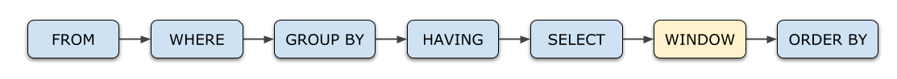
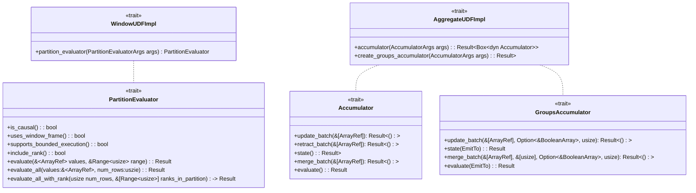
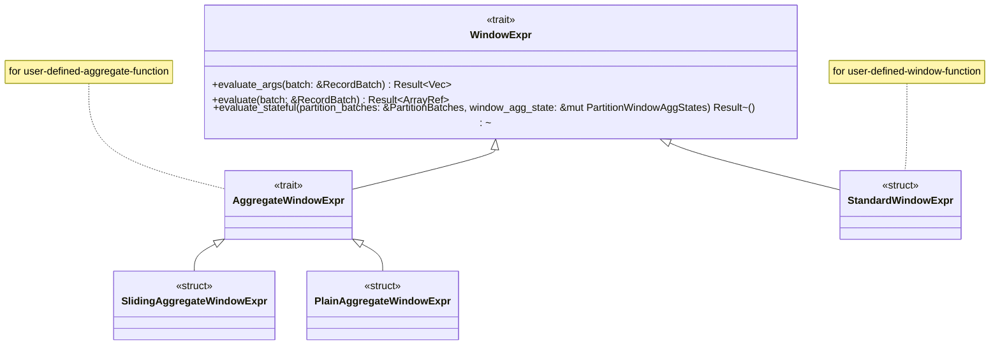
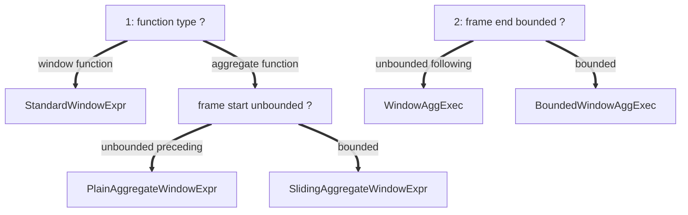
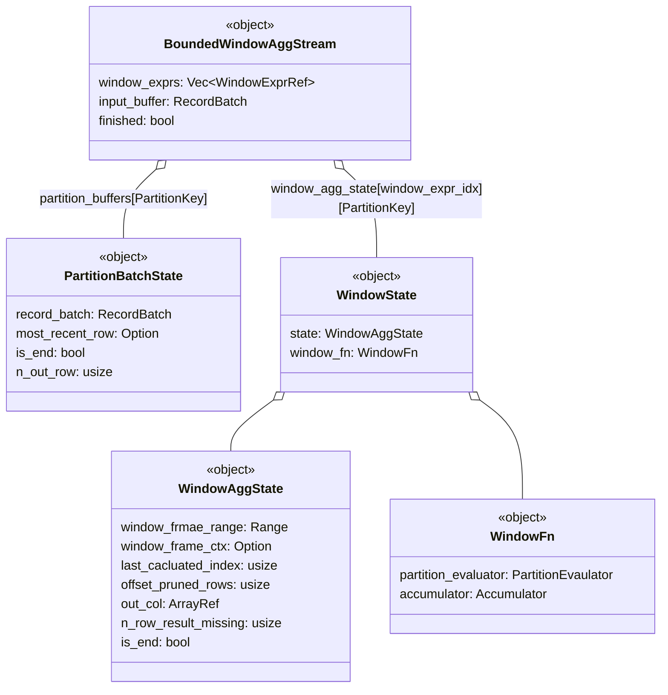

+++
title = "datafusion window function execution"
description = "本文对 datafusion 窗口函数的执行过程进行分析，以更好的理解窗口函数的执行原理"
date = 2025-05-26
draft = false
template = "blog/page.html"
+++

# API: 使用窗口函数
窗口函数是针对数据分析的一个 SQL 查询扩展，其执行顺序如下图中，


一般的，窗口函数的语法如下：

来源：https://duckdb.org/docs/stable/sql/functions/window_functions

datafusion 提供了对窗口函数的支持，不过，目前的版本支持程度仍然不如 duckdb，我目前发现的问题是： frame 中目前仅支持 literal expr,
这限制了基于当前行的 dynamic range 的支持能力，例如，典型的 上年同期年累 这样的计算。

在 duckdb 中，可以表示为
  ```sql
  SUM( SUM(amount) ) over (order by order_date 
    range between to_days( order_date - (date_trunc('year', order_date'year') - interval 1 year)) preceding 
    and interval 1 year preceding )
  ```
本文分析的目的之一就是对 datafusion 的窗口函数执行机制进行研究，并评估为其添加上这类能力的可行性。

# SPI：创建自定义的窗口函数

datafusion 中支持4种 自定义函数：
- udf: scalar 函数
- udtf: 表函数，如 csv_read 之类的函数
    - udwf: User Define Window Function：以 partition 为单位的窗口函数

      主要针对非聚合类的窗口函数，参见：
        1. [simple udwf](https://github.com/apache/datafusion/blob/main/datafusion-examples/examples/simple_udwf.rs)
        2. [advanced udwf](https://github.com/apache/datafusion/blob/main/datafusion-examples/examples/advanced_udwf.rs)

      see: datafusion/physical-expr/src/window/standard.rs StandardWindowExpr::evaluate(按照这个源代码整理，与代码注释对应不上)

      | [`uses_window_frame`] | [`supports_bounded_execution`] | [`include_rank`] | function_to_implement      | functions                   |
          |-----------------------|--------------------------------|------------------|----------------------------|-----------------------------|
      | true                  | *                              | *                | [`evaluate`]               | nth_value                   |
      | false (default)       | *                              | true             | [`evaluate_all_with_rank`] | rank, dense_rank, cume_dist |
      | false                 | *                              | false (default)  | [`evaluate_all`]           |                             |


UDWF 窗口函数列表：

| category   | functions                   | supported  | desc          | uses_window_frame | supports_bounded_execution | include_rank |
   |------------|-----------------------------|------------|---------------|-------------------|----------------------------|--------------|
| ranking    | cume_dist                   | df, duckdb | 累积百分比         | X                 | X                          | true         |
| ranking    | dense_rank                  | df, duckdb | 1,2,2,3 风格的排名 | X                 | true                       | true         |
| ranking    | rank                        | df, duckdb | 1,2,2,4 风格的排名 | X                 | true                       | true         |   
| ranking    | ntile(n)                    | df, duckdb | 按 n 等分        | X                 | X                          | X            |   
| ranking    | percent_rank                | df, duckdb | 排名百分比         | X                 | X                          | true         |   
| ranking    | row_number                  | df, duckdb | 行号            | X                 | true                       | X            |   
| analytical | first_value(expr)           | df, duckdb |               | X                 | X                          | X            |
| analytical | lag(expr, offset, default)  | df, duckdb |               | X                 | true                       | X            |
| analytical | last_value(expr)            | df, duckdb |               | X                 | X                          | X            |
| analytical | lead(expr, offset, default) | df, duckdb |               | X                 | true                       | X            |
| analytical | nth_value(expr, n)          | df, duckdb |               | true              | true                       | X            |


- udaf: User Define Aggregate Function
  针对形如 SUM, COUNT 之类的函数，自定义函数参考：[advanced udaf](https://github.com/apache/datafusion/blob/main/datafusion-examples/examples/advanced_udaf.rs)
  核心接口是 Accumulator, GroupsAccumulator





## 物理计划生成：选择算子、WindowExpr 决策树



具体，可以查看如下的代码实例，通过代码的调试等方式，可以帮助我们理解不同的算子下的执行流程：

| function  | operator                | window expr       | demo                                                                                                                        |
|-----------|-------------------------|-------------------|-----------------------------------------------------------------------------------------------------------------------------|
| aggregate | window agg exec         | plain aggregate   | [test_sum_1](https://github.com/wangzaixiang/vectorize_engine/blob/main/playgrounds/try_datafusion/src/bin/test_windows.rs) |
| aggregate | window agg exec         | sliding aggregate | [test_sum2](https://github.com/wangzaixiang/vectorize_engine/blob/main/playgrounds/try_datafusion/src/bin/test_windows.rs)  |
| aggregate | bounded window agg exec | plain aggregate   | [test_sum4](https://github.com/wangzaixiang/vectorize_engine/blob/main/playgrounds/try_datafusion/src/bin/test_windows.rs)  |
| aggregate | bounded window agg exec | sliding aggregate | [test_sum3](https://github.com/wangzaixiang/vectorize_engine/blob/main/playgrounds/try_datafusion/src/bin/test_windows.rs)  |

## 算子: WindowAggExec 分析
根据上述分析，WindowAggExec 的 frame 形如：between bounded and unbounded following

1. 从上游获取 RecordBatch，追加到 self.batches 中，直至全部读取完成，进入到第2步。
2. 将全部的 RecordBatch 合并为一个 RecordBatch
3. 在 batch 上求值 sort columns (partition key, maybe + order key)
4. 按照 partition key 对 batch 进行 partition，由于 batch 已经排序，因此，在batch 中每个分区的数据已经是连续存放的，一个分区的数据接着
   上一个分区的数据。每个分区可以表示为 Range<usize>
5. foreach partition，调用函数 WindowAggExec::compute_window_aggregates 进行窗口函数求值
    1. foreach window_expr 调用 window_expr.evaluate(batch) 求值（多个窗口函数可以共享同一个窗口）
        - window_expr.evaluate(batch) : single partition, single window_exp
            - foreach row in batch `AggregateWindowExpr::get_result_column`
                1. 计算 当前行的 window range
                2. window_expr.`get_aggregate_result_inside_range`: evaluate for single row with a range(window)
                    - PlainAggregateWindowExpr::get_aggregate_result_inside_range: window 0..end end 是递增的

                      frame: 0 .. LAST
                        1. 对比 last_range，将 shift in rows 调用 accumulator.update_batch
                        2. 获取 accumulator.evaluate
                    - SlidingAggregateWindowExpr::get_aggregate_result_inside_range:

                      frame: *bounded* .. LAST
                        1. 对比 last_range，将 shift out rows 调用 accumulator.retract_batch
                        2. 将 shift in rows 调用 accumulator.update_batch
                        3. 获取 accumulator.evaluate

                    - 总之： SlidingAggregateWindowExpr::get_aggregate_result_inside_range 可以覆盖 PlainAggregateWindowExpr::get_aggregate_result_inside_range 的能力。

## 算子： BoundedWindowAggExec
对 frame.end 不是 unbounded following 的窗口类型，datafusion 视为 bounded window，使用 BoundedWindowAggExec 算子来处理该窗口函数的计算。

根据 frame.start 的不同，会选择不同类型的 WindowExpr:
- 对标准的窗口函数（UDWF），使用 StandardWindowExpr + PartitionEvaluator:
  ```sql
    select *, rank() over (partition by product_id order by order_date) as rank1 from t1
  ```
- 对聚合类窗口函数（UDAF）, frame.start 是 unbounded preceding 的，使用 PlainAggregateWindowExpr + Accumulator
  ```sql
  select *, sum(amount) over (partition by product_id order by order_date rows between unbounded preceding and 1 following) as amounts1 from t1
  ```
- 对聚合类窗口函数（UDAF）, frame.start 不是 unbounded preceding 的，使用 SlidingAggregateWindowExpr + Accumulator
  ```sql
  select *, sum(amount) over (order by order_date range between interval '1 days' preceding and interval '1 days' following) as slide_amounts from t1
  ```

执行流程：
1. BoundedWindowAggStream 从上游读取 RecordBatch (已按 window order by 进行排序)
2. 根据 RecordBatch 更新 partition_key -> PartitionBatchState( record_batch )
3. 调用 BoundedWindowAggStream::compute_aggregates 计算窗口函数
    1. foreach window_expr, call window_expr.evaluate_stateful (1 window_expr, multi partition)
        1. foreach partition, call window_expr.get_result_column (1 window_expr, 1 partition)
            1. foreach row which is not calculated previous
                1. 计算 row 对应的 frame range
                2. 如果 RecordBatch 满足 frame range，则调用 window_expr.get_aggregate_result_inside_range 进行聚合求值
                    1. 相比上一行的frame，对移出的行调用 accumulator::retract_batch
                    2. 对移入的行调用 accumulator::update_batch


```rust
struct BoundedWindowAggStream {
  window_expr: Vec<WindowExprRef>,
  
  input_buffer: RecordBatch,
  
  partition_buffers:  PartitionBatches,   // IndexMap<PartitionKey, PartitionBatchState>
  window_agg_states:  Vec<PartitionWindowAggStates>, // indexed by window_expr, IndexMap<PartitionKey, WindowState>
}

struct PartitionBatchState {
  record_batch:  RecordBatch,
  most_recent_row: Option<RecordBatch>
  is_end: bool,
  n_out_row: usize
}

struct WindowState {
  state: WindowAggState,
  window_fn: WindowFn,      // 累加器会持有状态，通过 update_batch, retract_batch, merge_batch 更新状态
}

struct WindowAggState {
  window_frame_range: Range<usize>,
  window_frame_ctx:  Option<WindowFrameContext>,
  
  last_calculated_index: usize,
  offset_pruned_rows: usize,
  
  out_col: ArrayRef,
  n_row_result_missing: usize,
  is_end: bool
}

```



1. `BoundedWindowAggStream::poll_next_inner`
    1. poll RecordBatch from input
    2. `BoundedWindowAggStream::compute_aggregates`
        1. foreach window_expr, `window_expr::evaluate_stateful(partion_batches, partition_window_agg_states)`
            1. `AggregateWindowExpr::evalute_stateful` foreach partition
                1.

处理过程：
1. 无需在读取了全部分区数据后，再进行窗口函数计算，可以在读入 batch 的过程中增量的处理。
2. 思考：WindowAggExec 是否可以转换为 逆序后使用 BoundedWindowAggExec?

# 思考
1. 思考：支持更为灵活的 values between expr and expr ? 虽然不能匹配上述的优化，但在数据量不大的情况下，可以有更大的表现力
2. 思考：如何高效的支持同期、同期累积等功能？
3. datafusion 窗口函数代码改进思考