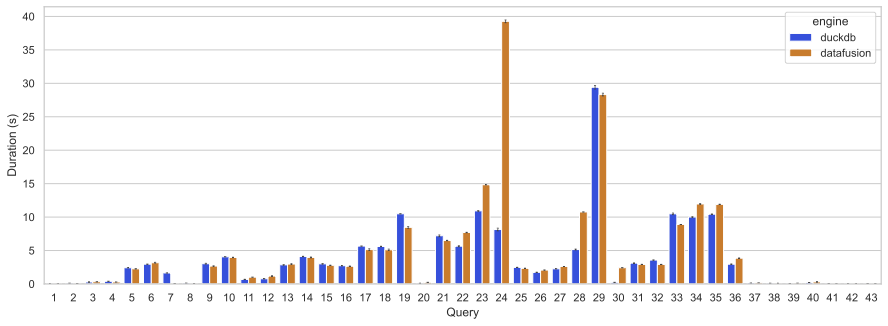
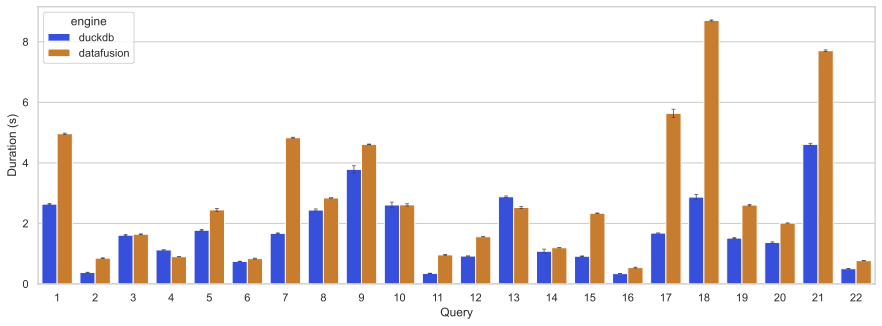

+++
title = "datafusion 性能分析"
description = "datafusion 性能分析"
date = 2025-06-06
draft = false
template = "blog/page.html"

[extra]
toc = true
+++

本文记录我对 datafusion 的一些性能测试的数据、分析和思考。

从2023年起，我开始关注在公司的 BI 分析引擎中，引入 OLAP 引擎的底层计算能力，当时就开始评估了几个计算引擎，包括：
- [polars](https://pola.rs)
- [datafusion](https://datafusion.apache.org)
- [duckdb](https://duckdb.org)

关注的重点主要是 计算能力 和 计算性能，后面选择了 duckdb 作为我们的计算引擎，主要的优势：
- 性能：duckdb 在大部份测试场景都具有领先或相当的性能（可参考我当时的一个测试：[duckdb 测评](/inside-duckdb/preface.html)）
- 表达能力：duckdb 对窗口函数的支持程度基本上是最完备的（而我测试的其他包括 mysql, clickhouse, datafusion 都有不同程度的支持不充分），pola.rs
  的窗口计算逻辑完全不同于 SQL 定义的窗口函数（而且我无法理解起底层逻辑是什么）。当然，我们后续在使用 duckdb 时，也发现了 duckdb 提供了很多有价值的
  SQL 扩展，例如 group by grouping set 对分组小计等统计场景非常有帮助。
- 工具完善度：duckdb 的 工具，包括 CLI、python API 都设计得非常友好。

25年，在阅读了[2024 Practice: Apache Arrow DataFusion A Fast, Embeddable, Modular Analytic Query Engine](https://docs.google.com/presentation/d/1gqcxSNLGVwaqN0_yJtCbNm19-w5pqPuktII5_EDA6_k)
一文后，尤其是文中提到的性能对比后，我也在本地重跑了一次 datafusion-duckdb-benchmark 的对比，再花了些时间阅读了一下 datafusion 的源代码，
有了一些不同的认知：
- Rust 源代码的可读性相比 C++ 有了更好的提升（可能因为我喜欢 Rust 超过 C++），我也把阅读 hash-join, window function等算子整理了文章，在这个系列中进行了发表。
- datafusion 的性能虽然整体上仍然不如 duckdb，但这个差距主要是工程上的成熟度，而非架构上的差异。

本文主要针对 datafusion-duckdb-benchmark 这个项目的测试结果，对二者的差异进行分析，并尝试给出改进、优化 datafusion 的一些建议。
更新的 [datafusion-duckdb-benchmark](https://github.com/wangzaixiang/datafusion-duckdb-benchmark) 项目:
1. 升级到最新的版本 datafusion 47.0.0 和 duckdb 1.3.0
2. 配合本文对部份脚本进行了更新。

# datafusion-duckdb-benchmark

1. clickbench
2. tpch
3. h2o

# clickbench 单线程测试


```sql
-- duckdb sql
 with 
   cb_datafusion as (from  read_csv('results/2025-06-17-df-48.0.0-duckdb-1.3.0-m1max/clickbench_datafusion.csv', header=false, columns= { 'query': 'int', 'core': 'int', 'seq': 'int', 'tm': 'double' } )),
   cb_duckdb as (from  read_csv('results/2025-06-17-df-48.0.0-duckdb-1.3.0-m1max/clickbench_duckdb.csv', header=false, columns= { 'query': 'int', 'core': 'int', 'seq': 'int', 'tm': 'double' } )),
   duckdb as (select query, min(tm) as tm from cb_duckdb group by query order by query), 
   datafusion as (select query, min(tm) as tm from cb_datafusion group by query order by query)
  select duckdb.query, round(duckdb.tm,3) as "duckdb time", round(datafusion.tm,3) as "datafusion time", round((datafusion.tm - duckdb.tm) / (duckdb.tm) * 100, 2) as "diff%" 
  from duckdb left join datafusion on duckdb.query = datafusion.query
  order by 1;
```

| query | duckdb time | datafusion time |   diff% |
|------:|------------:|----------------:|--------:|
|     1 |        0.03 |           0.033 |   12.23 |
|     2 |       0.109 |           0.071 |  -35.08 |
|     3 |       0.285 |           0.321 |   12.51 |
|     4 |       0.394 |           0.287 |  -27.19 |
|     5 |       2.411 |           2.219 |   -7.96 |
|     6 |       2.931 |           3.111 |    6.15 |
|     7 |       1.633 |           0.063 |  -96.15 |
|     8 |       0.117 |           0.075 |  -36.21 |
|     9 |        2.95 |           2.629 |  -10.87 |
|    10 |        4.04 |           3.929 |   -2.75 |
|    11 |       0.651 |           1.008 |    55.0 |
|    12 |       0.757 |           1.133 |   49.66 |
|    13 |       2.781 |           2.917 |    4.91 |
|    14 |       4.062 |           3.907 |   -3.81 |
|    15 |       2.968 |           2.763 |   -6.92 |
|    16 |       2.673 |           2.596 |   -2.86 |
|    17 |       5.652 |           5.042 |  -10.79 |
|    18 |        5.57 |           5.024 |    -9.8 |
|    19 |      10.476 |           8.318 |   -20.6 |
|    20 |       0.095 |           0.241 |  151.94 |
|    21 |       7.064 |           6.455 |   -8.62 |
|    22 |       5.578 |           7.659 |   37.31 |
|    23 |       10.85 |          14.823 |   36.62 |
|    24 |       7.969 |            39.1 |  390.67 |
|    25 |       2.454 |           2.314 |   -5.69 |
|    26 |       1.708 |           2.048 |   19.93 |
|    27 |       2.251 |           2.613 |   16.09 |
|    28 |       5.094 |          10.745 |  110.92 |
|    29 |      29.147 |          28.087 |   -3.64 |
|    30 |        0.24 |           2.405 |   904.0 |
|    31 |       3.086 |           2.896 |   -6.15 |
|    32 |       3.544 |           2.911 |  -17.86 |
|    33 |      10.346 |           8.892 |  -14.05 |
|    34 |       9.928 |          11.879 |   19.65 |
|    35 |      10.395 |          11.869 |   14.19 |
|    36 |       2.916 |           3.819 |   30.97 |
|    37 |       0.125 |           0.152 |   22.28 |
|    38 |       0.101 |           0.093 |   -7.43 |
|    39 |       0.066 |           0.112 |   69.53 |
|    40 |       0.222 |           0.292 |   31.95 |
|    41 |       0.052 |           0.033 |  -36.48 |
|    42 |       0.047 |           0.031 |  -33.35 |
|    43 |       0.062 |           0.039 |  -36.65 |


在43个场景中，有23个场景 datafusion 更快，有20个场景，datafusion 更慢, 其中差异比较显著的是：


| query | duckdb time | datafusion time |  diff% | analyze                  |
|------:|------------:|----------------:|-------:|--------------------------|
|     1 |        0.03 |           0.033 |  12.23 |                          |
|     3 |       0.285 |           0.321 |  12.51 |                          |
|     6 |       2.931 |           3.111 |   6.15 |                          |
|    11 |       0.651 |           1.008 |   55.0 |                          |
|    12 |       0.757 |           1.133 |  49.66 |                          |
|    13 |       2.781 |           2.917 |   4.91 |                          |
|    20 |       0.095 |           0.241 | 151.94 | TODO                     |
|    22 |       5.578 |           7.659 |  37.31 |                          |
|    23 |       10.85 |          14.823 |  36.62 | TODO                     |
|    24 |       7.969 |            39.1 | 390.67 | duckdb 生成了更好的 TOP-N 执行计划 |
|    26 |       1.708 |           2.048 |  19.93 |                          |
|    27 |       2.251 |           2.613 |  16.09 |                          |
|    28 |       5.094 |          10.745 | 110.92 | TODO                     |
|    30 |        0.24 |           2.405 |  904.0 | duckdb 有更好的公共表达式优化       |
|    34 |       9.928 |          11.879 |  19.65 |                          |
|    35 |      10.395 |          11.869 |  14.19 |                          |
|    36 |       2.916 |           3.819 |  30.97 |                          |
|    37 |       0.125 |           0.152 |  22.28 |                          |
|    39 |       0.066 |           0.112 |  69.53 |                          |
|    40 |       0.222 |           0.292 |  31.95 |                          |

## query 23
   - duckdb: TABLE_SCAN 11.49s, output: 7128 rows (98%)
   - datafusion:
## query 24: `SELECT * FROM hits WHERE URL LIKE '%google%' ORDER BY EventTime LIMIT 10`
   duckdb 生成了更好的查询计划：
   ```sql
    select a.* 
    from hits a 
    join
        (select file_index, file_row_number from hits where URL LIKE '%google%' ORDER BY EventTime LIMIT 10) b 
    on a.file_index = b.file_index and a.file_row_number = b.file_row_number
   ```
   这个优化，极大的减少了 parquet 的扫描开销。 
## query 30
   duckdb 对公共表达式优化进行了更好的优化，将 `SUM(col + n)` 替换为 `SUM(col) + n * COUNT(col)`, 这样对 Query 30 中多达 90 个 `SUM(col + n)`
   的字段，最后优化到只有2个分组计算： `SUM(col)` 和 `COUNT(col)`。
   优化： 参考 duckdb 的表达式优化策略。

# tpch benchmark

这个测试在 M1-MAX 64G 上运行。

| query | duckdb time | datafusion time |  diff% |
|------:|------------:|----------------:|-------:|
|     1 |       2.624 |           4.939 |  88.23 |
|     2 |        0.37 |            0.84 | 126.78 |
|     3 |       1.584 |           1.634 |   3.17 |
|     4 |       1.117 |           0.897 | -19.63 |
|     5 |       1.753 |           2.412 |  37.64 |
|     6 |       0.742 |           0.822 |  10.74 |
|     7 |       1.659 |           4.817 | 190.37 |
|     8 |       2.413 |           2.835 |  17.47 |
|     9 |       3.651 |           4.605 |  26.11 |
|    10 |       2.503 |           2.587 |   3.35 |
|    11 |       0.347 |           0.949 |  173.3 |
|    12 |       0.918 |           1.556 |  69.45 |
|    13 |       2.859 |           2.503 | -12.44 |
|    14 |        1.03 |           1.194 |  15.95 |
|    15 |       0.907 |           2.331 | 156.89 |
|    16 |       0.337 |           0.524 |  55.21 |
|    17 |       1.679 |           5.537 | 229.75 |
|    18 |       2.779 |           8.695 | 212.84 |
|    19 |         1.5 |           2.584 |  72.31 |
|    20 |       1.347 |           2.007 |   49.0 |
|    21 |        4.58 |           7.678 |  67.63 |
|    22 |       0.498 |           0.765 |  53.83 |

在 TPCH 的测试中，datafusion 整体落后于 duckdb，除 4/13 要更快一些之外，其余的 20 个查询都更慢，差距比较大的是 2/7/11/15/17/18 号查询。

## Query 1:   duckdb : datafusion =  3.33s : 4.971s (SF=10)
   ```sql
    select	l_returnflag,	l_linestatus,
             sum(l_quantity) as sum_qty,
             sum(l_extendedprice) as sum_base_price,
             sum(l_extendedprice * (1 - l_discount)) as sum_disc_price,
             sum(l_extendedprice * (1 - l_discount) * (1 + l_tax)) as sum_charge,
             avg(l_quantity) as avg_qty,
             avg(l_extendedprice) as avg_price,
             avg(l_discount) as avg_disc,
             count(*) as count_order
    from	lineitem
    where	l_shipdate <= date '1998-09-02'
    group by	l_returnflag,	l_linestatus
    order by	l_returnflag,	l_linestatus 
   ```
   
   - datafusion 
     - 算子耗时：使用 `explain analyze`
       - DataSourceExec output_rows: 59,986,052 time_elapsed_processing: 1.029s
       - FilterExec     output_rows: 59,142,609 elapsed_compute: 173.698ms
       - CoalesceBatchesExec:  output_rows: 59,142,609 elapsed_compute: 624.365ms *DuckDB 没有这个开销*
       - ProjectionExec: elapsed_compute: 448.843035ms
       - AggregateExec:  output_rows: 4, elapsed_compute: 2.581794006s
     - [samply profile](https://share.firefox.dev/4lrfgTI)
   - duckdb 3.33s
     - 算子耗时 
       - TableScan:   output_rows: 59142609, time: 1.20s
       - Projection:  0.12s + 0.11s
       - HASH_GROUP_BY:  1.85s
     - [samply profile](https://share.firefox.dev/4l0qZsr)
   - 对比
     - DataFusion 的 CoalesceBatchExec 开销 0.624s，在 DuckDB 没有这一步处理。
       - 使用 `set datafusion.execution.coalesce_batches = false` 执行时，其效果与 duckdb 相似，减少了这个算子的开销
     - ProjectionExec, DataFusion多耗时 0.218s
       - datafusion 只计算了 `l_extendedprice * (1 - l_discount)` 耗时 475ms
       - duckdb 有两个计算： 
         - `a: l_extendedprice * (1 - l_discount)` 耗时 120ms
         - `a * (1.00 + l_tax)` 耗时 0.11s
       - 对比而言，datafusion 在表达式求值的执行效率上，要比 duckdb 慢了很多。
     - AggregateExec:  DataFusion 多耗时：0.732s
       - datafusion 需要在这个阶段进行更多的表达式计算，且执行效率只有 duckdb 的 25%
## Query 7: duckdb: datafusion = 1.987s : 5.536s
   ```sql
   select	supp_nation,	cust_nation,	l_year,	sum(volume) as revenue	
   from	(	
      select	n1.n_name as supp_nation,	n2.n_name as cust_nation,	extract(year from l_shipdate) as l_year,	l_extendedprice * (1 - l_discount) as volume	
      from	supplier,	lineitem,	orders,	customer,	nation n1,	nation n2	
      where	s_suppkey = l_suppkey	and o_orderkey = l_orderkey	and c_custkey = o_custkey	and s_nationkey = n1.n_nationkey
        and c_nationkey = n2.n_nationkey	
        and (	(n1.n_name = 'FRANCE' and n2.n_name = 'GERMANY')	or (n1.n_name = 'GERMANY' and n2.n_name = 'FRANCE')	)	
        and l_shipdate between date '1995-01-01' and date '1996-12-31'	
   ) as shipping	
   group by	supp_nation,	cust_nation,	l_year	
   order by	supp_nation,	cust_nation,	l_year;
   ```
   - datafusion
     - Join Order: 
       ```mermaid
       flowchart TD
        S[supplier\n100K] -->|build| j1[Join\n18.2m]
        L[lineitem\n60m] --> f1[Filter\n18.2m] -->|input| j1 -->|build| j2[Join\n18.2m]
        O[orders\n15m] -->|input| j2 -->|build| j3[Join \n18.2m]
        C[customer\n1.5m] -->|input| j3 -->|build| j4[Join \n1.5m]
        N1[nation] --> f2[Filter\n2] -->|input| j4 -->|build| j5[Join\n58k]
        N2[nation] --> f3[Filter\n2] -->|input| j5 
       ```
       参考这个图：基本上，datafusion 选择了几乎最差的 join-path。
     - DataSourceExec: lineitem, output_rows: 59,986,052, time_elapsed_processing: 1.21s
     - FilterExec lineitem, output_rows: 18,230,325, elapsed_compute: 151.385ms
     - CoalesceBatchExec: lineitem, elapsed_compute:28.304ms
     - DataSourceExec: Supplier, output rows: 100,000, time_elapsed_processing: 1.103ms
     - JoinExec (lineitem * Supplier), output rows: 18,230,325  build_time: 1.902ms   join_time: 217.514ms
     - CoalesceBatchExec( lineitem * supplier),  output rows: 18,230,325, elapsed_compute: 65.489ms
     - DataSourceExec(orders): output_rows: 15,000,000   time_elapsed_processing: 203.315ms
     - JoinExec( lineitem * Supplier * orders ): output_rows: 18230325, build_time: 2.245s, join_time: 554.960ms
     - JoinExec( lineitem * supplier * orders * customers: 1,500,000): output_rows: 18,230,325, build_time: 3.510002485s, join_time: 1.391s
     - JoinExec( lineitem * supplier * orders * customers * nation: 2): output_rows:  1,460,257    build time: 5.060385334s, join_time: 66.956ms
     - JoinExec( lineitem * supplier * orders * customers * nation * nation): output_rows: 58365,  build time: 5.147108365s  join_time; 5.428ms
     - [ ] datafusion 的 explain analyze 对 JOIN 的 耗时计算并不准确，其时间包括了上游数据的处理时间。实际 build time 没有这么大。
     - [Samply Profile](https://share.firefox.dev/44D0Aes)
   - duckdb
     - Join Order
       `(orders X (lineitem X (supplier X nation))) * (customer X nation)`
     - duckdb 对 JOIN 有 right filter left 的 优化，可以大大的减少 probe side 的扫描成本
     - 作为对比： duckdb 的 JOIN 耗时总共为 430ms。
       - [Samply Profile](https://share.firefox.dev/4nnkj9q)
   - 对比
     - 对这个查询，duckdb 处理的关联顺序基本上是错误的，最佳的关联顺序应该是 `(filter(lineitem) X supplier X orders X customer X nation X nation `
     - [ ] 尝试手动编写物理查询计划，来做一个性能对比
     - Coalesce带来了额外的开销。
## Query 17: subquery duckdb 2.152s : datafusion 7.091s
   ```sql
   select	sum(l_extendedprice) / 7.0 as avg_yearly
   from	lineitem,	part
   where	p_partkey = l_partkey	and p_brand = 'Brand#23'	and p_container = 'MED BOX'
     and l_quantity < (	select	0.2 * avg(l_quantity)	from	lineitem	where	l_partkey = p_partkey ) 
   ```
   - datafusion
     ```mermaid
        flowchart TD
        A["ProjectionExec<br>---<br>avg_yearly:<br>CAST(sum(l_extendedprice) AS Float64) / 7"]
        B["AggregateExec<br>---<br>aggr: sum(l_extendedprice)<br>mode: Single"]
        C["HashJoinExec<br>---<br>on: (p_partkey = l_partkey)<br>5526rows, build: 50ms join: 5ms"]
        D["HashJoinExec<br>---<br>on: (l_partkey = p_partkey)"<br>61385rows, build: 1.92s, join: 11ms]
        E["ProjectionExec<br>---<br>exprs:<br>0.2 * avg(l_quantity)<br>l_partkey<br>2m rows, 15ms"]
        F["AggregateExec<br>---<br>aggr: avg(l_quantity)<br>group_by: l_partkey<br>mode: Single<br>2m rows, 2.553s"]
        G["DataSourceExec<br>---<br>files: 1<br>format: parquet<br>59.9m rows 1.03s"]
        H["FilterExec<br>---<br>predicate:<br>p_brand = Brand#23<br>AND<br>p_container = MED BOX<br>2044rows, 11ms"]
        I["DataSourceExec<br>---<br>files: 1<br>format: parquet<br>predicate applied<br>2m rows, 24.9ms"]
        J["DataSourceExec<br>---<br>files: 1<br>format: parquet <br>59.9m rows, 500ms"]

        A --> B
        B --> C
        C --> D
        C --> E
        D --> G
        D --> H
        H --> I
        E --> F
        F --> J
     ```
     - 两个耗时的算子： aggregate 2.553s,  hashjoin: 1.92s(JOIN顺序不忧)
   - duckdb
     ```mermaid
      flowchart TD
      A1["Total Time: 4.55s"]
      A2["QUERY"]
      A3["EXPLAIN_ANALYZE<br>────────────────────<br>0 Rows<br>(0.00s)"]
      A4["PROJECTION<br>────────────────────<br>avg_yearly<br><br>1 Rows<br>(0.00s)"]
      A5["UNGROUPED_AGGREGATE<br>────────────────────<br>Aggregates: sum(#0)<br><br>1 Rows<br>(0.00s)"]
      A6["PROJECTION<br>────────────────────<br>l_extendedprice<br><br>5526 Rows<br>(0.00s)"]
      A7["PROJECTION<br>────────────────────<br>#2<br><br>5526 Rows<br>(0.00s)"]
      A8["FILTER<br>────────────────────<br>(CAST(l_quantity AS DOUBLE<br>) < SUBQUERY)<br><br>5526 Rows<br>(0.00s)"]
      A9["RIGHT_DELIM_JOIN<br>────────────────────<br>Join Type: RIGHT<br><br>Conditions:<br>p_partkey IS NOT DISTINCT<br>FROM p_partkey<br><br>Delim Index: 1<br><br>0 Rows<br>(0.00s)"]
      B1["HASH_JOIN<br>────────────────────<br>Join Type: INNER<br><br>Conditions:<br>l_partkey = p_partkey<br><br>61385 Rows<br>(0.28s)"]
      B2["HASH_JOIN<br>────────────────────<br>Join Type: RIGHT<br><br>Conditions:<br>p_partkey IS NOT DISTINCT<br>FROM p_partkey<br><br>61385 Rows<br>(0.00s)"]
      B3["HASH_GROUP_BY<br>────────────────────<br>Groups: #0<br><br>2044 Rows<br>(0.00s)"]
      C1["TABLE_SCAN<br>────────────────────<br>Function:<br>READ_PARQUET<br><br>Projections:<br>l_partkey<br>l_quantity<br>l_extendedprice<br><br>Total Files Read: 1<br><br>59905251 Rows<br>(2.20s)"]
      C2["TABLE_SCAN<br>────────────────────<br>Function:<br>READ_PARQUET<br><br>Projections:<br>p_partkey<br><br>Filters:<br>p_brand='Brand#23'<br>p_container='MED BOX'<br><br>Total Files Read: 1<br><br>2044 Rows<br>(1.17s)"]
      D2["DUMMY_SCAN<br>────────────────────<br><br>0 Rows<br>(0.00s)"]
      E1["PROJECTION<br>────────────────────<br>(0.2 * avg(l_quantity))<br>p_partkey<br><br>2044 Rows<br>(0.00s)"]
      E2["PROJECTION<br>────────────────────<br>__internal_decompress_integral_bigint(#0, 1)<br>#1<br><br>2044 Rows<br>(0.00s)"]
      E3["HASH_GROUP_BY<br>────────────────────<br>Groups: #0<br>Aggregates: avg(#1)<br><br>2044 Rows<br>(0.00s)"]
      E4["PROJECTION<br>────────────────────<br>p_partkey<br>l_quantity<br><br>61385 Rows<br>(0.00s)"]
      E5["PROJECTION<br>────────────────────<br>#0<br>__internal_compress_integral_l_uinteger(#1, 1)<br><br>61385 Rows<br>(0.00s)"]
      E6["PROJECTION<br>────────────────────<br>l_quantity<br>p_partkey<br><br>61385 Rows<br>(0.00s)"]
      E7["HASH_JOIN<br>────────────────────<br>Join Type: INNER<br><br>Conditions:<br>l_partkey = p_partkey<br><br>61385 Rows<br>(0.27s)"]
      F1["TABLE_SCAN<br>────────────────────<br>Function:<br>READ_PARQUET<br><br>Projections:<br>l_partkey<br>l_quantity<br><br>Total Files Read: 1<br><br>59905251 Rows<br>(0.57s)"]
      F2["DELIM_SCAN<br>────────────────────<br>Delim Index: 1<br><br>0 Rows<br>(0.00s)"]

      A1 --> A2
      A2 --> A3
      A3 --> A4
      A4 --> A5
      A5 --> A6
      A6 --> A7
      A7 --> A8
      A8 --> A9
      A9 --> B1
      A9 --> B2
      A9 --> B3
      B1 --> C1
      B1 --> C2

      B2 --> E1
      B2 --> D2
      E1 --> E2
      E2 --> E3
      E3 --> E4
      E4 --> E5
      E5 --> E6
      E6 --> E7
      E7 --> F1
      E7 --> F2
     ```
## Query 18:  duckdb: 3.495s vs datafusion: 9.567s
```sql
select	c_name,	c_custkey,	o_orderkey,	o_orderdate,	o_totalprice,	sum(l_quantity)
from	customer,	orders,	lineitem
where	
    o_orderkey in (
        select	l_orderkey	from	lineitem	group by	l_orderkey having	sum(l_quantity) > 300
    )	
    and c_custkey = o_custkey	and o_orderkey = l_orderkey
group by	c_name,	c_custkey,	o_orderkey,	o_orderdate,	o_totalprice
order by	o_totalprice desc,	o_orderdate
```
- duckdb
  ```sql
    let a = (select	l_orderkey	from	lineitem	group by	l_orderkey having	sum(l_quantity) > 300)
    let b = lineitem inner join(
                (orders inner join a on orders.o_orderkey = a.o_orderkey) 
                inner join customers c on o.custkey = c.custkey 
            )
  ```
- datafusion
  ```sql
  let a = (select l_orderkey, sum(l_quanitity) from lineitem group by 1 having sum(l_quanitity))
  let b = (lineitem  inner join (orders inner join customer))
  b semi join a
  ```
  - [ ] BUG: set datafusion.execution.coalesce_batches = false; 执行该SQL 语句会超时
- 结论：duckdb 对 JOIN 顺序进行了更优的优化，在这个查询中，将具有更好筛选作用的 o_orderkey in subquery 重组顺序后，使得尽早的减少了数据量，将查询大大加速。

后续将对其他 Case 进行性能对比分析。

> 1. datafusion explain format = tree 时，HashJoin 按照 build-side, probe-side 的左右顺序。
> 2. datafusion explain format = indent 时，HashJoin 按着 build-side, probe-side 的上下顺序

# 结论： datafusion 性能的主要因素
1. CoalesceBatchExec 带来的额外开销. 参考 TPCH-Query1
2. 公共表达式提取优化不够:  TPCH-Query1, ClickBench-Query30
3. 对 `select * from ... limit 10` 这样的查询，查询计划不够优化，导致了大量的数据扫描。 ClickBench-Query24
4. 对表达式求值，datafusion 的执行效率远低于 duckdb（~25%）。这个需要进一步核实，对比，在大数据量下对性能有普遍性的影响。
5. JOIN 的性能
   - duckdb 生成了更合理的 JOIN 顺序，包括
     - 选择数据量更小的边作为 build-side
     - 重排 JOIN 的顺序，使得具有更好筛选作用的 JOIN 提前执行。 TPCH-18
   - hashjoin 算子的执行效率不如 duckdb。 
   - duckdb 支持 Dynamic Filter PushDown 优化，在一些场景下，可以大幅度提升性能

- [ ] 如果能够提供对表达式求值的性能统计信息，对定位性能会有更好的帮助
- [ ] datafusion 的 explain analyze 不能以 tree 的方式显示，可阅读性弱于 duckdb，理解耗时需要消耗更多时间。

# datafusion 文章系列
1. [push vs pull](@/blog/2025-04-08-duck-push-vs-datafusion-pull/index.md)
2. [datafusion hashjoin executor](@/blog/2025-05-08-datafusion-hashjoin/index.md)
3. [datafusion window function executor](@/blog/2025-05-26-datafusion-window-function/index.md)
4. [datafusion performance](@/blog/2025-06-06-datafusion-performance/index.md)

